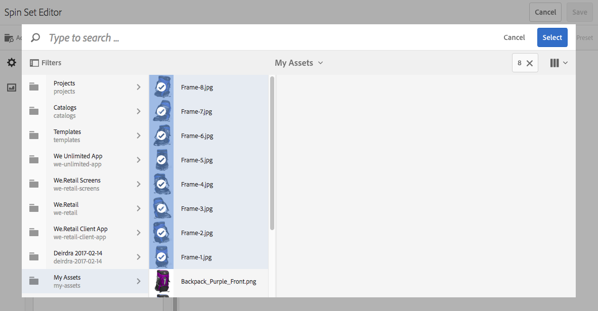
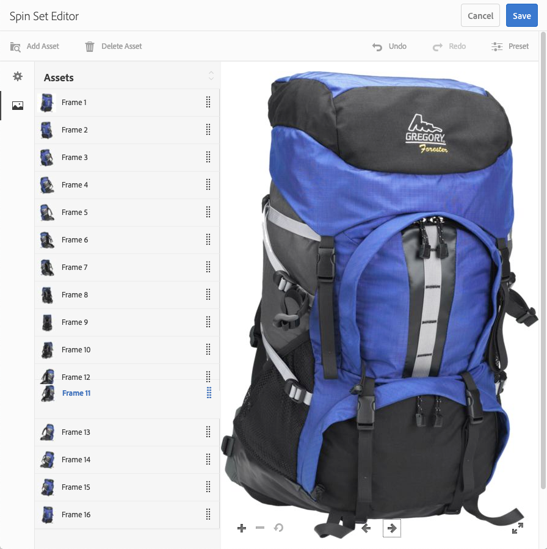

# Snurrande uppsättningar{#spin-sets}

Med en snurra uppsättning kan du simulera hur det ser ut när du vrider ett objekt för att undersöka det. Med snurra uppsättningar kan du visa objekt från vilken vinkel som helst och få fram de viktigaste visuella detaljerna från vilken vinkel som helst.

En snurra uppsättning simulerar en 360-gradig visningsupplevelse. Dynamic Media erbjuder snurra uppsättningar med en axel där tittarna kan rotera ett objekt. Dessutom kan man zooma och panorera med några enkla musklick. På så sätt kan användare undersöka ett objekt närmare från en viss betraktningsvinkel.

Snurra uppsättningar anges av en banderoll med ordet **[!UICONTROL SPINSET]**. Om rotationsuppsättningen dessutom publiceras visas det publiceringsdatum som anges av ikonen **[!UICONTROL World]** på banderollen tillsammans med det senaste ändringsdatumet, vilket anges av ikonen **[!UICONTROL Pencil]**.

>[!NOTE]
>
>Mer information om gränssnittet Resurser finns i [Hantera resurser](/help/assets/manage-assets.md).

## Snabbstart: Snurra uppsättningar {#quick-start-spin-sets}

Så här kommer du igång snabbt med Spin Sets:

1. [Ladda upp bilderna för olika vyer](#uploading-assets-for-spin-sets).

   Du behöver minst 8-12 tagningar av ett objekt för en endimensionell snurra och 16-24 för en tvådimensionell snurra uppsättning. Fotografierna måste tas med jämna mellanrum för att ge intryck av att objektet roteras och vändas. Om en endimensionell snurra t.ex. innehåller 12 tagningar roterar du objektet 30° (360/12) för varje tagning.

1. [Skapa snurruppsättningar](#creating-spin-sets).

   Om du vill skapa en snurruppsättning väljer du **[!UICONTROL Create > Spin Set]** och ger uppsättningen ett namn, väljer resurser och väljer i vilken ordning bilderna ska visas.

   Se [Arbeta med väljare](/help/assets/working-with-selectors.md).

   >[!NOTE]
   >
   >Du kan också skapa rotationsuppsättningar automatiskt med hjälp av [förinställningar för gruppuppsättningar](/help/assets/config-dms7.md#creating-batch-set-presets-to-auto-generate-image-sets-and-spin-sets). **Viktigt:** Gruppuppsättningar skapas av IPS (Image Production System) som en del av tillgångsanvändningen och är endast tillgängliga i Dynamic Media - Scene7-läge.

1. Ange [inställningar för Snurra in visningsprogram](/help/assets/managing-viewer-presets.md) efter behov.

   Administratörer kan skapa eller ändra visningsförinställningar för rotationsuppsättningar. Om du vill visa rotationsuppsättningen med en visningsförinställning markerar du rotationsuppsättningen och väljer **Visningsprogram** i listrutan till vänster.

   Se **[!UICONTROL Tools]** > **[!UICONTROL Assets]** > **[!UICONTROL Viewer Presets]** om du vill skapa eller redigera visningsförinställningar.

   Se [Lägg till och redigera visningsförinställningar](/help/assets/managing-viewer-presets.md).

1. [Visa snurruppsättningar](#viewing-spin-sets).

   Du kan visa och komma åt uppsättningar som skapats med förinställningar för gruppuppsättningar på tre olika sätt. (Uppsättningar som skapats med gruppuppsättningsförinställningar, *visas inte* i användargränssnittet.)

1. [Förhandsgranska snurruppsättningar](/help/assets/previewing-assets.md).

   Markera rotationsuppsättningen så kan du förhandsgranska den. Rotera snurrsuppsättningen. Du kan välja olika visningsprogram på menyn **[!UICONTROL Viewers]**, som finns i den vänstra listrutan.

1. [Publicera snurruppsättningar](/help/assets/publishing-dynamicmedia-assets.md).

   När du publicerar en snurruppsättning aktiveras URL-adressen och strängen Embed. Dessutom måste du [publicera visningsförinställningen](/help/assets/managing-viewer-presets.md).

1. [Länka URL:er till webbprogrammet ](/help/assets/linking-urls-to-yourwebapplication.md) eller  [Bädda in video- eller bildvisningsprogrammet](/help/assets/embed-code.md).

   Adobe Experience Manager Assets skapar URL-anrop för Spin Sets och aktiverar dem när du har publicerat snurruppsättningarna. Du kan kopiera dessa URL:er när du förhandsgranskar resurser. Du kan även bädda in dem på din webbplats.

   Markera rotationsuppsättningen och välj sedan **[!UICONTROL Viewers]** i listrutan till vänster.

   Se [Länka en snurruppsättning till en webbsida](/help/assets/linking-urls-to-yourwebapplication.md) och [Bädda in video- eller bildvisningsprogrammet](/help/assets/embed-code.md).

Om det behövs kan du [redigera snurruppsättningar](#editing-spin-sets). Dessutom kan du visa och ändra [egenskaper för snurruppsättning](/help/assets/manage-assets.md#editing-properties).

## Överför resurser för snurruppsättningar {#uploading-assets-for-spin-sets}

Du behöver minst 8-12 tagningar av ett objekt för en endimensionell snurra och 16-24 för en tvådimensionell snurra uppsättning. Fotografierna måste tas med jämna mellanrum för att ge intryck av att objektet roteras och vändas. Om en endimensionell snurra t.ex. innehåller 12 tagningar roterar du objektet 30° (360/12) för varje tagning.

Du kan överföra bilder för Snurra uppsättningar på samma sätt som du [överför andra resurser i Experience Manager Assets](/help/assets/manage-assets.md).

### Riktlinjer för hämtning av bilder för din snurruppsättning {#guidelines-for-shooting-spin-set-images}

Nedan följer några tips om hur du använder snurra uppsättningsbilder. Ju fler bilder du har i en snurrfunktion, desto bättre blir effekten av att snurra. Om du inkluderar många bilder i uppsättningen ökar dock tiden det tar för bilderna att läsas in. Experience Manager rekommenderar följande riktlinjer för att ta bilder för användning i snurra uppsättningar:

* Använd minst 8-12 bilder i en endimensionell snurra och 16-24 bilder i en tvådimensionell snurra. Minst 8 bilder krävs för att kunna vridas 360°. Endimensionella snurruppsättningar är vanligare eftersom det är arbetsintensivt att skapa tvådimensionella snurruppsättningar.
* Använd ett förlustfritt format, TIFF och PNG rekommenderas.
* Maskera alla bilder så att objektet visas på en helt vit eller annan bakgrund med hög kontrast. Du kan också lägga till skuggor.
* Se till att produktinformationen är väl belyst och i fokus.
* Ta snurra bilder till modekläder med mannequin eller modell. Ofta är mannequin antingen maskerat (med hjälp av en glasmannequin) eller en stiliserad mannequin/form visas i bilden. Du kan skapa en omformningsrotation genom att definiera antalet vinklar. Markera varje vinkel med band på golvet så att du kan vägleda modellen till steg och titta i riktningen för varje tagning.

## Skapa en snurruppsättning {#creating-spin-sets}

I det här avsnittet beskrivs hur du skapar en snurra uppsättning i Experience Manager.

>[!NOTE]
>
>Du kan också skapa rotationsuppsättningar automatiskt med hjälp av [förinställningar för gruppuppsättningar](/help/assets/config-dms7.md#creating-batch-set-presets-to-auto-generate-image-sets-and-spin-sets). **Viktigt:** Gruppuppsättningar skapas av IPS (Image Production System) som en del av tillgångsanvändningen och är endast tillgängliga i Dynamic Media - Scene7-läge.
>
>Se&quot;Skapa gruppuppsättningsförinställningar för automatisk generering av bilduppsättningar och snurruppsättningar&quot; i [Konfigurera Dynamic Media - Scene7-läge](/help/assets/config-dms7.md#creating-batch-set-presets-to-auto-generate-image-sets-and-spin-sets).

>[!NOTE]
>
>Den ordning i vilken bilderna visas i en snurrfunktion. Se till att ordna dem så att snurret blir en mjuk 360-gradersvy.

**Så här skapar du en snurra:**

1. I Resurser navigerar du till den plats där du vill skapa en snurruppsättning, väljer **[!UICONTROL Create]** och väljer **[!UICONTROL Spin Set]**. Du kan också skapa uppsättningen inifrån en mapp som innehåller resurserna. Redigeraren för rotationsuppsättningar visas.

   

1. Ange ett namn för rotationsuppsättningen i fältet **[!UICONTROL Title]** i Spin Set Editor. Namnet visas i banderollen över snurruppsättningen. Du kan också ange en beskrivning.

   

   >[!NOTE]
   >
   >När du skapar rotationsuppsättningen kan du ändra miniatyrbilden för rotationsuppsättningen eller låta Experience Manager välja miniatyrbilden automatiskt baserat på resurserna i rotationsuppsättningen. Om du vill välja en miniatyrbild väljer du **[!UICONTROL Change thumbnail]** och markerar en bild (du kan navigera till andra mappar för att söka efter bilder också). Om du har markerat en miniatyrbild och sedan vill att Experience Manager ska generera en från rotationsuppsättningen väljer du **[!UICONTROL Switch to Automatic thumbnail]**.

1. Gör något av följande:

   * Välj **[!UICONTROL Add Asset]** längst upp till vänster på sidan för redigeraren för sned uppsättning.

   * Välj **[!UICONTROL Tap to open Asset Selector]** mitt på sidan för redigeringsprogrammet för sned uppsättning.
   Tryck för att välja resurser som du vill inkludera i din snurruppsättning. De markerade resurserna visas med en bock. När du är klar väljer du **[!UICONTROL Select]** längst upp till höger på sidan.

   Med resursväljaren kan du söka efter resurser genom att skriva ett nyckelord och trycka på **[!UICONTROL Return]**. Du kan också använda filter för att förfina sökresultatet. Du kan filtrera efter sökväg, samling, filtyp och tagg. Markera filtret och välj sedan ikonen **[!UICONTROL Filter]** i verktygsfältet. Ändra vyn genom att trycka på ikonen Visa och sedan välja **[!UICONTROL Column View]**, **[!UICONTROL Card View]** eller **[!UICONTROL List View]**.

   Se [Arbeta med väljare](/help/assets/working-with-selectors.md).

   

1. När du lägger till resurser i uppsättningen läggs de automatiskt till i alfanumerisk ordning. Du kan ändra ordning på eller sortera resurser manuellt när du har lagt till dem.

   Om det behövs kan du dra en resurs sorteringsikon till höger om resursens filnamn för att ordna om bilderna uppåt eller nedåt i uppsättningslistan.

   .

   Ändra ordning på bildruta 11 i rotationsrutan genom att dra den till en ny plats.

1. (Valfritt) Gör något av följande:

   * Om du vill ta bort en bild markerar du bilden och väljer **[!UICONTROL Delete Asset]**.

   * Om du vill använda en förinställning väljer du **[!UICONTROL Preset]** längst upp till höger på sidan och väljer sedan en förinställning som ska användas på alla resurser samtidigt.

1. Välj **[!UICONTROL Save]**. Den nyligen skapade rotationsuppsättningen visas i den mapp du skapade den i.

## Visa en snurruppsättning {#viewing-spin-sets}

Du kan skapa snurruppsättningar antingen i användargränssnittet eller automatiskt med [gruppuppsättningsförinställningar](/help/assets/config-dms7.md#creating-batch-set-presets-to-auto-generate-image-sets-and-spin-sets). Uppsättningar som skapats med gruppuppsättningsförinställningar visas *inte* i användargränssnittet. Du kan få åtkomst till uppsättningar som skapats med gruppuppsättningsförinställningar på tre olika sätt. (Dessa metoder är tillgängliga även om du har skapat rotationsuppsättningarna i användargränssnittet).

>[!NOTE]
>
>Du kan också visa uppsättningar via användargränssnittet enligt beskrivningen i [Redigera snurruppsättningar](#editing-spin-sets).

**Så här visar du en snurruppsättning:**

1. När egenskaperna för en enskild resurs öppnas. Egenskaperna anger vad som ställer in den valda resursen som medlem av (under **[!UICONTROL Member of Sets]**). Markera namnet på uppsättningen så att du kan se hela uppsättningen.

   

1. Från en medlemsbild i en uppsättning. Välj menyn **[!UICONTROL Sets]** om du vill visa de uppsättningar som resursen är medlem i.

   

1. I sökningen kan du välja **[!UICONTROL Filters]** och sedan expandera **[!UICONTROL Dynamic Media]** och markera **[!UICONTROL Sets]**.

   Sökningen returnerar matchande uppsättningar som skapats manuellt i användargränssnittet eller automatiskt skapats med gruppuppsättningsförinställningar. För automatiska uppsättningar utförs sökfrågan med `Starts with`-sökvillkor som skiljer sig från sökvillkoret i Experience Manager, som baseras på `Contains`-sökvillkor. Det enda sättet att söka efter automatiska uppsättningar är att ställa in filtret på **[!UICONTROL Sets]**.

   

## Redigera en snurra uppsättning {#editing-spin-sets}

Du kan utföra olika redigeringsåtgärder på snurra uppsättningar, till exempel:

* Lägg till bilder i rotationsrutan.
* Ändra ordning på bilderna i rotationsrutan.
* Ta bort resurser i rotationsuppsättningen.
* Använd förinställningar för visningsprogram.
* Ta bort rotationsrutan.

**Så här redigerar du en snurra:**

1. Gör något av följande:

   * Håll pekaren över en resurs i en snurruppsättning och välj sedan **[!UICONTROL Edit]** (pennikon).
   * Håll pekaren över en resurs i en snurruppsättning, välj **[!UICONTROL Select]** (bockmarkeringsikon) och välj sedan **[!UICONTROL Edit]** i verktygsfältet.

   * Välj på en snurra uppsättning och välj sedan **[!UICONTROL Edit]** (pennikon) i verktygsfältet.

1. Gör något av följande om du vill redigera rotationsuppsättningen:

   * Om du vill ändra ordning på bilderna drar du en bild till en ny plats (markera ikonen för att ändra ordning för att flytta objekt).
   * Om du vill sortera objekt i stigande eller fallande ordning markerar du kolumnrubriken.
   * Om du vill lägga till en resurs eller uppdatera en befintlig resurs väljer du **[!UICONTROL Add Asset]**. Navigera till en resurs, markera den och välj sedan **[!UICONTROL Select]** nära det övre högra hörnet.
Om du tar bort den bild som Experience Manager använder som miniatyrbild genom att ersätta den med en annan bild, visas fortfarande originalresursen.
   * Om du vill ta bort en resurs markerar du den och väljer **[!UICONTROL Delete Asset]**.
   * Om du vill använda en förinställning väljer du förinställningsikonen och väljer en förinställning.
   * Om du vill ta bort en hel snurruppsättning går du till snurra-uppsättningen, markerar den och väljer **[!UICONTROL Delete]**

   >[!NOTE]
   >
   >Du kan redigera bilderna i en snurruppsättning genom att navigera till uppsättningen, markera **[!UICONTROL Set Members]** i den vänstra listen och sedan välja pennikonen på en enskild resurs för att öppna redigeringsfönstret.

1. Välj **[!UICONTROL Save]** när redigeringen är klar.

## Förhandsgranska en snurra uppsättning {#previewing-spin-sets}

Se [Förhandsgranska resurser](/help/assets/previewing-assets.md).

## Publicera en snurruppsättning {#publishing-spin-sets}

Se [Publicera resurser](/help/assets/publishing-dynamicmedia-assets.md).
