# Integrera dynamiska mediavisare med taggar från Adobe Analytics och Experience Platform {#integrating-dynamic-media-viewers-with-adobe-analytics-and-adobe-launch}

## Vad är Dynamic Media Viewer-integrering med Adobe Analytics- och Experience Platform-taggar? {#what-is-dynamic-media-viewers-integration-with-adobe-analytics-and-adobe-launch}

<!-- Leave this hidden path here; it points to the topic source from Sasha https://wiki.corp.adobe.com/pages/viewpage.action?spaceKey=~oufimtse&title=Dynamic+Media+Viewers+integration+with+Adobe+Launch -->

Med tillägget *Dynamiska medievyer* för Experience Platform Tags och Dynamic Media Viewers 5.13 kan Adobe Analytics- och Experience Platform Tags-kunder använda händelser och data som är specifika för Dynamic Media Viewer i sina Experience Platform Tags-konfigurationer.

Integrationen innebär att du kan spåra användningen av dynamiska medievyer på din webbplats med Adobe Analytics. Samtidigt kan du använda händelser och data som visas av visningsprogrammen med andra Experience Platform Tags-tillägg som kommer från Adobe eller en tredje part.

Mer information om Adobe-tillägg och tredjepartstillägg finns i [Adobe-tillägg](https://experienceleague.adobe.com/en/docs/experience-platform/tags/extensions/overview) i användarhandboken för Experience Platform-taggar.

**Det här avsnittet är avsett för följande:** Webbplatsadministratörer, utvecklare på Experience Platform samt personer i Operations.

### Begränsningar i integreringen {#limitations-of-the-integration}

* Integrering med Experience Platform Tags för dynamiska medievyer fungerar inte i Experience Manager författarnod. Du kan inte se någon spårning från en WCM-sida förrän den har publicerats.
* Integrering med Experience Platform Tags för Dynamic Media-visningsprogram stöds inte för&quot;popup&quot;-åtgärdsläge, där visningsprogrammets URL hämtas med knappen &quot;URL&quot; på sidan Resursinformation.
* Integrering med Experience Platform Tags kan inte användas samtidigt med integrering med äldre visningsprogram med Analytics (med parametern `config2=`).
* Stödet för videospårning är begränsat till enbart huvuduppspelningsspårning, vilket beskrivs i [Spårningsöversikt](https://experienceleague.adobe.com/en/docs/media-analytics/using/tracking/track-core-overview). Speciellt stöds inte QoS, Ads, Chapter/Segments eller Errors tracking.
* Lagringsvaraktighetskonfigurationen för dataelement stöds inte för dataelement med tillägget *Dynamiska medievyer*. Lagringstid måste anges till **[!UICONTROL None]**.

### Användningsexempel för integreringen {#use-cases-for-the-integration}

Det viktigaste användningsområdet för integreringen med Experience Platform Tags är kunder som använder både Adobe Experience Manager Assets och Adobe Experience Manager Sites. I sådana fall kan du skapa en standardintegrering mellan Experience Manager-författarnoden och Experience Platform Tags och sedan associera platsinstansen med Experience Platform Tags-egenskapen. Efter det kommer alla WCM-komponenter för Dynamic Media som läggs till på en Sites-sida att spåra data och händelser från tittarna.

Se [Spåra visningar för dynamiska media i Experience Manager Sites](#tracking-dynamic-media-viewers-in-aem-sites).

Ett sekundärt användningsfall som integreringen stöder är de kunder som bara använder Experience Manager Assets eller Dynamic Media Classic. I så fall får du inbäddningskoden för ditt visningsprogram och lägger till den på webbplatssidan. Hämta sedan Experience Platform Tags-bibliotekets produktions-URL från Experience Platform Tags och lägg till den manuellt i webbsideskoden.

Se [Spåra visningar för dynamiska media med hjälp av inbäddningskod](#tracking-dynamic-media-viewers-using-embed-code).

<!-- Path on internal wiki [About tracking Dynamic Media viewers using embed code](https://wiki.corp.adobe.com/display/~oufimtse/Dynamic+Media+Viewers+integration+with+Adobe+Launch#DynamicMediaViewersintegrationwithAdobeLaunch-TrackingDynamicMediaViewersusingEmbedcode). -->

## Hur data- och händelsespårning fungerar i integreringen {#how-data-and-event-tracking-works-in-the-integration}

Integreringen utnyttjar två separata och oberoende typer av spårning av dynamiska medievyer: *Adobe Analytics* och *Adobe Analytics för ljud och video*.

### Om spårning med Adobe Analytics  {#about-tracking-using-adobe-analytics}

Med Adobe Analytics kan du spåra åtgärder som slutanvändaren utför när de interagerar med dynamiska medievyer på webbplatsen. Med Adobe Analytics kan du också spåra visningsprogramspecifika data. Du kan till exempel spåra och spela in inläsningshändelser tillsammans med resursnamnet, eventuella zoomåtgärder som har utförts och videouppspelningsåtgärder.

I Experience Platform-taggar fungerar koncepten för *dataelement* och *regler* tillsammans för att aktivera Adobe Analytics-spårning.

#### Om dataelement i Experience Platform-taggar {#about-data-elements-in-adobe-launch}

Ett dataelement i Experience Platform-taggar är en namngiven egenskap vars värde antingen är statiskt definierat eller dynamiskt beräknat baserat på en webbsidas eller dynamiska medievydata.

Vilka alternativ som är tillgängliga för en dataelementsdefinition beror på listan med tillägg som är installerade i egenskapen Experience Platform Tags. Tillägget &quot;Core&quot; är förinstallerat och finns tillgängligt direkt i alla konfigurationer. Med det här tillägget Core kan du definiera ett dataelement som kommer från cookie, JavaScript-kod, frågesträng och många andra källor.

För Adobe Analytics tracking måste ytterligare tillägg installeras, vilket beskrivs i [Installation och konfiguration av tillägg](#installing-and-setup-of-extensions). Tillägget Dynamic Media Viewer ger möjlighet att definiera ett dataelement som är ett argument i Dynamic Viewer-händelsen. Det är till exempel möjligt att referera till visningsprogramtypen, eller resursnamnet som rapporteras av visningsprogrammet vid inläsning, den zoomnivå som rapporteras när slutanvändaren zoomar och mycket annat.

Tillägget Dynamic Media Viewer håller automatiskt värdena för dataelementen uppdaterade.

När du har definierat det kan ett dataelement användas på andra platser i användargränssnittet för Experience Platform-taggar med hjälp av widgeten för dataelementväljaren. Dataelement som definieras för spårning av dynamiska medievyer refereras särskilt av tillägget Ange variabelåtgärd för Adobe Analytics i regeln (se nedan).

Se [Dataelement](https://experienceleague.adobe.com/en/docs/experience-platform/tags/ui/data-elements).

#### Om regler i Experience Platform-taggar {#about-rules-in-adobe-launch}

En regel i Experience Platform-taggar är en agnostisk konfiguration som definierar tre områden som utgör en regel: *Händelser*, *Villkor* och *Åtgärder*:

* *Händelser* (if) anger för Experience Platform-taggar när en regel ska utlösas.
* *Villkor* (if) anger för Experience Platform-taggar vilka andra begränsningar som ska tillåtas eller inte när en regel aktiveras.
* *Åtgärder* (sedan) anger för Experience Platform-taggar vad som ska göras när en regel aktiveras.

Vilka alternativ som är tillgängliga i avsnittet Händelser, Villkor och Åtgärder beror på vilka tillägg som är installerade i egenskapen Experience Platform Tags. Tillägget *Core* är förinstallerat och är tillgängligt direkt i alla konfigurationer. Tillägget innehåller flera alternativ för händelser, till exempel grundläggande åtgärder på webbläsarnivå. Dessa åtgärder omfattar fokusändring, tangenttryckningar och formulärinskickning. Den innehåller även alternativ för Villkor, som cookie-värde, webbläsartyp och mycket annat. För Åtgärder är endast alternativet Anpassad kod tillgängligt.

För Adobe Analytics-spårning måste flera andra tillägg installeras, vilket beskrivs i [Installation och konfiguration av tillägg](#installing-and-setup-of-extensions). Mer specifikt:

* Tillägget Dynamic Media Viewer utökar listan med händelser som stöds till händelser som är specifika för Dynamic Media-visningsprogram, t.ex. inläsning av visningsprogram, resursväxling, inzoomning och videouppspelning.
* Adobe Analytics-tillägget utökar listan med åtgärder som stöds med två åtgärder som krävs för att skicka data till spårningsservrar: *Ange variabler* och *Skicka signal*.

Om du vill spåra Dynamic Media-visningsprogram kan du använda någon av följande typer:

* Händelser från tillägget Dynamic Media Viewer, Core-tillägget eller något annat tillägg.
* Villkor i regeldefinitionen. Du kan också lämna villkorsområdet tomt.

I avsnittet Åtgärder måste du ha en *Ange variabler*-åtgärd. Den här åtgärden anger för Adobe Analytics hur spårningsvariabler ska fyllas i med data. Samtidigt skickar inte åtgärden *Ange variabler* något till spårningsservern.

Åtgärden *Ange variabler* måste följas av en *Skicka Beacon*-åtgärd. Åtgärden *Skicka Beacon* skickar data till analysspårningsservern. Båda åtgärderna, *Ange variabler* och *Skicka fyr*, kommer från Adobe Analytics-tillägget.

Se [Regler](https://experienceleague.adobe.com/en/docs/experience-platform/tags/ui/rules).

#### Exempelkonfiguration {#sample-configuration}

I följande exempelkonfiguration i Experience Platform Tags visas hur du spårar ett resursnamn när visningsprogrammet läses in.

1. På fliken **[!UICONTROL Data Elements]** definierar du ett dataelement `AssetName` som refererar till parametern `asset` för händelsen `LOAD` från tillägget Dynamiska medievyer.

   

1. Definiera en regel **[!UICONTROL Rules]** TrackAssetOnLoad *från fliken*.

   I den här regeln använder fältet **[!UICONTROL Event]** händelsen **[!UICONTROL LOAD]** från tillägget för dynamiska medievyer.

   

1. Åtgärdskonfigurationen har två åtgärdstyper från Adobe Analytics-tillägget:

   *Ange variabler* som mappar en analysvariabel som du väljer till värdet för dataelementet `AssetName`.

   *Skicka Beacon* som skickar spårningsinformation till Adobe Analytics.

   

1. Den resulterande regelkonfigurationen ser ut så här:

   

### Om Adobe Analytics för ljud och video {#about-adobe-analytics-for-audio-and-video}

När ett Experience Cloud-konto prenumererar på Adobe Analytics för ljud och video räcker det att aktivera videospårning i tilläggsinställningarna för *Dynamiska medievyer*. Videomått blir tillgängligt i Adobe Analytics. Videospårning beror på att det finns Adobe Media Analytics för ljud- och videotillägg.

Se [Installation och konfiguration av tillägg](#installing-and-setup-of-extensions).

Stödet för videospårning är för närvarande begränsat till enbart huvuduppspelningsspårning, vilket beskrivs i [Spårningsöversikt](https://experienceleague.adobe.com/en/docs/media-analytics/using/tracking/track-core-overview). Speciellt stöds inte QoS, Ads, Chapter/Segments eller Errors tracking.

## Använda tillägget Dynamic Media Viewer {#using-the-dynamic-media-viewers-extension}

Som nämndes i [Användningsexempel för integreringen](#use-cases-for-the-integration) är det möjligt att spåra visningar för dynamiska media med den nya integreringen av Experience Platform-taggar i Experience Manager Sites och genom att använda inbäddningskod.

### Spåra Dynamic Media-visningsprogram i Experience Manager Sites {#tracking-dynamic-media-viewers-in-aem-sites}

Om du vill spåra Dynamic Media-visningsprogram i Experience Manager Sites måste alla steg som listas under avsnittet [Konfigurera alla integrationsdelar](#configuring-all-the-integration-pieces) utföras. Du måste skapa IMS-konfigurationen och Experience Platform Tags Cloud Configuration.

Om du använder en WCM-komponent som stöds av Dynamic Media, spåras data automatiskt till Adobe Analytics, Adobe Analytics for Video eller båda, efter rätt konfiguration.

<!-- To be reviewed and updated although this is found live in the Experience ManageraaCS version:
See [Adding Dynamic Media Assets to Pages using Adobe Sites](https://helpx.adobe.com/experience-manager/6-5/help/assets/adding-dynamic-media-assets-to-pages.html).
-->

### Spåra Dynamic Media-visningsprogram med hjälp av inbäddningskod {#tracking-dynamic-media-viewers-using-embed-code}

Kunder som inte använder Experience Manager Sites, eller bäddar in Dynamic Media-visningsprogram på webbsidor utanför Experience Manager Sites, eller båda, kan fortfarande använda Experience Platform Tags-integreringen.

Slutför konfigurationsstegen i avsnitten [Konfigurera Adobe Analytics](#configuring-adobe-analytics-for-the-integration) och [Konfigurera Experience Platform-taggar](#configuring-adobe-launch-for-the-integration). Experience Manager-relaterade konfigurationssteg behövs dock inte.

Om konfigurationen är korrekt kan du lägga till stöd för Experience Platform-taggar på en webbsida med ett dynamiskt medievisningsprogram.

Mer information om hur du använder inbäddningskoden för Experience Platform-taggbiblioteket finns i [Lägga till Experience Platform-taggar &#x200B;](https://experienceleague.adobe.com/en/docs/platform-learn/implement-in-websites/configure-tags/add-embed-code) .

<!-- To be reviewed and updated although this is found live in the Experience ManageraaCS version:
See [Embedding the Video or Image Viewer on a Web Page](https://helpx.adobe.com/experience-manager/6-5/help/assets/embed-code.html) to learn more about how to use the embed code feature of Experience Manager Dynamic Media.
-->

**Spåra dynamiska medievisningsprogram med inbäddningskoden:**

1. Ha en webbsida redo för inbäddning av ett dynamiskt medievisningsprogram.
1. Hämta inbäddningskoden för Experience Platform Tags-biblioteket genom att först logga in på Experience Platform Tags (se [Konfigurera Experience Platform Tags](#configuring-adobe-launch-for-the-integration)).
1. Välj **[!UICONTROL Property]** och sedan fliken **[!UICONTROL Environments]**.
1. Plocka upp den miljönivå som är relevant för webbsidans miljö. Markera sedan ruteikonen i kolumnen **[!UICONTROL Install]**.
1. **[!UICONTROL In the Web Install Instructions]**-dialogrutan kopierar den fullständiga inbäddningskoden för Experience Platform-taggbiblioteket tillsammans med de omgivande `<script/>` -taggarna.

## Referenshandbok för tillägget Dynamic Media Viewers {#reference-guide-for-the-dynamic-media-viewers-extension}

### Om konfigurationen för Dynamic Media Viewer {#about-the-dynamic-media-viewers-configuration}

Tillägget Dynamic Media Viewer integreras automatiskt med Experience Platform Tags Library om följande villkor är uppfyllda:

* Experience Platform Tags-bibliotekets globala objekt ( `_satellite`) finns på sidan.
* Tilläggsfunktionen `_dmviewers_v001()` för Dynamic Media Viewer har definierats för `_satellite`.

* `config2=`-visningsprogramparametern har inte angetts, vilket innebär att visningsprogrammet inte använder äldre Analytics-integrering.

Det finns också ett alternativ för att uttryckligen inaktivera integreringen av Experience Platform-taggar i visningsprogrammet genom att ange parametern `launch=0` i visningsprogrammets konfiguration. Standardvärdet för parametern är `1`.

### Konfigurera tillägget Dynamiska medievyer {#configuring-the-dynamic-media-viewers-extension}

Det enda konfigurationsalternativet för tillägget för dynamiska medievyer är **[!UICONTROL Enable Adobe Media Analytics for Audio and Video]**.

När du markerar (aktiverar) det här alternativet och Adobe Media Analytics för ljud och video-tillägget har installerats och konfigurerats skickas videouppspelningsstatistik till Adobe Analytics för ljud och video. Om du inaktiverar det här alternativet inaktiveras videospårning.

Om du aktiverar det här alternativet *utan att* ha Adobe Media Analytics för ljud och video installerat, har alternativet ingen effekt.

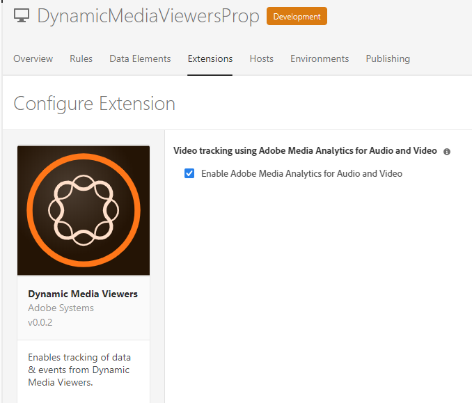

### Om dataelement i tillägget Dynamiska medievisningsprogram {#about-data-elements-in-the-dynamic-media-viewers-extension}

Den enda dataelementtypen som tillägget Dynamic Media-visningsprogram tillhandahåller är **[!UICONTROL Viewer Event]** i listrutan **[!UICONTROL Data Element Type]**.

När du väljer det här alternativet återges ett formulär med två fält i dataelementsredigeraren:

* **[!UICONTROL DM viewers event data type]** – en listruta som identifierar alla visningsprogramhändelser som stöds av tillägget Dynamic Media-visningsprogrammet och som har argument, plus ett särskilt **[!UICONTROL COMMON]**-objekt. Objektet **[!UICONTROL COMMON]** representerar en lista med händelseparametrar som är gemensamma för alla typer av händelser som skickas av visningsprogrammen.
* **[!UICONTROL Tracking parameter]** - ett argument för den valda Dynamic Media Viewer-händelsen.

I referenshandboken för [Dynamiska medievisningsprogram](https://experienceleague.adobe.com/en/docs/dynamic-media-developer-resources/library/viewers-aem-assets-dmc/c-html5-s7-aem-asset-viewers#viewers-aem-assets-dmc) finns en lista över händelser som stöds av varje visningsprogramtyp. Gå till den specifika visningsprogramsektionen och välj sedan underavsnittet Stöd för Adobe Analytics-spårning. För närvarande dokumenterar inte referenshandboken för Dynamic Media Viewer händelseargument.

Överväg nu livscykeln för de dynamiska medievisningsprogrammen *Dataelement*. Värdet för ett sådant dataelement fylls i efter att motsvarande Dynamic Media Viewer-händelse inträffar på sidan. Anta till exempel att dataelementet pekar på händelsen **[!UICONTROL LOAD]** och dess &quot;asset&quot;-argument. I så fall tar värdet för det dataelementet emot giltiga data efter att visningsprogrammet kör **[!UICONTROL LOAD]**-händelsen för första gången. Om dataelementet pekar på händelsen **[!UICONTROL ZOOM]** och dess &quot;scale&quot;-argument, förblir värdet för dataelementet tomt tills användaren skickar en **[!UICONTROL ZOOM]** -händelse för första gången.

På samma sätt uppdateras värdena för dataelement automatiskt när visningsprogrammet skickar en motsvarande händelse på sidan. Värdeuppdateringen sker även om den särskilda händelsen inte har angetts i regelkonfigurationen. Anta till exempel att dataelementet **[!UICONTROL ZoomScale]** har definierats för parametern &quot;scale&quot; i ZOOM-händelsen. Den enda regel som finns i regelkonfigurationen aktiveras emellertid av händelsen **[!UICONTROL LOAD]**. Värdet för **[!UICONTROL ZoomScale]** uppdateras fortfarande varje gång en användare zoomar in i visningsprogrammet.

Alla Dynamic Media-visningsprogram har en unik identifierare på webbsidan. Dataelementet spårar själva värdet och det visningsprogram som har fyllt i värdet. Anta till exempel att det finns flera visningsprogram på samma sida och ett **[!UICONTROL AssetName]**-dataelement som pekar på händelsen **[!UICONTROL LOAD]** och dess &quot;asset&quot;-argument. Dataelementet **[!UICONTROL AssetName]** underhåller en samling resursnamn som är associerade med varje visningsprogram som har lästs in på sidan.

Det exakta värdet som returneras av dataelementet beror på sammanhanget. Om dataelementet begärs i en regel som utlöstes av en Dynamic Media Viewer-händelse, returneras Data Element-värdet för det visningsprogram som initierade regeln. Dataelementet begärs dessutom i en regel som utlöstes av en händelse från ett annat tillägg för Experience Platform-taggar. I det skedet kommer dataelementets värde från det visningsprogram som senast uppdaterade det här dataelementet.

**Överväg följande exempelinställningar:**

* En webbsida med två zoomningsvisningsprogram för Dynamic Media: *viewer1* och *viewer2*.

* **[!UICONTROL ZoomScale]** Dataelement pekar på händelsen **[!UICONTROL ZOOM]** och dess &quot;scale&quot;-argument.
* **[!UICONTROL TrackPan]** Regel med följande:

   * Använder Dynamic Media Viewer **[!UICONTROL PAN]**-händelsen som utlösare.
   * Skickar värdet för dataelementet **[!UICONTROL ZoomScale]** till Adobe Analytics.

* **[!UICONTROL TrackKey]** Regel med följande:

   * Använder tangenttryckningshändelsen från Core Experience Platform Tags-tillägget som utlösare.
   * Skickar värdet för dataelementet **[!UICONTROL ZoomScale]** till Adobe Analytics.

Anta nu att slutanvändaren läser in webbsidan med de två visningsprogrammen. I *viewer1* zoomar de in till 50 % skala och i *viewer2* zoomar de sedan in till 25 % skala. I *visningsprogrammet1* panorerar de bilden runt och väljer slutligen en tangent på tangentbordet.

Slutanvändarens aktivitet resulterar i följande två spårningsanrop till Adobe Analytics:

* Det första anropet sker eftersom regeln **[!UICONTROL TrackPan]** aktiveras när användaren panorerar i *viewer1*. Anropet skickar 50 % som ett värde för dataelementet **[!UICONTROL ZoomScale]** eftersom dataelementet vet att regeln aktiveras av *viewer1* och hämtar motsvarande skalvärde.
* Det andra anropet sker eftersom regeln **[!UICONTROL TrackKey]** aktiveras när användaren trycker på en tangent på tangentbordet. Det anropet skickar 25 % som ett värde för dataelementet **[!UICONTROL ZoomScale]** eftersom regeln inte utlöstes av visningsprogrammet. Därför returnerar dataelementet det senaste värdet.

Samplingsuppsättningen ovan påverkar också dataelementvärdets livslängd. Värdet på dataelementet som hanteras av Dynamic Media Viewer lagras i Experience Platform Tags-bibliotekskoden även efter att visningsprogrammet har tagits bort från webbsidan. Den här funktionen innebär att om det finns en regel som aktiveras av ett icke-dynamiskt visningsprogramtillägg och refererar till ett sådant dataelement, returnerar dataelementet det senast kända värdet. Även om visningsprogrammet inte längre finns på webbsidan.

Värden för dataelement som hanteras av dynamiska medievisningsprogram lagras inte i den lokala lagringen eller på servern. De lagras bara i klientsidans Experience Platform-taggbibliotek. Värdena för sådana dataelement försvinner när webbsidan läses in igen.

I allmänhet har dataelementsredigeraren stöd för [val av lagringstid](https://experienceleague.adobe.com/en/docs/experience-platform/tags/ui/data-elements#create-a-data-element). Dataelement som använder tillägget för dynamiska medievyer stöder dock bara alternativet för lagringstid på **[!UICONTROL None]**. Det går att ange andra värden i användargränssnittet, men i det här fallet är dataelementets beteende inte definierat. Tillägget hanterar värdet på dataelementet separat: det dataelement som behåller värdet på visningsprogrammets händelseargument under hela visningsprogrammets livscykel.

### Regler i tillägget Dynamiska medievyer {#about-rules-in-the-dynamic-media-viewers-extension}

I regelredigeraren lägger tillägget till nya konfigurationsalternativ för händelseredigeraren. Redigeraren har också ett alternativ för att manuellt referera till händelseparametrar i Action Editor som ett kortvarigt alternativ i stället för att använda förkonfigurerade dataelement.

#### Om händelseredigeraren {#about-the-events-editor}

I händelseredigeraren lägger tillägget för dynamiska medievyer till **[!UICONTROL Event Type]** med namnet **[!UICONTROL Viewer Event]**.

När det här alternativet är markerat återges listrutan **[!UICONTROL Dynamic Media Viewer events]** med alla tillgängliga händelser som stöds av visningsprogram för dynamiska media.

#### Om funktionsmakroredigeraren {#about-the-actions-editor}

Med tillägget Dynamic Media Viewer kan du använda händelseparametrar för Dynamic Media-visningsprogram för att mappa till analysvariabler i Adobe Analytics-tilläggets Set Variables-redigerare.

Det enklaste sättet att göra detta är att slutföra följande tvåstegsprocess:

* Börja med att definiera ett eller flera dataelement, där varje dataelement representerar en parameter för en Dynamic Media Viewer-händelse.
* I redigeraren Ange variabler för Adobe Analytics-tillägget markerar du väljarikonen **[!UICONTROL Data Element]** (tre skiktade diskar) för att öppna dialogrutan Markera dataelement och väljer sedan ett dataelement.

Det är dock möjligt att använda en alternativ metod och åsidosätta skapande av dataelement. Du kan referera direkt till ett argument från en Dynamic Media Viewer-händelse. Ange det fullständiga, kvalificerade namnet på händelseargumentet i indatafältet **[!UICONTROL value]** i variabeltilldelningen för Analytics. Försäkra dig om att du omger det med procenttecken (%). Exempel:

`%event.detail.dm.LOAD.asset%`

Det finns en viktig skillnad mellan att använda dataelement och argumentreferens för direkt händelse. För dataelement spelar det ingen roll vilken händelse som utlöser åtgärden Ange variabler. Händelsen som utlöser regeln kan inte kopplas till den dynamiska visningsprogrammet. Du kan till exempel välja webbsidan från Core-tillägget. Men när du använder en referens för ett direkt argument är det viktigt att se till att händelsen som utlöser regeln motsvarar händelseargumentet som den refererar till.

Om du till exempel refererar till `%event.detail.dm.LOAD.asset%` returneras rätt resursnamn om regeln aktiveras av händelsen **[!UICONTROL LOAD]** för tillägget Dynamic Media-visningsprogrammet. Det returnerar dock ett tomt värde för alla andra händelser.

I följande tabell visas Dynamic Media Viewer-händelser och deras argument som stöds:

<table>
 <tbody>
  <tr>
   <td>Namn på visningsprogramhändelse</td>
   <td>Argumentreferens</td>
  </tr>
  <tr>
   <td><code>COMMON</code></td>
   <td><code>%event.detail.dm.objID%</code></td>
  </tr>
  <tr>
   <td> </td>
   <td><code>%event.detail.dm.compClass%</code></td>
  </tr>
  <tr>
   <td> </td>
   <td><code>%event.detail.dm.instName%</code></td>
  </tr>
  <tr>
   <td> </td>
   <td><code>%event.detail.dm.timeStamp%</code></td>
  </tr>
  <tr>
   <td><code>BANNER</code>  </td>
   <td><code>%event.detail.dm.BANNER.asset%</code></td>
  </tr>
  <tr>
   <td> </td>
   <td><code>%event.detail.dm.BANNER.frame%</code></td>
  </tr>
  <tr>
   <td> </td>
   <td><code>%event.detail.dm.BANNER.label%</code></td>
  </tr>
  <tr>
   <td><code>HREF</code></td>
   <td><code>%event.detail.dm.HREF.rollover%</code></td>
  </tr>
  <tr>
   <td><code>ITEM</code></td>
   <td><code>%event.detail.dm.ITEM.rollover%</code></td>
  </tr>
  <tr>
   <td><code>LOAD</code></td>
   <td><code>%event.detail.dm.LOAD.applicationname%</code></td>
  </tr>
  <tr>
   <td><strong> </strong></td>
   <td><code>%event.detail.dm.LOAD.asset%</code></td>
  </tr>
  <tr>
   <td><strong> </strong></td>
   <td><code>%event.detail.dm.LOAD.company%</code></td>
  </tr>
  <tr>
   <td><strong> </strong></td>
   <td><code>%event.detail.dm.LOAD.sdkversion%</code></td>
  </tr>
  <tr>
   <td><strong> </strong></td>
   <td><code>%event.detail.dm.LOAD.viewertype%</code></td>
  </tr>
  <tr>
   <td><strong> </strong></td>
   <td><code>%event.detail.dm.LOAD.viewerversion%</code></td>
  </tr>
  <tr>
   <td><code>METADATA</code></td>
   <td><code>%event.detail.dm.METADATA.length%</code></td>
  </tr>
  <tr>
   <td> </td>
   <td><code>%event.detail.dm.METADATA.type%</code></td>
  </tr>
  <tr>
   <td><code>MILESTONE</code></td>
   <td><code>%event.detail.dm.MILESTONE.milestone%</code></td>
  </tr>
  <tr>
   <td><code>PAGE</code></td>
   <td><code>%event.detail.dm.PAGE.frame%</code></td>
  </tr>
  <tr>
   <td> </td>
   <td><code>%event.detail.dm.PAGE.label%</code></td>
  </tr>
  <tr>
   <td><code>PAUSE</code></td>
   <td><code>%event.detail.dm.PAUSE.timestamp%</code></td>
  </tr>
  <tr>
   <td><code>PLAY</code></td>
   <td><code>%event.detail.dm.PLAY.timestamp%</code></td>
  </tr>
  <tr>
   <td><code>SPIN</code></td>
   <td><code>%event.detail.dm.SPIN.framenumber%</code></td>
  </tr>
  <tr>
   <td><code>STOP</code></td>
   <td><code>%event.detail.dm.STOP.timestamp%</code></td>
  </tr>
  <tr>
   <td><code>SWAP</code></td>
   <td><code>%event.detail.dm.SWAP.asset%</code></td>
  </tr>
  <tr>
   <td><code>SWATCH</code></td>
   <td><code>%event.detail.dm.SWATCH.frame%</code></td>
  </tr>
  <tr>
   <td> </td>
   <td><code>%event.detail.dm.SWATCH.label%</code></td>
  </tr>
  <tr>
   <td><code>TARG</code></td>
   <td><code>%event.detail.dm.TARG.frame%</code></td>
  </tr>
  <tr>
   <td> </td>
   <td><code>%event.detail.dm.TARG.label%</code></td>
  </tr>
  <tr>
   <td><code>ZOOM</code></td>
   <td><code>%event.detail.dm.ZOOM.scale%</code></td>
  </tr>
 </tbody>
</table>

## Konfigurera alla integreringsdelar {#configuring-all-the-integration-pieces}

**INNAN DU BÖRJAR**

Adobe rekommenderar att du granskar all dokumentation innan detta avsnitt så att du förstår den fullständiga integreringen.

I det här avsnittet beskrivs de konfigurationssteg som krävs för att integrera dynamiska medievyer med Adobe Analytics och Adobe Analytics för ljud och video. Även om det är möjligt att använda tillägget Dynamic Media Viewer för andra syften i Experience Platform Tags, beskrivs inte sådana scenarier i den här dokumentationen.

Du kommer att använda följande Adobe-produkter för att konfigurera din integrering:

* Adobe Analytics - används för att konfigurera spårningsvariabler och rapporter.
* Experience Platform-taggar - används för att definiera en egenskap, en eller flera regler och ett eller flera dataelement för att aktivera spårning av visningsprogram.

Om integrationslösningen används med Experience Manager Sites måste dessutom följande konfiguration göras:

* [!DNL Adobe Developer Console] - integrering skapas för Experience Platform-taggar.
* Experience Manager author node - IMS configuration and Experience Platform Tags cloud configuration.

Som en del av konfigurationen bör du kontrollera att du har tillgång till ett företag i Adobe Experience Cloud som redan har Adobe Analytics- och Experience Platform-taggar aktiverade.

## Konfigurera Adobe Analytics för integreringen {#configuring-adobe-analytics-for-the-integration}

När du har konfigurerat Adobe Analytics konfigureras följande för integreringen:

* En rapportsvit finns på plats och har valts.
* Analysvariabler är tillgängliga för att ta emot spårningsdata.
* Rapporter finns tillgängliga för att visa insamlade data från Adobe Analytics.

Se även [Implementeringshandbok för analyser](https://experienceleague.adobe.com/en/docs/analytics/implementation/home).

**Så här konfigurerar du Adobe Analytics för integreringen:**

1. Börja med att gå till Adobe Analytics från Experience Cloud [hemsida](https://experience.adobe.com/#/home). På menyraden väljer du ikonen **[!UICONTROL Solutions]** (en tabell med tre punkter) i sidans övre högra hörn och sedan **[!UICONTROL Analytics]**.

   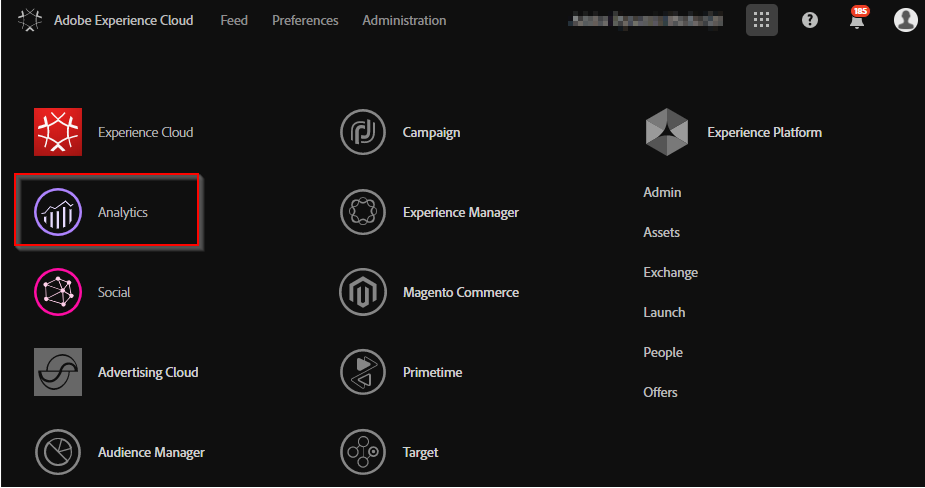

   Välj en rapportsvit.

### Välj en rapportsvit {#selecting-a-report-suite}

1. I det övre högra hörnet av Adobe Analytics-sidan, till höger om fältet **[!UICONTROL Search Reports]**, väljer du rätt rapportsvit i listrutan. Om det finns flera rapportsviter och du är osäker på vilken du ska använda kontaktar du Adobe Analytics-administratören, som kan hjälpa dig att välja rätt rapportsvit.

   På skärmbilden nedan skapade en användare en rapportsvit med namnet *DynamicMediaViewersExtensionDoc* och markerade den i listrutan. Rapportsvitens namn är endast ett exempelnamn. Namnet på den rapportsvit du väljer är upp till dig.

   Om ingen rapportsvit är tillgänglig måste du eller Adobe Analytics-administratören skapa en innan du kan fortsätta med konfigurationen.

   Se [Rapporter och rapportsviter](https://experienceleague.adobe.com/en/docs/analytics/admin/admin-tools/manage-report-suites/report-suites-admin) och [Skapa en rapportsvit](https://experienceleague.adobe.com/en/docs/analytics/admin/admin-tools/manage-report-suites/c-new-report-suite/t-create-a-report-suite).

   I Adobe Analytics hanteras rapportsviter under **[!UICONTROL Admin]** > **[!UICONTROL Report Suites]**.

   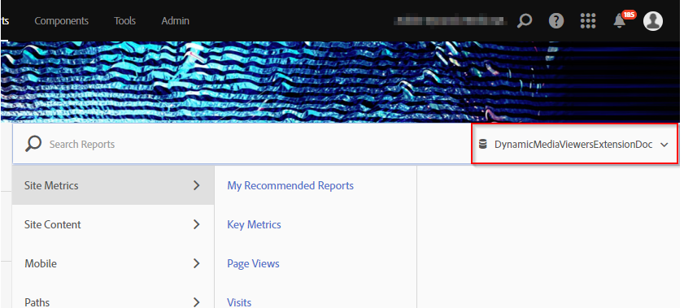

   Konfigurera Adobe Analytics-variabler.

### Ställa in Adobe Analytics-variabler {#setting-up-adobe-analytics-variables}

1. Ange en eller flera Adobe Analytics-variabler som du vill använda för att spåra beteendet hos dynamiska medievisningsprogram på webbsidan.

   Det går att använda alla typer av variabler som stöds av Adobe Analytics. Beslutet om variabeltypen (som Custom Traffic [props], Conversion [eVar]) styrs av de specifika behoven i din Analytics-implementering.

   Se [Översikt över utkast och eVars](https://experienceleague.adobe.com/en/docs/analytics/implementation/vars/page-vars/evar#vars).

   I den här dokumentationen används endast en anpassad trafikvariabel (props) eftersom de blir tillgängliga i en analysrapport inom några minuter efter att en åtgärd har utförts på en webbsida.

   Om du vill aktivera en ny anpassad trafikvariabel går du till **[!UICONTROL Admin]** > **[!UICONTROL Report Suites]** i verktygsfältet i Adobe Analytics.

1. Markera rätt rapport på sidan **[!UICONTROL Report Suite Manager]** och gå sedan till **[!UICONTROL Edit Settings]** > **[!UICONTROL Traffic]** > **[!UICONTROL Traffic Variables]** i verktygsfältet.
1. Välj en variabel som inte används, ge den ett beskrivande namn (**[!UICONTROL Viewer asset (prop 30)]**) och ändra kombinationsrutan till Aktiverad i kolumnen Aktiverad.

   Följande skärmbild är ett exempel på en anpassad trafikvariabel ( **[!UICONTROL prop30]**) för att spåra ett resursnamn som används av visningsprogrammet:

   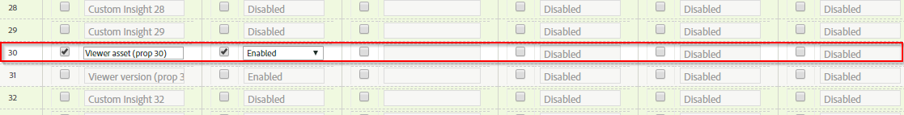

1. Välj **[!UICONTROL Save]** längst ned i variabellistan.

### Konfigurera en rapport {#setting-up-a-report}

1. Vanligtvis styrs skapandet av en rapport i Adobe Analytics av specifika projektbehov. Därför ligger en detaljerad rapportkonfiguration utanför omfånget för den här integreringen.

   Det räcker dock att känna till att rapporter om anpassad trafik automatiskt blir tillgängliga i Adobe Analytics när du har konfigurerat anpassade trafikvariabler i [Konfigurera Adobe Analytics-variabler](#setting-up-adobe-analytics-variables).

   Rapporten för variabeln **[!UICONTROL Viewer asset (prop 30)]** är till exempel tillgänglig på menyn Rapporter under **[!UICONTROL Custom Traffic]** > **[!UICONTROL Custom Traffic 21-30]** > **[!UICONTROL Viewer asset (prop 30)]**.

   Inga data visas när du besöker den här rapporten direkt efter att **[!UICONTROL Viewer asset (prop 30)]** har skapats, vilket är som väntat vid den här tidpunkten i integreringen.

   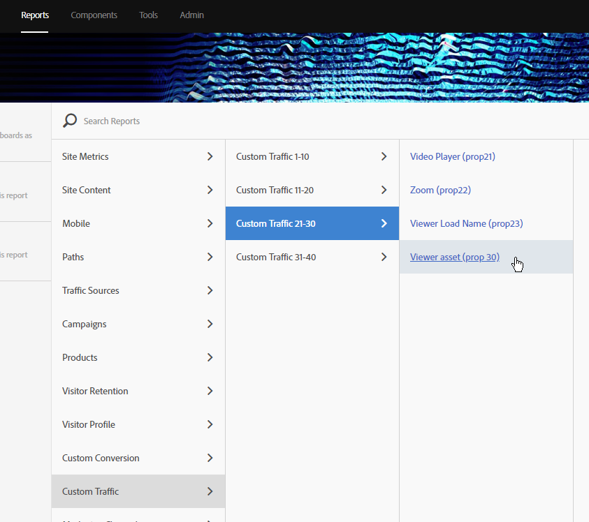

## Konfigurera Experience Platform-taggar för integreringen {#configuring-adobe-launch-for-the-integration}

När du har konfigurerat Experience Platform Tags ställs följande in för integreringen:

* Skapandet av en ny egenskap som håller ihop alla dina konfigurationer.
* Installation och installation av tillägg. Klientkoden för alla tillägg som är installerade i egenskapen kompileras tillsammans till ett bibliotek. Det här biblioteket används av webbsidan senare.
* Konfiguration av dataelement och regler. Den här konfigurationen definierar vilka data som ska hämtas från de dynamiska medievyn, när spårningslogiken ska utlösas och var data ska skickas i Adobe Analytics.
* Publicering av biblioteket.

**Så här konfigurerar du Experience Platform-taggar för integreringen:**

1. Börja med att gå till Experience Platform-taggar från Experience Cloud [hemsida](https://experience.adobe.com/#/home). På menyraden väljer du ikonen **[!UICONTROL Solutions]** (3 x 3 punkter) i det övre högra hörnet av sidan och väljer sedan **[!UICONTROL Tags]**.

   

### Skapa en egenskap i Experience Platform Tags {#creating-a-property-in-adobe-launch}

En egenskap i Experience Platform Tags är en namngiven konfiguration som håller ihop alla inställningar. Ett bibliotek med konfigurationsinställningarna genereras och publiceras på olika miljönivåer (utveckling, mellanlagring och produktion).

Se även [Skapa en taggegenskap](https://experienceleague.adobe.com/en/docs/platform-learn/implement-mobile-sdk/initial-configuration/configure-tags).

1. Markera **[!UICONTROL New Property]** i Experience Platform Tags.
1. I dialogrutan **[!UICONTROL Create Property]** anger du ett beskrivande namn, till exempel webbplatsens titel, i fältet **[!UICONTROL Name]**. Exempel: `DynamicMediaViewersProp.`
1. Ange webbplatsens domän i fältet **[!UICONTROL Domains]**.
1. Aktivera **[!UICONTROL Advanced Options]** i listrutan **[!UICONTROL Configure for extension development (cannot be modified later)]** om det tillägg som du vill använda - i det här fallet *Dynamiska medievyer* - inte har släppts än.

   

1. Välj **[!UICONTROL Save]**.

   Välj den nya egenskapen och gå sedan vidare till *Installation och konfiguration av tillägg*.

### Installera och konfigurera tillägg {#installing-and-setup-of-extensions}

Alla tillgängliga tillägg i Experience Platform Tags listas under **[!UICONTROL Extensions]** > **[!UICONTROL Catalog]**.

Välj **[!UICONTROL Install]** om du vill installera ett tillägg. Utför vid behov en engångskonfiguration och välj sedan **[!UICONTROL Save]**.

Om det behövs måste följande tillägg installeras och konfigureras:

* (Obligatoriskt) *Tillägget Experience Cloud ID Service*.

Ingen ytterligare konfiguration behövs, acceptera för föreslagna värden. Se till att du väljer **[!UICONTROL Save]** när du är klar.

Se [Adobe Experience Cloud Identity Service-tillägg](https://experienceleague.adobe.com/en/docs/experience-platform/tags/extensions/client/id-service/overview).

* (Obligatoriskt) *Adobe Analytics*-tillägg

Om du vill konfigurera det här tillägget måste du ha det Report Suite-ID som finns i Adobe Analytics, under **[!UICONTROL Admin]** > **[!UICONTROL Report Suite]**, under kolumnrubriken **[!UICONTROL Report Suite ID]**.

(Endast i demonstrationssyfte används rapportsvitens-ID för rapportsviten **[!UICONTROL DynamicMediaViewersExtensionDoc]** i följande skärmbilder. Det här ID:t skapades och användes i [Välj en rapportsvit](#selecting-a-report-suite) tidigare.)

På sidan Installera tillägg anger du rapportsvits-ID:t i fälten **[!UICONTROL Development Report Suites]**, **[!UICONTROL Staging Report Suites]** och **[!UICONTROL Production Report Suites]**.

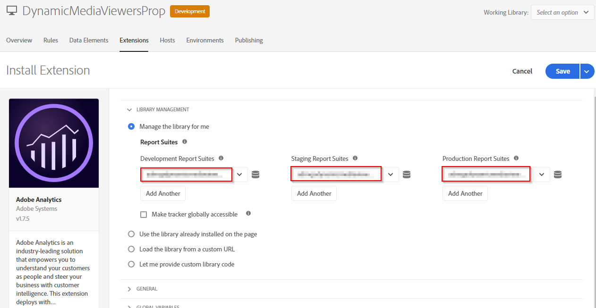

*Konfigurera endast följande objekt om du tänker använda videospårning:*

Expandera **[!UICONTROL Install Extension]** på sidan **[!UICONTROL General]** och ange sedan spårningsservern. Spårningsservern följer mallen `<trackingNamespace>.sc.omtrdc.net`, där `<trackingNamespace>` är den information som hämtas i e-postmeddelandet om etablering.

Välj **[!UICONTROL Save]**.

Se [Adobe Analytics-tillägg](https://experienceleague.adobe.com/en/docs/experience-platform/tags/extensions/client/analytics/overview).

* (Valfritt, krävs bara om videospårning behövs) *Adobe Media Analytics för ljud och video*-tillägg

Fyll i spårningsserverfältet. Spårningsservern för tillägget *Adobe Media Analytics för ljud och video* skiljer sig från spårningsservern som används för Adobe Analytics. Det följer mallen `<trackingNamespace>.hb.omtrdc.net`, där `<trackingNamespace>` är informationen från e-postmeddelandet om etablering.

Alla andra fält är valfria.

Se [Adobe Media Analytics för ljud- och videotillägg](https://experienceleague.adobe.com/en/docs/experience-platform/tags/extensions/client/media-analytics/overview).

* (Obligatoriskt) Tillägget *Dynamiska medievisningsprogram*

Välj **[!UICONTROL enable Adobe Analytics for Video]** om du vill aktivera (starta) spårning av pulsslag för video.

Från och med den här skrivningen är tillägget *Dynamiska medievisningsprogram* bara tillgängligt om Experience Platform Tags Property har skapats för utveckling.

Se [Skapa en egenskap i Experience Platform-taggar](#creating-a-property-in-adobe-launch).

När tilläggen har installerats och konfigurerats visas minst följande fem tillägg (fyra om du inte spårar video) under Tillägg > Installerat.

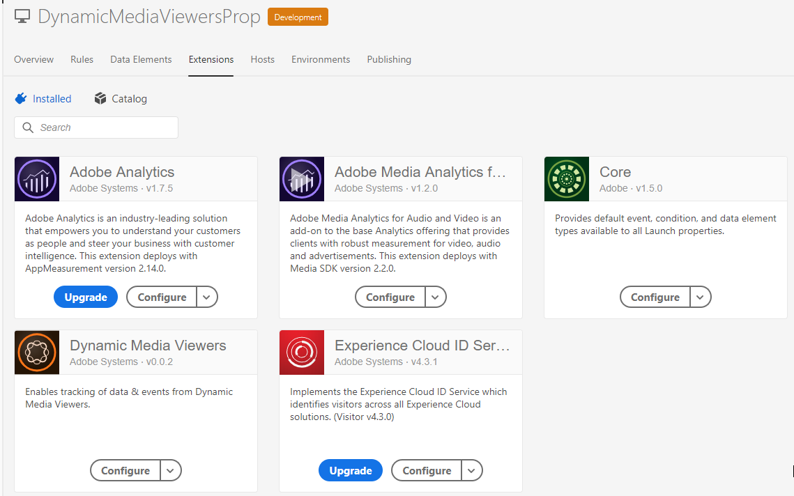

### Ställ in dataelement och regler {#setting-up-data-elements-and-rules}

I Experience Platform Tags skapar du dataelement och regler som behövs för att spåra visare för dynamiska media.

Se [Hur data- och händelsespårning fungerar i integreringen](#how-data-and-event-tracking-works-in-the-integration) för en översikt över spårning med Experience Platform-taggar.

Se [Exempelkonfiguration](#sample-configuration) för en exempelkonfiguration i Experience Platform Tags som visar hur du spårar ett resursnamn när visningsprogrammet läses in.

Se [Konfigurera tillägget för dynamiska mediavisare](#configuring-the-dynamic-media-viewers-extension) för detaljerad information om tilläggets funktioner.

### Publicera ett bibliotek {#publishing-a-library}

Om du vill ändra konfigurationen för Experience Platform-taggar (inklusive inställningar för egenskaper, tillägg, regler och dataelement) måste du *publicera* sådana ändringar. Publicering i Experience Platform-taggar utförs från fliken Publicering under egenskapskonfigurationen.

Experience Platform Tags kan ha flera utvecklingsmiljöer, en mellanlagringsmiljö och en produktionsmiljö. Som standard pekar Experience Platform Tags Cloud Configuration i Experience Manager på Experience Manager författarnoden mot scenmiljön i Experience Platform Tags. Noden Experience Manager Publish pekar på produktionsmiljön för Experience Platform-taggar. Detta innebär att med standardinställningarna för Experience Manager måste du publicera Experience Platform Tags-biblioteket till mellanlagringsmiljön. Om du gör det kan du använda det i Experience Manager författare. Du kan sedan publicera den i produktionsmiljön så att den kan användas i Experience Manager-publicering.

Mer information om Experience Platform Tags-miljöer finns i [Miljö](https://experienceleague.adobe.com/en/docs/experience-platform/tags/publish/environments/environments).

Publicering av ett bibliotek omfattar följande två steg:

* Lägga till och skapa ett nytt bibliotek genom att inkludera alla nödvändiga ändringar (nya och uppdateringar) i biblioteket.
* Flytta upp biblioteket genom de olika miljönivåerna (från utveckling till mellanlagring och produktion).

#### Lägga till och skapa ett nytt bibliotek {#adding-and-building-a-new-library}

1. Första gången du öppnar fliken Publicera i Experience Platform Tags är bibliotekslistan tom.

   Välj **[!UICONTROL Add New Library]** i den vänstra kolumnen.

   

1. På sidan Skapa nytt bibliotek anger du det beskrivande namnet för det nya biblioteket i fältet **[!UICONTROL Name]**. Exempel:

   *DynamicMediaViewersLib*

   Välj miljönivå i listrutan Miljö. Till att börja med är bara utvecklingsnivån tillgänglig för val. Välj **[!UICONTROL Add All Changed Resources]** i närheten av sidans nedre vänstra sida.

   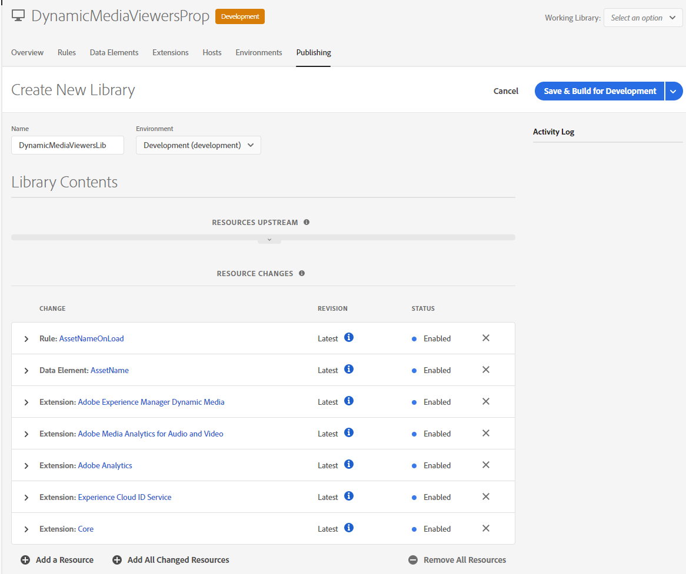

1. Välj **[!UICONTROL Save & Build for Development]** i sidans övre högra hörn.

   Om några minuter är biblioteket klart att användas.

   

   >[!NOTE]
   >
   >Nästa gång du ändrar konfigurationen för Experience Platform-taggar går du till fliken **[!UICONTROL Publishing]** under konfigurationen för **[!UICONTROL Property]** och väljer sedan det bibliotek du skapat tidigare.
   >
   >
   >På bibliotekets publiceringsskärm väljer du **[!UICONTROL Add All Changed Resources]** och sedan **[!UICONTROL Save & Build for Development]**.

#### Flytta upp ett bibliotek via miljönivåer {#moving-a-library-up-through-environment-levels}

1. När ett nytt bibliotek har lagts till finns det i utvecklingsmiljön. Om du vill flytta den till nivån för mellanlagringsmiljön (som motsvarar kolumnen Skickat) väljer du **[!UICONTROL Submit for Approval]** på bibliotekets nedrullningsbara meny.

   

1. Välj **[!UICONTROL Submit]** i bekräftelsedialogrutan.

   När biblioteket har flyttats till kolumnen Skickat väljer du **[!UICONTROL Build for Staging]** på bibliotekets nedrullningsbara meny.

   

1. Om du vill flytta biblioteket från mellanlagringsmiljön till produktionsmiljön (kolumnen Publicerad) följer du en liknande process.

   Välj först **[!UICONTROL Approve for Publishing]** i listrutan.

   

1. Välj **[!UICONTROL Build & Publish to Production]** i listrutan.

   

   Mer information om publiceringsprocessen i Experience Platform Tags finns i [Publicera](https://experienceleague.adobe.com/en/docs/experience-platform/tags/publish/overview).

## Konfigurera Adobe Experience Manager för integreringen {#configuring-adobe-experience-manager-for-the-integration}

Förutsättningar:

* Experience Manager kör både Skapat av och Publicera.
* Experience Manager-författarnod har konfigurerats i Dynamic Media - Scene7-körningsläge (dynamicmedia_s7)
* Dynamic Media WCM-komponenter är aktiverade i Experience Manager Sites.

Experience Manager-konfigurationen består av följande två huvudsteg:

* Konfiguration av Experience Manager IMS.
* Konfiguration av Experience Platform Tags Cloud.

### Konfigurera Experience Manager IMS {#configuring-aem-ims}

1. I Experience Manager-författaren väljer du ikonen **[!UICONTROL Tools]** (hammare) och går sedan till **[!UICONTROL Security]** > **[!UICONTROL Adobe IMS Configurations]**.

   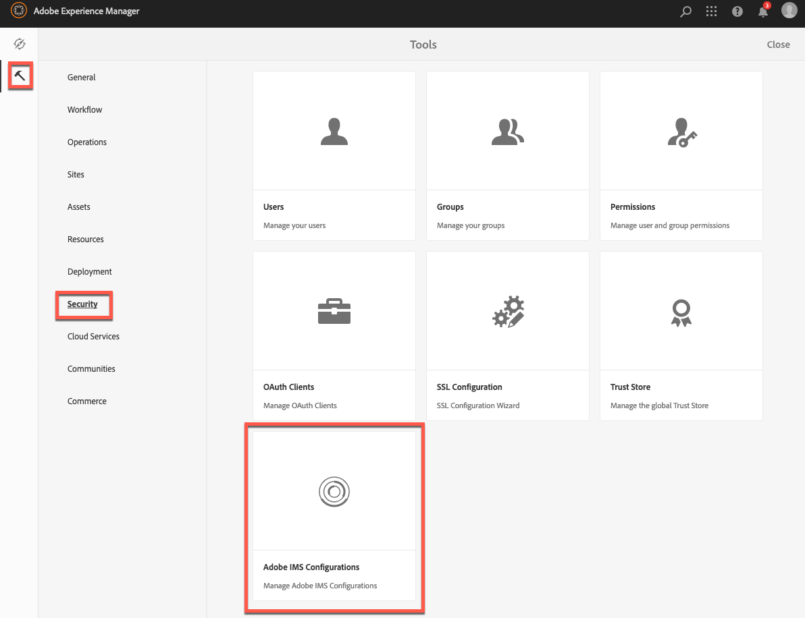

1. Välj **[!UICONTROL Create]** på konfigurationssidan för Adobe IMC, i det övre vänstra hörnet.
1. På sidan **[!UICONTROL Adobe IMS Technical Account Configuration]** väljer du **[!UICONTROL Cloud Solution]** i listrutan **[!UICONTROL Experience Platform Tags]**.
1. Aktivera **[!UICONTROL Create new certificate]** och ange sedan ett meningsfullt värde för certifikatet i textfältet. Exempel: *AdobeLaunchIMSCert*. Välj **[!UICONTROL Create certificate]**.

   Följande informationsmeddelande visas:

   *Om du vill hämta en giltig åtkomsttoken läggs det nya certifikatets offentliga nyckel till i det tekniska kontot på Adobe Developer Console!*

   Om du vill stänga dialogrutan Info väljer du **[!UICONTROL OK]**.

   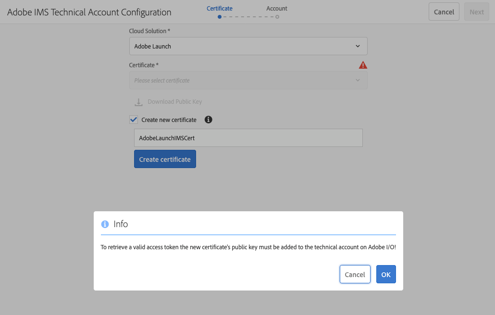

1. Om du vill hämta en fil med en offentlig nyckel (&#42;.crt) till ditt lokala system väljer du **[!UICONTROL Download Public Key]**.

   >[!NOTE]
   >
   >***lämna sidan*** öppen **[!UICONTROL Adobe IMS Technical Account Configuration]** i det här läget. ***stäng inte*** sidan och ***välj inte*** Nästa. Du kommer att gå tillbaka till den här sidan senare i stegen.

   

1. Navigera till [[!DNL Adobe Developer Console]](https://developer.adobe.com/console/integrations) på en ny flik i webbläsaren.

1. På sidan **[!UICONTROL Adobe Developer Console Integrations]**, nära det övre högra hörnet, väljer du **[!UICONTROL New integration]**.
1. Kontrollera att alternativknappen **[!UICONTROL Create a new integration]** är markerad i dialogrutan **[!UICONTROL Access an API]** och välj sedan **[!UICONTROL Continue]**.

   

1. På den andra **[!UICONTROL Create a new integration]**-sidan aktiverar du (sätter på) alternativknappen **[!UICONTROL Experience Platform Tags API]**. Välj **[!UICONTROL Continue]** i sidans nedre högra hörn.

   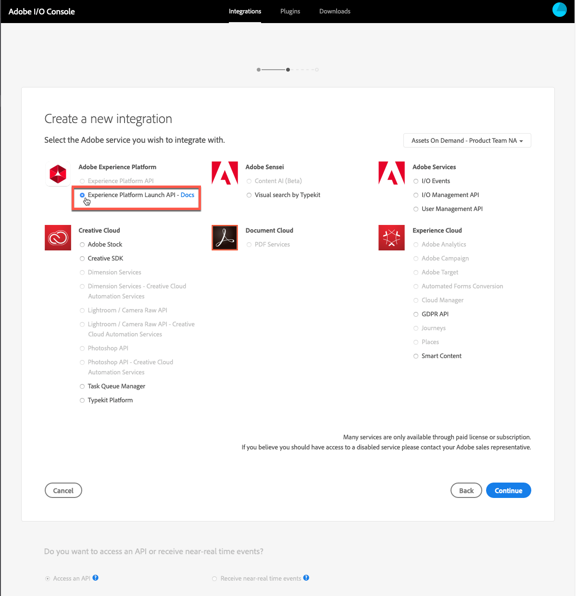

1. Gör följande på den tredje **[!UICONTROL Create a new integration]**-sidan:

   * Ange ett beskrivande namn i fältet **[!UICONTROL Name]**. Exempel: *DynamicMediaViewersIO*.

   * I fältet **[!UICONTROL Description]** anger du en beskrivning för integreringen.

   * I området **[!UICONTROL Public key certificates]** överför du filen med den offentliga nyckeln (&#42;.crt) som du hämtade tidigare i dessa steg.

   * Välj **[!UICONTROL Select a role for Experience Platform Tags API]** under rubriken **[!UICONTROL Admin]**.

   * Välj produktprofilen **[!UICONTROL Select one or more product profiles for Experience Platform Tags API]** under rubriken **[!UICONTROL Tags - <your_company_name>]**.

   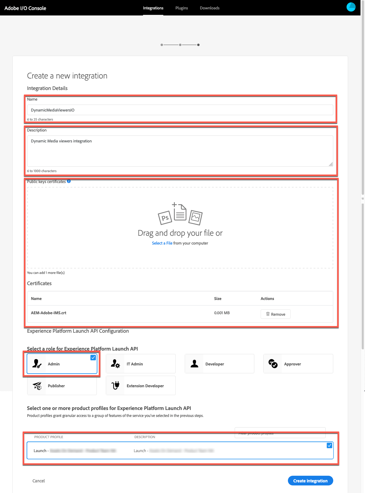

1. Välj **[!UICONTROL Create integration]**.
1. Välj **[!UICONTROL Integration created]** på sidan **[!UICONTROL Continue to integration details]**.

   

1. En integreringsinformationssida visas, **&#x200B;**, ungefär som följande:

   >[!NOTE]
   >
   >***Låt den här sidan med integreringsinformation vara öppen.*** Du kommer att behöva olika uppgifter från flikarna **[!UICONTROL Overview]** och **[!UICONTROL JWT]** om bara ett ögonblick.

   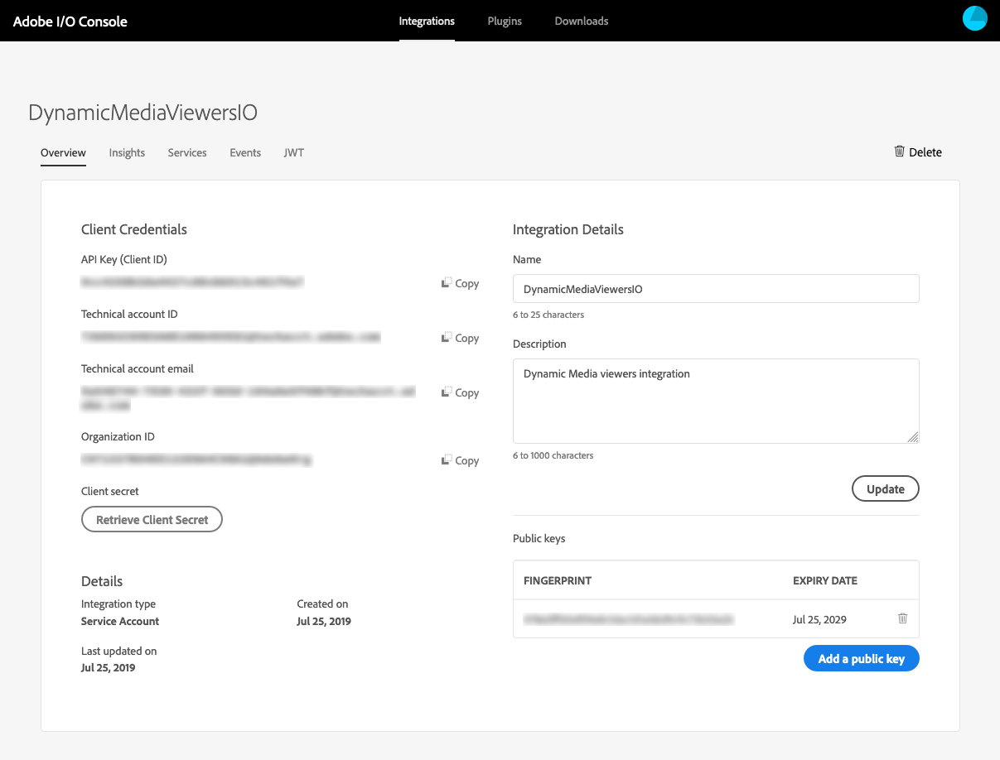

   Sidan med integreringsinformation.

1. Gå tillbaka till sidan **[!UICONTROL Adobe IMS Technical Account Configuration]** som du öppnade tidigare. I det övre högra hörnet på sidan väljer du **[!UICONTROL Next]** för att öppna sidan **[!UICONTROL Account]** i fönstret **[!UICONTROL Adobe IMS Technical Account Configuration]**.

   (Om du stängde sidan tidigare går du tillbaka till Experience Manager-författaren och går till **[!UICONTROL Tools]** > **[!UICONTROL Security]** > **[!UICONTROL Adobe IMS Configurations]**. Välj **[!UICONTROL Create]**. I listrutan **[!UICONTROL Cloud Solution]** väljer du **[!UICONTROL Experience Platform Tags]**. I listrutan **[!UICONTROL Certificate]** markerar du namnet på det certifikat som skapats tidigare.)

   

   Adobe IMS Technical Account Configuration - certifikatsida.

1. Sidan **[!UICONTROL Account]** har fem fält som du måste fylla i med information från sidan Integreringsinformation från föregående steg.

   

   Adobe IMS Technical Account Configuration - kontosida.

1. På sidan **[!UICONTROL Account]** fyller du i följande fält:

   * **[!UICONTROL Title]** - Ange en beskrivande kontotitel.
   * **[!UICONTROL Authorization Server]** - Återgå till sidan Integreringsinformation som du öppnade tidigare. Välj fliken **[!UICONTROL JWT]**. Kopiera servernamnet - utan sökvägen - enligt markeringen nedan.

   Gå tillbaka till sidan **[!UICONTROL Account]** och klistra sedan in namnet i respektive fält.
Exempel: `https://ims-na1.adobelogin.com/`
(servernamnet är endast ett exempel)

   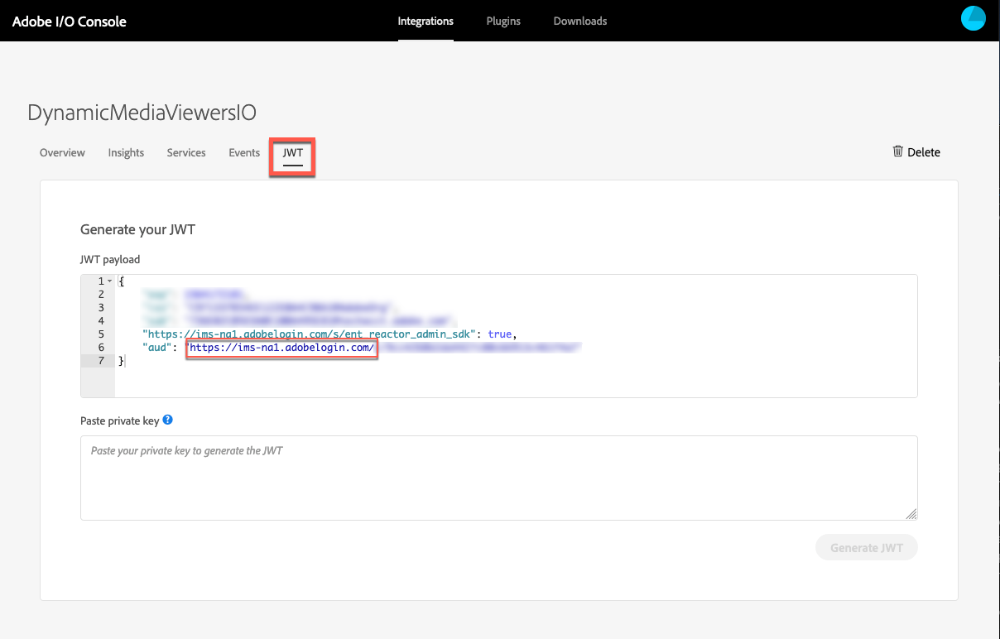

   Detaljsida för integrering - fliken JWT

1. **[!UICONTROL API Key]** – Gå tillbaka till sidan med integreringsinformation. Välj fliken **[!UICONTROL Overview]** och välj sedan **[!UICONTROL API Key (Client ID)]** till höger om fältet **[!UICONTROL Copy]**.

   Gå tillbaka till sidan **[!UICONTROL Account]** och klistra sedan in nyckeln i respektive fält.

   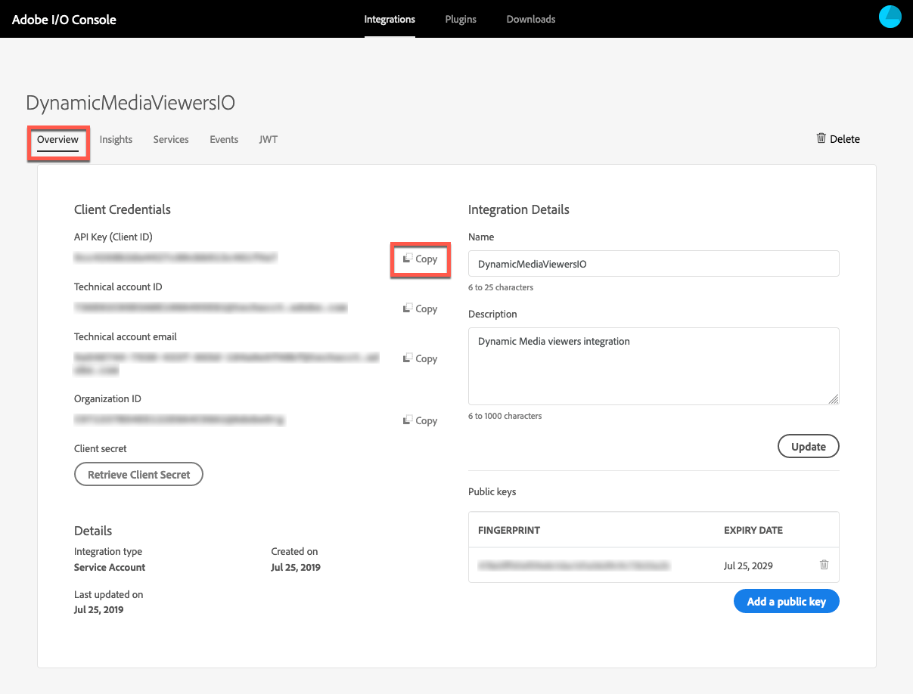

   Sidan med integreringsinformation.

1. **[!UICONTROL Client Secret]** – Gå tillbaka till sidan med integreringsinformation. Välj **[!UICONTROL Overview]** på fliken **[!UICONTROL Retrieve Client Secret]**. Välj **[!UICONTROL Client secret]** till höger om fältet **[!UICONTROL Copy]**.

   Gå tillbaka till sidan **[!UICONTROL Account]** och klistra sedan in nyckeln i respektive fält.

1. **[!UICONTROL Payload]** – Gå tillbaka till sidan med integreringsinformation. Kopiera hela JSON-objektkoden från fliken **[!UICONTROL JWT]** i fältet JWT-nyttolast.

   Gå tillbaka till sidan **[!UICONTROL Account]** och klistra sedan in koden i respektive fält.

   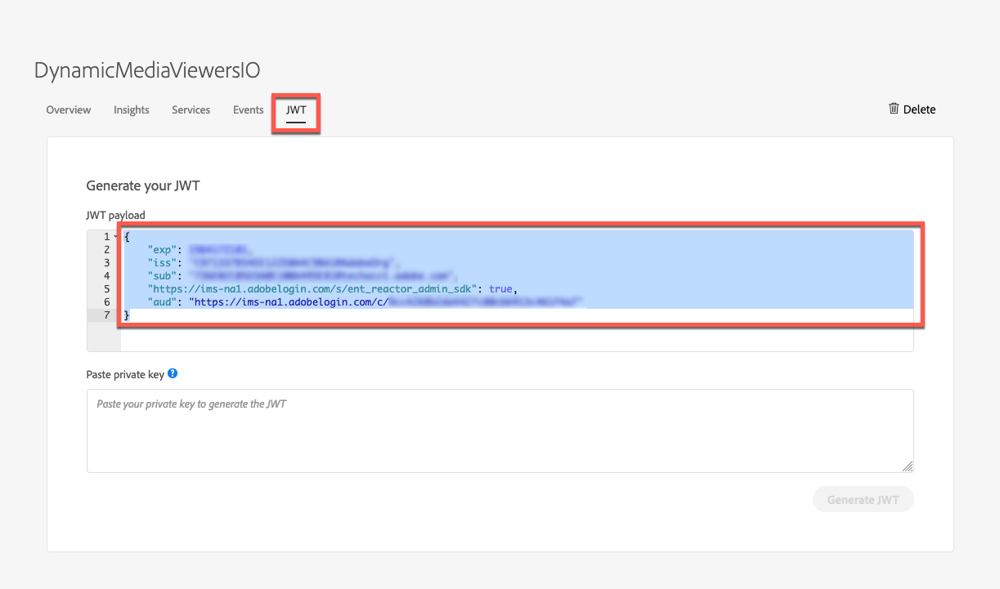

   Integrationsinformationssida - JWT-flik

   Kontosidan, med alla fält ifyllda, ser ut ungefär så här:

   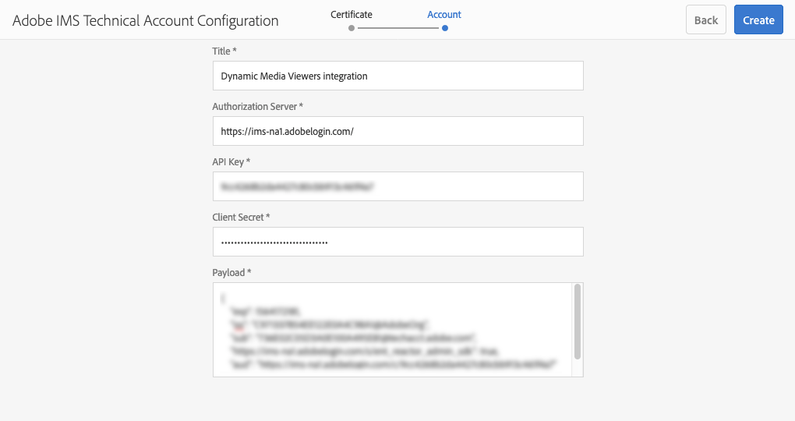

1. Välj **[!UICONTROL Account]** i det övre högra hörnet på sidan **[!UICONTROL Create]**.

   När Experience Manager IMS är konfigurerat har du nu ett nytt IMSAccount som visas under **[!UICONTROL Adobe IMS Configurations]**.

   

## Konfigurera Experience Platform Tags Cloud för integrering {#configuring-adobe-launch-cloud-for-the-integration}

1. I Experience Manager-författaren, nära det övre vänstra hörnet, väljer du ikonen **[!UICONTROL Tools]** (hammare) och går sedan till **[!UICONTROL Cloud Services]** > **[!UICONTROL Experience Platform Tags Configurations]**.

   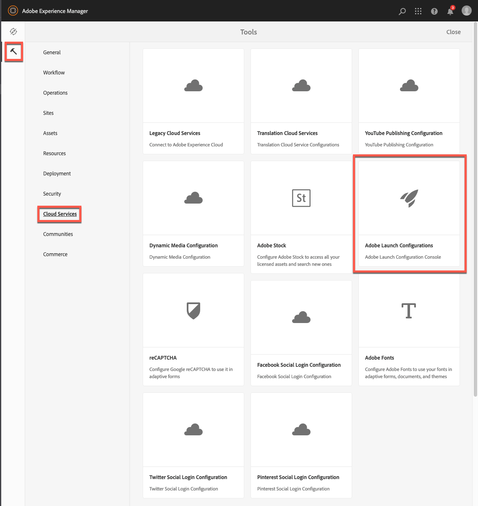

1. På sidan **[!UICONTROL Experience Platform Tags Configurations]** i den vänstra panelen väljer du en Experience Manager-webbplats som du vill använda Experience Platform Tags Configuration för.

   Endast i exempelsyfte väljs platsen **`We.Retail`** i skärmbilden nedan.

   

1. Välj **[!UICONTROL Create]** i sidans övre vänstra hörn.
1. På sidan **[!UICONTROL General]** (sida 1/3) i fönstret **[!UICONTROL Create Experience Platform Tags Configuration]** fyller du i följande fält:

   * **[!UICONTROL Title]** - Ange en beskrivande konfigurationstitel. Exempel: `We.Retail Tags cloud configuration`.

   * **[!UICONTROL Associated Adobe IMS Configuration]** - Välj den IMS-konfiguration som du skapade tidigare i [Konfigurera Experience Manager IMS](#configuring-aem-ims).

   * **[!UICONTROL Company]** - I listrutan **[!UICONTROL Company]** väljer du ditt Experience Cloud-företag. Listan fylls i automatiskt.

   * **[!UICONTROL Property]** - I listrutan Egenskaper väljer du egenskapen Experience Platform Tags som du skapade tidigare. Listan fylls i automatiskt.

   När du har fyllt i alla fält ser sidan **[!UICONTROL General]** ut ungefär så här:

   

1. Välj **[!UICONTROL Next]** i det övre vänstra hörnet.
1. På sidan **[!UICONTROL Staging]** (sida 2/3) i fönstret **[!UICONTROL Create Experience Platform Tags Configuration]** fyller du i följande fält:

   Kontrollera platsen för mellanlagringsversionen av ditt Experience Platform Tags-bibliotek i fältet **[!UICONTROL Library URI]** (Uniform Resource Identifier). Experience Manager fyller i detta fält automatiskt.

   I det här steget används endast bibliotek för Experience Platform-taggar som distribueras till Adobe CDN.

   >[!NOTE]
   >
   >Kontrollera att den automatiskt ifyllda biblioteks-URI:n (Uniform Resource Identifier) inte har fel format. Om det behövs kan du åtgärda det så att URI:n representerar en protokollrelativ URI. Det vill säga, det börjar med ett dubbelt snedstreck.
   >
   >
   >Till exempel: `//assets.adobetm.com/launch-xxxx`.

   Sidan **[!UICONTROL Staging]** ser förmodligen ut ungefär så här. Alternativen **[!UICONTROL Archive]** och **[!UICONTROL Load Library Asynchronously]** är ***inte*** angivna:

   

1. Välj **[!UICONTROL Next]** i det övre högra hörnet.
1. På sidan **[!UICONTROL Production]** (sida 3/3) i fönstret **[!UICONTROL Create Experience Platform Tags Configuration]** korrigerar du (vid behov) den automatiskt ifyllda produktions-URI:n på samma sätt som på föregående **[!UICONTROL Staging]**-sida.
1. Välj **[!UICONTROL Create]** i det övre högra hörnet.

   Din nya Experience Platform Tags Cloud-konfiguration skapas och visas bredvid din webbplats enligt följande exempel:

1. Markera din nya Experience Platform Tags Cloud-konfiguration (en bockmarkering visas till vänster om konfigurationstiteln när den har valts). Välj **[!UICONTROL Publish]** i verktygsfältet.

   

För närvarande stöder inte Experience Manager-författare integrering av dynamiska medievyer med Experience Platform-taggar.

Det stöds dock i Experience Manager publiceringsnod. Experience Manager publiceringsnod använder standardinställningarna för Experience Platform Tags Cloud Configuration och produktionsmiljön för Experience Platform Tags. Därför måste Experience Platform Tags Library-uppdateringarna från Development till Production Environment varje gång under testet skickas.

Det är möjligt att kringgå denna begränsning. Ange utvecklings- eller mellanlagrings-URL för plattformstaggbiblioteket i Experience Platform Tags Cloud-konfigurationen för Experience Manager publiceringsnod ovan. När du gör det använder Experience Manager publiceringsnod utvecklings- eller mellanlagringsversionen av Experience Platform Tags-biblioteket.

Mer information om hur du konfigurerar Experience Platform Tags Cloud finns i [Integrera Experience Manager med Experience Platform Tags via [!DNL Adobe Developer Console]](https://experienceleague.adobe.com/en/docs/experience-manager-learn/sites/integrations/experience-platform-data-collection-tags/overview).
