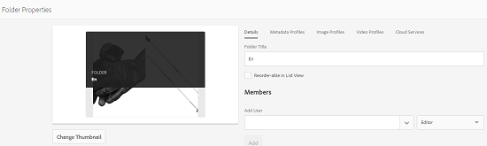

# Använd översättningsmolntjänster på mappar {#applying-translation-cloud-services-to-folders}

Med Adobe Experience Manager (AEM) kan ni använda molnbaserade översättningstjänster från den översättningsleverantör ni väljer för att se till att era resurser översätts utifrån era behov.

Du kan använda översättningsmolntjänsten direkt i resursmappen så att den kan användas under översättningsarbetsflöden.

## Använda översättningstjänster {#applying-the-translation-services}

Genom att använda översättningsmolntjänster direkt i resursmappen behöver du inte konfigurera översättningstjänster när du skapar eller uppdaterar översättningsarbetsflöden.

1. I Assets-användargränssnittet väljer du den mapp som du vill använda översättningstjänster på.
1. Klicka/tryck på ikonen **[!UICONTROL Egenskaper]** i verktygsfältet för att visa sidan **[!UICONTROL Mappegenskaper]** .

   

1. Gå till fliken **[!UICONTROL Cloud-tjänster]** .
1. Välj önskad översättningsleverantör i listan Cloud-tjänstkonfigurationer. Om du till exempel vill använda översättningstjänster från Microsoft väljer du **[!UICONTROL Microsoft Translator]**.

   

1. Välj koppling för översättningsprovidern.

   

1. Klicka/tryck på **[!UICONTROL Spara]** i verktygsfältet och klicka sedan på **[!UICONTROL OK]** för att stänga dialogrutan.Översättningstjänsten används i mappen.

## Använd anpassad översättningskoppling {#applying-custom-translation-connector}

Om du vill använda en anpassad koppling för de översättningstjänster som du vill använda i översättningsarbetsflöden. Om du vill använda en anpassad koppling måste du först installera kopplingen från Package Manager. Konfigurera sedan anslutningen från molntjänstkonsolen. När du har konfigurerat kopplingen är den tillgänglig i listan över anslutningar på fliken Cloud-tjänster som beskrivs i [Använda översättningstjänsterna](transition-cloud-services.md#applying-the-translation-services). När du har tillämpat den anpassade kopplingen och kört översättningsarbetsflöden visas anslutningsinformationen under rubrikens **[!UICONTROL provider]** och **[!UICONTROL metod]** **** i översättningsprojektets översättningssammanfattningssida.

1. Installera kopplingen från Package Manager.
1. Klicka på/tryck på AEM-logotypen och gå till **[!UICONTROL Verktyg > Distribution > Cloud-tjänster]**.
1. Leta reda på den koppling du installerade under **[!UICONTROL tredjepartstjänster]** på sidan **[!UICONTROL Cloud-tjänster]** .

   

1. Klicka på/tryck på länken **[!UICONTROL Konfigurera nu]** för att öppna dialogrutan **[!UICONTROL Skapa konfiguration]** .

   

1. Ange en titel och ett namn för kopplingen och klicka/tryck sedan på **[!UICONTROL Skapa]**. Den anpassade kopplingen finns i listan över anslutningar på fliken **[!UICONTROL Cloud-tjänster]** som beskrivs i steg 5 i [Använda översättningstjänsterna](#applying-the-translation-services).
1. Kör ett översättningsarbetsflöde som beskrivs i [Skapa översättningsprojekt](translation-projects.md) när du har använt den anpassade kopplingen. Kontrollera informationen om kopplingen i **[!UICONTROL översättningssammanfattningsrutan]** i översättningsprojektet i **[!UICONTROL projektkonsolen]** .

   
