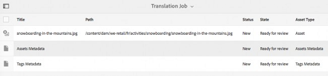

# Skapa översättningsprojekt {#creating-translation-projects}

Om du vill skapa en språkkopia utlöser du ett av följande språkkopieringsarbetsflöden som är tillgängliga under referenslinjen i användargränssnittet för [!DNL Experience Manager].

* **Skapa och översätt**: I det här arbetsflödet kopieras resurser som ska översättas till språkroten för det språk som du vill översätta till. Beroende på vilka alternativ du väljer skapas dessutom ett översättningsprojekt för resurserna i projektkonsolen. Beroende på inställningarna kan översättningsprojektet startas manuellt eller köras automatiskt så fort översättningsprojektet skapas.

* **Uppdatera språkkopior**: Kör det här arbetsflödet för att översätta ytterligare en grupp resurser och inkludera den i en språkkopia för en viss språkinställning. I det här fallet läggs de översatta resurserna till i målmappen som redan innehåller översatta resurser.

>[!PREREQUISITES]
>
>* Användare som skapar översättningsprojekt är medlemmar i gruppen `projects-administrators`.
>* Översättningstjänstleverantören stöder översättning av binära filer.

## Skapa och översätta arbetsflöde {#create-and-translate-workflow}

Du använder arbetsflödet för att skapa och översätta för att generera språkkopior för ett visst språk för första gången. Arbetsflödet innehåller följande alternativ:

* Skapa endast struktur.
* Skapa ett översättningsprojekt.
* Lägg till i befintligt översättningsprojekt.

### Skapa endast struktur {#create-structure-only}

Använd alternativet **[!UICONTROL Create structure only]** för att skapa en målmappshierarki inom målspråkets rot som matchar källmappens hierarki i källspråkets rot. I det här fallet kopieras källresurserna till målmappen. Inget översättningsprojekt genereras emellertid.

1. I gränssnittet [!DNL Assets] väljer du den källmapp som du vill skapa en struktur för i målspråkets rot.

1. Öppna rutan **[!UICONTROL References]** och klicka på **[!UICONTROL Language Copies]** under **[!UICONTROL Copies]**.

   

1. Klicka på **[!UICONTROL Create & Translate]**. I listan **[!UICONTROL Target Languages]** väljer du det språk som du vill skapa en mappstruktur för.

1. Välj **[!UICONTROL Create structure only]** i listan **[!UICONTROL Project]**.

1. Klicka på **[!UICONTROL Create]**. Den nya strukturen för målspråket listas under **[!UICONTROL Language Copies]**.

   

1. Klicka på strukturen i listan och klicka sedan på **[!UICONTROL Reveal in Assets]** för att navigera till mappstrukturen inom målspråket.

   

### Skapa ett översättningsprojekt {#create-a-new-translation-project}

Om du använder det här alternativet kopieras resurser som ska översättas till språkroten för det språk som du vill översätta till. Beroende på vilka alternativ du väljer skapas ett översättningsprojekt för resurserna i projektkonsolen. Beroende på inställningarna kan översättningsprojektet startas manuellt eller automatiskt så snart översättningsprojektet skapas.

1. I användargränssnittet för [!DNL Assets] väljer du den källmapp som du vill skapa en språkkopia för.
1. Öppna rutan **[!UICONTROL References]** och klicka på **[!UICONTROL Language Copies]** under **[!UICONTROL Copies]**.

   

1. Klicka på **[!UICONTROL Create & Translate]** längst ned.

1. I listan **[!UICONTROL Target Languages]** väljer du de språk som du vill skapa en mappstruktur för.

1. Välj **[!UICONTROL Create a new translation project]** i listan **[!UICONTROL Project]**.

1. Ange en titel för projektet i fältet **[!UICONTROL Project Title]**.

1. Klicka på **[!UICONTROL Create]**. [!DNL Assets] från källmappen kopieras till målmapparna för de språkinställningar du valde i steg 4.

   

1. Om du vill navigera till mappen markerar du språkkopian och klickar på **[!UICONTROL Reveal in Assets]**.

   

1. Navigera till projektkonsolen. Översättningsmappen kopieras till projektkonsolen.

   

1. Öppna mappen för att visa översättningsprojektet.

   

1. Klicka på projektet för att öppna informationssidan.

   

1. Om du vill visa översättningsjobbets status klickar du på ellipsen längst ned i rutan **[!UICONTROL Translation Job]**.

   

   Mer information om jobbstatus finns i [Övervaka status för ett översättningsjobb](/help/sites-administering/tc-manage.md#monitoring-the-status-of-a-translation-job).

1. Navigera till användargränssnittet [!DNL Assets] och öppna sidan [!UICONTROL Properties] för vart och ett av de översatta resurserna för att visa översatta metadata.

   

   *Figur: Översatta metadata på sidan för resursegenskaper.*

   >[!NOTE]
   >
   >Den här funktionen är tillgänglig både för resurser och mappar. När en resurs väljs i stället för en mapp kopieras hela mapphierarkin upp till språkroten för att skapa en språkkopia för resursen.

### Lägg till i befintligt översättningsprojekt {#add-to-existing-translation-project}

Om du använder det här alternativet körs översättningsarbetsflödet för resurser som du lägger till i källmappen efter att ha kört ett tidigare arbetsflöde för översättning. Endast resurser som nyligen lagts till kopieras till målmappen som innehåller tidigare översatta resurser. Inget nytt översättningsprojekt skapas i det här fallet.

1. Navigera till källmappen som innehåller oöversatta resurser i [!DNL Assets]-gränssnittet.
1. Markera en resurs som du vill översätta och öppna **[!UICONTROL Reference pane]**. I avsnittet **[!UICONTROL Language Copies]** visas antalet översättningskopior som är tillgängliga.
1. Klicka på **[!UICONTROL Language Copies]** under **[!UICONTROL Copies]**. En lista över tillgängliga översättningskopior visas.
1. Klicka på **[!UICONTROL Create & Translate]** längst ned.

1. I listan **[!UICONTROL Target Languages]** väljer du de språk som du vill skapa en mappstruktur för.

1. I listan **[!UICONTROL Project]** väljer du **[!UICONTROL Add to existing translation project]** för att köra översättningsarbetsflödet för mappen.

   >[!NOTE]
   >
   >Om du väljer alternativet **[!UICONTROL Add to existing translation project]** läggs ditt översättningsprojekt till i ett befintligt projekt endast om dina projektinställningar exakt matchar inställningarna för det befintliga projektet. Annars skapas ett nytt projekt.

1. Välj ett projekt i listan **[!UICONTROL Existing translation project]** som du vill lägga till resursen för översättning.

1. Klicka på **[!UICONTROL Create]**. Resurserna som ska översättas läggs till i målmappen. Den uppdaterade mappen listas i avsnittet **[!UICONTROL Language Copies]**.

   

1. Navigera till projektkonsolen och öppna det befintliga översättningsprojektet som du har lagt till i.
1. Klicka på sidan med projektinformation för översättning.

   

1. Klicka på ellipsen längst ned i rutan **Översättningsjobb** för att visa resurserna i översättningsarbetsflödet. I översättningsjobblistan visas även poster för metadata och taggar för resurser. Dessa poster anger att metadata och taggar för resurserna också översätts.

   >[!NOTE]
   >
   >Om du tar bort posten för taggar eller metadata översätts inga taggar eller metadata för resurserna.

   >[!NOTE]
   >
   >Om den resurs som du lägger till i översättningsjobbet innehåller delresurser, markerar du delresurserna och tar bort dem för översättningen för att fortsätta utan några fel.

1. Om du vill starta översättningen för resurserna klickar du på pilen på **[!UICONTROL Translation Job]**-panelen och väljer **[!UICONTROL Start]** i listan.

   

   Ett meddelande meddelar när översättningsjobbet påbörjas.

1. Om du vill visa översättningsjobbets status klickar du på ellipsen längst ned i rutan **[!UICONTROL Translation Job]**.

   

   Mer information finns i [Övervaka status för ett översättningsjobb](/help/sites-administering/tc-manage.md#monitoring-the-status-of-a-translation-job).

1. När översättningen är klar ändras statusen till Klart för granskning. Navigera till användargränssnittet för [!DNL Assets] och öppna sidan Egenskaper för vart och ett av de översatta resurserna för att visa översatta metadata.

## Uppdatera språkkopior {#update-language-copies}

Kör det här arbetsflödet för att översätta alla ytterligare resurser och inkludera dem i en språkkopia för en viss språkinställning. I det här fallet läggs de översatta resurserna till i målmappen som redan innehåller översatta resurser. Beroende på vilka alternativ du väljer skapas ett översättningsprojekt eller så uppdateras ett befintligt översättningsprojekt för de nya resurserna. Arbetsflödet för att uppdatera språkkopior innehåller följande alternativ:

* Skapa ett översättningsprojekt
* Lägg till i befintligt översättningsprojekt

### Skapa ett översättningsprojekt {#create-a-new-translation-project-1}

Om du använder det här alternativet skapas ett översättningsprojekt för den resursuppsättning som du vill uppdatera en språkkopia för.

1. I användargränssnittet för [!DNL Assets] väljer du den källmapp där du lade till en resurs.
1. Öppna rutan **[!UICONTROL References]** och klicka på **[!UICONTROL Language Copies]** under **[!UICONTROL Copies]** för att visa listan med språkkopior.
1. Markera kryssrutan före **[!UICONTROL Language Copies]** och välj sedan den målmapp som motsvarar rätt språkinställning.

   

1. Klicka på **[!UICONTROL Update language copies]** längst ned.

1. Välj **[!UICONTROL Create a new translation project]** i listan **[!UICONTROL Project]**.

1. Ange en titel för projektet i fältet **[!UICONTROL Project Title]**.

1. Klicka på **[!UICONTROL Start]**.
1. Navigera till projektkonsolen. Översättningsmappen kopieras till projektkonsolen.

   

1. Öppna mappen för att visa översättningsprojektet.

   

1. Klicka på projektet för att öppna informationssidan.

   

1. Om du vill starta översättningen för resurserna klickar du på pilen på **[!UICONTROL Translation Job]**-panelen och väljer **[!UICONTROL Start]** i listan.

   

   Ett meddelande meddelar när översättningsjobbet påbörjas.

1. Om du vill visa översättningsjobbets status klickar du på ellipsen längst ned i rutan **[!UICONTROL Translation Job]**.

   

   Mer information om jobbstatus finns i [Övervaka status för ett översättningsjobb](../sites-administering/tc-manage.md#monitoring-the-status-of-a-translation-job).

1. Navigera till användargränssnittet för [!DNL Assets] och öppna sidan Egenskaper för vart och ett av de översatta resurserna för att visa översatta metadata.

### Lägg till i befintligt översättningsprojekt {#add-to-existing-translation-project-1}

Om du använder det här alternativet läggs resursuppsättningen till i ett befintligt översättningsprojekt för att uppdatera språkkopian för det språkområde du väljer.

1. I användargränssnittet för [!DNL Assets] väljer du den källmapp där du lade till en resursmapp.
1. Öppna **[!UICONTROL References pane]** och klicka på **[!UICONTROL Language Copies]** under **[!UICONTROL Copies]** för att visa listan med språkkopior.

   

1. Markera kryssrutan före **[!UICONTROL Language Copies]**, så markeras alla språkversioner. Avmarkera andra kopior än den språkkopia (kopior) som motsvarar det eller de språk som du vill översätta till.

   

1. Klicka på **[!UICONTROL Update language copies]** längst ned.

1. Välj **[!UICONTROL Add to existing translation project]** i listan **[!UICONTROL Project]**.

1. Välj ett projekt i listan **[!UICONTROL Existing translation project]** som du vill lägga till resursen för översättning.

1. Klicka på **[!UICONTROL Start]**.
1. Se steg 9-14 i [Lägg till i det befintliga översättningsprojektet](translation-projects.md#add-to-existing-translation-project) för att slutföra resten av proceduren.

## Skapa tillfälliga språkkopior {#creating-temporary-language-copies}

När du kör ett översättningsarbetsflöde för att uppdatera en språkkopia med redigerade versioner av originalresurser bevaras den befintliga språkkopian tills du godkänner de översatta resurserna. [!DNL Adobe Experience Manager Assets] lagrar de nyligen översatta resurserna på en tillfällig plats och uppdaterar den befintliga språkkopian när du har godkänt resurserna explicit. Om du refuserar resurserna ändras inte språkkopian.

1. Klicka på källrotmappen under **[!UICONTROL Language Copies]** som du redan har skapat en språkkopia för och klicka sedan på **[!UICONTROL Reveal in Assets]** för att öppna mappen i [!DNL Experience Manager Assets].

   

1. I gränssnittet [!DNL Assets] väljer du en resurs som du redan har översatt och klickar på **[!UICONTROL Edit]** i verktygsfältet för att öppna resursen i redigeringsläge.
1. Redigera resursen och spara sedan ändringarna.
1. Utför steg 2-14 i proceduren [Lägg till i befintligt översättningsprojekt](#add-to-existing-translation-project) för att uppdatera språkkopian.
1. Klicka på ellipsen längst ned i rutan **[!UICONTROL Translation Job]**. Från listan med resurser på sidan **[!UICONTROL Translation Job]** kan du tydligt visa den tillfälliga plats där den översatta versionen av resursen lagras.

   

1. Markera kryssrutan bredvid **[!UICONTROL Title]**.
1. Klicka på **[!UICONTROL Accept Translation]**  i verktygsfältet och klicka sedan på **[!UICONTROL Accept]** i dialogrutan för att skriva över den översatta resursen i målmappen med den översatta versionen av den redigerade resursen.

   >[!NOTE]
   >
   >Om du vill att översättningsarbetsflödet ska kunna uppdatera målresurserna, godkänner du både resursen och metadata.

   Klicka på **[!UICONTROL Reject Translation]**  om du vill behålla den ursprungligen översatta versionen av resursen i målspråkets rot och avvisa den redigerade versionen.

1. Om du vill visa översatta metadata går du till konsolen [!DNL Assets] och öppnar sidan [!UICONTROL Properties] för varje översatt resurs.

## Tips och begränsningar {#tips-limitations}

* Om du startar ett översättningsarbetsflöde för komplexa resurser, som PDF och [!DNL Adobe InDesign] filer, skickas inte deras delresurser eller återgivningar (om det finns några) för översättning.
* Om du använder maskinöversättning översätts inte resursens binärfiler.
