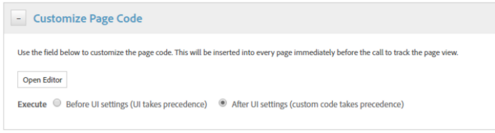

# Aktivera tillgångsinsikter via DTM {#enable-asset-insights-through-dtm}

Adobe Dynamic Tag Management är ett verktyg som aktiverar era digitala marknadsföringsverktyg. Det tillhandahålls kostnadsfritt till Adobe Analytics-kunder. Du kan antingen anpassa din spårningskod för att aktivera CMS-lösningar från tredje part för att använda resursinsikter eller så kan du använda DTM för att infoga resursinsikter-taggar. Insikter stöds endast och tillhandahålls för bilder.

>[!CAUTION]
>
>Adobe DTM är ersatt med [!DNL Adobe Experience Platform Launch] och kommer snart att nå [slutet av livet](https://medium.com/launch-by-adobe/dtm-plans-for-a-sunset-3c6aab003a6f). Adobe rekommenderar att du [använder [!DNL Launch] för resursinsikter](https://experienceleague.adobe.com/docs/experience-manager-learn/assets/advanced/asset-insights-launch-tutorial.html).

Utför dessa steg för att aktivera tillgångsinsikter via DTM.

1. Klicka på Experience Manager-logotypen och gå till **[!UICONTROL Tools]** > **[!UICONTROL Assets]** > **[!UICONTROL Insights Configuration]**.
1. [Konfigurera driftsättning av Experience Manager med DTM-Cloud Service](/help/sites-administering/dtm.md)

   API-token bör vara tillgänglig när du har loggat in på [https://dtm.adobe.com](https://dtm.adobe.com/) och går till **[!UICONTROL Account Settings]** i användarprofilen. Det här steget krävs inte från tillgångsinsikter eftersom integreringen av Experience Manager Sites med tillgångsinsikter fortfarande pågår.

1. Logga in på [https://dtm.adobe.com](https://dtm.adobe.com/) och välj ett företag efter behov.
1. Skapa eller öppna en befintlig webbegenskap

   * Välj fliken **[!UICONTROL Web Properties]** och klicka sedan på **[!UICONTROL Add Property]**.

   * Uppdatera fälten efter behov och klicka på **[!UICONTROL Create Property]**. Se [dokumentation](https://experienceleague.adobe.com/docs/experience-manager-learn/getting-started-wknd-tutorial-develop/overview.html).

   

1. På fliken **[!UICONTROL Rules]** väljer du **[!UICONTROL Page Load Rules]** i navigeringsrutan och klickar på **[!UICONTROL Create New Rule]**.

   

1. Expandera **[!UICONTROL JavaScript /Third Party Tags]**. Klicka sedan på **[!UICONTROL Add New Script]** på fliken **[!UICONTROL Sequential HTML]** för att öppna skriptdialogrutan.

   

1. Klicka på Experience Manager-logotypen och gå till **[!UICONTROL Tools]** > **[!UICONTROL Assets]**.
1. Klicka på **[!UICONTROL Insights Page Tracker]**, kopiera spårningskoden och klistra sedan in den i skriptdialogrutan som du öppnade i steg 6. Spara ändringarna.

   >[!NOTE]
   >
   >* `AppMeasurement.js` tas bort. Den förväntas bli tillgänglig via DTM:s Adobe Analytics-verktyg.
   >* Anropet till `assetAnalytics.dispatcher.init()` har tagits bort. Funktionen förväntas anropas när inläsningen av DTM:s Adobe Analytics-verktyg är klar.
   >* Beroende på var sidspåraren för tillgångsinsikter finns (till exempel Experience Manager, CDN och så vidare) kan skriptkällans ursprung kräva ändringar.
   >* För sidspåraren som är värd för Experience Manager ska källan peka på en publiceringsinstans med hjälp av värdnamnet för dispatcher-instansen.


1. Öppna `https://dtm.adobe.com`. Klicka på **[!UICONTROL Overview]** i webbegenskapen och klicka på **[!UICONTROL Add Tool]** eller öppna ett befintligt Adobe Analytics-verktyg. När du skapar verktyget kan du ange **[!UICONTROL Configuration Method]** till **[!UICONTROL Automatic]**.

   

   Välj rapportsviter för mellanlagring/produktion efter behov.

1. Expandera **[!UICONTROL Library Management]** och kontrollera att **[!UICONTROL Load Library at]** är **[!UICONTROL Page Top]**.

   

1. Expandera **[!UICONTROL Customize Page Code]** och klicka på **[!UICONTROL Open Editor]**.

   

1. Klistra in följande kod i fönstret:

   ```Java
   var sObj;
   
   if (arguments.length > 0) {
     sObj = arguments[0];
   } else {
     sObj = _satellite.getToolsByType('sc')[0].getS();
   }
   _satellite.notify('in assetAnalytics customInit');
   (function initializeAssetAnalytics() {
     if ((!!window.assetAnalytics) && (!!assetAnalytics.dispatcher)) {
       _satellite.notify('assetAnalytics ready');
       /** NOTE:
           Copy over the call to 'assetAnalytics.dispatcher.init()' from Assets Pagetracker
           Be mindful about changing the AppMeasurement object as retrieved above.
       */
       assetAnalytics.dispatcher.init(
             "",  /** RSID to send tracking-call to */
             "",  /** Tracking Server to send tracking-call to */
             "",  /** Visitor Namespace to send tracking-call to */
             "",  /** listVar to put comma-separated-list of Asset IDs for Asset Impression Events in tracking-call, e.g. 'listVar1' */
             "",  /** eVar to put Asset ID for Asset Click Events in, e.g. 'eVar3' */
             "",  /** event to include in tracking-calls for Asset Impression Events, e.g. 'event8' */
             "",  /** event to include in tracking-calls for Asset Click Events, e.g. 'event7' */
             sObj  /** [OPTIONAL] if the webpage already has an AppMeasurement object, include the object here. If unspecified, Pagetracker Core shall create its own AppMeasurement object */
             );
       sObj.usePlugins = true;
       sObj.doPlugins = assetAnalytics.core.updateContextData;
       assetAnalytics.core.optimizedAssetInsights();
     }
     else {
       _satellite.notify('assetAnalytics not available. Consider updating the Custom Page Code', 4);
     }
   })();
   ```

   * Sidinläsningsregeln i DTM innehåller bara koden `pagetracker.js`. Alla `assetAnalytics`-fält betraktas som åsidosättningar för standardvärden. De är inte obligatoriska som standard.
   * Koden anropar `assetAnalytics.dispatcher.init()` efter att ha kontrollerat att `_satellite.getToolsByType('sc')[0].getS()` är initierat och `assetAnalytics,dispatcher.init` är tillgängligt. Du kan därför hoppa över att lägga till den i steg 11.
   * Om sidspåraren inte skapar ett `AppMeasurement`-objekt är de första tre argumenten (RSID, Tracking Server och Visitor Namespace) irrelevanta, vilket anges i kommentarerna i koden för sidspåraren för Insights (**[!UICONTROL Tools > Assets > Insights Page Tracker]**). Tomma strängar skickas i stället för att markera detta.\
      De återstående argumenten motsvarar konfigurationen på sidan Insights-konfiguration (**[!UICONTROL Tools > Assets > Insights Configuration]**).
   * AppMeasurement-objektet hämtas genom att fråga `satelliteLib` för alla tillgängliga SiteCatalyst-motorer. Om flera taggar har konfigurerats ändrar du indexvärdet för arrayväljaren på rätt sätt. Posterna i arrayen ordnas enligt de SiteCatalyst-verktyg som finns i DTM-gränssnittet.

1. Spara och stäng fönstret Kodredigeraren och spara sedan ändringarna i verktygskonfigurationen.
1. Godkänn båda väntande godkännanden på fliken **[!UICONTROL Approvals]**. DTM-taggen kan infogas på webbsidan. Mer information om hur du infogar DTM-taggar på webbsidor finns i [Integrera DTM i anpassade sidmallar](https://blogs.adobe.com/experiencedelivers/experience-management/integrating-dtm-custom-aem6-page-template/).
