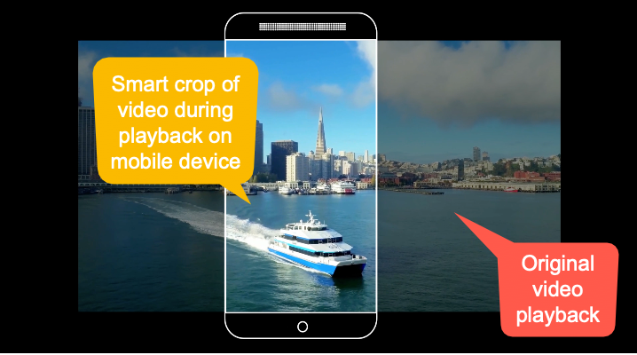
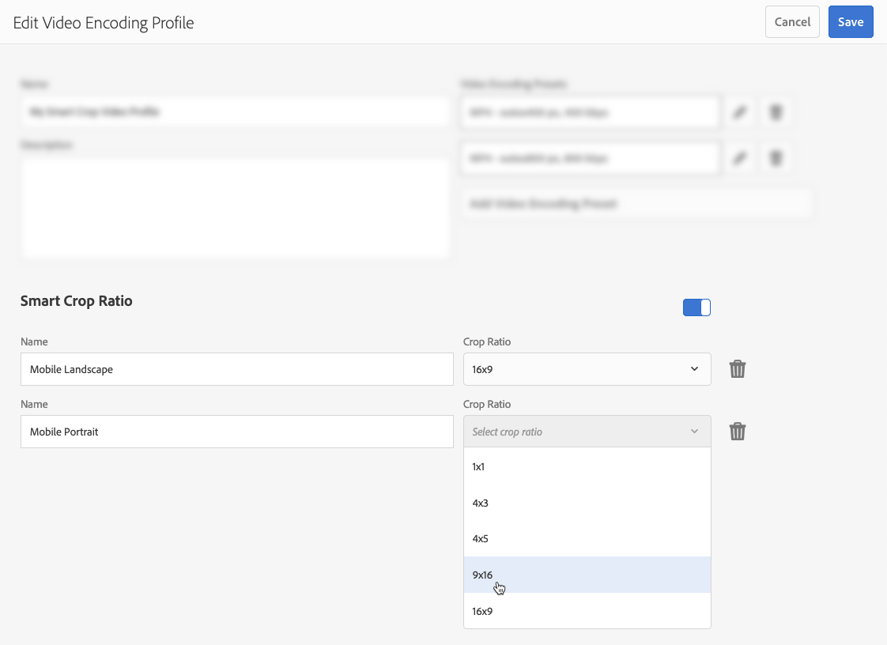
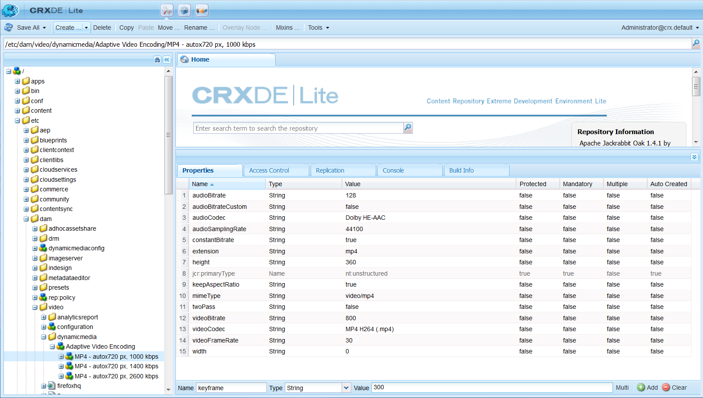
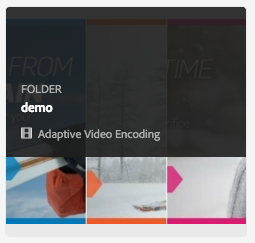
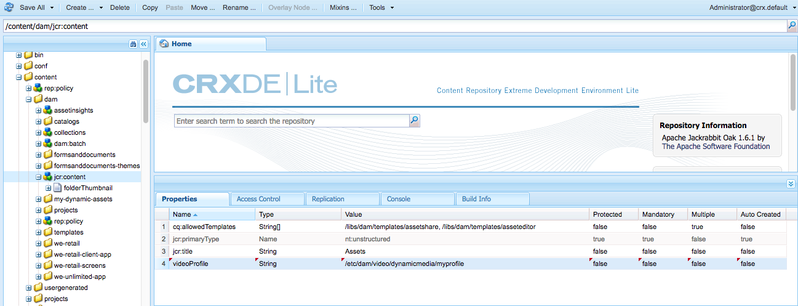

# Videoprofiler {#video-profiles}

Dynamic Media har redan en fördefinierad adaptiv videokodningsprofil. Inställningarna i den här färdiga profilen är optimerade för att ge kunderna bästa möjliga visningsupplevelse. När du kodar dina primära källvideofilmer med den adaptiva videokodningsprofilen justeras videospelaren automatiskt i videoströmmens kvalitet under uppspelningen baserat på internetanslutningshastigheten hos dina kunder. Den här funktionen kallas för strömning med adaptiv bithastighet.

Följande är andra faktorer som avgör kvaliteten på videoklipp:

* **Upplösning för den överförda primära källvideon**

  Om MP4-videon spelades in med en lägre upplösning, till exempel 240p eller 360p, kan den inte direktuppspelas i HD-format.

* **Videospelarens storlek**

  Som standard är &quot;Bredd&quot; i profilen Adaptiv videokodning inställd på &quot;Auto&quot;. Under uppspelningen används återigen den bästa kvaliteten baserat på spelarens storlek.

Se [Bästa praxis för videokodning](/help/assets/video.md#best-practices-for-encoding-videos).

Se även [Bästa metoder för att ordna din digitala Assets för att använda Bearbeta profiler](/help/assets/organize-assets.md).

>[!NOTE]
>
>Om du vill generera videons metadata och tillhörande videobildminiatyrer måste själva videon gå igenom kodningsprocessen i Dynamic Media. I Adobe Experience Manager kodar arbetsflödet i **[!UICONTROL Dynamic Media Encode Video]** videon om du har aktiverat Dynamic Media och konfigurerat videolmolntjänster. Det här arbetsflödet innehåller information om arbetsflödets processhistorik och fel. Se [Övervaka videokodning och YouTube publiceringsförlopp](/help/assets/video.md#monitoring-video-encoding-and-youtube-publishing-progress). Om du har aktiverat Dynamic Media och konfigurerat videolmolntjänster börjar arbetsflödet **[!UICONTROL Dynamic Media Encode Video]** automatiskt att gälla när du överför en video. (Om du inte använder Dynamic Media börjar arbetsflödet **[!UICONTROL DAM Update Asset]** gälla.)
>
>Metadata är användbara när du söker efter resurser. Miniatyrbilderna är statiska videobilder som genereras under kodningen. De krävs av Experience Manager-systemet och används i användargränssnittet för att hjälpa dig att visuellt identifiera videofilmer i kortvyn, sökresultatvyn och resurslista. Du kan se de genererade miniatyrbilderna när du väljer ikonen Återgivningar (färgpaletten) för en kodad video.

När du har skapat videoprofilen kan du använda den på en eller flera mappar. Se [Använda en videoprofil för mappar](#applying-a-video-profile-to-folders).

Mer information om hur du definierar avancerade bearbetningsparametrar för andra resurstyper finns i [Konfigurera bearbetning av resurser](/help/assets/config-dms7.md#configuring-asset-processing).

Se även [Profiler för bearbetning av metadata, bilder och videoklipp](processing-profiles.md).

## Förinställningar för adaptiv videokodning {#adaptive-video-encoding-presets}

I följande tabell visas kodningsprofiler med bästa praxis för adaptiv videoströmning till mobiler, surfplattor och stationära datorer. Du kan använda de här förinställningarna för video med alla proportioner.

<table>
 <tbody>
  <tr>
   <td><strong>Videoformatkodek</strong></td>
   <td><strong>Videostorlek - bredd (px)</strong></td>
   <td><strong>Videostorlek - höjd (px)</strong></td>
   <td><strong>Behåll proportioner?</strong></td>
   <td><strong>Videobithastighet (kbit/s)</strong></td>
   <td><strong>Bildrutefrekvens för video (fps)</strong></td>
   <td><strong>Ljudkodek</strong></td>
   <td><strong>Ljudbithastighet (kbit/s)</strong></td>
  </tr>
  <tr>
   <td>
MP4 H.264 (mp4)
 </td>
   <td>auto</td>
   <td>360</td>
   <td>Ja</td>
   <td>730</td>
   <td>30</td>
   <td>Dolby HE-AAC</td>
   <td>128</td>
  </tr>
  <tr>
   <td>
MP4 H.264 (mp4)
 </td>
   <td>auto</td>
   <td>540</td>
   <td>Ja</td>
   <td>2000  </td>
   <td>30</td>
   <td>Dolby HE-AAC</td>
   <td>128</td>
  </tr>
  <tr>
   <td>
MP4 H.264 (mp4)
 </td>
   <td>auto</td>
   <td>720  </td>
   <td>Ja</td>
   <td>3000  </td>
   <td>30</td>
   <td>Dolby HE-AAC</td>
   <td>128</td>
  </tr>
 </tbody>
</table>

## Använda smart beskärning i videoprofiler {#about-smart-crop-video}

Smart beskärning för video - en valfri funktion i videoprofiler - är ett verktyg som utnyttjar intelligensen i Adobe Sensei. Fokalpunkten identifieras och beskärs automatiskt i alla adaptiva videoklipp och progressiva videoklipp som du har överfört, oavsett storlek.

De videoformat som stöds för smart beskärning är MP4, MKV, MOV, AVI, FLV och WMV.

Den största videofilstorleken som stöds för smart beskärning är följande kriterier:

* Varaktighet på fem minuter.
* 30 bildrutor per sekund (FPS).
* 300 MB filstorlek.

Adobe Sensei är begränsat till 9 000 bildrutor. Fem minuter vid 30 bildrutor/s. Om videon har en högre bildrutefrekvens minskar den maximala videouppspelningstiden. Exempelvis måste en 60 bildrutevideo vara två och en halv minut lång för att kunna hanteras av Adobe Sensei och smart beskärning.

>[!IMPORTANT]
>
>För att smart beskärning av video ska fungera måste du inkludera en eller flera förinställningar för videokodning i videoprofilen.

Om du vill använda smart beskärning för video skapar du en adaptiv eller progressiv videokodningsprofil. Som en del av din profil använder du verktyget **[!UICONTROL Smart Crop Ratio]** för att välja fördefinierade proportioner. När du har definierat dina förinställningar för videokodning kan du till exempel lägga till en&quot;Mobile Landscape&quot;-definition med proportionerna 16×9 och en&quot;Mobile Portrait&quot;-definition med proportionerna 9×16. Andra proportioner eller beskärningsproportioner som du kan välja bland är 1×1, 4×3 och 4×5.

Du kan växla videomaterifierad smart beskärning i videoprofilen till på eller av med skjutreglaget längst till höger om **[!UICONTROL Smart Crop Ratio]** i användargränssnittet.

När du har skapat och sparat videoprofilen kan du använda den på de mappar du vill använda.

Se [Tillämpa videoprofiler på specifika mappar](#applying-video-profiles-to-specific-folders) eller [Använd en videoprofil globalt](#applying-a-video-profile-globally).

Se även [Smart beskärning för bilder](image-profiles.md).

## Skapa en videoprofil för strömning med adaptiv bithastighet {#creating-a-video-encoding-profile-for-adaptive-streaming}

Dynamic Media har redan en fördefinierad Adaptive Video Encoding-profil - en grupp inställningar för videoöverföring för MP4 H.264 - som är optimerade för bästa visningssätt. Du kan använda den här profilen när du överför videoklipp.

Om den här fördefinierade profilen inte uppfyller dina behov kan du välja att skapa en egen adaptiv videokodningsprofil. När du använder inställningen **[!UICONTROL Encode for adaptive streaming]** - som en god praxis - valideras alla kodningsförinställningar som du lägger till i profilen så att alla videoklipp har samma proportioner. Dessutom hanteras de kodade videoklippen som en uppsättning med flera bithastigheter för direktuppspelning.

När du skapar videokodningsprofilen bör du tänka på att de flesta kodningsalternativen är förifyllda med rekommenderade standardinställningar. Om du väljer ett annat värde än det rekommenderade kan det emellertid ge sämre videokvalitet vid uppspelning och andra prestandaproblem.

För alla kodningsförinställningar för MP4 H.264-video i profilen valideras följande värden för att säkerställa att de är desamma för de enskilda kodningsförinställningarna i profilen, vilket gör det möjligt att strömma med adaptiv bithastighet:

* Videoformatkodek - MP4 H.264 (.mp4)
* Ljudkodek
* Bithastighet för ljud
* Behåll proportioner
* Kodning i två omgångar
* Konstant bithastighet
* H264-profil
* Samplingsfrekvens för ljud

Om värdena inte är desamma kan du fortsätta skapa profilen som den är. Däremot går det inte att strömma med adaptiv bithastighet. I stället får användarna direktuppspelning med en bithastighet. Vi rekommenderar att du redigerar kodningsinställningarna så att samma värden används för de enskilda kodningsförinställningarna i profilen. (Videoprofilen/förinställningsredigeraren tillämpar paritet för de adaptiva videokodningsinställningarna om **[!UICONTROL Encode for adaptive streaming]** är aktiverat.)

Se även [Skapa en videokodningsprofil för progressiv direktuppspelning](#creating-a-video-encoding-profile-for-progressive-streaming).

Se även [Bästa tillvägagångssätt för videokodning](/help/assets/video.md#best-practices-for-encoding-videos).

Mer information om hur du definierar avancerade bearbetningsparametrar för andra resurstyper finns i [Konfigurera bearbetning av resurser](/help/assets/config-dms7.md#configuring-asset-processing).

**Om du vill skapa en videoprofil för strömning med adaptiv bithastighet**

1. Markera Experience Manager-logotypen och gå till **[!UICONTROL Tools]** > **[!UICONTROL Assets]** > **[!UICONTROL Video Profiles]**.
1. Välj **[!UICONTROL Create]** om du vill lägga till en videoprofil.

1. Ange ett namn och en beskrivning för profilen.
1. Välj **[!UICONTROL Add Video Encoding Preset]** på sidan Skapa/redigera förinställningar för videokodning.
1. Ange video- och ljudalternativen på fliken **[!UICONTROL Basic]**.
Välj informationsikonen bredvid varje alternativ för ytterligare beskrivningar eller rekommenderade inställningar baserat på den valda videoformatskoden.
1. Kontrollera att **[!UICONTROL Keep aspect ratio]** är markerat under rubriken Videostorlek.
1. Ställ in videobildrutans upplösning i pixlar. Använd värdet **[!UICONTROL Auto]** för att automatiskt skala så att det matchar källproportionerna (bredd-/höjdförhållandet). Exempel: Auto x 480 eller 640 x Auto.

1. Gör något av följande:

   * Ange **[!UICONTROL auto]** i fältet **[!UICONTROL Width]**. Ange ett värde i pixlar i fältet **[!UICONTROL Height]**.

   * Om du vill få hjälp med att visualisera storleken på videon väljer du informationsikonen (i) till höger om **[!UICONTROL Height]** för att öppna sidan för storlekskalkylatorn. Använd **[!UICONTROL Size Calculator]** för att ange de videodimensioner (som representeras av den blå rutan) som du vill använda. Välj **[!UICONTROL X]** i det övre högra hörnet när du är klar.

1. (Valfritt) Markera fliken **[!UICONTROL Advanced]** och kontrollera att kryssrutan **[!UICONTROL Use Default Values]** är markerad (rekommenderas). Du kan också ändra avancerade video- och ljudinställningar.
1. I det övre högra hörnet på sidan väljer du **[!UICONTROL Save]** för att spara förinställningen.
1. Gör något av följande:
   * Upprepa steg 4-10 för att skapa ytterligare kodningsförinställningar. (Adaptiv videoströmning kräver mer än en videoförinställning.)
   * Fortsätt till nästa steg.

1. (Valfritt) Gör så här om du vill lägga till videomaterial i videoklipp som den här profilen tillämpas på:
   * Välj **[!UICONTROL Add New]** på sidan Redigera videoprofil till höger om rubriken Smarta beskärningsproportioner.
   * I fältet Namn anger du ett namn på beskärningsförhållandet som gör det lättare att identifiera det.
   * Välj den proportion som du vill använda i listrutan **[!UICONTROL Crop Ratio]**.

1. Gör något av följande:

   * Fortsätt lägga till nya beskärningsproportioner efter behov.
   * Fortsätt till nästa steg.

1. I det övre högra hörnet av sidan väljer du **[!UICONTROL Save]** igen för att spara profilen.

Nu kan du använda profilen för mappar som innehåller videoklipp. Se [Tillämpa en videoprofil på mappar](#applying-a-video-profile-to-folders) eller [Använd en videoprofil globalt](#applying-a-video-profile-globally).

## Skapa en videoprofil för progressiv strömning {#creating-a-video-encoding-profile-for-progressive-streaming}

Om du väljer att inte använda alternativet **[!UICONTROL Encode for adaptive streaming]** behandlas alla kodningsförinställningar som du lägger till i profilen som enskilda videoåtergivningar för direktuppspelning med en bithastighet eller progressiv videoleverans. Dessutom går det inte att kontrollera att alla videoåtergivningar har samma proportioner.

Beroende på vilket läge du använder är videoformatets kodekar följande:

* Dynamic Media-Scene7-läge: H.264 (.mp4)
* Dynamic Media-hybrid-läge: H.264 (.mp4), WebM

Se även [Skapa en videokodningsprofil för strömning med adaptiv bithastighet](#creating-a-video-encoding-profile-for-adaptive-streaming).

Se även [Bästa tillvägagångssätt för videokodning](/help/assets/video.md#best-practices-for-encoding-videos).

Mer information om hur du definierar avancerade bearbetningsparametrar för andra resurstyper finns i [Konfigurera bearbetning av resurser](/help/assets/config-dms7.md#configuring-asset-processing).

**Så här skapar du en videoprofil för progressiv direktuppspelning:**

1. Markera Experience Manager-logotypen och gå till **[!UICONTROL Tools]** > **[!UICONTROL Assets]** > **[!UICONTROL Video Profiles]**.
1. Välj **[!UICONTROL Create]** om du vill lägga till en videoprofil.
1. Ange ett namn och en beskrivning för profilen.
1. Välj **[!UICONTROL Add Video Encoding Preset]** på sidan Skapa/redigera förinställningar för videokodning.
1. Ange video- och ljudalternativen på fliken **[!UICONTROL Basic]**.
Välj informationsikonen bredvid varje alternativ för ytterligare beskrivningar eller rekommenderade inställningar baserat på den valda videoformatskoden.
1. (Valfritt) Avmarkera **[!UICONTROL Keep aspect ratio]** under rubriken Videostorlek.
1. Gör följande:
   * Ange **[!UICONTROL auto]** i fältet **[!UICONTROL Width]**.
   * Ange ett värde i pixlar i fältet **[!UICONTROL Height]**.
Om du vill få hjälp med att visualisera storleken på videon väljer du informationsikonen för höjden för att öppna sidan **[!UICONTROL Size Calculator]**. Använd sidan **[!UICONTROL Size Calculator]** för att ytterligare ange videodimensionen (blå ruta) som du vill ha den. När du är klar väljer du **[!UICONTROL X]** i dialogrutans övre högra hörn.
1. (Valfritt) Gör något av följande:

   * Markera fliken **[!UICONTROL Advanced]** och kontrollera att kryssrutan **[!UICONTROL Use Default Values]** är markerad (rekommenderas).

   * Avmarkera kryssrutan **[!UICONTROL Use Default Values]** och ange önskade videoinställningar och ljudinställningar.
Välj informationsikonen bredvid varje alternativ för ytterligare beskrivningar eller rekommenderade inställningar baserat på den valda videoformatskoden.

1. I det övre högra hörnet på sidan väljer du **[!UICONTROL Save]** för att spara förinställningen.
1. Gör något av följande:

   * Upprepa steg 4-9 för att skapa ytterligare kodningsförinställningar.
   * Fortsätt till nästa steg.

1. (Valfritt) Gör så här om du vill lägga till videomaterial i videoklipp som den här profilen tillämpas på:

   * Välj **[!UICONTROL Add New]** på sidan Redigera videoprofil till höger om rubriken Smarta beskärningsproportioner.
   * I fältet Namn anger du ett namn på beskärningsförhållandet som gör det lättare att identifiera det.
   * Välj den proportion som du vill använda i listrutan **[!UICONTROL Crop Ratio]**.

1. Gör något av följande:

   * Fortsätt lägga till nya beskärningsproportioner efter behov.
   * Fortsätt till nästa steg.

1. I det övre högra hörnet på sidan väljer du **[!UICONTROL Save]** för att spara profilen.

Nu kan du använda profilen för mappar som innehåller videoklipp. Se [Tillämpa en videoprofil på mappar](#applying-a-video-profile-to-folders) eller [Tillämpa en videoprofil globalt](#applying-a-video-profile-globally).

## Använda egna parametrar för videokodning {#using-custom-added-video-encoding-parameters}

Du kan redigera en befintlig videokodningsprofil för att dra nytta av avancerade videokodningsparametrar som inte finns i användargränssnittet när du skapar eller redigerar en videoprofil i Experience Manager. Lägg till en eller flera avancerade parametrar - till exempel minBitrate och maxBitrate - i den befintliga profilen.

**Så här använder du anpassade kodningsparametrar för video:**

1. Markera Experience Manager-logotypen och gå sedan till **[!UICONTROL Tools]** > **[!UICONTROL General]** > **[!UICONTROL CRXDE Lite]**.
1. Gå till följande på Utforskarpanelen till vänster på CRXDE Lite-sidan:

   `/conf/global/settings/dam/dm/presets/video/*name_of_video_encoding_profile_to_edit`

1. På panelen längst ned till höger på sidan, på fliken Egenskaper, anger du **[!UICONTROL Name]**, **[!UICONTROL Type]** och **[!UICONTROL Value]** för den parameter som du vill använda.

   Följande avancerade parametrar är tillgängliga:

<table>
 <tbody>
  <tr>
   <td><strong>Namn</strong></td>
   <td><strong>Beskrivning</strong>  </td>
   <td><strong>Typ</strong>  </td>
   <td><strong>Värde</strong></td>
  </tr>
  <tr>
   <td><code>h264Level</code></td>
   <td>H.264-nivå som ska användas för kodning. Normalt bestäms den här parametern automatiskt utifrån de kodningsinställningar som du använder.</td>
   <td><code>String</code></td>
   <td>
10 * h264 nivå
 
3.0 = 30, 1.3 = 13)
 
Inget standardvärde.
 </td>
  </tr>
  <tr>
   <td><code>keyframe</code></td>
   <td>Målantalet bildrutor mellan nyckelbildrutor. Beräkna det här värdet så att en nyckelbildruta kan genereras var 2:10:e sekund. Exempel: vid 30 bildrutor per sekund ska nyckelbildruteintervallet vara 60-300.    Lägre nyckelruteintervall förbättrar strömsöknings- och strömbrytningsbeteendet för adaptiv videokodning och kan även förbättra kvaliteten för videoklipp som har mycket rörelse. Men eftersom nyckelrutor ökar filstorleken resulterar ett lägre nyckelruteintervall vanligtvis i en lägre total videokvalitet med en viss bithastighet.</td>
   <td><code>String</code></td>
   <td>
Positivt nummer.
 
Standardvärdet är 300.
 
Rekommenderat värde för DASH eller HLS är 60-90. (Om du vill använda DASH för videoklipp måste det först aktiveras på ditt konto. Se <a href="/help/assets/video.md#enable-dash">Aktivera DASH för ditt konto</a>.)
 </td>
  </tr>
  <tr>
   <td><code>minBitrate</code></td>
   <td>
Minsta bithastighet som tillåter variabel bithastighetskodning, i kbit/s (kilobit per sekund).
 
Den här parametern gäller bara när <strong> Använd konstant bithastighet </strong> är avmarkerat på fliken Avancerat när du skapar eller redigerar en videokodningsprofil.
 
Se även <a href="/help/assets/video.md#bitrate">Bithastighet</a>.
 </td>
   <td><code>String</code></td>
   <td>
Positivt tal i kbit/s.
 
Inget standardvärde.
 </td>
  </tr>
  <tr>
   <td><code>maxBitrate</code></td>
   <td>
Maximal bithastighet som tillåter variabel bithastighetskodning, i kbit/s.
 
Den här parametern gäller bara när <strong> Använd konstant bithastighet </strong> är avmarkerat på fliken Avancerat när du skapar eller redigerar en videokodningsprofil.
 
Se även <a href="/help/assets/video.md#bitrate">Bithastighet</a>.
 </td>
   <td><code>String</code></td>
   <td>
Positivt tal i kbit/s.
 
Inget standardvärde. Det rekommenderade värdet är dock upp till två gånger högre än kodningsbithastigheten.
 </td>
  </tr>
  <tr>
   <td><code>audioBitrateCustom</code></td>
   <td>Ange värdet <code>true</code> för att tvinga fram en konstant bithastighet för ljudströmmen, om det stöds av ljudkodeken.</td>
   <td><code>String</code></td>
   <td>
<code>true</code>/<code>false</code>
 
Standardvärdet är <code>false</code>.
 
Rekommenderat värde för DASH eller HLS är <code>false</code>. (Om du vill använda DASH för videoklipp måste det först aktiveras på ditt konto. Se <a href="/help/assets/video.md#enable-dash">Aktivera DASH för ditt konto</a>.)
 
 
 </td>
  </tr>
 </tbody>
</table>

1. Välj **[!UICONTROL Add]** i sidans nedre högra hörn.
1. Gör något av följande:

   * Upprepa steg 3 och 4 för att lägga till ytterligare en parameter i videokodningsprofilen.
   * Välj **[!UICONTROL Save All]** i sidans övre vänstra hörn.

1. I det övre vänstra hörnet på CRXDE Lite-sidan väljer du ikonen **[!UICONTROL Back Home]** för att gå tillbaka till Experience Manager.

### Redigera en videoprofil {#editing-a-video-encoding-profile}

Du kan redigera alla videoprofiler som du har skapat för att lägga till, redigera eller ta bort förinställningar för video i den profilen.

Som standard kan du inte redigera den fördefinierade, körklara **[!UICONTROL Adaptive Video Encoding]**-profilen som medföljde Dynamic Media. I stället kan du enkelt kopiera profilen och spara den med ett nytt namn. Du kan sedan redigera de önskade förinställningarna i den kopierade profilen.

Se även [Bästa tillvägagångssätt för videokodning](/help/assets/video.md#best-practices-for-encoding-videos).

Mer information om hur du definierar avancerade bearbetningsparametrar för andra resurstyper finns i [Konfigurera bearbetning av resurser](/help/assets/config-dms7.md#configuring-asset-processing).

**Så här redigerar du en videoprofil:**

1. Markera Experience Manager-logotypen och gå till **[!UICONTROL Tools]** > **[!UICONTROL Assets]** > **[!UICONTROL Video Profiles]**.
1. Markera ett videoprofilnamn på sidan Videoprofiler.
1. Välj **[!UICONTROL Edit]** i verktygsfältet.
1. Redigera namn och beskrivning på sidan Video Encoding Profile.
1. Du bör kontrollera att kryssrutan **[!UICONTROL Encode for adaptive bitrate streaming]** är markerad.
Välj informationsikonen för en beskrivning av strömning med adaptiv bithastighet. (Om du redigerar en progressiv videoprofil ska du inte markera den här kryssrutan.)
1. Under rubriken Förinställningar för videokodning lägger du till, redigerar eller tar bort förinställningar för videokodning som utgör profilen.

   Välj informationsikonen bredvid varje alternativ på flikarna **[!UICONTROL Basic]** och **[!UICONTROL Advanced]** om du vill ha ytterligare beskrivningar eller rekommenderade inställningar baserat på den valda videoformatkodeken.

1. Välj **[!UICONTROL Save]** i sidans övre högra hörn.

### Kopiera en videoprofil {#copying-a-video-encoding-profile}

1. Markera Experience Manager-logotypen och gå till **[!UICONTROL Tools]** > **[!UICONTROL Assets]** > **[!UICONTROL Video Profiles]**.
1. Markera ett videoprofilnamn på sidan Videoprofiler.
1. Välj **[!UICONTROL Copy]** i verktygsfältet.
1. Ange ett nytt namn för profilen på sidan Video Encoding Profile.
1. Det är en god idé att se till att kryssrutan **[!UICONTROL Encode for adaptive streaming]** är markerad. Välj informationsikonen för en beskrivning av strömning med adaptiv bithastighet. (Om du kopierar en progressiv videoprofil markerar du inte kryssrutan.)

   I Dynamic Media - hybrid-läge, om en WebM-videoförinställning är en del av videoprofilen, är **[!UICONTROL Encode for adaptive streaming]** inte möjligt eftersom alla förinställningar måste vara MP4.
1. Under rubriken Förinställningar för videokodning lägger du till, redigerar eller tar bort förinställningar för videokodning som utgör profilen.

   Välj informationsikonen bredvid varje alternativ på flikarna Grundläggande och Avancerat för rekommenderade inställningar och beskrivningar.

1. Välj **[!UICONTROL Save]** i sidans övre högra hörn.

### Ta bort en videoprofil {#deleting-a-video-encoding-profile}

1. Markera Experience Manager-logotypen och gå till **[!UICONTROL Tools]** > **[!UICONTROL Assets]** > **[!UICONTROL Video Profiles]**.
1. Markera ett eller flera videoprofilnamn på sidan Videoprofiler.
1. Välj **[!UICONTROL Delete]** i verktygsfältet.
1. Välj **[!UICONTROL OK]**.

## Använda en videoprofil på mappar {#applying-a-video-profile-to-folders}

När du tilldelar en videoprofil till en mapp ärver alla undermappar automatiskt profilen från den överordnade mappen. Den här regeln innebär att du bara kan tilldela en videoprofil till en mapp. Fundera därför noga över mappstrukturen för var du överför, lagrar, använder och arkiverar resurser.

Om du tilldelade en annan videoprofil till en mapp åsidosätter den nya profilen den tidigare profilen. De tidigare befintliga mappresurserna ändras inte. Den nya profilen används för resurser som läggs till i mappen senare.

Mappar som har en tilldelad profil visas i användargränssnittet genom att profilnamnet visas i kortnamnet.

Du kan tillämpa videoprofiler på specifika mappar eller globalt på alla resurser.

Du kan bearbeta resurser i en mapp som redan har en befintlig videoprofil som du senare ändrade. Se [Bearbeta resurser i en mapp igen när du har redigerat dess bearbetningsprofil](processing-profiles.md#reprocessing-assets).

### Tillämpa en videoprofil på specifika mappar {#applying-video-profiles-to-specific-folders}

Du kan använda en videoprofil på en mapp från menyn **[!UICONTROL Tools]** eller, om du är i mappen, från **[!UICONTROL Properties]**. I det här avsnittet beskrivs hur du använder videoprofiler på mappar på båda sätten.

För mappar som redan har tilldelats en profil visas profilens namn direkt under mappnamnet.

Se även [Bearbeta resurser igen i en mapp när du har redigerat dess bearbetningsprofil](processing-profiles.md#reprocessing-assets).

#### Använda en videoprofil på mappar med hjälp av användargränssnittet Profiler {#applying-video-profiles-to-folders-by-way-of-the-profiles-user-interface}

1. Markera Experience Manager-logotypen och gå till **[!UICONTROL Tools]** > **[!UICONTROL Assets]** > **[!UICONTROL Video Profiles]**.
1. Välj den videoprofil som du vill använda för en eller flera mappar.
1. Markera **[!UICONTROL Apply Profile to Folders]** och markera den eller de mappar som du vill använda för att ta emot de nyligen överförda resurserna och välj **[!UICONTROL Apply]**. Mappar som redan har tilldelats en profil visas genom att profilens namn visas direkt under mappnamnet i **[!UICONTROL Card View]**.
Du kan [övervaka förloppet för ett videoprofilbearbetningsjobb](#monitoring-the-progress-of-an-encoding-job).

#### Använda en videoprofil på mappar från Egenskaper {#applying-video-profiles-to-folders-from-properties}

1. Markera Experience Manager-logotypen, navigera till **[!UICONTROL Assets]** och sedan till den mapp som du vill tillämpa en videoprofil på.
1. Markera kryssmarkeringen i mappen för att markera den och välj sedan **[!UICONTROL Properties]**.
1. Välj fliken **[!UICONTROL Video Profiles]**, välj profilen i listrutan och välj **[!UICONTROL Save & Close]**. För mappar som redan har tilldelats en profil visas profilens namn direkt under mappnamnet.

   
Du kan [övervaka förloppet för ett videoprofilbearbetningsjobb](#monitoring-the-progress-of-an-encoding-job).

### Tillämpa en videoprofil globalt {#applying-a-video-profile-globally}

Förutom att tillämpa en profil på en mapp kan du även tillämpa en profil globalt så att allt innehåll som överförs till Experience Manager Assets i en mapp har den valda profilen.

Se även [Bearbeta resurser igen i en mapp när du har redigerat dess bearbetningsprofil](processing-profiles.md#reprocessing-assets).

**Så här använder du en videoprofil globalt:**

* Navigera till CRXDE Lite till följande nod: `/content/dam/jcr:content`. Lägg till egenskapen `videoProfile:/libs/settings/dam/video/dynamicmedia/<name of video encoding profile>` och välj **[!UICONTROL Save All]**.

  
* Du kan [övervaka förloppet för ett videoprofilbearbetningsjobb](#monitoring-the-progress-of-an-encoding-job).

## Övervaka förloppet för ett videoprofilbearbetningsjobb {#monitoring-the-progress-of-an-encoding-job}

En bearbetningsindikator (eller förloppsindikator) visas så att du visuellt kan övervaka förloppet för ett videoprofilbearbetningsjobb.

Du kan även visa filen `error.log` för att övervaka förloppet för ett kodningsjobb, för att se om kodningen är klar eller för att se eventuella jobbfel. `error.log` finns i mappen `logs` där din instans av Experience Manager är installerad.

## Ta bort en videoprofil från mappar {#removing-a-video-profile-from-folders}

När du tar bort en videoprofil från en mapp ärver alla undermappar automatiskt borttagningen av profilen från den överordnade mappen. All bearbetning av filer som har inträffat i mapparna förblir dock oförändrad.

Du kan ta bort en videoprofil från en mapp från menyn **[!UICONTROL Tools]** eller, om du är i mappen, från **[!UICONTROL Folder Settings]**. I det här avsnittet beskrivs hur du tar bort videoprofiler från mappar på båda sätten.

### Ta bort en videoprofil från mappar via profilens användargränssnitt {#removing-video-profiles-from-folders-by-way-of-the-profiles-user-interface}

1. Markera Experience Manager-logotypen och gå till **[!UICONTROL Tools]** > **[!UICONTROL Assets]** > **[!UICONTROL Video Profiles]**.
1. Markera den videoprofil som du vill ta bort från en eller flera mappar.
1. Markera **[!UICONTROL Remove Profile from Folders]** och markera den eller de mappar som du vill ta bort profilen från och välj **[!UICONTROL Remove]**.

   Du kan bekräfta att videoprofilen inte längre används för en mapp eftersom namnet inte längre visas under mappnamnet.

### Ta bort en videoprofil från mappar via Egenskaper {#removing-video-profiles-from-folders-by-way-of-properties}

1. Markera Experience Manager-logotypen, navigera till **[!UICONTROL Assets]** och sedan till den mapp som du vill ta bort en videoprofil från.
1. Markera bockmarkeringen i mappen och välj sedan **[!UICONTROL Properties]**.
1. Välj fliken **[!UICONTROL Video Profiles]**, välj **[!UICONTROL None]** i listrutan och välj **[!UICONTROL Save & Close]**. För mappar som redan har tilldelats en profil visas profilens namn direkt under mappnamnet.
