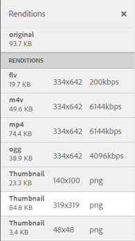

# Videoåtergivningar {#video-renditions}

Adobe Experience Manager Assets genererar videoåtergivningar för videoresurser i olika format, bland annat OGG, FLV.

Experience Manager Assets har stöd för statiska och dynamiska återgivningar (DM-kodade återgivningar) för medieresurser.

Statiska återgivningar genereras internt med hjälp av FFMPEG (som är installerat och tillgängligt på systemsökvägen) och lagras i innehållsdatabasen.

DM-kodade återgivningar lagras på proxyservern och hanteras vid körning.

Experience Manager Assets har uppspelningsstöd för dessa återgivningar på klientsidan.

Om du vill visa återgivningarna för en viss videoresurs öppnar du resurssidan och väljer ikonen Global navigering. Välj sedan **[!UICONTROL Renditions]** i listan.

Listan med videoåtergivningar visas på panelen **[!UICONTROL Renditions]**.

[Konfigurera Dynamic Media Cloud-tjänster](config-dynamic.md) om du vill konfigurera proxyservern för DM-kodade återgivningar.

Om du vill generera videoåtergivningar med önskade parametrar [skapar du en motsvarande videoprofil](video-profiles.md).

När du har konfigurerat proxyservern och skapat videoprofiler kan du ta med den här videoförinställningen i en bearbetningsprofil och använda bearbetningsprofilen i en mapp.

>[!NOTE]
>
>Ljuduppspelning fungerar inte för OGG- och WAV-filer i Microsoft® Internet Explorer 11. Ett fel `Invalid Source` visas på sidan med tillgångsinformation för resurser med tillägget OGG eller WAV.
>
>I MS® Edge och iPad spelas inte OGG-filer upp och ett formatfel som inte stöds uppstår.
