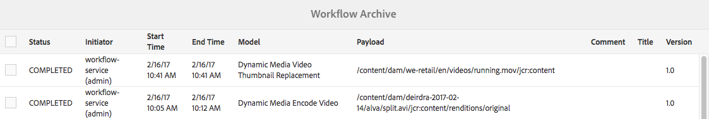

# Video i Dynamic Media {#video}

I det här avsnittet beskrivs hur du arbetar med video i Dynamic Media.

## Snabbstart: Videor {#quick-start-videos}

Följande steg-för-steg-beskrivning av arbetsflödet hjälper dig att komma igång snabbt med anpassningsbara videouppsättningar i Dynamic Media. Efter varje steg finns det korsreferenser till ämnesrubriker där du kan hitta mer information.

>[!IMPORTANT]
>
>Innan du arbetar med video i Dynamic Media måste Adobe Experience Manager-administratören ha aktiverat och konfigurerat Dynamic Media-Cloud Services i Dynamic Media - Scene7-läge eller Dynamic Media - hybrid-läge.
>
>* Se [Konfigurera Dynamic Media-Cloud Services](/help/assets/config-dms7.md#configuring-dynamic-media-cloud-services) i Konfigurera Dynamic Media - Scene7 och [Felsöka Dynamic Media - Scene7-läge](/help/assets/troubleshoot-dms7.md).
   >
   >
* Se [Konfigurera Dynamic Media-Cloud Services](/help/assets/config-dynamic.md#configuring-dynamic-media-cloud-services) i Konfigurera Dynamic Media - hybrid-läge.
>
>
För närvarande kända problem med videouppspelning i Dynamic Media *på Experience Manager 6.5.9.0 endast*:
>
>* 

   <!-- CQDOC-18116 -->You cannot play video renditions from the asset's Details page on Experience Manager - Dynamic Media running in hybrid mode.
>* 

   <!-- CQDOC-18116 -->You cannot stream videos on Experience Manager - Dynamic Media running in hybrid mode.
>


1. **Ladda upp dina Dynamic Media-** filmer genom att göra följande:

   * Skapa en egen videokodningsprofil. Du kan också helt enkelt använda den fördefinierade _adaptiva videokodningsprofilen_ som medföljer Dynamic Media.

      * [Skapa en videokodningsprofil](/help/assets/video-profiles.md#creating-a-video-encoding-profile-for-adaptive-streaming).
      * Läs mer om [Bästa tillvägagångssätt för videokodning](#best-practices-for-encoding-videos).
   * Koppla videobearbetningsprofilen till en eller flera mappar där du ska överföra dina primära källvideor.

      * [Använd en videoprofil på mappar](/help/assets/video-profiles.md#applying-a-video-profile-to-folders).
      * Läs mer om [Bästa tillvägagångssätt för att ordna digitala resurser så att du kan använda bearbetningsprofiler](/help/assets/organize-assets.md).
      * Läs mer om [Ordna digitala resurser](/help/assets/organize-assets.md).
   * Överför dina primära källvideor till mapparna. Du kan överföra videofiler som är upp till 15 GB vardera. När du lägger till videofilmer i mappen kodas de enligt den videobearbetningsprofil som du tilldelade mappen.

      * [Ladda upp videor](/help/assets/managing-video-assets.md#upload-and-preview-video-assets).
      * Läs mer om [Indatafilformat](/help/assets/assets-formats.md#supported-multimedia-formats) som stöds.
   * Övervaka hur [videokodningen fortskrider](#monitoring-video-encoding-and-youtube-publishing-progress) antingen från resursvyn eller arbetsflödesvyn.


1. **Hantera dina Dynamic Media-** filmer på något av följande sätt:

   * Ordna, bläddra bland och söka efter videomaterial

      * [Organisera digitalt ](/help/assets/organize-assets.md)
materialLäs mer om  [Bästa metoder för att ordna digitalt material för användning av bearbetningsprofiler](organize-assets.md)

      * [Söka efter ](search-assets.md#custompredicates) videomaterial eller  [söka efter resurser](/help/assets/search-assets.md)
   * Förhandsgranska och publicera videomaterial

      * Visa källvideon och de kodade återgivningarna av videon tillsammans med tillhörande miniatyrer:
         [Förhandsgranska ](managing-video-assets.md#upload-and-preview-video-assets) videoklipp eller  [Förhandsgranska resurser](previewing-assets.md)
         [Visa videoåtergivningar](video-renditions.md)
         [Hantera videoåtergivningar](manage-assets.md#managing-renditions)

      * [Hantera förinställningar för visningsprogram](managing-viewer-presets.md)
      * [Publicera resurser](publishing-dynamicmedia-assets.md)
   * Arbeta med videometadata

      * Visa egenskaperna för en kodad videoåtergivning, t.ex. bildrutefrekvens, ljud- och videobithastighet samt kodek:
         [Visa egenskaper för videoåtergivning](video-renditions.md)

      * Redigera egenskaperna för video, till exempel titel, beskrivning och taggar, anpassade metadatafält:
         [Redigera videoegenskaper](manage-assets.md#editing-properties)

      * [Hantera metadata för digitala resurser](metadata.md)
      * [Metadata-scheman](metadata-schemas.md)
   * Granska, godkänn och kommentera videoklipp och behåll fullständig versionskontroll

      * [Anteckna ](managing-video-assets.md#annotate-video-assets) videor eller  [Anteckna material](manage-assets.md#annotating)

      * [Skapa en version](manage-assets.md#asset-versioning)
      * [Använda arbetsflöden på ](assets-workflow.md) resurser eller se  [Starta ett arbetsflöde på en resurs](manage-assets.md#starting-a-workflow-on-an-asset)

      * [Granska mappresurser](bulk-approval.md)
      * [Projekt](../sites-authoring/projects.md)


1. **Publicera dina Dynamic Media-** filmer genom att göra något av följande:

   * Om du använder Adobe Experience Manager som webbinnehållshanteringssystem kan du lägga till videofilmer direkt på dina webbsidor.

      * [Lägg till videor på webbsidorna](adding-dynamic-media-assets-to-pages.md).
   * Om du använder ett webbinnehållshanteringssystem från en annan leverantör kan du länka eller bädda in videor på dina webbsidor.

      * Integrera video med URL:
         [Länka URL:er till webbprogrammet](linking-urls-to-yourwebapplication.md).

      * Integrera video med inbäddad kod på webbsidan:
         [Bädda in videovisningsprogrammet på en webbsida](embed-code.md).
   * [Publicera videor på YouTube](#publishing-videos-to-youtube).
   * [Generera videorapporter](#viewing-video-reports).

   * [Lägg till bildtexter i videon](#adding-captions-to-video).


## Arbeta med video i Dynamic Media {#working-with-video-in-dynamic-media}

Video i Dynamic Media är en totallösning som gör det enkelt att publicera högkvalitativ adaptiv video för direktuppspelning på flera skärmar, inklusive datorer, iOS, Android™, BlackBerry® och Windows-enheter. En adaptiv videouppsättning grupperar versioner av samma video som är kodade med olika bithastigheter och format som 400 kbit/s, 800 kbit/s och 1 000 kbit/s. Den stationära datorn eller mobila enheten känner av den tillgängliga bandbredden.

På en iOS-mobil enhet upptäcker den till exempel en bandbredd som 3G, 4G eller Wi-Fi. Sedan väljs automatiskt rätt kodad video bland de olika videobithastigheterna i den adaptiva videouppsättningen. Videon strömmas till datorer, mobila enheter eller surfplattor.

Dessutom ändras videokvaliteten dynamiskt automatiskt om nätverksförhållandena ändras på datorn eller den mobila enheten. Om en kund går över till helskärmsläge på en stationär dator svarar den adaptiva videouppsättningen med en bättre upplösning, vilket förbättrar kundens tittarupplevelse. Med adaptiva videouppsättningar får du bästa möjliga uppspelning för kunder som spelar upp Dynamic Media-video på flera skärmar och enheter.

Den logik som en videospelare använder för att avgöra vilken kodad video som ska spelas upp eller väljas under uppspelningen baseras på följande algoritm:

1. Videospelaren läser in det inledande videofragmentet baserat på den bithastighet som ligger närmast värdet som är inställt för&quot;inledande bithastighet&quot; i spelaren.
1. Videospelaren växlar baserat på ändringar av bandbreddshastigheten med följande kriterier:

   1. Spelaren väljer den högsta bandbreddsströmmen under eller lika med den beräknade bandbredden.
   1. Spelaren hanterar bara 80 % av den tillgängliga bandbredden. Men om den byter upp sig är det mer försiktigt med bara 70 % för att undvika överskattning och omedelbart gå tillbaka.

Detaljerad teknisk information om algoritmen finns i [https://android.googlesource.com/platform/frameworks/av/+/master/media/libstagefright/httplive/LiveSession.cpp](https://android.googlesource.com/platform/frameworks/av/+/master/media/libstagefright/httplive/LiveSession.cpp)

Följande stöds för hantering av enstaka video och adaptiva videouppsättningar:

* Överföra video från ett antal videoformat och ljudformat som stöds och koda video till MP4 H.264-format för uppspelning på flera skärmar. Du kan använda fördefinierade adaptiva videoförinställningar, enskilda videokodningsförinställningar eller anpassa din egen kodning för att styra videons kvalitet och storlek.

   * När en adaptiv videouppsättning genereras innehåller den MP4-videor.
   * **Obs**: Överordnad videoklipp/källvideoklipp läggs inte till i en adaptiv videouppsättning.

* Videobildtext i alla HTML5-videovisningsprogram.
* Ordna, bläddra bland och sök videoklipp med fullt stöd för metadata för effektiv hantering av videomaterial.
* Leverera adaptiva videouppsättningar till webben, datorer och mobila enheter som iPhone, iPad, Android™, BlackBerry® och Windows Phone.

Adaptiv videoströmning stöds på olika iOS-plattformar. Se [Referenshandbok för Dynamic Media-visningsprogram](https://experienceleague.adobe.com/docs/dynamic-media-developer-resources/library/viewers-aem-assets-dmc/video/c-html5-video-reference.html#video).

Dynamic Media har stöd för videouppspelning i mobiler för MP4 H.264-video. Du kan hitta BlackBerry®-enheter som stöder det här videoformatet på följande: [Videoformat som stöds på BlackBerry®](https://support.blackberry.com/kb/articleDetail?ArticleNumber=000005482).

Windows-enheter som stöder det här videoformatet finns på följande plats: [Media codecs som stöds för Windows Phone 8](https://docs.microsoft.com/en-us/windows/uwp/audio-video-camera/supported-codecs)

* Spela upp videon med Dynamic Media Video Viewer Presets, inklusive följande:

   * Enstaka videovisningsprogram.
   * Visningsprogram för blandade media som kombinerar både video- och bildinnehåll.

* Konfigurera videospelare för att tillgodose era varumärkesbehov.
* Integrera video på webbplatsen, mobilsajten eller mobilapplikationen med en enkel URL eller inbäddningskod.

<!-- See [Dynamic video playback](https://s7d9.scene7.com/s7/uvideo.jsp?asset=GeoRetail/Mop_AVS&config=GeoRetail/Universal_Video1&stageSize=640,480) sample. -->

Se även [Visningsprogram för Experience Manager Assets och Dynamic Media Classic](https://experienceleague.adobe.com/docs/dynamic-media-developer-resources/library/viewers-aem-assets-dmc/c-html5-s7-aem-asset-viewers.html#viewers-aem-assets-dmc) och [Visningsprogram för endast Experience Manager-resurser](https://experienceleague.adobe.com/docs/dynamic-media-developer-resources/library/viewers-for-aem-assets-only/c-html5-aem-asset-viewers.html#viewers-for-aem-assets-only).

## Bästa praxis: Använda videovisningsprogrammet för HTML5 {#best-practice-using-the-html-video-viewer}

Förinställningarna för visningsprogrammet för Dynamic Media HTML5-video är robusta videospelare. Du kan använda dem för att undvika många vanliga problem som är kopplade till videouppspelning i HTML5. Och även problem med mobila enheter, som brist på adaptiv strömning och begränsad räckvidd för datorwebbläsare.

På designsidan av spelaren kan du utforma videospelarens funktioner med standardverktyg för webbutveckling. Du kan till exempel utforma knappar, kontroller och anpassad förhandsgranskningsbildbakgrund med HTML5 och CSS så att du kan nå dina kunder med ett anpassat utseende.

På visningsprogrammets uppspelningssida identifieras webbläsarens videokapacitet automatiskt. Sedan visas videon med HLS (HTTP Live Streaming), som också kallas adaptiv videoströmning. Om leveransmetoderna saknas används i stället HTML5 progressiv.

Genom att kombinera följande i en enda spelare:

* Möjlighet att utforma uppspelningskomponenterna med HTML5 och CSS
* Har inbäddad uppspelning
* Använd adaptiv och progressiv strömning beroende på webbläsarens kapacitet

Ni kan nå ut till multimediematerialet både för dator- och mobilanvändare och få en smidig videoupplevelse.

Se även [Om HTML5-visningsprogram](https://experienceleague.adobe.com/docs/dynamic-media-developer-resources/library/viewers-for-aem-assets-only/c-html5-aem-asset-viewers.html#viewers-for-aem-assets-only).

### Uppspelning av video på stationära datorer och mobila enheter med HTML5-videovisningsprogrammet {#playback-of-video-on-desktop-computers-and-mobile-devices-using-the-html-video-viewer}

För strömning av anpassningsbara video för datorer och mobilenheter baseras de videor som används för växling av bithastighet på alla MP4-videor i den adaptiva videouppsättningen.

Videouppspelning sker med HLS eller progressiv videohämtning. I tidigare versioner av Experience Manager, som 6.0, 6.1 och 6.2, strömmades videofilmer via HTTP.

I Experience Manager 6.3 och senare direktuppspelas videor nu via HTTPS (dvs. HLS) eftersom DM-gatewaytjänstens URL alltid använder HTTPS. Det här standardbeteendet påverkar inte kunderna. Det innebär att direktuppspelning av video alltid sker via HTTPS, såvida det inte stöds av webbläsaren. (se följande tabell). Därför returnerar

* Om du har en HTTPS-webbplats med HTTPS-videoströmning går det bra att strömma.
* Om du har en HTTP-webbplats med HTTPS-videoströmning går det bra att strömma och det finns inga blandade innehållsproblem i webbläsaren.

HLS är en Apple-standard för adaptiv videoströmning som automatiskt justerar uppspelningen baserat på nätverkets bandbreddskapacitet. Man kan också &quot;söka&quot; till valfri punkt i videon utan att behöva vänta på att resten av videon ska laddas ned.

Progressiv video levereras genom att videon hämtas och lagras lokalt på en användares dator eller mobila enhet.

I följande tabell beskrivs enheten, webbläsaren och uppspelningsmetoden för videofilmer på stationära datorer och mobila enheter med Dynamic Media Video Viewer.

<table>
 <tbody>
  <tr>
   <td><strong>Enhet</strong></td>
   <td><strong>Webbläsare</strong></td>
   <td><strong>Videouppspelningsläge</strong></td>
  </tr>
  <tr>
   <td>Skrivbord</td>
   <td>Internet Explorer 9 och 10</td>
   <td>Progressiv nedladdning.</td>
  </tr>
  <tr>
   <td>Skrivbord</td>
   <td>Internet Explorer 11+</td>
   <td>I Windows 8 och Windows 10 - Tvinga användning av HTTPS när HLS begärs. Känd begränsning: HTTP på HLS fungerar inte i den här kombinationen av webbläsare/operativsystem<br /> <br /> I Windows 7 - progressiv nedladdning. Använder standardlogik för att välja HTTP- eller HTTPS-protokoll.</td>
  </tr>
  <tr>
   <td>Skrivbord</td>
   <td>Firefox 23-44</td>
   <td>Progressiv nedladdning.</td>
  </tr>
  <tr>
   <td>Skrivbord</td>
   <td>Firefox 45 eller senare</td>
   <td>HLS</td>
  </tr>
  <tr>
   <td>Skrivbord</td>
   <td>Krom</td>
   <td>HLS</td>
  </tr>
  <tr>
   <td>Skrivbord</td>
   <td>Safari (Mac)</td>
   <td>HLS</td>
  </tr>
  <tr>
   <td>Mobil</td>
   <td>Chrome (Android™ 6 eller tidigare)</td>
   <td>Progressiv nedladdning.</td>
  </tr>
  <tr>
   <td>Mobil</td>
   <td>Chrome (Android™ 7 eller senare)</td>
   <td>HLS</td>
  </tr>
  <tr>
   <td>Mobil</td>
   <td>Android™ (standardwebbläsare)</td>
   <td>Progressiv nedladdning.</td>
  </tr>
  <tr>
   <td>Mobil</td>
   <td>Safari (iOS)</td>
   <td>HLS</td>
  </tr>
  <tr>
   <td>Mobil</td>
   <td>Chrome (iOS)</td>
   <td>HLS</td>
  </tr>
  <tr>
   <td>Mobil</td>
   <td>BlackBerry®</td>
   <td>HLS</td>
  </tr>
 </tbody>
</table>

## Arkitektur för Dynamic Media videolösning {#architecture-of-dynamic-media-video-solution}

Följande bild visar det övergripande arbetsflödet för redigering av videoklipp som har överförts och kodats med hjälp av DMGGateway (i Dynamic Media Hybrid-läge) och som har gjorts tillgängliga för offentlig användning.


## Hybrid publiceringsarkitektur för videor {#hybrid-publishing-architecture-for-videos}


## Bästa tillvägagångssätt för att koda videofilmer {#best-practices-for-encoding-videos}

Arbetsflödet **Dynamic Media Encode Video** kodar video om du har aktiverat Dynamic Media och konfigurerat videolmolntjänster. Det här arbetsflödet innehåller information om arbetsflödets processhistorik och fel. Se [Övervaka videokodning och YouTube publiceringsförlopp](#monitoring-video-encoding-and-youtube-publishing-progress). Om du har aktiverat Dynamic Media och konfigurerat videolmolntjänster börjar arbetsflödet **[!UICONTROL Dynamic Media Encode Video]** automatiskt gälla när du överför en video. (Om du inte använder Dynamic Media börjar arbetsflödet **[!UICONTROL DAM Update Asset]** gälla.)

<!-- DEAD The following are best-practice tips for encoding source video files.

For advice about video encoding, see [Video Encoding Basics](https://www.adobe.com/go/learn_s7_encoding_en).

* [Streaming 101: The Basics — Codecs, Bandwidth, Data Rate, and Resolution](https://www.adobe.com/go/learn_s7_streaming101_en). -->

### Källvideofiler {#source-video-files}

När du kodar en videofil ska du använda en källvideofil med högsta möjliga kvalitet. Undvik att använda tidigare kodade videofiler eftersom dessa filer redan är komprimerade, och ytterligare kodning skapar en video med delkvalitet.

I följande tabell beskrivs rekommenderad storlek, proportioner och lägsta bithastighet som källvideofilerna måste ha innan du kodar dem:

| Storlek | Proportioner | Minsta bithastighet |
|--- |--- |--- |
| 1024 x 768 | 4:3 | 4 500 kbit/s för de flesta videoklipp. |
| 1280 x 720 | 16:9 | 3 000 - 6 000 kbit/s, beroende på mängden rörelse i videon. |
| 1920 x 1080 | 16:9 | 6000 - 8 000 kbit/s, beroende på mängden rörelse i videon. |

### Hämta metadata för en fil {#obtaining-a-file-s-metadata}

Du kan hämta metadata för en fil genom att visa dess metadata med ett videoredigeringsverktyg eller med ett program som utformats för att hämta metadata. Nedan följer instruktioner om hur du använder MediaInfo, ett tredjepartsprogram, för att hämta videofilens metadata:

1. Gå till [MediaInfo Download](https://mediaarea.net/en/MediaInfo/Download).
1. Välj och hämta installationsprogrammet för den grafiska användargränssnittsversionen och följ installationsanvisningarna.
1. Efter installationen högerklickar du på videofilen (endast Windows) och väljer MediaInfo, eller öppnar MediaInfo och drar videofilen till programmet. Alla metadata som är associerade med videofilen, inklusive bredd, höjd och fps, visas.

### Proportioner {#aspect-ratio}

När du väljer eller skapar en förinställning för videokodning för den primära källvideofilen måste du se till att förinställningen har samma proportioner som den primära källvideofilen. Proportionerna är proportionerna mellan videons bredd och höjd.

Om du vill ta reda på videofilens proportioner hämtar du filens metadata och noterar filens bredd och höjd (se Hämta filens metadata ovan). Använd sedan den här formeln för att bestämma proportionerna:

width/height = aspect ratio

I följande tabell beskrivs hur formelresultaten översätts till vanliga alternativ för proportioner:

| Formelresultat | Proportioner |
|--- |--- |
| 1,33 | 4:3 |
| 0,75 | 3:4 |
| 1,78 | 16:9 |
| 0,56 | 9:16 |

En video som till exempel är 1440 bredd x 1080 höjd har proportionerna 1440/1080 eller 1,33. I det här fallet väljer du en förinställning för videokodning med 4:3-proportioner för att koda videofilen.

### Bithastighet {#bitrate}

Bithastighet är den mängd data som kodas för att skapa en enda sekund av videouppspelning. Bithastigheten mäts i kilobit per sekund (kbit/s).

>[!NOTE]
>
>Eftersom förlustgivande komprimering används för alla kodekar är bithastigheten den viktigaste faktorn i videokvaliteten. Ju mer du komprimerar en videofil desto sämre blir kvaliteten. Därför är alla andra egenskaper lika (upplösning, bildrutehastighet och kodek), ju lägre bithastighet, desto lägre kvalitet får den komprimerade filen.

När du väljer en bithastighetskodning kan du välja mellan två typer:

* **[!UICONTROL Constant Bitrate Encoding]** (CBR) - Under CBR-kodning är bithastigheten eller antalet bitar per sekund densamma under hela kodningsprocessen. CBR-kodning bevarar den angivna datahastigheten enligt inställningen för hela videon. CBR-kodning optimerar inte heller mediefiler för kvalitet utan sparar på lagringsutrymmet.
Använd CBR om videon innehåller en liknande rörelsenivå i hela videon. CBR används oftast för direktuppspelat videoinnehåll. Se även [Använd egna parametrar för videokodning](/help/assets/video-profiles.md#using-custom-added-video-encoding-parameters).

* **[!UICONTROL Variable Bitrate Encoding]** (VBR) - VBR-kodning justerar datahastigheten nedåt och till den övre gräns som du anger, baserat på de data som krävs av kompressorn. Den här funktionen innebär att under en VBR-kodningsprocess ökar eller minskar bithastigheten för mediefilen dynamiskt beroende på mediafilens behov av bithastighet.
VBR tar längre tid att koda men ger det mest fördelaktiga resultatet. mediefilens kvalitet är överlägsen. VBR används oftast för http-progressiv leverans av videoinnehåll.

När använder du VBR jämfört med CRB?
När du väljer VBR jämfört med CBR rekommenderar vi nästan alltid att du använder VBR för dina mediefiler. VBR ger filer av högre kvalitet med konkurrenskraftiga bithastigheter. När du använder VBR måste du vara säker på att du använder kodning i två omgångar och ställa in den maximala bithastigheten till 1,5 gånger målvideobithastigheten.

När du väljer en förinställning för videokodning bör du komma ihåg målanvändarens anslutningshastighet. Välj en förinställning med en datahastighet som är 80 % av den hastigheten. Om målanvändarens anslutningshastighet till exempel är 1 000 kbit/s är den bästa förinställningen en med en videodatahastighet på 800 kbit/s.

I den här tabellen beskrivs datahastigheten för typiska anslutningshastigheter.

| Hastighet (kbit/s) | Anslutningstyp |
|--- |--- |
| 256 | Uppringd anslutning. |
| 800 | Vanlig mobilanslutning. För den här anslutningen anger du en datahastighet mellan 400 och maximalt 800 för 3G-upplevelser som mål. |
| 2000 | Vanlig anslutning till stationär bredbandsuppkoppling. För den här anslutningen anger du en datahastighet i intervallet 800-2000 kbit/s med de flesta mål som är i genomsnitt 1200-1500 kbit/s. |
| 5000 | Vanlig bredbandsanslutning. Kodning i det här övre intervallet rekommenderas inte eftersom videoleverans i den här hastigheten inte är tillgänglig för de flesta konsumenter. |

### Upplösning {#resolution}

**Upplösning** beskriver videofilens höjd och bredd i pixlar. Den mesta källvideon lagras med hög upplösning (till exempel 1 920 x 1 080). Vid direktuppspelning komprimeras källvideo till en lägre upplösning (640 x 480 eller lägre).

Upplösning och datahastighet är två sammankopplade faktorer som avgör videokvaliteten. Om du vill behålla samma videokvalitet måste datahastigheten vara högre ju fler pixlar en videofil har (ju högre upplösning). Ta till exempel antalet pixlar per bildruta i en 320 x 240-upplösning och en 640 x 480-upplösningsvideofil:

| Upplösning | Pixlar per bildruta |
|--- |--- |
| 320 x 240 | 76 800 |
| 640 x 480 | 307 200 |

Filen på 640 x 480 har fyra gånger fler pixlar per bildruta. För att uppnå samma datahastighet för dessa två exempelupplösningar tillämpar du fyra gånger komprimeringen på 640 x 480-filen, vilket kan minska videons kvalitet. En videodatahastighet på 250 kbit/s ger därför en högkvalitativ bild med upplösningen 320 x 240, men inte med upplösningen 640 x 480.

I allmänhet gäller att ju högre datahastighet du använder, desto bättre utseende på videon och ju högre upplösning du använder, desto högre datahastighet måste du behålla visningskvaliteten (jämfört med lägre upplösningar).

Eftersom upplösning och datahastighet är länkade finns det två alternativ när du kodar video:

* Välj en datahastighet och koda sedan med den högsta upplösningen som ser bra ut med den datahastighet du väljer.
* Välj en upplösning och koda sedan med den datahastighet som krävs för att få en video med hög kvalitet med den upplösning du väljer.

När du väljer (eller skapar) en förinställning för videokodning för den primära källvideofilen använder du den här tabellen för att ange rätt upplösning:

| Upplösning | Höjd (pixlar) | Skärmstorlek |
|--- |--- |--- |
| 240p | 240 | Liten skärm |
| 300p | 300 | Liten skärm för mobila enheter |
| 360p | 360 | Liten skärm |
| 480p | 480 | Medelstor skärm |
| 720p | 720 | Stor skärm |
| 1080p | 1080 | Stor HD-skärm |

### Fps (bildrutor per sekund) {#fps-frames-per-second}

I USA och Japan spelas de flesta videoklipp in med 29,97 bildrutor per sekund (fps). i Europa spelas de flesta videoklipp in med 25 bildrutor per sekund. Film filmas med 24 fps.

Välj en förinställning för videokodning som matchar fps-hastigheten för den primära källvideofilen. Om den primära källvideon till exempel är 25 fps väljer du en kodningsförinställning med 25 fps. Som standard används den primära källvideofilens fps för all anpassad kodning. Därför behöver du inte uttryckligen ange fps-inställningen när du skapar en förinställning för videokodning.

### Videokodningsdimensioner {#video-encoding-dimensions}

För bästa resultat väljer du kodningsdimensioner så att källvideon är en hel multipel av alla dina kodade videor.

Om du vill beräkna förhållandet dividerar du källbredden med den kodade bredden för att få breddförhållandet. Sedan dividerar du källhöjden med kodad höjd för att få höjdförhållandet.

Om förhållandet är ett heltal betyder det att videon är optimalt skalad. Om den resulterande kvoten inte är ett heltal påverkas videokvaliteten genom att kvarvarande pixelartefakter lämnas kvar på skärmen. Effekten märks mest när videon innehåller text.

Anta till exempel att källvideon är 1 920 x 1 080. I följande tabell ger de tre kodade videoklippen de optimala kodningsinställningarna som kan användas.

| Videotyp | Bredd x höjd | Breddförhållande | Höjdförhållande |
|--- |--- |--- |--- |
| Källa | 1920 x 1080 | 1 | 3 |
| Kodad | 960 x 540 | 2 | 2 |
| Kodad | 640 x 360 | 3 | 1 |
| Kodad | 480 x 270 | 4 | 4 |

### Kodat videofilformat {#encoded-video-file-format}

Dynamic Media rekommenderar att du använder MP4 H.264-videokodningsförinställningar. Eftersom MP4-filer använder H.264-videokodeken ger den video med hög kvalitet men i en komprimerad filstorlek.

## Publicera videor på YouTube {#publishing-videos-to-youtube}

Du kan publicera Experience Manager-videoresurser direkt i en YouTube-kanal som du tidigare har skapat.

Om du vill publicera videomaterial till YouTube ställer du in Experience Manager Assets med taggar. Du kopplar dessa taggar till en YouTube-kanal. Om videoresursens tagg matchar taggen för en YouTube-kanal publiceras videon till YouTube. Publicera till YouTube sker tillsammans med en normal publicering av videon så länge en associerad tagg används.

YouTube gör sin egen kodning. Det innebär att den ursprungliga videofilen som överfördes till Experience Manager publiceras till YouTube i stället för någon videoåtergivning som Dynamic Media kodning har skapat. Även om det inte krävs för att bearbeta videofilmer med Dynamic Media förväntas de göra det om en visningsförinställning behövs för uppspelning.

När du åsidosätter videobearbetningsprofilen och publicerar direkt till YouTube innebär det helt enkelt att videomaterialet i Experience Manager Asset inte får någon miniatyrbild som kan visas. Det innebär också att om du kör i körningslägena `dynamicmedia` eller `dynamicmedia_scene7` så fungerar inte videofilmer som inte är kodade med någon av Dynamic Media resurstyper.

När du publicerar videomaterial till YouTube-servrar utför du följande uppgifter för att säkerställa säker server-till-server-autentisering med YouTube:

1. [Konfigurera inställningar för Google Cloud](#configuring-google-cloud-settings)
1. [Skapa en YouTube-kanal](#creating-a-youtube-channel)
1. [Lägga till taggar för publicering](#adding-tags-for-publishing)
1. [Aktivera YouTube Publish Replication Agent](#enabling-the-youtube-publish-replication-agent)
1. [Konfigurera YouTube i Experience Manager](#setting-up-youtube-in-aem)
1. [(Valfritt) Automatisera inställningen av YouTube standardegenskaper för överförda videofilmer](#optional-automating-the-setting-of-default-youtube-properties-for-your-uploaded-videos)
1. [Publicera videor i din YouTube-kanal](#publishing-videos-to-your-youtube-channel)
1. [(Valfritt) Verifiera den publicerade videon på YouTube](/help/assets/video.md#optional-verifying-the-published-video-on-youtube)
1. [Länka YouTube URL:er till ditt webbprogram](#linking-youtube-urls-to-your-web-application)

Du kan även [avpublicera videoklipp för att ta bort dem från YouTube](#unpublishing-videos-to-remove-them-from-youtube).

### Konfigurera inställningar för Google Cloud {#configuring-google-cloud-settings}

Du behöver ett Google-konto för att publicera till YouTube. Om du har ett GMAIL-konto har du redan ett Google-konto; Om du inte har något Google-konto kan du enkelt skapa ett. Du behöver kontot eftersom du behöver inloggningsuppgifter för att publicera videoresurser på YouTube. Om du redan har skapat ett konto hoppar du över den här uppgiften och fortsätter direkt till [Skapa en YouTube-kanal](#creating-a-youtube-channel).

Kontot som används med Google Cloud och Google-kontot som används för YouTube behöver inte vara samma.

Google ändrar regelbundet användargränssnittet. Stegen för att publicera videofilmer till YouTube kan därför variera något från vad som beskrivs nedan. Denna caveat gäller även YouTube när du försöker kontrollera om videoklipp har överförts till det.

>[!NOTE]
>
>Följande steg var korrekta när detta skrevs. Google uppdaterar dock regelbundet sina webbplatser utan föregående meddelande. De här stegen kan därför vara något annorlunda.

Så här konfigurerar du Google Cloud-inställningar:

1. Skapa ett Google-konto.
   [https://accounts.google.com/SignUp?service=mail](https://accounts.google.com/SignUp?service=mail)

   Om du redan har ett Google-konto går du vidare till nästa steg.

1. Gå till [https://cloud.google.com/](https://cloud.google.com/).
1. På Google Cloud-sidan uppe till höger klickar du på **[!UICONTROL Console]**.

   Om det behövs kan du **[!UICONTROL Sign in]** använda inloggningsuppgifterna för ditt Google-konto för att se alternativet **[!UICONTROL Console]**.

1. Klicka på listrutan Projekt till höger om **[!UICONTROL Google Cloud Platform]** på sidan Kontrollpanel för att öppna dialogrutan Välj ett projekt.
1. Tryck på **[!UICONTROL New Project]** i dialogrutan Välj ett projekt.

   

1. Skriv namnet på det nya projektet i fältet Projektnamn i dialogrutan Nytt projekt.

   Ditt projekt-ID baseras på ditt projektnamn. Välj projektnamnet noggrant. den kan inte ändras efter att den har skapats. Du måste även ange samma projekt-ID igen när du konfigurerar YouTube i Experience Manager senare. Jag kan skriva ner det.

1. Klicka på **[!UICONTROL Create]**.

1. Gör något av följande:

   * Tryck på **[!UICONTROL Explore and enable APIs]** på Komma igång-kortet på Dashboard för ditt projekt.
   * Tryck på **[!UICONTROL Go to APIs overview]** i API-kortet på Dashboard för ditt projekt.

   

1. Tryck på **[!UICONTROL Enable APIs and Services]** längst upp på sidan API:er och tjänster.
1. Tryck på **[!UICONTROL Category]** till vänster på sidan API-bibliotek. **[!UICONTROL YouTube]** Tryck på **[!UICONTROL YouTube Data API]** till höger på sidan.
1. Tryck på **[!UICONTROL Enable]** på sidan YouTube Data API v3.

   

1. Om du vill använda API:t måste du ha autentiseringsuppgifter. Om det behövs klickar du på **[!UICONTROL Create Credentials]**.

   

1. Gör följande på sidan **[!UICONTROL Add credentials to your project]**, steg 1:

   * I listrutan **[!UICONTROL Which API are you using?]** väljer du **[!UICONTROL YouTube Data API v3]**.

   * I listrutan **[!UICONTROL Where are you calling the API from?]** väljer du **[!UICONTROL Web Server (for example, node.js, Tomcat)]**

   * Tryck på **[!UICONTROL User data]** i listrutan **[!UICONTROL What data are you accessing?]**.

   

1. Tryck på **[!UICONTROL What credentials do I need?]**
1. I steg 2 på sidan **[!UICONTROL Add credentials to your project]** anger du ett unikt namn i fältet Namn under rubriken **[!UICONTROL Create an OAuth 2.0 client ID]**. Du kan också använda standardnamnet som anges av Google.
1. Under rubriken **[!UICONTROL Authorized JavaScript origins]** anger du följande sökväg i textfältet, ersätter din egen domän och portnummer i sökvägen och trycker sedan på **[!UICONTROL Enter]** för att lägga till sökvägen i listan:

   `https://<servername.domain>:<port_number>`

   Till exempel, `https://1a2b3c.mycompany.com:4321`

   **Obs**: Sökvägsexemplet ovan är endast avsett som exempel.

   

1. Under rubriken **[!UICONTROL Authorized redirect URIs]** anger du följande sökväg i textfältet, ersätter din egen domän och portnummer i sökvägen och trycker sedan på **[!UICONTROL Enter]** för att lägga till sökvägen i listan:

   `https://<servername.domain>:<port_number>/etc/cloudservices/youtube.youtubecredentialcallback.json`

   Till exempel, `https://1a2b3c.mycompany.com:4321/etc/cloudservices/youtube.youtubecredentialcallback.json`

   **Obs**: Sökvägsexemplet ovan är endast avsett som exempel.

1. Klicka på **[!UICONTROL Create OAuth client ID]**.
1. På sidan **[!UICONTROL Add credentials to your project]**, steg 3, under rubriken **[!UICONTROL Set up the OAuth 2.0 consent screen]**, väljer du den Gmail-e-postadress som du för närvarande använder.

   

1. Under rubriken **[!UICONTROL Product name shown to users]**, i textfältet, anger du det du vill visa på godkännandeskärmen.

   Godkännandeskärmen visas för Experience Manager-administratören när de autentiserar sig för YouTube. Experience Manager kontaktar YouTube för tillstånd.

1. Klicka på **[!UICONTROL Continue]**.
1. Gå till sidan Lägg till inloggningsuppgifter för projektet och i steg 4, under rubriken **[!UICONTROL Download credentials]**, trycker du på **[!UICONTROL Download]**.

   

1. Spara `client_id.json`-filen.

   Du behöver den här hämtade JSON-filen när du konfigurerar YouTube i Adobe Experience Manager senare.

1. Klicka på **[!UICONTROL Done]**.

   Logga ut från ditt Google-konto. Skapa nu en YouTube-kanal.

### Skapa en YouTube-kanal {#creating-a-youtube-channel}

Du måste ha en eller flera kanaler för att kunna publicera videofilmer på YouTube. Om du redan har skapat en YouTube-kanal kan du hoppa över den här uppgiften och gå till [Lägg till taggar för publicering](/help/assets/video.md#adding-tags-for-publishing).

>[!WARNING]
>
>Kontrollera att du redan har konfigurerat en eller flera kanaler i YouTube *innan* du lägger till kanaler under YouTube Settings i Experience Manager (se [Konfigurera YouTube i Experience Manager](#setting-up-youtube-in-aem) nedan). Om du inte konfigurerar en eller flera kanaler får du ingen varning om att det inte finns några kanaler. Google-autentisering sker dock fortfarande när du lägger till en kanal, men det finns inget alternativ för att välja vilken kanal videon skickas till.

**Så här skapar du en YouTube-kanal:**

1. Gå till [https://www.youtube.com](https://www.youtube.com/) och logga in med inloggningsuppgifterna för ditt Google-konto.
1. Klicka på din profilbild i det övre högra hörnet på YouTube-sidan (kan också visas som en bokstav i en enfärgad cirkel) och klicka sedan på **[!UICONTROL YouTube settings]** (den runda kugghjulsikonen).
1. På sidan Översikt, under rubriken Ytterligare funktioner, klickar du på **[!UICONTROL See all my channels or create a new channel]**.
1. Klicka på **[!UICONTROL Create a new channel]** på sidan Kanaler.
1. På sidan Varumärkeskonto anger du ett företagsnamn eller ett annat kanalnamn som du väljer där du vill publicera videoresurserna i fältet Märkeskontonamn. Klicka sedan på **[!UICONTROL Create]**.

   Kom ihåg namnet som du anger här eftersom du måste ange det igen när du konfigurerar YouTube i Experience Manager.

1. (Valfritt) Lägg till fler kanaler om det behövs.

   Nu kan du lägga till taggar för publicering.

### Lägga till taggar för publicering {#adding-tags-for-publishing}

Om du vill publicera till dina videofilmer på YouTube associerar Experience Manager taggar till en eller flera YouTube-kanaler. Mer information om hur du lägger till taggar för publicering finns i [Administrera taggar](/help/sites-administering/tags.md).

Om du tänker använda standardtaggarna i Experience Manager kan du hoppa över den här uppgiften och gå till [Aktivera YouTube Publish Replication Agent](#enabling-the-youtube-publish-replication-agent).

### Aktivera YouTube Publish-replikeringsagenten {#enabling-the-youtube-publish-replication-agent}

När du har aktiverat YouTube Publish-replikeringsagenten trycker du på **[!UICONTROL Test Connection]** om du vill testa anslutningen till Google Cloud-kontot. Anslutningsresultaten visas på en flik i webbläsaren. Om du har lagt till YouTube-kanaler visas en lista över dem som en del av testet.

1. Klicka på Experience Manager-logotypen i det övre vänstra hörnet av Experience Manager och klicka sedan på **[!UICONTROL Tools]** > **[!UICONTROL Deployment]** > **[!UICONTROL Replication]** > **[!UICONTROL Agents on Author]** i det vänstra hörnet.
1. På sidan Agents of Author klickar du på **[!UICONTROL YouTube Publish]**.
1. Klicka på **[!UICONTROL Edit]** till höger om Inställningar i verktygsfältet.
1. Markera kryssrutan **[!UICONTROL Enabled]** så att du kan aktivera replikeringsagenten.
1. Klicka på **[!UICONTROL OK]**.

   Konfigurera nu YouTube i Experience Manager.

### Konfigurera YouTube i Experience Manager {#setting-up-youtube-in-aem}

Från och med Experience Manager 6.4 introducerades en ny pekgränssnittsmetod för att konfigurera YouTube-publicering i Experience Manager. Baserat på den installerade instansen av Experience Manager som du använder gör du något av följande:

* Information om hur du konfigurerar YouTube i Experience Manager före 6.4 finns i [Konfigurera YouTube i Experience Manager före 6.4](/help/assets/video.md#setting-up-youtube-in-aem-before).
* Information om hur du konfigurerar YouTube i Experience Manager 6.4 eller senare finns i [Konfigurera YouTube i Experience Manager 6.4 och senare](#setting-up-youtube-in-aem-and-later).

#### Konfigurera YouTube i Experience Manager 6.4 och senare {#setting-up-youtube-in-aem-and-later}

1. Se till att du loggar in på din instans av Dynamic Media som administratör.
1. I det övre vänstra hörnet trycker du på logotypen för Experience Manager och sedan på **[!UICONTROL Tools]**(hammer icon) > **[!UICONTROL Cloud Services]** > **[!UICONTROL YouTube Publishing Configuration]** i den vänstra listen.
1. Tryck på **[!UICONTROL global]** (markera det inte).

1. I det övre högra hörnet av den globala sidan trycker du på **[!UICONTROL Create]**.
1. På sidan Skapa YouTube-konfiguration anger du Googles projekt-ID under Inställningar för Google Cloud-plattform i fältet **[!UICONTROL Application Name]**.

   Du angav projekt-ID när du konfigurerade Google Cloud-inställningarna tidigare.
Lämna sidan Skapa YouTube-konfiguration öppen; om en stund kommer du tillbaka till den.

   

1. Öppna JSON-filen som du hämtade och sparade tidigare i [Konfigurera inställningarna för Google Cloud](/help/assets/video.md#configuring-google-cloud-settings) med en vanlig textredigerare.
1. Markera och kopiera hela JSON-texten.
1. Återgå till dialogrutan YouTube-kontoinställningar Klistra in JSON-texten i fältet **[!UICONTROL JSON Config]**.
1. Tryck på **[!UICONTROL Save]** i sidans övre högra hörn.

   Konfigurera nu YouTube-kanaler i Experience Manager.

1. Tryck på **[!UICONTROL Add Channel]**.
1. I fältet Kanalnamn anger du namnet på kanalen som du skapade i uppgiften **[!UICONTROL Adding one or more channels to YouTube]** tidigare.

   Om du vill kan du lägga till en beskrivning.

1. Tryck på **[!UICONTROL Add]**.
1. YouTube/Google-autentisering visas. Om du inte redan är inloggad på Google Cloud-kontot hoppar du över det här steget.

   * Ange det Google-användarnamn och lösenord som är kopplat till Googles projekt-ID och JSON-texten ovan.
   * Beroende på hur många kanaler ditt konto har visas två eller flera objekt. Välj en kanal. Ange inte e-postadressen. det är inte en kanal.
   * På nästa sida trycker du på **[!UICONTROL Accept]** för att tillåta åtkomst till den här kanalen.

1. Tryck på **[!UICONTROL Allow]**.

   Konfigurera taggar för publicering.

1. **[!UICONTROL Setting up tags for publishing]** - Tryck på pennikonen på Cloud Services > YouTube för att redigera listan med taggar som du vill använda.
1. Tryck på ikonen för listrutan (upp-och-ned-cirkumflex) så att du kan visa listan med tillgängliga taggar i Experience Manager.
1. Tryck på en eller flera taggar så att du kan lägga till dem.

   Om du vill ta bort en tagg som du har lagt till markerar du taggen och trycker på **[!UICONTROL X]**.

1. När du är klar med att lägga till de taggar du vill ha trycker du på **[!UICONTROL Save]**.

   Nu kan du publicera videor i din YouTube-kanal.

#### Konfigurera YouTube i Experience Manager före 6.4 {#setting-up-youtube-in-aem-before}

1. Se till att du loggar in på din instans av Dynamic Media som administratör.

1. I det övre vänstra hörnet trycker du på logotypen för Experience Manager och sedan på **[!UICONTROL Tools]** (hammikon) > **[!UICONTROL Deployment]** > **[!UICONTROL Cloud Services]** till vänster.
1. Tryck på **[!UICONTROL Configure now]** under rubriken Tredjepartstjänster, under YouTube.
1. I dialogrutan Skapa konfiguration anger du en rubrik (obligatoriskt) och ett namn (valfritt) i respektive fält.
1. Tryck på **[!UICONTROL Create]**.
1. I dialogrutan YouTube-kontoinställningar anger du Googles projekt-ID i fältet **[!UICONTROL Application Name]**.

   Du angav projekt-ID när du först [konfigurerade Google Cloud-inställningar](/help/assets/video.md#configuring-google-cloud-settings) tidigare.
Lämna dialogrutan YouTube Kontoinställning öppen; kommer du att återvända till det om en stund.

1. Öppna JSON-filen som du hämtade och sparade tidigare i uppgiften Konfigurera inställningarna för Google Cloud med en vanlig textredigerare.
1. Markera och kopiera hela JSON-texten.
1. Återgå till dialogrutan YouTube-kontoinställningar Klistra in JSON-texten i fältet **[!UICONTROL JSON Config]**.
1. Tryck på **[!UICONTROL OK]**.

   Konfigurera nu YouTube-kanaler i Experience Manager.

1. Till höger om **[!UICONTROL Available Channels]** trycker du på **+** (plustecknet).
1. I dialogrutan YouTube-kanalinställningar, i fältet Titel, anger du namnet på kanalen som du skapade i uppgiften **[!UICONTROL Adding one or more channels to YouTube]** tidigare.

   Om du vill kan du lägga till en beskrivning.

1. Tryck på **[!UICONTROL OK]**.
1. YouTube/Google-autentisering visas. Om du inte redan är inloggad på Google Cloud-kontot hoppar du över det här steget.

   * Ange det Google-användarnamn och lösenord som är kopplat till Googles projekt-ID och JSON-texten ovan.
   * Beroende på hur många kanaler ditt konto har visas två eller flera objekt. Välj en kanal. Ange inte e-postadressen. det är inte en kanal.
   * På nästa sida trycker du på **[!UICONTROL Accept]** för att tillåta åtkomst till den här kanalen.

1. Tryck på **[!UICONTROL Allow]**.

   Konfigurera taggar för publicering.

1. **[!UICONTROL Setting up tags for publishing]** - Tryck på pennikonen på Cloud Services > YouTube för att redigera listan med taggar som du vill använda.
1. Tryck på ikonen för listrutan (upp-och-ned-cirkumflex) så att du kan visa listan med tillgängliga taggar i Experience Manager.
1. Tryck på en eller flera taggar så att du kan lägga till dem.

   Om du vill ta bort en tagg som du har lagt till markerar du taggen och trycker på **X**.

1. När du är klar med att lägga till de taggar du vill ha trycker du på **[!UICONTROL OK]**.

   Nu kan du publicera videor i din YouTube-kanal.

### (Valfritt) Automatisera inställningen av YouTube standardegenskaper för överförda videofilmer {#optional-automating-the-setting-of-default-youtube-properties-for-your-uploaded-videos}

Du kan också automatisera inställningen av YouTube-egenskaper vid överföring av videofilmer genom att skapa en metadatabearbetningsprofil i Experience Manager.

Om du vill skapa en profil för metadatabearbetning kopierar du först värden från fälten **[!UICONTROL Field Label]**, **[!UICONTROL Map to property]** och **[!UICONTROL Choices]**, som alla finns i metadatascheman för video. Sedan skapar du en YouTube-metadatabearbetningsprofil för video genom att lägga till dessa värden.

Så här automatiserar du inställningen av YouTube standardegenskaper för överförda videofilmer:

1. I det övre vänstra hörnet trycker du på logotypen för Experience Manager och sedan på **[!UICONTROL Tools]** (hammikon) > **[!UICONTROL Assets]** > **[!UICONTROL Metadata Schemas]** till vänster.
1. Klicka på **[!UICONTROL default]**. (Lägg inte till en bockmarkering i markeringsrutan till vänster om &quot;standard&quot;.)
1. Markera rutan till vänster om **[!UICONTROL video]** på **[!UICONTROL default]**-sidan och tryck sedan på **[!UICONTROL Edit]**.
1. Tryck på fliken **[!UICONTROL Advanced]** på sidan för redigeringsprogram för metadatamodeller.
1. Under rubriken YouTube-publicering klickar du på **[!UICONTROL YouTube Category]**.
1. Till höger på sidan, under fliken **[!UICONTROL Settings]**, gör du följande:

   * Markera och kopiera värdet i textfältet **[!UICONTROL Map to property]**.
Klistra in det kopierade värdet i den öppna textredigeraren. Du kommer att behöva det här värdet senare när du skapar din metadatabearbetningsprofil. Låt textredigeraren vara öppen.

   * Under **[!UICONTROL Choices]** markerar och kopierar du standardvärdet som du vill använda (till exempel Folk &amp; bloggar eller Vetenskap och teknik).
Klistra in det kopierade värdet i den öppna textredigeraren. Du kommer att behöva det här värdet senare när du skapar din metadatabearbetningsprofil. Låt textredigeraren vara öppen.

1. Tryck på **[!UICONTROL YouTube Privacy]** under rubriken YouTube Publishing.
1. Till höger på sidan, under fliken **[!UICONTROL Settings]**, gör du följande:

   * Markera och kopiera värdet i textfältet **[!UICONTROL Map to property]**.
Klistra in det kopierade värdet i den öppna textredigeraren. Du kommer att behöva det här värdet senare när du skapar din metadatabearbetningsprofil. Låt textredigeraren vara öppen.

   * Under **[!UICONTROL Choices]** markerar och kopierar du standardvärdet som du vill använda. Observera att alternativen grupperas i par om två. Det undre fältet i paret är standardvärdet som du vill kopiera, till exempel public, unlisted eller private.
Klistra in det kopierade värdet i den öppna textredigeraren. Du kommer att behöva det här värdet senare när du skapar din metadatabearbetningsprofil. Låt textredigeraren vara öppen.

1. Klicka på **[!UICONTROL Cancel]** i det övre högra hörnet på sidan för redigering av metadatamodell.
1. I det övre vänstra hörnet av Experience Manager trycker du på logotypen för Experience Manager och sedan på **[!UICONTROL Tools]** (hammarikon) > **[!UICONTROL Assets]** > **[!UICONTROL Metadata Profiles]** till vänster.

1. Klicka på **[!UICONTROL Create]** längst upp till höger på sidan Metadataprofiler.
1. I dialogrutan Lägg till metadataprofil i textfältet **[!UICONTROL Profile title]** anger du namnet `YouTube Video` och sedan klickar du på **[!UICONTROL Create]**.
1. Klicka på fliken **[!UICONTROL Advance]** på sidan Redigerare för metadataprofil.
1. Lägg till de kopierade YouTube Publishing-värdena i profilen genom att göra följande:

   * Klicka på fliken **[!UICONTROL Build Form]** till höger på sidan.
   * (Valfritt) Dra komponenten **[!UICONTROL Section Header]** till vänster och släpp den i formulärområdet.
   * (Valfritt) Klicka på **[!UICONTROL Field Label]** för att markera komponenten.
   * (Valfritt) Till höger på sidan skriver du `YouTube Publishing` under fliken Inställningar i textfältet Fältetikett.
   * Klicka på fliken **[!UICONTROL Build Form]** och dra sedan komponenten **[!UICONTROL Multi Value Text]** och släpp den under rubriken **[!UICONTROL YouTube Publishing]** som du skapade.

   * Klicka på **[!UICONTROL Field Label]** så att komponenten är markerad.
   * Till höger på sidan, under fliken Inställningar, klistrar du in de YouTube Publishing-värden (Field Label-värde och Map to property-värde) som du kopierade tidigare i deras respektive fält i formuläret. Klistra in alternativvärdet i fältet Standardvärde.

1. Lägg till de kopierade sekretessvärdena för YouTube till profilen genom att göra följande:

   * Klicka på fliken **[!UICONTROL Build Form]** till höger på sidan.
   * (Valfritt) Dra komponenten **[!UICONTROL Section Header]** till vänster och släpp den i formulärområdet.
   * (Valfritt) Klicka på **[!UICONTROL Field Label]** för att markera komponenten.
   * (Valfritt) Till höger på sidan skriver du `YouTube Privacy` under fliken Inställningar i textfältet Fältetikett.
   * Klicka på fliken **[!UICONTROL Build Form]** och dra sedan komponenten **[!UICONTROL Multi Value Text]** och släpp den under rubriken **[!UICONTROL YouTube Privacy]** som du skapade.

   * Klicka på **[!UICONTROL Field Label]** så att komponenten är markerad.
   * Till höger på sidan, under fliken Inställningar, klistrar du in de YouTube Publishing-värden (Field Label-värde och Map to property-värde) som du kopierade tidigare i deras respektive fält i formuläret. Klistra in alternativvärdet i fältet Standardvärde.

1. Klicka på **[!UICONTROL Save]** i det övre högra hörnet på sidan.
1. Använd metadataprofilen för YouTube Publishing på de mappar där du ska överföra videoklipp. Du måste ha angett både Metadataprofil och Videoprofil.

   Se [Metadataprofiler](/help/assets/metadata-config.md#metadata-profiles) och [Videoprofiler](/help/assets/video-profiles.md).

### Publicera videor i din YouTube-kanal {#publishing-videos-to-your-youtube-channel}

Nu kopplar du taggarna som du lade till tidigare till videoresurser. På så sätt kan Experience Manager veta vilka mediefiler som ska publiceras i din YouTube-kanal.

>[!NOTE]
>
>När du kör i Dynamic Media - Scene7-läge publiceras inte direkt till YouTube. När läget Dynamic Media - Scene7 är inställt finns det två publiceringsalternativ att välja mellan: **[!UICONTROL Immediately]** eller **[!UICONTROL Upon Activation]**.
>
>**[!UICONTROL Publish Immediately]** betyder att den överförda resursen - när den har synkroniserats med IPS - publiceras automatiskt till leveranssystemet. Det gäller Dynamic Media, men inte YouTube. Om du vill publicera till YouTube måste du publicera via Experience Manager Author.

>[!NOTE]
>
>För att publicera innehåll från YouTube använder Experience Manager arbetsflödet **[!UICONTROL Publish to YouTube]**, som gör att du kan övervaka förloppet och visa felinformation.
>
>Se [Övervaka videokodning och YouTube publiceringsförlopp](#monitoring-video-encoding-and-youtube-publishing-progress).
>
>Mer detaljerad förloppsinformation finns i YouTube-loggen som replikeras. Tänk dock på att en sådan övervakning kräver administratörsåtkomst.

**Så här publicerar du videor i din YouTube-kanal:**

1. I Experience Manager navigerar du till en videoresurs som du vill publicera i din YouTube-kanal.
1. Välj videoresurs (den adaptiva videouppsättningen).
1. Klicka på **[!UICONTROL Properties]** i verktygsfältet.
1. Klicka på **[!UICONTROL Open Selection Dialog]** till höger om fältet Taggar under rubriken Metadata på fliken Grundläggande.
1. På sidan Välj taggar navigerar du till de taggar du vill använda och markerar sedan en eller flera taggar.

   Kom ihåg att taggarna måste kopplas till YouTube-kanalen.

1. Klicka på **[!UICONTROL Select]** i det övre högra hörnet på sidan.
1. Klicka på **[!UICONTROL Save and Close]** i det övre högra hörnet på egenskapssidan för videon.
1. Klicka på **[!UICONTROL Quick Publish]** i verktygsfältet.

   Se även [Använda Publiceringshantering med Experience Manager Sites](https://experienceleague.adobe.com/docs/experience-manager-learn/sites/page-authoring/publication-management-feature-video-use.html).

   Du kan även verifiera den publicerade videon på din YouTube-kanal.

### (Valfritt) Verifiera den publicerade videon på YouTube {#optional-verifying-the-published-video-on-youtube}

Du kan också övervaka förloppet för din YouTube-publicering (eller avpublicering).

Se [Övervaka videokodning och YouTube publiceringsförlopp](#monitoring-video-encoding-and-youtube-publishing-progress).

Publiceringstiderna kan variera avsevärt beroende på olika faktorer, bland annat formatet för den primära källvideon, filstorleken och överföringstrafiken. Publiceringsprocessen kan ta från några minuter till flera timmar. Högre upplösningsformat återges dessutom mycket långsammare. 720p och 1080p tar till exempel längre tid att visa än 480p.

Efter åtta timmar om du fortfarande ser ett statusmeddelande som säger **[!UICONTROL Uploaded (processing, please wait)]** kan du försöka ta bort videon från Adobe webbplats och överföra den igen.

### Länka YouTube URL:er till ditt webbprogram {#linking-youtube-urls-to-your-web-application}

Du kan hämta en YouTube URL-sträng som genereras av Dynamic Media när du har publicerat videon. När du kopierar YouTube-URL:en markeras den i Urklipp så att du kan klistra in den på sidor på webbplatsen eller i programmet.

>[!NOTE]
>
>YouTube-URL:en kan inte kopieras förrän du har publicerat videoresursen till YouTube.

**Så här länkar du YouTube URL:er till ditt webbprogram:**

1. Navigera till den *YouTube-publicerade* videoresurs vars URL du vill kopiera och markera den.

   Kom ihåg att YouTube URL:er endast är tillgängliga för kopiering *efter* att du först *har publicerat* videomaterialet till YouTube.

1. Klicka på **[!UICONTROL Properties]** i verktygsfältet.
1. Klicka på fliken **[!UICONTROL Advanced]**.
1. Under rubriken YouTube Publishing (Publicering), i YouTube URL List, markerar och kopierar du URL-texten till webbläsaren för att förhandsgranska resursen eller lägga till den på webbinnehållssidan.

### Avpublicera videoklipp så att du kan ta bort dem från YouTube {#unpublishing-videos-to-remove-them-from-youtube}

När du avpublicerar en videoresurs i Experience Manager tas videon bort från YouTube.

>[!CAUTION]
>
>Om du tar bort en video direkt från YouTube är Experience Manager inte medveten om det och fortsätter att bete sig som om videon fortfarande publiceras till YouTube. Avpublicera alltid en videoresurs från YouTube via Experience Manager.

>[!NOTE]
>
>Experience Manager använder arbetsflödet **[!UICONTROL Unpublish from YouTube]** för att ta bort innehåll från YouTube, vilket gör att du kan övervaka förloppet och visa felinformation.
>
>Se [Övervaka videokodning och YouTube publiceringsförlopp](#monitoring-video-encoding-and-youtube-publishing-progress).

**Så här avpublicerar du videoklipp för att ta bort dem från YouTube:**

1. Navigera till de videoresurser som du vill avpublicera från din YouTube-kanal.
1. Välj en eller flera publicerade videoresurser i ett resursurvalsläge.
1. Klicka på **[!UICONTROL Manage Publication]** i verktygsfältet. Tryck på ikonen med tre punkter (. . .) i verktygsfältet så att **[!UICONTROL Manage Publication]** öppnas.
1. Tryck på **[!UICONTROL Unpublish]** på sidan Hantera publikation.
1. Tryck på **[!UICONTROL Next]** i det övre högra hörnet på sidan.
1. Tryck på **[!UICONTROL Unpublish]** i det övre högra hörnet på sidan.

## Övervaka videokodning och YouTube publiceringsförlopp {#monitoring-video-encoding-and-youtube-publishing-progress}

När du överför en ny video till en mapp där videokodning används, eller publicerar videon på YouTube, kan du övervaka hur videokodningen/YouTube-publiceringen fortskrider. Publiceringsförloppet för YouTube är endast tillgängligt via loggarna. Misslyckandet eller framgången listas dock på ytterligare sätt som beskrivs i följande procedur. Dessutom får du e-postmeddelanden när en YouTube-publiceringsarbetsgång eller videokodning har slutförts eller avbrutits.

### Övervaka förlopp {#monitoring-progress}

1. Visa kodningsförloppet för video i resursmappen:

   * I kortvyn visas videokodningsförloppet för resursen i procent. Om ett fel uppstår visas även den här informationen på resursen.

   

   * I listvyn visas videokodningsförloppet i kolumnen **[!UICONTROL Processing Status]**. Om ett fel uppstår visas det här meddelandet i samma kolumn.

   

   Den här kolumnen visas inte som standard. Om du vill aktivera kolumnen väljer du **[!UICONTROL View Settings]** i listrutan Vyer, lägger till kolumnen **[!UICONTROL Processing Status]** och trycker eller klickar på **[!UICONTROL Update]**.

   

1. Visa förloppet i tillgångsinformationen. När du trycker eller klickar på en resurs öppnar du den nedrullningsbara menyn och väljer **[!UICONTROL Timeline]**. Om du vill begränsa det till arbetsflödesaktiviteter som kodning eller YouTube-publicering väljer du **[!UICONTROL Workflows]**.

   

   All arbetsflödesinformation, till exempel kodning, visas på tidslinjen. För YouTube-publicering innehåller tidslinjen för arbetsflödet även namnet på YouTube-kanalen och YouTube video-URL:en. Dessutom visas felmeddelanden på tidslinjen i arbetsflödet när publiceringen är klar.

   >[!NOTE]
   >
   >Det kan ta lång tid innan fel-/felmeddelanden slutligen registreras på grund av flera arbetsflödeskonfigurationer på **[!UICONTROL retries]**, **[!UICONTROL retry delay]** och **[!UICONTROL timeout]** från [https://localhost:4502/system/console/configMgr](https://localhost:4502/system/console/configMgr), till exempel:
   >
   >    * Konfiguration av Apache Sling-jobbkö
   >    * Adobe Granite Workflow External Process Job Handler
   >    * Timeoutkö för Granite-arbetsflöde

   >
   >Du kan justera egenskaperna **[!UICONTROL retries]**, **[!UICONTROL retry delay]** och **[!UICONTROL timeout]** i dessa konfigurationer.

1. Information om pågående arbetsflöden finns i Arbetsflödesinstanser som är tillgängliga i **[!UICONTROL Tools]** > **[!UICONTROL Workflow]** > **[!UICONTROL Instances]**.

   >[!NOTE]
   >
   >Du behöver administratörsbehörighet för att komma åt **[!UICONTROL Tools]**-menyn.

   

   Markera instansen och tryck på **[!UICONTROL Open History]**.

   

   I området Arbetsflödesinstanser kan du även göra uppehåll i, avsluta eller byta namn på arbetsflöden. Mer information finns i [Administrera arbetsflöden](/help/sites-administering/workflows-administering.md).

1. Information om misslyckade jobb finns i Arbetsflödesfel i **[!UICONTROL Tools]** > **[!UICONTROL Workflow]** > **[!UICONTROL Failures]**. I listan **[!UICONTROL Workflow Failure]** visas alla misslyckade arbetsflödesaktiviteter.

   >[!NOTE]
   >
   >Du behöver administratörsbehörighet för att komma åt **[!UICONTROL Tools]**-menyn.

   

   >[!NOTE]
   >
   >Det kan ta lång tid innan felmeddelandet slutligen spelas in på grund av flera arbetsflödeskonfigurationer på **[!UICONTROL retries]**, **[!UICONTROL retry delay]** och **[!UICONTROL timeout]** från [https://localhost:4502/system/console/configMgr](https://localhost:4502/system/console/configMgr), till exempel:
   >
   >
   >
   >    * Konfiguration av Apache Sling-jobbkö
   >    * Adobe Granite Workflow External Process Job Handler
   >    * Timeoutkö för Granite-arbetsflöde

   >
   >
   >Du kan justera egenskaperna **[!UICONTROL retries]**, **[!UICONTROL retry delay]** och **[!UICONTROL timeout]** i dessa konfigurationer.

1. Information om slutförda arbetsflöden finns i Arbetsflödesarkiv som är tillgängligt från **[!UICONTROL Tools]** > **[!UICONTROL Workflow]** > **[!UICONTROL Archive]**. **[!UICONTROL Workflow Archive]** visar alla slutförda arbetsflödesaktiviteter.

   >[!NOTE]
   >
   >Du behöver administratörsbehörighet för att komma åt **[!UICONTROL Tools]**-menyn.

   

1. Du får e-postmeddelanden om avbrutna eller misslyckade arbetsflödesjobb. Dessa e-postmeddelanden kan konfigureras av en administratör. Se [Konfigurera e-postmeddelanden](#configuring-e-mail-notifications).

#### Konfigurera e-postmeddelanden {#configuring-e-mail-notifications}

>[!NOTE]
>
>Du behöver administratörsbehörighet för att komma åt **[!UICONTROL Tools]**-menyn.

Hur du konfigurerar meddelanden beror på om du vill ha meddelanden för kodningsjobb eller YouTube publiceringsjobb:

* För kodningsjobb kan du komma åt konfigurationssidan för alla e-postmeddelanden om arbetsflöden i Experience Manager på **[!UICONTROL Tools]** > **[!UICONTROL Operations]** > **[!UICONTROL Web Console]** och genom att söka efter **[!UICONTROL Day CQ Workflow Email Notification Service]**. Se [Konfigurera e-postmeddelanden i Experience Manager](/help/sites-administering/notification.md). Du kan markera eller avmarkera kryssrutorna för **[!UICONTROL Notify on Abort]** eller **[!UICONTROL Notify on Complete]**.

* Gör följande för publiceringsjobb i YouTube:

1. I Experience Manager trycker du på **[!UICONTROL Tools]** > **[!UICONTROL Workflow]** > **[!UICONTROL Models]**.
1. På sidan Arbetsflödesmodeller väljer du **[!UICONTROL Publish to YouTube]** och trycker sedan på **[!UICONTROL Edit]** i verktygsfältet.
1. Tryck på **[!UICONTROL Edit]** i det övre högra hörnet av arbetsflödessidan Publicera till YouTube.
1. Håll muspekaren över YouTube Upload-komponenten och tryck sedan en gång för att visa det textbundna verktygsfältet.

   

1. Tryck på ikonen Konfiguration (skiftnyckel) i det textbundna verktygsfältet. Klicka på fliken **[!UICONTROL Arguments]**.

   

1. I dialogrutan YouTube Upload Process - Step Properties (Överför process - stegegenskaper) trycker du på fliken **[!UICONTROL Arguments]**.

   

1. Du kan markera eller avmarkera följande kryssrutor:

   * Publicera start
   * Publiceringsfel
   * Slutförd publicering - innehåller information om kanaler och URL:er

   Om du avmarkerar en kryssruta innebär det att du inte får det angivna e-postmeddelandet från YouTube Publish-arbetsflödet.

   >[!NOTE]
   >
   >Dessa e-postmeddelanden är specifika för YouTube och är utöver de allmänna e-postmeddelandena för arbetsflöden. Det innebär att du kan få två uppsättningar e-postmeddelanden - det allmänna meddelandet som finns i **[!UICONTROL Day CQ Workflow Email Notification Service]** och ett som är specifikt för YouTube beroende på dina konfigurationsinställningar.

1. När du är klar trycker du på ikonen **[!UICONTROL Done]** (bockmarkering) i dialogrutans övre högra hörn.
1. Tryck på **[!UICONTROL Sync]** längst upp till höger på arbetsflödessidan Publicera till YouTube.

## Visa videorapporter {#viewing-video-reports}

>[!NOTE]
>
>Videorapporter är bara tillgängliga när du kör Dynamic Media - hybrid-läge.

Videorapporter visar flera sammanställda mätvärden för en viss tid så att du kan övervaka att *publicerade *enskilda och sammanställda videor fungerar som förväntat. Följande viktigaste mätdata samlas in för alla publicerade videor på hela webbplatsen:

* Video börjar
* Slutförandefrekvens
* Genomsnittlig tid för video
* Total tid för video
* Videor per besök

En tabell över alla *publicerade* videoklipp listas också så att du kan spåra de mest visade videoklippen på din webbplats baserat på den totala videostarten.

När du trycker på ett videonamn i listan visas videons rapport för att behålla tittare (bortfall) i form av ett linjediagram. Diagrammet visar antalet vyer för en given tidpunkt under videouppspelning. När du spelar upp videon synkroniseras det lodräta strecket med tidsindikatorn i spelaren. Släppningar i linjediagramdata indikerar var publiken slutar intressera sig.

Om videon kodades utanför Adobe Experience Manager Dynamic Media är inte data för målgruppsinnehållande (bortfall) och uppspelningsprocent tillgängliga i tabellen.

Se även [Konfigurera Dynamic Media-Cloud Services](/help/assets/config-dynamic.md).

>[!NOTE]
>
>Spårnings- och rapportdata baseras uteslutande på Dynamic Media egen videospelare och tillhörande videospelarförinställning. Därför kan du inte spåra och rapportera om videofilmer som spelas upp med andra videospelare.

Första gången du anger Videorapporter visas som standard videodata från och med den första i den aktuella månaden och till och med den aktuella månadens datum. Du kan dock åsidosätta standarddatumintervallet genom att ange ett eget datumintervall. Nästa gång du anger Videorapporter används det datumintervall du har angett.

För att videorapporter ska fungera på rätt sätt skapas ett Report Suite-ID automatiskt när Dynamic Media-Cloud Services konfigureras. Samtidigt skickas Report Suite-ID:t till publiceringsservern så att det är tillgängligt för funktionen Kopiera URL när du förhandsgranskar resurser. Den här funktionen kräver dock att publiceringsservern redan har konfigurerats. Om publiceringsservern inte är konfigurerad kan du fortfarande publicera för att se videorapporten. Du måste dock gå tillbaka till Dynamic Media Cloud Configuration och trycka på **[!UICONTROL OK]**.

**Så här visar du videorapporter:**

1. I det övre vänstra hörnet av Experience Manager trycker du på logotypen för Experience Manager och sedan på **[!UICONTROL Tools]** (hammarikon) > **[!UICONTROL Assets]** > **[!UICONTROL Video Reports]** till vänster.
1. Gör något av följande på sidan Videorapporter:

   * I närheten av det övre högra hörnet trycker du på ikonen **Uppdatera videorapport**.
Använd bara Uppdatera om rapportens slutdatum är den aktuella dagen. Om du gör det ser du till att du ser videospårningen som har utförts sedan du senast körde rapporten.

   * I närheten av det övre högra hörnet trycker du på ikonen **Datumväljaren**.
Ange start- och slutdatumintervallet som du vill ha videodata för och tryck sedan på **[!UICONTROL Run Report]**.

   I grupprutan Övre mått identifieras olika aggregerade mått för alla *publicerade* videor på webbplatsen.

1. I tabellen som visar de publicerade videoklippen trycker du på ett videonamn för att spela upp videon och ser även videons återgivningsrapport.

### Visa videorapporter baserade på ett videovisningsprogram som du har skapat med Dynamic Media HTML5 Viewer SDK {#viewing-video-reports-based-on-a-video-viewer-that-you-created-using-the-scene-hmtl-viewer-sdk}

Om du använder ett användningsklart visningsprogram från Dynamic Media, eller om du har skapat en anpassad visningsförinställning baserad på ett användningsklart videovisningsprogram, krävs inga ytterligare steg för att visa videorapporter. Om du har skapat ett eget videovisningsprogram baserat på SDK-API:t för HTML5-visningsprogrammet ska du följa de här stegen för att se till att videovisningsprogrammet skickar spårningshändelser till Dynamic Media videorapporter.

Använd [Adobe Dynamic Media Viewer Reference Guide](https://experienceleague.adobe.com/docs/dynamic-media-developer-resources.html) och [HTML5 Viewer SDK API](https://s7d1.scene7.com/s7sdk/3.10/docs/jsdoc/index.html) för att skapa egna videovisningsprogram.

**Så här visar du videorapporter baserade på ett videovisningsprogram som du har skapat med Dynamic Media HTML5 Viewer SDK:**

1. Navigera till alla publicerade videoresurser.
1. I listrutan i det övre vänstra hörnet på resursens sida väljer du **[!UICONTROL Viewers]**.
1. Välj en förinställning för visningsprogrammet och kopiera inbäddningskoden.
1. I inbäddningskoden söker du efter raden med följande:

   `videoViewer.setParam("config2", "<value>");`

   Parametern `config2` aktiverar spårning i HTML5-visningsprogram. Det är också en företagsspecifik förinställning som innehåller konfigurationsinformationen för Videorapportering och för kundspecifika Adobe Analytics-konfigurationer.

   Det korrekta värdet för parametern config2 finns både i **[!UICONTROL Embed Code]** och i kopieringsfunktionen **[!UICONTROL URL]**. I URL:en från kopieringskommandot **[!UICONTROL URL]** letar du efter parametern `&config2=<value>`. Värdet är nästan alltid `companypreset`, men i vissa fall kan det också vara `companypreset-1`, `companypreset-2` osv.

1. Lägg till AppMeasurementBridge .jsp på visningsprogramsidan i din anpassade videovisningsprogramkod genom att göra följande:

   * Kontrollera först om du behöver parametern `&preset`.

      Om parametern `config2` är `companypreset` behöver du *inte* `&preset=parameter`.

      Om `config2` är något annat anger du parametern preset till samma som parametern `config2`. Om `config2=companypreset-2` till exempel lägger du till `&param2=companypreset-2` i URL:en AppMeasurmentBridge.jsp.

   * Lägg sedan till skriptet AppMeasurementBridge.jsp:

      `<script language="javascript" type="text/javascript" src="https://s7d1.scene7.com/s7viewers/AppMeasurementBridge.jsp?company=robindallas&preset=companypreset-2"></script>`

1. Skapa komponenten TrackingManager genom att göra följande:

   * När du har anropat `s7sdk.Util.init();` skapar du en TrackingManager-instans för att spåra händelser genom att lägga till följande:

      `var trackingManager = new s7sdk.TrackingManager();`

   * Koppla komponenter till TrackingManager genom att göra följande:

      I `s7sdk.Event.SDK_READY`-händelsehanteraren kopplar du komponenten som du vill spåra till TrackingManager.

      Om komponenten till exempel är `videoPlayer` lägger du till

      `trackingManager.attach(videoPlayer);`

      för att bifoga komponenten till trackingManager. Om du vill spåra flera visningsprogram på en sida använder du flera komponenter för spårningshanteraren.

   * Skapa AppMeasurementBridge-objektet genom att lägga till följande:

      ```
      var appMeasurementBridge = new AppMeasurementBridge(); appMeasurementBridge.setVideoPlayer(videoPlayer);
      ```

   * Lägg till spårningsfunktionen genom att lägga till följande:

      ```
      trackingManager.setCallback(appMeasurementBridge.track, 
       appMeasurementBridge);
      ```
   AppMeasurementBridge-objektet har en inbyggd spårfunktion. Du kan dock ge dig ett eget stöd för flera spårningssystem eller andra funktioner.

<!--    For more information, see *Using the TrackingManager Component* in the *Scene7 HTML5 Viewer SDK User Guide* available for download from [Adobe Developer Connection](https://help.adobe.com/en_US/scene7/using/WSef8d5860223939e2-43dedf7012b792fc1d5-8000.html). -->

## Lägga till bildtexter eller undertexter till video {#adding-captions-to-video}

Du kan utöka räckvidden för dina videor till globala marknader genom att lägga till bildtexter till enskilda videor eller till adaptiva videouppsättningar. Genom att lägga till bildtext undviker du behovet av att duplicera ljudet, eller behovet av att använda inbyggda högtalare för att spela in ljudet igen för varje språk. Videon spelas upp på det språk den spelades in på. Undertexter på främmande språk visas så att personer på olika språk fortfarande kan förstå ljuddelen.

Bildtext ger också bättre tillgänglighet genom att använda undertexter för personer som är döva eller hörselskadade.

>[!NOTE]
>
>Den videospelare som du använder måste ha stöd för visning av bildtexter.

Dynamic Media konverterar bildtextfiler till JSON-format (JavaScript Object Notation). Den här konverteringen innebär att du kan bädda in JSON-texten på en webbsida som en dold men fullständig utskrift av videon. Sökmotorerna kan sedan crawla och indexera innehållet så att videoklippen blir lättare att hitta och ge kunderna ytterligare information om videoinnehållet.

Mer information om hur du använder JSON-funktionen i en URL finns i [Servera statiskt (icke-image) innehåll](https://experienceleague.adobe.com/docs/dynamic-media-developer-resources/image-serving-api/image-serving-api/c-serving-static-nonimage-contents.html#image-serving-api) i *Dynamic Media Image Serving and Rendering API Help*.

**Så här lägger du till bildtexter eller undertexter till video:**

1. Använd ett program eller en tjänst från tredje part för att skapa en undertextningsfil för video.

   Kontrollera att filen du skapar följer standarden WebVTT (Web Video Text Tracks). Bildtextens filnamnstillägg är .vtt. Du kan läsa mer om bildtextstandarden WebVTT.

   Se [WebVTT: Textspårningsformatet för webbvideo](https://w3c.github.io/webvtt/).

   Det finns både kostnadsfria och premiumverktyg och tjänster som du kan använda för att skapa bildtexter/undertexter utanför Dynamic Media. Om du till exempel vill skapa en enkel videobeskrivningsfil utan formatering kan du använda följande kostnadsfria redigerings- och redigeringsverktyg för bildtexter online:

   [WebVTT Caption Maker](https://testdrive-archive.azurewebsites.net/Graphics/CaptionMaker/Default.html)

   Du får bäst resultat om du använder verktyget i Internet Explorer 9 eller senare, Google Chrome eller Safari.

   Klistra in den kopierade URL-adressen för videofilen i fältet **[!UICONTROL Enter URL of video file]** i verktyget och klicka sedan på **[!UICONTROL Load]**. Se [Hämta en URL för en resurs](/help/assets/linking-urls-to-yourwebapplication.md#obtaining-a-url-for-an-asset) för att hämta URL:en till själva videofilen som du sedan kan klistra in i **[!UICONTROL Enter URL of video file field]**. Internet Explorer, Chrome och Safari kan sedan spela upp videon direkt.

   Följ nu instruktionerna på skärmen för att skapa och spara WebVTT-filen. När du är klar kopierar du bildtextfilens innehåll och klistrar in det i en vanlig textredigerare och sparar det med filnamnstillägget `.vtt`.

   >[!NOTE]
   >
   >För globalt stöd för videoundertexter på flera språk kräver WebVTT-standarden att du skapar separata VTT-filer och anropar varje språk som du vill ha stöd för.

   Vanligtvis vill du ge bildtexten VTT ett namn som är detsamma som videofilen och bifoga den med språkinställningen -EN, -FR eller -DE. Genom att göra det kan det hjälpa dig att automatisera genereringen av video-URL:er med ditt befintliga system för hantering av webbinnehåll.

1. I Experience Manager överför du WebVTT-bildtextfilen till DAM.
1. Navigera till den *publicerade* videoresurs som du vill associera med bildtextfilen som du överförde.

   Kom ihåg att URL:er endast går att kopiera *efter* att du har *publicerat* resurserna.

   Se [Publicera resurser](/help/assets/publishing-dynamicmedia-assets.md).

1. Gör något av följande:

   * Tryck på **[!UICONTROL URL]** om du vill visa ett videoklipp. I dialogrutan URL-adress markerar och kopierar du URL-adressen till Urklipp och sedan förbi URL-adressen till en enkel textredigerare. Lägg till den kopierade URL:en för videon med följande syntax:

      `&caption=<server_path>/is/content/<path_to_caption.vtt_file,1>`

      Observera `,1` i slutet av bildtextsökvägen. Omedelbart efter filnamnstillägget `.vtt` i sökvägen kan du aktivera (aktivera) eller inaktivera (inaktivera) den stängda bildtextsknappen i videospelarfältet genom att ställa in på `,1` eller `,0`.

   * Tryck på **[!UICONTROL Embed Code]** om du vill få en inbäddad videoredigeringsfunktion. I dialogrutan Bädda in kod markerar och kopierar du den inbäddade koden till Urklipp och klistrar sedan in koden i en enkel textredigerare. Lägg till den kopierade inbäddningskoden med följande syntax:

      `videoViewer.setParam("caption","<path_to_caption.vtt_file,1>");`

      Observera `,1` i slutet av bildtextsökvägen. Omedelbart efter filnamnstillägget `.vtt` i sökvägen kan du aktivera (aktivera) eller inaktivera (inaktivera) den stängda bildtextsknappen i videospelarfältet genom att ställa in på `,1` eller `,0`.

## Lägga till kapitelmarkörer i video {#adding-chapter-markers-to-video}

Du kan göra det enklare att titta på och navigera i videoklipp med långa formulär genom att lägga till kapitelmarkörer i enstaka videor eller i adaptiva videouppsättningar. När en användare spelar upp videon kan han/hon klicka på kapitelmarkörerna på tidslinjen (kallas även videobandskrubbaren) för att enkelt navigera till sin intressepunkt. Eller så går de direkt till nytt innehåll, demonstrationer och självstudiekurser.

>[!NOTE]
>
>Den videospelare som används måste ha stöd för kapitelmarkörer. Dynamic Media videospelare har stöd för kapitelmarkörer, men det är inte säkert att tredjepartsvideospelare används.

Om du vill kan du skapa och märka ut ett eget anpassat visningsprogram med kapitel i stället för att använda en förinställning för visningsprogrammet för video. Instruktioner om hur du skapar ett eget HTML5-visningsprogram med kapitelnavigering finns i Adobe HTML5 Viewer SDK API:t i rubriken&quot;Anpassa beteende med modifierare&quot; under klasserna `s7sdk.video.VideoPlayer` och `s7sdk.video.VideoScrubber`. Se dokumentationen för [HTML5 Viewer SDK API](https://s7d1.scene7.com/s7sdk/3.10/docs/jsdoc/index.html).

<!-- If desired, you can create and brand your own custom video viewer with chapters instead of using a video viewer preset. For instructions on creating your own HTML5 viewer with chapter navigation, in the Adobe Scene7 Viewer SDK for HTML5 guide, reference the heading “Customizing Behavior Using Modifiers” under the classes `s7sdk.video.VideoPlayer` and `s7sdk.video.VideoScrubber`. The Adobe Scene7 Viewer SDK is available as a download from [Adobe Developer Connection](https://help.adobe.com/en_US/scene7/using/WSef8d5860223939e2-43dedf7012b792fc1d5-8000.html). -->

Du skapar en kapitellista för videon på ungefär samma sätt som du skapar bildtexter. Det innebär att du skapar en WebVTT-fil. Observera dock att den här filen måste vara separat från alla WebVTT-beskrivningsfiler som du också använder. du kan inte kombinera bildtexter och kapitel i en WebVTT-fil.

Du kan använda följande exempel som exempel på det format du använder för att skapa en WebVTT-fil med kapitelnavigering:

### WebVTT-fil med videokapitelnavigering {#webvtt-file-with-video-chapter-navigation}

```xml
WEBVTT
Chapter 1
00:00.000 --> 01:04.364
The bicycle store behind it all.
Chapter 2
01:04.364 --> 02:00.944
Creative Cloud.
Chapter 3
02:00.944 --> 03:02.937
Ease of management for a working solution.
Chapter 4
03:02.937 --> 03:35.000
Cost-efficient access to rapidly evolving technology.
```

I exemplet ovan är `Chapter 1` referensidentifieraren och valfri. Referenstiden på `00:00:000 --> 01:04:364` anger kapitlets start- och sluttid i `00:00:000`-format. De sista tre siffrorna är millisekunder och kan lämnas som `000` om det behövs. Kapiteltiteln för `The bicycle store behind it all` är den faktiska beskrivningen av kapitlets innehåll. Referensidentifieraren, startreferenstiden och kapiteltiteln visas alla i en videospelares popup när en användare håller muspekaren över en visuell referenspunkt i videons tidslinje.

Eftersom du använder ett HTML5-videovisningsprogram bör du kontrollera att den kapitelfil du skapar följer standarden WebVTT (Web Video Text Tracks). Kapitelfilnamnstillägget är `.vtt`. Du kan läsa mer om bildtextstandarden WebVTT.

Se [WebVTT: Textspårningsformatet för webbvideo](https://w3c.github.io/webvtt/)

**Så här lägger du till kapitelmarkörer i video:**

1. Spara `.vtt`-filen i UTF8-kodning så att du slipper problem med teckenåtergivning i kapiteltiteltexten.

   Vanligtvis vill du ge kapitlet VTT-filen samma namn som videofilen och bifoga den med kapitel. Genom att göra det kan det hjälpa dig att automatisera genereringen av video-URL:er med ditt befintliga system för hantering av webbinnehåll.
1. Ladda upp din WebVTT-kapitelfil i Experience Manager.

   Se [Överför resurser](/help/assets/manage-assets.md#uploading-assets).

1. Gör något av följande:

   <table>
     <tbody>
      <tr>
       <td>För en popup-video</td>
       <td>
       <ol>
       <li>Navigera till den <i>publicerade </i>videoresursen som du vill associera med den överförda kapitelfilen. Kom ihåg att URL:er endast går att kopiera <i>efter</i> att du har <i>publicerat</i> resurserna. Se <a href="/help/assets/publishing-dynamicmedia-assets.md">Publicera resurser.</a></li>
       <li>Klicka eller tryck på <strong>Visare</strong> i listrutan.</li>
       <li>Tryck eller klicka på förinställningsnamnet för videovisningsprogrammet i den vänstra listen. En förhandsgranskning av videon öppnas på en separat sida.</li>
       <li>Klicka på <strong>URL</strong> längst ned i den vänstra listen.</li>
       <li>I dialogrutan URL-adress markerar och kopierar du URL-adressen till Urklipp och sedan förbi URL-adressen till en enkel textredigerare.</li>
       <li>Lägg till den kopierade URL:en för videon med följande syntax så att du kan associera den med den kopierade URL:en till din kapitelfil:<br /> <br /> <code>&navigation=<<i>full_copied_URL_path_to_chapter_file</i>.vtt></code><br /> </li>
       </ol> </td>
      </tr>
      <tr>
       <td>För en inbäddad videoupplevelse<br /> </td>
       <td>
       <ol>
       <li>Navigera till den <i>publicerade </i>videoresursen som du vill associera med den överförda kapitelfilen. Kom ihåg att URL:er endast går att kopiera <i>efter</i> att du har <i>publicerat</i> resurserna. Se <a href="/help/assets/publishing-dynamicmedia-assets.md">Publicera resurser.</a></li>
       <li>Klicka eller tryck på <strong>Visare</strong> i listrutan.</li>
       <li>Tryck eller klicka på förinställningsnamnet för videovisningsprogrammet i den vänstra listen. En förhandsgranskning av videon öppnas på en separat sida.</li>
       <li>Klicka på <strong>Bädda in</strong> längst ned i den vänstra listen.</li>
       <li>I dialogrutan Bädda in kod markerar och kopierar du hela koden till Urklipp och klistrar sedan in den i en enkel textredigerare.</li>
       <li>Lägg till videofilens inbäddningskod med följande syntax så att du kan koppla den till den kopierade URL:en till din kapitelfil:<br /> <br /> <code>videoViewer.setParam("navigation","&lt;<i>full_copied_URL_path_to_chapter_file</i>.vtt&gt;"</code></li>
       </ol> </td>
      </tr>
     </tbody>
   </table>

## Om videominiatyrer i Dynamic Media - Scene7-läge {#about-video-thumbnails-in-dynamic-media-scene-mode}

En videominiatyr är en version med reducerad storlek av en videobildruta eller en bildresurs som representerar videon för kunden. Miniatyrbilden får kunden att klicka på videon.

Alla videofilmer i Experience Manager måste ha en tillhörande miniatyrbild. Du kan inte ta bort en miniatyrbild utan att ersätta den. Som standard används den första bildrutan som miniatyrbild när du överför en video till Experience Manager. Du kan dock anpassa miniatyrbilden för exempelvis varumärke eller visuell sökning. När du anpassar en videominiatyr kan du spela upp videon och pausa den bildruta som du vill använda. Du kan också välja en bildresurs som du redan har överfört och *publicerat* i din Digital Asset Manager.

En anpassad videominiatyrbild som du väljer från en video extraheras inte och sparas i DAM som en separat och distinkt resurs. En anpassad videominiatyr som du väljer från en befintlig bildresurs sparas dock i JCR-filen. Sökvägen för den valda resursen lagras under videoresursens nod som i följande exempelsökväg:

`/content/dam/*<folder_name*>/<*video_name*>/jcr:content/manualThumbnail`

Möjligheten att anpassa en videominiatyr är endast tillgänglig efter att du har tillämpat en videoprofil på den mapp där videon finns.

Se även [Om videominiatyrer i Dynamic Media - hybrid-läge](#about-video-thumbnails-in-dynamic-media-hybrid-mode).

### Lägga till en anpassad videominiatyr {#adding-a-custom-video-thumbnail}

De här stegen gäller endast för Dynamic Media som körs i läget&quot;Dynamicmedia_Scene7&quot;.

**Så här lägger du till en anpassad videominiatyr:**

1. Kontrollera att du redan har gjort följande:

   * Skapade en mapp för dina videoresurser.
   * [En videoprofil har använts på mappen](/help/assets/video-profiles.md#applying-a-video-profile-to-folders).

   * [Dina videoklipp har överförts till mappen](/help/assets/managing-video-assets.md#upload-and-preview-video-assets).

1. Navigera till en överförd videoresurs vars miniatyrbild du vill ändra.
1. I resursurvalsläget, antingen från **[!UICONTROL List View]** eller **[!UICONTROL Card View]**, trycker du på videoresursen.
1. Tryck på ikonen **[!UICONTROL Properties]** (en cirkel med ett &quot;i&quot; i verktygsfältet).
1. Tryck på **[!UICONTROL Change Thumbnail]** på egenskapssidan för videon.
1. Gör något av följande på sidan Ändra miniatyrbild:

   * Så här använder du en bildruta från videon som ny miniatyrbild:

      * Tryck på **[!UICONTROL Select Frame from video]** i verktygsfältet.
      * Tryck på uppspelningsknappen och tryck sedan på pausknappen på bildrutan som du vill spela in som videons nya miniatyrbild.
   * Så här använder du en bildresurs som ny miniatyrbild:

      * Tryck på **[!UICONTROL Select Thumbnail from Assets]** i verktygsfältet.
      * Tryck på **[!UICONTROL Select Thumbnail]**.
      * Navigera till en tidigare överförd och publicerad bildresurs som du vill använda. Resursens storlek ändras automatiskt så att den fungerar som en miniatyrbild för videon.
      * Markera bildresursen och tryck sedan på **[!UICONTROL Select]**.


1. Tryck på **[!UICONTROL Save Change]** på sidan Ändra miniatyrbild.
1. Tryck på **[!UICONTROL Save & Close]** i det övre högra hörnet på videons egenskapssida.

## Om videominiatyrer i Dynamic Media - hybrid-läge {#about-video-thumbnails-in-dynamic-media-hybrid-mode}

Du kan välja mellan en av tio miniatyrbilder som har genererats automatiskt av Dynamic Media och lägga till dem i videon. Videospelaren visar den valda miniatyrbilden när en videoresurs används med Dynamic Media-komponenten i redigeringsmiljön på Experience Manager Sites, Experience Manager Mobile eller Experience Manager Screens. Miniatyrbilden fungerar som en statisk bild som bäst motsvarar innehållet i hela videon och uppmuntrar dessutom användarna att klicka på knappen Spela upp.

Baserat på den totala tiden för videon tar Dynamic Media tio (standard) miniatyrbilder. Bilderna spelas in i videon med 1 %, 11 %, 21 %, 31 %, 41 %, 51 %, 61 %, 71 %, 81 % och 91 %. De tio miniatyrbilderna finns kvar, vilket innebär att om du väljer en annan miniatyrbild senare behöver du inte återskapa serien. Du förhandsgranskar de tio miniatyrbilderna och väljer sedan den som du vill använda med videon. Om du vill ändra till standardvärdet kan du använda CRXDE Lite för att konfigurera det tidsintervall som miniatyrbilderna genereras i. Om du till exempel bara vill generera en serie med fyra miniatyrbilder med jämna mellanrum från videon kan du konfigurera intervalltiden till 24 %, 49 %, 74 % och 99 %.

Helst kan du lägga till en videominiatyr när som helst efter att du har överfört videon, men innan du publicerar videon på webbplatsen.

Om du vill kan du välja att överföra en anpassad miniatyrbild för videon i stället för att använda en miniatyrbild som genererats av Dynamic Media. Du kan till exempel skapa en anpassad miniatyrbild med videons titel, en iögonfallande öppningsbild eller en viss bild som hämtats från videon. Den anpassade videominiatyrbilden som du överför måste ha en maximal upplösning på 1 280 x 720 pixlar (minsta bredd på 640 pixlar) och inte vara större än 2 MB.

Se även [Om videominiatyrer i Dynamic Media - Scene7-läge](/help/assets/video.md#about-video-thumbnails-in-dynamic-media-scene-mode).

### Lägga till en videominiatyr {#adding-a-video-thumbnail}

De här stegen gäller endast för Dynamic Media som körs i hybridläge.

**Så här lägger du till en videominiatyr:**

1. Navigera till en överförd videoresurs som du vill lägga till en videominiatyr.
1. I resursurvalsläget, antingen från listvyn eller kortvyn, trycker du på videoresursen.
1. Tryck på ikonen **[!UICONTROL View Properties]** (en cirkel med ett &quot;i&quot; i verktygsfältet).
1. Tryck på **[!UICONTROL Change Thumbnail]** på egenskapssidan för videon.
1. Tryck på **[!UICONTROL Select Frame]** i verktygsfältet på sidan Ändra miniatyrbild.

   Dynamic Media genererar en serie miniatyrbilder från videon baserat på det standardtidsintervall eller tidsintervall som du har anpassat.

1. Förhandsgranska de genererade miniatyrbilderna och välj sedan den som du vill lägga till i videon.
1. Tryck på **[!UICONTROL Save Change]**.

   Videons miniatyrbild uppdateras till att använda den miniatyrbild du valde. Om du senare bestämmer dig för att ändra miniatyrbilden kan du gå tillbaka till **[!UICONTROL Change Thumbnail]**-sidan och välja en ny.

   Om du har konfigurerat nya standardtidsintervall, eller om du har överfört en ny video som ska ersätta den befintliga videon, bör du låta Dynamic Media generera om miniatyrbilderna.

   Se [Konfigurera det standardtidsintervall som videominiatyrbilder genereras](#configuring-the-default-time-interval-that-video-thumbnails-are-generated).

#### Konfigurera det standardtidsintervall som videominiatyrbilder genereras {#configuring-the-default-time-interval-that-video-thumbnails-are-generated}

När du konfigurerar och sparar det nya standardtidsintervallet gäller ändringen automatiskt endast videoklipp som du överför i framtiden. Den nya standardinställningen tillämpas inte automatiskt på videoklipp som du tidigare överfört. För befintliga videofilmer måste du återskapa miniatyrbilderna.

Se [Lägg till en videominiatyr](#adding-a-video-thumbnail).

**Så här konfigurerar du det standardtidsintervall som videominiatyrbilder genereras:**

1. I Experience Manager trycker du på **[!UICONTROL Tools]** > **[!UICONTROL General]** > **[!UICONTROL CRXDE Lite]**.

1. Gå till `o etc/dam/imageserver/configuration/jcr:content/settings.` på CRXDE Lite-sidan i katalogpanelen till vänster

   om katalogpanelen inte visas trycker du på ikonen >> till vänster om fliken Hem.

1. Dubbeltryck på `thumbnailtime` på den nedre högra panelen på fliken Egenskaper.
1. I dialogrutan **[!UICONTROL Edit thumbnailtime]** använder du textfälten för att ange intervallvärden som procentvärden.

   * Tryck på plustecknet (+) om du vill lägga till ett eller flera intervallvärdesfält. Om det behövs bläddrar du till dialogrutans nedre del för att se ikonen.
   * Tryck på minustecknet (-) till höger om ett intervallvärdesfält om du vill ta bort det från listan.
   * Tryck på uppilsikonen och nedpilsikonen om du vill ändra ordningen på intervallvärdena.

1. Tryck på **[!UICONTROL OK]** och återgå till fliken Egenskaper.
1. I närheten av det övre vänstra hörnet på CRXDE Lite-sidan trycker du på **[!UICONTROL Save All]** och sedan på ikonen Bakåt i det övre vänstra hörnet för att gå tillbaka till Experience Manager.

   Se [Lägg till en videominiatyr](#adding-a-video-thumbnail).

### Lägga till en anpassad videominiatyr {#adding-a-custom-video-thumbnail-1}

De här stegen gäller endast för Dynamic Media som körs i hybridläge.

**Så här lägger du till en anpassad videominiatyr:**

1. Navigera till en överförd videoresurs som du vill lägga till en anpassad videominiatyr.
1. I resursurvalsläget, antingen från listvyn eller kortvyn, trycker du på videoresursen.
1. Tryck på ikonen **[!UICONTROL View Properties]** (en cirkel med ett &quot;i&quot; i verktygsfältet).
1. Tryck på **[!UICONTROL Change Thumbnail]** på egenskapssidan för videon.
1. Tryck på **[!UICONTROL Upload New Thumbnail]** i verktygsfältet på sidan Ändra miniatyrbild.
1. Navigera till en miniatyrbild som du vill använda, markera den och tryck sedan på **[!UICONTROL Open]** för att börja överföra bilden till Experience Manager. Efter överföringen måste du publicera bilden.
1. När du har överfört och publicerat bilden trycker du på **[!UICONTROL Save Changes]** på sidan Ändra miniatyrbild.

   Den anpassade miniatyrbilden läggs till i videon.
