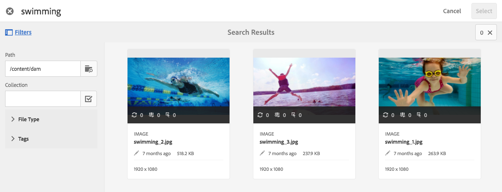

# Arbeta med väljare {#working-with-selectors}

När du arbetar med en interaktiv bild, interaktiv video eller Carousel Banner väljer du resurser och väljer webbplatser och produkter för aktiveringspunkter och bildscheman att länka till. När du arbetar med bilduppsättningar, snurruppsättningar och multimedieuppsättningar väljer du också resurser med resursväljaren.

Det här avsnittet handlar om hur du använder väljarna Produkt, Plats och Resurser, inklusive möjligheten att bläddra, filtrera och sortera i väljarna.

Du kommer åt väljarna när du skapar karuselluppsättningar, lägger till aktiveringspunkter och bildscheman, skapar interaktiva videor och bilder.

I den här Carousel-banderollen använder du produktväljaren om du länkar en hotspot eller bildschema till en QuickView-sida. Använd platsväljaren om du länkar en aktiveringspunkt eller ett bildschema till en hyperlänk. Använd resursväljaren när du skapar en bildruta.

När du väljer (i stället för att ange manuellt) vart hotspot-områden eller bildscheman ska gå, använder du väljaren. Webbplatsväljaren fungerar bara om du är Experience Manager Sites-kund. Produktväljaren kräver också Experience Manager Commerce.

## Använd produktväljare {#selecting-products}

Använd produktväljaren för att välja en produkt när du vill ha en aktiveringspunkt eller bildschema för att ge en snabbvy till en viss produkt i produktkatalogen.

1. Navigera till Carousel Set, Interactive Image eller Interactive Video och välj **[!UICONTROL Actions]** (endast tillgängligt om du har definierat en hotspot eller ett bildschema).

   Produktväljaren finns i **[!UICONTROL Action Type]** område.

   

1. Välj **[!UICONTROL Product Selector]** ikon (förstoringsglas) och navigera till en produkt i katalogen.

   

   Filtrera efter nyckelord eller tagg genom att trycka **[!UICONTROL Filter]** och ange nyckelord, markera taggar eller båda.

   

   Ändra var Experience Manager bläddrar efter produktdata genom att trycka **[!UICONTROL Browse]** och navigera till en annan mapp.

   

   Välj **[!UICONTROL Sort]** genom att ändra om Experience Manager sorterar efter senaste till äldsta eller äldsta till nyaste.

   

   Välj **[!UICONTROL View as]** för att ändra hur du ser produkter - antingen **[!UICONTROL List View]** eller **[!UICONTROL Card View]**.

   

1. När produkten har valts fylls fältet i med produktminiatyrbilden och namnet.

   

1. När **[!UICONTROL Preview]** kan du markera hotspot eller bildschema och se hur snabbvyn ser ut.

   

## Använd webbplatsväljare {#selecting-sites}

Använd webbplatsväljaren för att välja en webbsida när du vill att ett hotspot- eller bildschema ska länka till en webbsida som hanteras i Experience Manager Sites.

1. Navigera till Carousel Set, Interactive Image eller Interactive Video och välj **[!UICONTROL Actions]** (endast tillgängligt om du har definierat en hotspot eller ett bildschema).

   Platsväljaren finns i avsnittet **[!UICONTROL Action Type]**.

   

1. Välj **[!UICONTROL Site Selector]** -ikonen (mapp med förstoringsglas) och navigera till en sida i Experience Manager Sites som du vill länka aktiveringspunkten eller bildschemat till.

   

1. När platsen har valts fylls fältet i med sökvägen.

   

1. När **[!UICONTROL Preview]** Om du markerar hotspot eller bildschema navigerar du till den Experience Manager-sida du angav.

## Använd resursväljare {#selecting-assets}

Använd den här väljaren för att välja bilder som ska användas i en Carousel Banner, en interaktiv video, bilduppsättningar, blandade medieuppsättningar och snurruppsättningar. I interaktiv video är resursväljaren tillgänglig när du väljer **[!UICONTROL Select Assets]** i **[!UICONTROL Content]** -fliken. I Carousel Sets är resursväljaren tillgänglig när du skapar en bildruta. I Bilduppsättningar, Blandade medieuppsättningar och Snurra uppsättningar är resursväljaren tillgänglig när du skapar en bilduppsättning, blandad medieuppsättning eller snurra uppsättning.

Se även [Resursväljaren](search-assets.md#assetpicker) för mer information.

1. Navigera till Carousel Set och skapa en bild. Eller navigera till Interactive Video, gå till **[!UICONTROL Content]** och välja resurser. Du kan också skapa en uppsättning med blandade media, bilduppsättning eller snurra.
1. Välj **[!UICONTROL Asset Selector]** ikon (mapp med förstoringsglas) och navigera till en resurs.

   

   Filtrera efter nyckelord eller tagg genom att trycka **[!UICONTROL Filter]** och ange nyckelord, eller lägga till villkor, eller båda.

   

   Ändra var Experience Manager bläddrar efter resurser genom att navigera till en annan mapp i dialogrutan **[!UICONTROL Path]** fält.

   Välj **[!UICONTROL Collection]** om du bara vill söka efter resurser i samlingar.

   

   Välj **[!UICONTROL View as]** för att ändra hur du ser produkter - antingen **[!UICONTROL List View]**, **[!UICONTROL Column View]**, eller **[!UICONTROL Card View]**.

   

1. Markera resursen genom att trycka på bockmarkeringen. Resursen visas.

   
