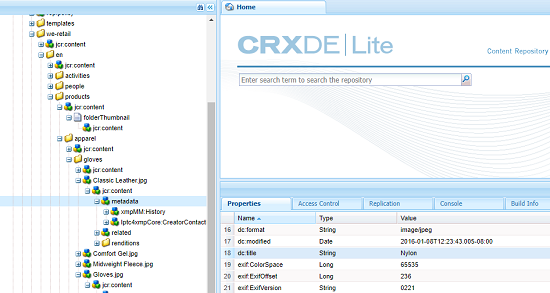
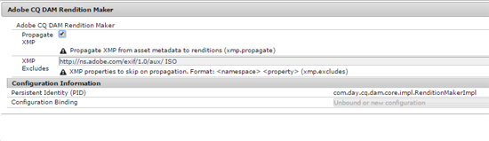

# XMP-tillbakaskrivning till återgivningar {#xmp-writeback-to-renditions}

Den här XMP-återskrivningsfunktionen i Adobe Experience Manager (AEM) Assets replikerar ändringar i resursens återgivningar av metadata.

När du ändrar metadata för en resurs i AEM Resurser eller när du överför resursen, lagras ändringarna i resursnoden i Crx-De.

Funktionen XMP-återställning sprider metadataändringarna till alla eller specifika återgivningar av resursen.

Tänk dig ett scenario där du ändrar egenskapen Title för resursen som har namnet `Classic Leather` till `Nylon`.

I det här fallet sparar AEM Resurser ändringarna av egenskapen **Title** i parametern `dc:title` för resursens metadata som lagras i resurshierarkin.

AEM Resurser sprider dock inte automatiskt några metadataändringar i återgivningarna av en resurs.

Med funktionen XMP-återställning kan du sprida metadataändringarna till alla eller specifika återgivningar av resursen. Ändringarna lagras dock inte under metadatanoden i resurshierarkin. I stället bäddar den här funktionen in ändringarna i de binära filerna för återgivningarna.

## Aktivera XMP-tillbakaskrivning {#enabling-xmp-writeback}

Om du vill att metadataändringarna ska kunna spridas till återgivningarna av resursen när du överför den ändrar du konfigurationen **Adobe CQ DAM Rendition Maker** i Configuration Manager.

1. Öppna Configuration Manager genom att gå till `https://[aem_server]:[port]/system/console/configMgr`.
1. Öppna **Adobe CQ DAM Rendition Maker** -konfigurationen.
1. Välj alternativet **Sprid XMP** och spara sedan ändringarna.

   

## Aktivera XMP-tillbakaskrivning för specifika återgivningar {#enabling-xmp-writeback-for-specific-renditions}

Om du vill att XMP-återskrivningsfunktionen ska kunna sprida metadataändringar för att välja återgivningar, anger du dessa återgivningar i XMP-återskrivningssteget i arbetsflödet för DAM-metadata WriteBack. Som standard konfigureras det här steget med den ursprungliga återgivningen.

Utför dessa steg för XMP-återskrivningsfunktionen som sprider metadata till återgivningsminiatyrerna 140.100.png och 319.319.png.

1. Tryck/klicka på AEM-logotypen och navigera sedan till **Verktyg** > **Arbetsflöde** > **Modeller**.
1. Öppna arbetsflödesmodellen **DAM Metadata Writeback** på sidan Modeller.
1. Öppna steget för **XMP-återskrivningsprocess** på sidan med egenskaper för **DAM-metadataåterställning** .
1. I dialogrutan Stegegenskaper trycker/klickar du på fliken **Process** .
1. Lägg till **i rutan** Argument `rendition:cq5dam.thumbnail.140.100.png,rendition:cq5dam.thumbnail.319.319.png`och tryck/klicka sedan på **OK**.

   

1. Spara ändringarna.
1. Om du vill återskapa pyramidens TIF-renderingar för Dynamic Media-bilder med de nya attributen lägger du till steget **Dynamic Media Process Image Assets** i arbetsflödet för DAM-metadataåterställning.

   PTIFF-renderingar skapas och lagras bara lokalt i en Dynamic Media Hybrid-implementering.

1. Spara arbetsflödet.

Metadataändringarna sprids till miniatyrbilden för återgivningarna.140.100.png och miniatyrbilden.319.319.png för resursen, inte till de andra.

>[!NOTE]
>
>Information om XMP-återskrivningsproblem i 64-bitars Linux finns i [Så här aktiverar du XMP-återskrivningsproblem i 64-bitars RedHat Linux](https://helpx.adobe.com/experience-manager/kb/enable-xmp-write-back-64-bit-redhat.html).
>
>Mer information om vilka plattformar som stöds finns i [XMP-metadatavillkor](/help/sites-deploying/technical-requirements.md#requirements-for-aem-assets-xmp-metadata-write-back).

## Filtrera XMP-metadata {#filtering-xmp-metadata}

AEM Resurser stöder både svartlistsfiltrering och vitlistsfiltrering av egenskaper/noder för XMP-metadata som läses från resurbinärfiler och lagras i JCR när resurser hämtas.

Med svartlistsfiltrering kan du importera alla XMP-metadataegenskaper utom de egenskaper som anges för uteslutning. För resurstyper som INDD-filer som har stora mängder XMP-metadata (till exempel 1 000 noder med 10 000 egenskaper) är namnen på de noder som ska filtreras inte alltid kända i förväg. Om svartlistsfiltrering tillåter ett stort antal resurser med flera XMP-metadata att importeras, kan AEM-instansen/klustret stöta på stabilitetsproblem, till exempel övervakningsköer som stoppats.

Vitlistsfiltrering av XMP-metadata löser problemet genom att du kan definiera de XMP-egenskaper som ska importeras. På så sätt ignoreras andra/okända XMP-egenskaper. Du kan lägga till några av dessa egenskaper i svartlistningsfiltret för bakåtkompatibilitet.

>[!NOTE]
>
>Filtrering fungerar bara för egenskaper som härletts från XMP-källor i objektbinärfiler. För egenskaper som härleds från andra källor än XMP, t.ex. EXIF- och IPTC-format, fungerar inte filtreringen. Datumet då resursen skapades sparas till exempel i egenskapen EXIF TIFF `CreateDate` . AEM berättar det här värdet i metadatafältet med namnet `exif:DateTimeOriginal`. Eftersom källan inte är en XMP-källa fungerar inte filtrering på den här egenskapen.

1. Öppna Configuration Manager genom att gå till `https://[aem_server]:[port]/system/console/configMgr`.
1. Öppna **Adobe CQ DAM XmpFilter** -konfigurationen.
1. Om du vill använda vitlistsfiltrering väljer du **Använd vitlista på XMP-egenskaper** och anger de egenskaper som ska importeras i rutan XML-namn i listan **över godkända för XMP-filtrering** .

   

1. Om du vill filtrera bort svartlistade XMP-egenskaper efter att ha använt vitlistsfiltrering anger du dem i rutan XML-namn med **svartlistning för XMP-filtrering** .

   >[!NOTE]
   >
   >Alternativet **Använd svartlista för XMP-egenskaper** är markerat som standard. Svartlistsfiltrering är alltså aktiverat som standard. Om du vill inaktivera svartlistsfiltrering avmarkerar du alternativet **Använd svartlista för XMP-egenskaper** .

1. Spara ändringarna.
