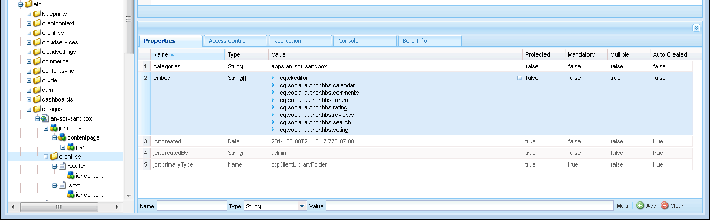

# Lägg till klienter {#add-clientlibs}

## Lägg till en ClientLibraryFolder (clientlibs) {#add-a-clientlibraryfolder-clientlibs}

Skapa en ClientLibraryFolder med namnet `clientlibs` som innehåller JavaScript (JS) och CSS (Cascading Styles Sheets) som används för att återge sidorna på platsen.

Egenskapsvärdet `categories` som anges för det här klientbiblioteket är den identifierare som används för att direkt ta med klienten från en innehållssida eller för att bädda in den i andra klientlibs.

1. Expandera `/etc/designs` med **CRXDE Lite**

1. Högerklicka på `an-scf-sandbox` och välj `Create Node`

   * Namn: `clientlibs`
   * Typ: `cq:ClientLibraryFolder`

1. Klicka på **OK**


På fliken **Egenskaper** för den nya `clientlibs`-noden anger du egenskapen **categories** :

* Namn : **kategorier**
* Typ: **String**
* Värde: **apps.an-scf-sandbox**
* Klicka på **Lägg till**
* Klicka på **Spara alla**

Obs! Kategorivärdet förskjuts med &#39;appar&#39;. är en konvention som identifierar att &quot;ägande program&quot; finns i /apps-mappen, inte /libs. VIKTIGT! Lägg till platshållare `js.tx`t- och **`css.txt`**-filer. (Det är inte officiellt en cq:ClientLibraryFolder utan dem.)

1. Högerklicka på **`/etc/designs/an-scf-sandbox/clientlibs`**
1. Välj **Skapa fil..**
1. Ange **namn:** `css.txt`
1. Välj **Skapa fil..**
1. Ange **namn:** `js.txt`
1. Klicka på **Spara alla**


Den första raden i css.txt och js.txt identifierar den basplats från vilken följande fillistor ska hittas.

Försök att ställa in innehållet i css.txt på

```
#base=.
 style.css
```

Skapa sedan en fil under clientlibs med namnet style.css och ställ in innehållet på

`body {`

`background-color: #b0c4de;`

`}`

### Bädda in SCF-klienter {#embed-scf-clientlibs}

På fliken **Egenskaper** för noden `clientlibs` anger du strängegenskapen **embed** med flera värden. Detta bäddar in nödvändiga [klientbibliotek (klientbibliotek) för SCF-komponenter](/help/communities/client-customize.md#clientlibs-for-scf). I den här självstudiekursen läggs många av de klientlibs som behövs för komponenterna i Communities till.

Detta kan vara det önskade tillvägagångssättet för en produktionsplats, eftersom det finns praktiska överväganden jämfört med storleken/hastigheten för de klienter som laddas ned för varje sida.

Om du bara använder en funktion på en sida kan du inkludera den funktionens fullständiga klientlib direkt på sidan, till exempel

`% ui:includeClientLib categories=cq.social.hbs.forum" %`

I det här fallet är det bäst att ta med alla och så att de mer grundläggande SCF-klientlibs som författarklienten tillhör:

* Namn: **`embed`**
* Typ: **`String`**
* Klicka på **`Multi`**
* Värde: **`cq.social.scf`**

   * En dialogruta öppnas.
klicka på **`+`** efter varje post för att lägga till följande kategorier för klientlib:

      * **`cq.ckeditor`**
      * **`cq.social.author.hbs.comments`**
      * **`cq.social.author.hbs.forum`**
      * **`cq.social.author.hbs.rating`**
      * **`cq.social.author.hbs.reviews`**
      * **`cq.social.author.hbs.voting`**
      * Klicka på **OK**

* Klicka på **Spara alla**


Så här ska `/etc/designs/an-scf-sandbox/clientlibs` nu visas i databasen:



### Inkludera klientlibs i PlayPage-mallen {#include-clientlibs-in-playpage-template}

Utan att ta med kategorin `apps.an-scf-sandbox` ClientLibraryFolder på sidan fungerar inte SCF-komponenterna och är inte formaterade eftersom nödvändiga JavaScript- och CSS-format inte är tillgängliga.

Utan att ta med clientlibs visas SCF-kommentarkomponenten som stylfri:


När clientlibs för apps.an-scf-sandbox ingår formateras SCF-kommentarskomponenten:


Programsatsen include hör till avsnittet `head` i skriptet `html`. Standardvärdet **`foundation head.jsp`** innehåller ett skript som kan överlappas: **`headlibs.jsp`**.

**Kopiera headlibs.jsp och inkludera clientlibs:**

1. Använd **CRXDE Lite** och markera **`/libs/foundation/components/page/headlibs.jsp`**

1. Högerklicka och välj **Kopiera** (eller välj Kopiera från verktygsfältet)
1. Välj **`/apps/an-scf-sandbox/components/playpage`**
1. Högerklicka och välj **Klistra in** (eller välj Klistra in i verktygsfältet)
1. Dubbelklicka på **`headlibs.jsp`** så att du kan öppna den
1. Lägg till följande rad i slutet av filen
   **`<ui:includeClientLib categories="apps.an-scf-sandbox"/>`**

1. Klicka på **Spara alla**

```xml
<%@ page session="false" %><%
%><%@include file="/libs/foundation/global.jsp" %><%
%><ui:includeClientLib categories="cq.foundation-main"/><%
%>
<cq:include script="/libs/cq/cloudserviceconfigs/components/servicelibs/servicelibs.jsp"/>
<% currentDesign.writeCssIncludes(pageContext); %>
<ui:includeClientLib categories="apps.an-scf-sandbox"/>
```

Läs in webbplatsen i webbläsaren och se om bakgrunden inte är en blå nyans.

[https://localhost:4502/content/an-scf-sandbox/en/play.html](https://localhost:4502/content/an-scf-sandbox/en/play.html)


### Spara ditt arbete hittills {#saving-your-work-so-far}

För närvarande finns det en minimalistisk sandlåda. Det kan vara värt att spara som ett paket så att du kan inaktivera servern när du spelar upp, om databasen blir skadad och du vill börja om. Byt namn på eller ta bort mappen crx-quickstart/, aktivera servern, ladda upp och installera det här sparade paketet och behöver inte upprepa dessa grundläggande steg.

Det här paketet finns i självstudiekursen [Skapa en exempelsida](/help/communities/create-sample-page.md) för dem som inte kan vänta med att hoppa in och börja spela upp.

Så här skapar du ett paket:

* Klicka på ikonen [Packa](https://localhost:4502/crx/packmgr/) från CRXDE Lite.
* Klicka på **Skapa paket**

   * Paketnamn: an-scf-sandbox-minimum-pkg
   * Version: 0.1
   * Grupp: `leave as default`
   * Klicka på **OK**

* Klicka på **Redigera**

   * Välj fliken **Filter**

      * Klicka på **Lägg till filter**
      * Rotsökväg: bläddra till `/apps/an-scf-sandbox`
      * Klicka på **Klar**
      * Klicka på **Lägg till filter**
      * Rotsökväg: bläddra till `/etc/designs/an-scf-sandbox`
      * Klicka på **Klar**
      * Klicka på **Lägg till filter**
      * Rotsökväg: bläddra till `/content/an-scf-sandbox**`
      * Klicka på **Klar**

   * Klicka på **Spara**

* Klicka på **Skapa**

Nu kan du välja **Hämta** om du vill spara den på disken och **Överför paket** någon annanstans. Välj sedan **Mer > Replikera** om du vill överföra sandlådan till en lokal värdpubliceringsinstans för att utöka sandlådans sfär.
