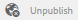

# Analyskonfiguration för communityfunktioner{#analytics-configuration-for-communities-features}

## Översikt {#overview}

Adobe Analytics och Adobe Experience Manager (AEM) är båda lösningarna i Adobe Marketing Cloud.

Adobe Analytics kan konfigureras för AEM Communities så att händelser skickas till Adobe Analytics från vilka rapporter genereras när en medlem interagerar med funktioner som stöds i Communities.

När en medlem på en community-webbplats för aktivering till exempel visar en videoresurs som tilldelats dem, skickar resursspelaren händelser till Analytics, inklusive data om hjärtslag för video. Från communitywebbplatsen kan administratörer se olika rapporter om videouppspelningen.

Dessutom krävs analyser för att

* i publiceringsmiljön:

   * rapporter om [communitytrender](/help/communities/trends.md)
   * tillåt besökare att sortera efter&quot;mest visade&quot;,&quot;mest aktiva&quot; eller&quot;mest gillade&quot;
   * visa antal i UGC-listor

* i redigeringsmiljön:

   * visning av deltagardata i [medlemmarnas administrationskonsol](/help/communities/members.md) (vyer, inlägg, följare, gilla-markeringar)
   * trendsammanfattning, hjärtslag för video och videoenhet för [rapporter om aktiveringsresurser](/help/communities/reports.md)

Funktioner som stöds för Communities är:

* [aktiveringsresurser](/help/communities/resources.md)
* [forum](/help/communities/forum.md)
* [QnA](/help/communities/working-with-qna.md)
* [blogg](/help/communities/blog-feature.md)
* [filbibliotek](/help/communities/file-library.md)
* [kalender](/help/communities/calendar.md)

I det här avsnittet av dokumentationen beskrivs hur du kopplar samman en Analytics-rapportsserie med communityfunktioner. De grundläggande stegen är:

1. [Replikera krypteringsnyckeln](#replicate-the-crypto-key) för att säkerställa att kryptering/dekryptering sker korrekt på alla AEM-instanser
1. Förbered en [rapportsserie för Adobe Analytics](#adobe-analytics-report-suite-for-video-reporting)
1. Skapa en [molntjänst](#aem-analytics-cloud-service-configuration) och ett [ramverk för AEM Analytics](#aem-analytics-framework-configuration)

1. [Aktivera Analytics](#enable-analytics-for-a-community-site) för en community-webbplats
1. [**Verifiera **](#verify-analytics-to-aem-variable-mapping)analys till AEM-variabelmappning
1. Identifiera [primär utgivare](#primary-publisher)
1. [Publicera](#publish-community-site-and-analytics-cloud-service) communitywebbplatsen
1. Konfigurera [import av rapportdata](#obtaining-reports-from-analytics) från Adobe Analytics till communitywebbplatsen

## Förutsättningar {#prerequisites}

Om du vill konfigurera Analytics för communityfunktioner måste du samarbeta med din kontorepresentant för att skapa ett Adobe Analytics-konto och en [rapportserie](#adobe-analytics-report-suite-for-video-reporting). När den är etablerad ska följande information finnas tillgänglig:

* Företag som är associerat med Adobe Analytics-kontot
* Användarnamn inloggningsanvändarnamn för den användare som är behörig att hantera Analytics-kontot (ska inkludera Web Service Access-behörigheter)

* Lösenord för den behöriga användarens inloggningslösenord
* Analysdatacenter - URL:en för kontots Analytics-datacenter
* Report Suite, namnet på den analysrapportsserie som ska användas

## Adobe Analytics Report Suite for Video Reporting {#adobe-analytics-report-suite-for-video-reporting}

Med hjälp av [Report Suite Manager](https://marketing.adobe.com/resources/help/en_US/reference/new_report_suite.html)i Adobe Marketing Cloud kan rapportsviterna i Analytics konfigureras så att en communitywebbplats kan aktiveras för att tillhandahålla rapporter om communityfunktioner.

Genom att logga in på [Adobe Marketing Cloud](https://marketing.adobe.com/resources/help/en_US/analytics/getting-started/analytics-navigation.html) med [företagsnamn och användarnamn](/help/communities/analytics.md#prerequisites)kan du konfigurera en ny eller befintlig rapportserie så att den har:

* [11 Konverteringsvariabler](https://marketing.adobe.com/resources/help/en_US/reference/conversion_var_admin.html) (eVars)

   * **`evar1`** via **`evar11`** aktiverad

   * kan återanvända (byta namn på) befintliga e-variabler eller skapa nya som kan användas för webbgruppsfunktioner

* [7 Success Events](https://marketing.adobe.com/resources/help/en_US/reference/success_event.html) (events)

   * **`event1`** via **`event7`** aktiverad

   * type **`Counter`**

      * not **`Counter (no subrelations)`**
   * kan återanvända (byta namn på) befintliga händelser eller skapa nya som kan användas för communityfunktioner


* [Videohantering](https://marketing.adobe.com/resources/help/en_US/sc/appmeasurement/hbvideo/video_analytics_config.html)

   * Videorapportkonsol

      * enable `Video Core`
      * välj Spara
   * Mätkonsol för videokärna

      * select `Use Solution Variables`
      * välj Spara


Om du använder en **ny rapportserie** bör du vara medveten om att en ny rapportserie bara kan ha 4 variabler och 6 händelsvariabler, medan 11 variabler och 7 händelsvariabler krävs för Communities.

Om du använder en **befintlig rapportserie** kan det vara nödvändigt att [ändra variabelmappningen](#modifying-analytics-variable-mapping) innan Analytics-ramverket aktiveras för en community-webbplats. Kontakta din kontorepresentant om du har några frågor om de variabler som är dedikerade till Communities.

>[!CAUTION]
>
>**Om du använder en befintlig rapportserie som redan använder variabler i**
>
>* **`evar1`** via **`evar11`**
   >
   >
* **`event1`** via **`event7`**
>
>
**Innan communitywebbplatsen publiceras är det** viktigt att återställa den befintliga mappningen genom att flytta AEM-variablerna som automatiskt mappades till Analytics-variabler när Analytics aktiverades för en community-webbplats.
>
>Om du vill återställa den befintliga mappningen och flytta AEM-variabler till andra Analytics-variabler läser du avsnittet [Ändra variabelmappning](#modifying-analytics-variable-mapping)i Analytics.
>
>Om detta inte görs kan data gå förlorade.

### Analys av pulsslag för video {#video-heartbeat-analytics}

När Video Heartbeat Analytics är licensierat `Marketing Cloud Org Id` tilldelas ett videomaterial.

Så här aktiverar du rapportering av pulsslag i videomaterial efter [att du har konfigurerat Analytics-rapportsviten för videorapportering](#adobe-analytics-report-suite-for-video-reporting):

* skapa en [molntjänst för Analytics](#aem-analytics-cloud-service-configuration)
* aktivera [analys för en community-webbplats](#enable-analytics-for-a-community-site)
* associera webbplatsen `Marketing Cloud Org Id` med communitywebbplatsen

Du kan `Marketing Cloud Org Id` ange detta när en [community-webbplats skapas](/help/communities/sites-console.md#enablement) eller senare genom att [ändra](/help/communities/sites-console.md#modifying-site-properties) egenskaperna för communitywebbplatsen. [](#aem-analytics-cloud-service-configuration)


När Video Heartbeat Analytics är aktiverat instansierar JavaScript-koden (JS) för videospelaren bibliotekskoden för pulsslag (även i JS), som hanterar all logik för att skicka videostatusuppdateringar till videospårningsservrarna i Analytics var 10:e sekund (inte konfigurerbar) och slutligen skickar en kumulativ rapport om videosessionen till huvudanalysservrarna.

Om det inte är aktiverat instansieras aldrig videons hjärtslagskod och endast videoförloppet och återupptagningspositionsspårning sparas i SRP för rapportering.

## Tjänstkonfiguration för AEM Analytics Cloud {#aem-analytics-cloud-service-configuration}

Så här skapar du en ny Analytics-integrering, som integrerar Adobe Analytics med AEM-communitywebbplatsen, med standardgränssnittet på författarinstansen:

* från global navigering: **Verktyg, Distribution, molntjänster**
* rulla ned till **Adobe Analytics**
* välj **Konfigurera nu** eller **Visa konfigurationer**


### Dialogrutan Skapa konfiguration {#create-configuration-dialog}

* välj **[+]** ikon bredvid **Tillgängliga konfigurationer** för att skapa en ny konfiguration

I dialogrutan Skapa konfiguration anger de värden som ska anges konfigurationen.


* **Titel**(obligatoriskt) En visningsrubrik för konfigurationen.
Ange till exempel *Aktivera communityanalys*

* **Namn**(valfritt) Om inget anges används som standard ett giltigt nodnamn som härleds från titeln.
Ange t.ex. *communities*

* *Mallval*`Adobe Analytics Configuration`

* Välj **Skapa**

   * startar konfigurationssidan och öppnar `Analytics Settings` dialogrutan

### Dialogrutan Analysinställningar {#analytics-settings-dialog}

När en ny Analytics-konfiguration skapas första gången visas konfigurationen och en ny dialogruta där Analytics-inställningarna kan anges. Den här dialogrutan kräver den [nödvändiga kontoinformationen](#prerequisites) från kontoombudet.


* **Företaget** som är associerat med Adobe Analytics-kontot

* **Användarnamn** för användarens inloggningsnamn som är behörig att hantera Analytics-kontot

* **Lösenord** för den behöriga användarens inloggningslösenord

* **Datacenter** väljer det Analytics-datacenter som är värd för rapportsviten

* **Lägg inte till spårningstagg till sidans** standardplats (avmarkerat)

* **Använd AppMeasurement** som standard (avmarkerat)

* **Importera inte sidvisningar varje kväll (författare)** lämna dem som standard (avmarkerat)

* **Importera inte sidvisningar varje natt (publicera)** lämna dem som standard (avmarkerat)

Så här sparar du inställningarna:

* välj **Anslut till analys**

   * om det inte lyckas,

      * verifiera att posterna inte innehåller inledande blanksteg
      * prova ett annat datacenter
      * kontakta din kontorepresentant

* välj **OK**


### Skapa ramverk {#create-framework}

När du har konfigurerat den grundläggande anslutningen till Adobe Analytics måste du skapa eller redigera ett ramverk för communitywebbplatsen. Syftet med ramverket är att mappa variabler för funktionen Communities (AEM) till analysvariabler (report suite).

* välj `[+]` ikon bredvid **Tillgängliga ramverk** för att skapa ett nytt ramverk


* **Title**(required) A display title for the frameworkAnge t.ex. *Enablement Community Framework*

* **Namn**(valfritt) Om inget anges används som standard ett giltigt nodnamn som härleds från titeln.
Ange t.ex. *communities*

* *Mallval*`Adobe Analytics Framework`

* Välj **Skapa**

Om du skapar Analytics Framework öppnas ramverket för konfiguration.

## Konfiguration av AEM Analytics Framework {#aem-analytics-framework-configuration}

Syftet med ramverket är att mappa AEM-variabler till analysvariabler (eVars och events). Analysvariablerna som är tillgängliga för mappning [definieras i rapportsviten](#adobe-analytics-report-suite-for-video-reporting).


### Välj Report Suite {#select-report-suite}

Välj den rapportsvit som har konfigurerats för videorapportering.

Om en rapportsvit ännu inte har skapats eller inte har konfigurerats på rätt sätt, se föregående avsnitt:
[Adobe Analytics Report Suite for Video Reporting](#adobe-analytics-report-suite-for-video-reporting)

Den idekiske behövs inte och kan minimeras så att den inte förhindrar åtkomst till inställningarna för Report Suites.

#### Dialogrutan Rapportsviter före och efter alternativet Lägg till objekt {#report-suites-dialog-before-and-after-selecting-add-item}



1. Välj **Lägg till objekt +.**
Två listrutor visas.

1. Välj en rapportsvit `Report suite.`som är kopplad till företagskontot som kan väljas.

1. Välj **Yes **i den dialogruta som öppnas:

   ```
   Load default server settings?
    Do you want to load the default server settings and overwrite current values in the Server section?
   ```

1. Välj en `Run Mode`
1. Välj **publicering**


Molntjänsten och ramverket för Analytics är nu färdiga. Mappningarna definieras när en communitywebbplats har skapats med den här analystjänsten aktiverad.

## Aktivera analys för en communitywebbplats {#enable-analytics-for-a-community-site}

### Aktivera för ny community-plats {#enable-for-new-community-site}

Så här lägger du till molntjänsten Analytics när du [skapar en ny community-webbplats](/help/communities/sites-console.md):

* I steg 3, under fliken [](/help/communities/sites-console.md#analytics)ANALYTICS:
   * Markera kryssrutan **Aktivera analys** .
   * välj ramverket i listrutan.

* Om du vill kan du gå tillbaka till Analytics-ramverkskonfigurationen och justera variabelmappningarna.

### Aktivera för befintlig communitywebbplats {#enable-for-existing-community-site}

Så här lägger du till molntjänsten Analytics på en [befintlig community-webbplats](/help/communities/sites-console.md#modifying-site-properties):

* Gå till **webbgruppskonsolen, webbplatskonsolen** .
* Välj ikonen Redigera webbplats för communitywebbplatsen.
* Välj INSTÄLLNINGAR.
* I avsnittet Analytics:
   * Markera kryssrutan **Aktivera analys** .
   * Välj ramverket i listrutan.

* Om du vill kan du gå tillbaka till Analytics-ramverkskonfigurationen och justera variabelmappningarna.

### Aktivera för anpassade platser {#enable-for-customized-sites}

För att Analytics-spårning och -import ska fungera korrekt för en community-webbplats måste det finnas ett sidelement med attributen `scf-js-site-title` class och href. Det får bara finnas ett sådant element på sidan, t.ex. i ett oförändrat `sitepage.hbs` skript för en communitywebbplats. Värdet för `siteUrl` extraheras och skickas till Adobe Analytics som *webbplatssökväg*.

```xml
# present in default sitepage.hbs
# only one scf-js-site-title class should be included
# this example sets it to be hidden as it serves no visual purpose
<div
    class="navbar-brand scf-js-site-title"
    href="{{siteUrl}}.html"
    style="visibility: hidden;"
>
</div>
```

Om du vill ha en **anpassad communitywebbplats** som täcker över `sitepage.hbs` skriptet kontrollerar du att elementet finns. Variabeln `siteUrl`ställs in när den återges på servern innan den skickas till klienten.

För en **allmän AEM-webbplats** som innehåller webbgruppskomponenter, men som inte har skapats med guiden [Skapa](/help/communities/sites-console.md)webbplats, måste du lägga till elementet. Värdet för href bör vara sökvägen till platsen. Om till exempel platssökvägen är `/content/my/company/en`använder du:

```xml
<div
    class="navbar-brand scf-js-site-title"
    href="/content/my/company/en.html"
    style="visibility: hidden;"
>
</div>
```

## Funktioner i Analytics for Communities {#analytics-for-communities-features}

Analyser används automatiskt för flera communityfunktioner.

Författarmiljöns [OSGi-konfiguration](/help/sites-deploying/configuring-osgi.md), `AEM Communities Analytics Component Configuration`innehåller en lista över de komponenter som har instrumenterats för Analytics. Den automatiska mappningen av variabler bestäms av komponenterna i listan.

Om nya anpassade komponenter skapas som är instrumenterade för Analytics, bör de läggas till i den här listan med konfigurerade komponenter.

### Komponentkonfiguration {#component-configuration}


>[!NOTE]
>
>Journalkomponenterna används för att implementera bloggfunktionen.

### Mappade analyser till AEM-variabler {#mapped-analytics-to-aem-variables}

När communitywebbplatsen har sparats med Analytics aktiverat och molnkonfigureringsramverket valt mappas AEM-variablerna automatiskt till eVars-variabler och händelser i Analytics som börjar med evar1 respektive event1 och ökar med 1.

Om du använder en befintlig rapportserie som mappade någon av variablerna inom var1 till var11 och event1 till och med event7, måste du [mappa om AEM-variablerna](#modifying-analytics-variable-mapping) och återställa den ursprungliga mappningen.

Här följer ett exempel på standardmappningar efter att du har följt självstudiekursen [](/help/communities/getting-started-enablement.md)Komma igång:


#### Karta över eVars som skickas med varje händelse {#map-of-evars-sent-with-each-event}

<table>
 <tbody>
  <tr>
   <td><strong> </strong></td>
   <td><strong>Typ<br /> av aktiveringsresurs<br /></strong></td>
   <td><strong>Platsrubrik<br /></strong></td>
   <td><strong>Funktionstyp<br /></strong></td>
   <td><strong>Grupptitel<br /></strong></td>
   <td><strong>Gruppera<br /> bana</strong></td>
   <td><strong>UGC<br /> -typ</strong></td>
   <td><strong>UGC<br /> -titel</strong></td>
   <td><strong>Användare<br /> (medlem)</strong></td>
   <td><strong>UGC<br /> -sökväg</strong></td>
   <td><strong>Platsens<br /> sökväg</strong></td>
  </tr>
  <tr>
   <td><strong> </strong></td>
   <td><strong>eVar1</strong></td>
   <td><strong>eVar2</strong></td>
   <td><strong>eVar3</strong></td>
   <td><strong>eVar4</strong></td>
   <td><strong>eVar5</strong></td>
   <td><strong>eVar6</strong></td>
   <td><strong>eVar7</strong></td>
   <td><strong>eVar8</strong></td>
   <td><strong>eVar9</strong></td>
   <td><strong>eVar10</strong></td>
  </tr>
  <tr>
   <td><strong>event1<br /> Resource Play</strong></td>
   <td><em>(en)</em></td>
   <td><em>-</em></td>
   <td><em>-</em></td>
   <td><em>-</em></td>
   <td><em>-</em></td>
   <td><em>-</em></td>
   <td><em>-</em></td>
   <td><em>-</em></td>
   <td><em>(i)</em></td>
   <td><em>-</em></td>
  </tr>
  <tr>
   <td><strong>event2<br /> SCFView</strong></td>
   <td><em>(en)</em></td>
   <td><em>b)</em></td>
   <td><em>(c)</em></td>
   <td><em>(d)</em></td>
   <td><em>(e)</em></td>
   <td><em>(f)</em></td>
   <td><em>(g)</em></td>
   <td><em>(h)</em></td>
   <td><em>(i)</em></td>
   <td><em>(j)</em></td>
  </tr>
  <tr>
   <td><strong>event3<br /> SCFCreate (Post)</strong></td>
   <td><em>-</em></td>
   <td><em>b)</em></td>
   <td><em>(c)</em></td>
   <td><em>(d)</em></td>
   <td><em>(e)</em></td>
   <td><em>(f)</em></td>
   <td><em>(g)</em></td>
   <td><em>(h)</em></td>
   <td><em>(i)</em></td>
   <td><em>(j)</em></td>
  </tr>
  <tr>
   <td><strong>event4<br /> SCFFollow</strong></td>
   <td><em>-</em></td>
   <td><em>b)</em></td>
   <td><em>(c)</em></td>
   <td><em>(d)</em></td>
   <td><em>(e)</em></td>
   <td><em>(f)</em></td>
   <td><em>(g)</em></td>
   <td><em>(h)</em></td>
   <td><em>(i)</em></td>
   <td><em>(j)</em></td>
  </tr>
  <tr>
   <td><strong>event5<br /> SCFVoteUp</strong></td>
   <td><em>-</em></td>
   <td><em>b)</em></td>
   <td><em>(c)</em></td>
   <td><em>(d)</em></td>
   <td><em>(e)</em></td>
   <td><em>(f)</em></td>
   <td><em>(g)</em></td>
   <td><em>(h)</em></td>
   <td><em>(i)</em></td>
   <td><em>(j)</em></td>
  </tr>
  <tr>
   <td><strong>event6<br /> SCFVoteDown</strong></td>
   <td><em>-</em></td>
   <td><em>b)</em></td>
   <td><em>(c)</em></td>
   <td><em>(d)</em></td>
   <td><em>(e)</em></td>
   <td><em>(f)</em></td>
   <td><em>(g)</em></td>
   <td><em>(h)</em></td>
   <td><em>(i)</em></td>
   <td><em>(j)</em></td>
  </tr>
  <tr>
   <td><strong>event7<br /> SCFRate</strong></td>
   <td><em>-</em></td>
   <td><em>b)</em></td>
   <td><em>(c)</em></td>
   <td><em>(d)</em></td>
   <td><em>(e)</em></td>
   <td><em>(f)</em></td>
   <td><em>(g)</em></td>
   <td><em>(h)</em></td>
   <td><em>(i)</em></td>
   <td><em>(j)</em></td>
  </tr>
 </tbody>
</table>

**Exempel på eVar-värden:**

* *a)[MIME-typ](https://www.iana.org/assignments/media-types)*:video/mp4
* *b)[communitytitel](/help/communities/sites-console.md#step13asitetemplate)*: Geometrixx Communities
* *c)[communityfunktionsnamn](/help/communities/functions.md)*:Forum
* *d)[communitygruppsnamn](/help/communities/creating-groups.md#creating-a-new-group)*: Vattna
* *e) väg till communitygruppsinnehåll*: /content/sites/communities/en/groups/hiking
* *(f)[UGC-komponentresursType](/help/communities/essentials.md)*: social/forum/komponenter/hbs/topic
* *g) UGC-komponentens titel*: Hiking Topics
* *h) login (authzableId)*: aaron.mcdonald@mailinator.com
* *(i) SRP-sökväg till UGC*: /content/usergenerated/asi/.../forum/jmtz-topic3or *path of component to follow*: /content/sites/communities/en/jcr:content/content/primary/forum

* *j) väg till innehåll* på communitywebbplatsen: /content/sites/community/en

### Ändra variabelmappning för analys {#modifying-analytics-variable-mapping}

Mappningen av eVars och händelser för Analytics till AEM-variabler visas i ramverkskonfigurationen när Analytics har aktiverats för en communitywebbplats.

När Analytics har aktiverats och innan communitywebbplatsen publiceras, kan mappningen ändras i ramverket genom att dra önskad Analytics-evar eller -händelse från den vänstra listen och släppa den på den relevanta raden i mappningstabellen.

För att undvika dubblettmappningar måste du se till att ta bort den ersatta Analytics-instansen eller händelsen från raden genom att hålla markören över den och välja &quot;X&quot; som visas till höger om variabelelementet Analytics.

Om Communities eVars och Events skriver över mappningar som fanns tidigare i rapportsviten bör du, för att undvika dataförluster, tilldela AEM-variablerna för Communities-funktioner till andra Analytics eVars eller events och återställa de ursprungliga mappningarna.

>[!CAUTION]
>
>Det är viktigt att tänka på innan communitywebbplatsen [publiceras](#publishing-the-community-site) med Analytics aktiverat, annars finns det risk för dataförlust.

#### Exempelsteg 1: Dra Analytics evar14 till mappningstabellen {#example-step-dragging-analytics-evar-into-mapping-table}


#### Exempelsteg 2: Välja &#39;x&#39; för att ta bort ersatt evar11 {#example-step-selecting-x-to-remove-replaced-evar}


#### Exempelsteg 3: AEM var eventdata.siteId ommappas till Analytics evar14 {#example-step-aem-var-eventdata-siteid-remapped-to-analytics-evar}


## Publicera communitywebbplatsen {#publishing-the-community-site}

### Verifiera analyser till AEM-variabelmappning {#verify-analytics-to-aem-variable-mapping}

Det är klokt att verifiera variabelmappningen innan communitywebbplatsen publiceras, som även publicerar molntjänsten och ramverket för Analytics.

Se avsnitt:

* [Mappade analyser till AEM-variabler](#mapped-analytics-to-aem-variables)
* [Ändra variabelmappning för analys](#modifying-analytics-variable-mapping)

>[!CAUTION]
>
>**Om du använder en befintlig rapportserie som redan använder variabler i**
>
>* **`evar1`** via **`evar11`**
   >
   >
* **`event1`** via **`event7`**
>
>
**Innan communitywebbplatsen publiceras är det** viktigt att återställa den befintliga mappningen och flytta de Communities AEM-variabler som automatiskt mappades (när Analytics aktiverades för communitywebbplatsen) till andra Analytics-variabler. Den här ommappningen bör vara konsekvent för alla webbgruppskomponenter.
>
>Om detta inte görs kan data gå förlorade.

### Primär utgivare {#primary-publisher}

När den valda distributionen är en [publiceringsgrupp](/help/communities/topologies.md#tarmk-publish-farm)måste en AEM-publiceringsinstans identifieras som primär utgivare för att avfråga Adobe Analytics för rapportdata som ska skrivas till [SRP](/help/communities/working-with-srp.md).

Som standard identifierar `AEM Communities Publisher Configuration` OSGi-konfigurationen sin publiceringsinstans som primär utgivare, så att alla publiceringsinstanser i en publiceringsgrupp identifierar sig själva som primär.

Det är därför nödvändigt att redigera konfigurationen för alla sekundära publiceringsinstanser för att avmarkera kryssrutan **Primär utgivare** .

Specifika anvisningar finns i den primära utgivardelen i [Distribuera communities](/help/communities/deploy-communities.md#primary-publisher).

>[!CAUTION]
>
>Det är viktigt att den primära utgivaren är konfigurerad för att förhindra avsökning från flera publiceringsinstanser.

### Replikera krypteringsnyckeln {#replicate-the-crypto-key}

Adobe Analytics-autentiseringsuppgifterna är krypterade. För att underlätta replikering eller överföring av krypterade analysreferenser mellan författare och utgivare måste alla AEM-instanser dela samma huvudkrypteringsnyckel.

Följ instruktionerna på [Replikera krypteringsnyckeln](/help/communities/deploy-communities.md#replicate-the-crypto-key).

### Publicera Community Site and Analytics Cloud Service {#publish-community-site-and-analytics-cloud-service}

När molntjänsten Analytics har aktiverats för en communitywebbplats och, om det behövs, [mappningen av Analytics till AEM-variabler har justerats](#mapped-analytics-to-aem-variables), måste konfigurationen replikeras till publiceringsmiljön genom [att publicera communitywebbplatsen](/help/communities/sites-console.md#publishing-the-site)på nytt.

## Få rapporter från Analytics {#obtaining-reports-from-analytics}

### Rapporthantering {#report-management}

Författaren och den primära utgivarens [OSGi-konfiguration](/help/sites-deploying/configuring-osgi.md), `AEM Communities Analytics Report Management`, används för att fråga Analytics.

Frågorna gäller för realtidsrapporter.

På den primära utgivaren används frågorna för att tillhandahålla information som förberedelse för Report-importerarens Analytics-dataimport.

Frågeintervallet är som standard 10 sekunder.

### Rapportimporteraren {#report-importer}

När en communitywebbplats aktiverad med Analytics har publicerats kan den primära utgivarens [OSGi-konfiguration](/help/sites-deploying/configuring-osgi.md), `AEM Communities Analytics Report Importer`konfigureras att ange standardavsökningsintervallet för de konfigurationer som inte konfigureras individuellt i CRXDE.

Avsökningsintervallet styr hur ofta Adobe Analytics begär data som ska hämtas och sparas i [SRP](/help/communities/working-with-srp.md).

När data kan kategoriseras som&quot;big data&quot; kan en mer frekvent undersökning innebära en stor belastning på communitywebbplatsen.

Standardavsökningsintervallet **för** import är 12 timmar.


### Anpassning av komponentrapport {#component-report-customization}

För att anpassa mätvärdena för att spåra skapas för närvarande noder i databasen som definierar tidsperioder för vilka en rapport om mätvärdena ska genereras.

Forum-ämnet är för närvarande det enda exemplet på den här anpassningen:

* Logga in med administratörsbehörighet på den primära utgivaren.
* Navigera till [CRXDE Lite](/help/sites-developing/developing-with-crxde-lite.md). Till exempel [https://localhost:4503/crx/de](https://localhost:4503/crx/de).

* Under jcr:content-noden i språkroten ( `/content/sites/engage/en/jcr:content),`navigera till exempel till komponenten som konfigurerats för Analytics-rapportering).
Exempel, **`analytics/reportConfigs/social_forum_components_hbs_topic`**

* Observera de skapade tidsperioderna:

   * `last30Days`
   * `last90Days`
   * `thisYear`

* Lägg märke till `total`noden.

   * Om du ändrar egenskapen **`interval`**åsidosätts intervallet för rapportimporteraren.
   * Värdet anges i sekunder och är inställt på 4 timmar (1 400 sekunder).


## Hantera användardata i Analytics {#manage-user-data-in-analytics}

Adobe Analytics innehåller API:er som gör att du kan komma åt, exportera och ta bort användardata. Mer information finns i [Skicka begäran](https://marketing.adobe.com/resources/help/en_US/analytics/gdpr/gdpr_submit_access_delete.html)om åtkomst och borttagning.

## Resurser {#resources}

* Adobe Marketing Cloud: Hjälp och referens [för analyser](https://marketing.adobe.com/resources/help/en_US/reference/)
* AEM: Integrera [med Adobe Analytics](/help/sites-administering/adobeanalytics.md)
* AEM: [Analyser med externa leverantörer](/help/sites-administering/external-providers.md)

