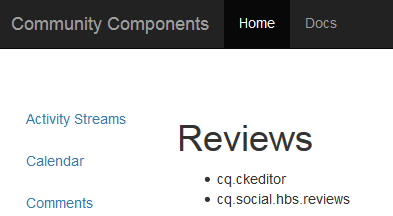

# Clientlibs for Communities Components {#clientlibs-for-communities-components}

## Introduktion {#introduction}

I det här avsnittet av dokumentationen beskrivs hur du lägger till klientbibliotek (klientbibliotek) på en sida för webbgruppskomponenter.

Grundläggande information finns i följande:

* [Använda bibliotek på klientsidan](/help/sites-developing/clientlibs.md) som innehåller användningsinformation och felsökningsverktyg
* [Clientlibs for SCF](/help/communities/client-customize.md#clientlibs) som ger användbar information när du anpassar SCF-komponenter

## Varför Clientlibs krävs {#why-clientlibs-are-required}

Clientlibs krävs för att en komponent ska fungera korrekt (JavaScript) och ha rätt format (CSS).

När det finns en [community-funktion](/help/communities/functions.md) för en funktion finns alla nödvändiga komponenter och konfigurationer, inklusive de nödvändiga klientlibs, på communitywebbplatsen. Bara om ytterligare komponenter ska vara tillgängliga för författare måste ytterligare klientlib läggas till.

När de nödvändiga klientlibs saknas kan [tillägg av en webbgruppskomponent till en sida](/help/communities/author-communities.md) resultera i JavaScript-fel och ett oväntat utseende.

### Exempel: Monterade granskningar utan Clientlibs {#example-placed-reviews-without-clientlibs}

### Exempel: Monterade granskningar med Clientlibs {#example-placed-reviews-with-clientlibs}

## Identifiera nödvändiga klienter {#identifying-required-clientlibs}

Den viktigaste funktionsinformationen för utvecklare identifierar de nödvändiga klientlibs.

Om du dessutom bläddrar till [Community Components Guide](/help/communities/components-guide.md) från en AEM får du tillgång till en lista med de clientlib-kategorier som krävs för en komponent.

Överst på sidan [Recensioner](https://localhost:4502/content/community-components/en/reviews.html) finns till exempel de nödvändiga libs som visas

* cq.ckeditor
* cq.social.hbs.reviews

## Lägga till nödvändiga klienter {#adding-required-clientlibs}

När du vill lägga till en webbgruppskomponent på en sida måste du lägga till de nödvändiga klientlibs för komponenten om det inte redan finns.

Använd [CRXDE|Lite](#using-crxde-lite) om du vill ändra en befintlig klientlistorlista för en communitywebbplatssida.

Så här lägger du till en klientlib för en community-webbplats med [CRXDE Lite](/help/sites-developing/developing-with-crxde-lite.md):

* Gå till [https://&lt;server>:&lt;port>/crx/de](https://localhost:4502/crx/de).
* Leta reda på noden `clientlibslist` för sidan där du vill lägga till komponenten:

   * `/content/sites/sample/en/page/jcr:content/clientlibslist`

* Med noden `clientlibslist` markerad:

   * Leta reda på egenskapen [] för String. `scg:requiredClientLibs`.
   * Välj dess `Value` så att du kan komma åt dialogrutan String-matris.

      * Bläddra nedåt om det behövs.
      * Välj + för att ange ett nytt klientbibliotek.

         * Upprepa om du vill lägga till fler klientbibliotek.

         * Välj **OK**.

   * Välj **Spara alla**.

>[!NOTE]
>
>Om webbplatsen inte är en communitywebbplats måste förekomsten eller platsen för klientbiblioteken som används för webbplatsen upptäckas.

Om du använder exemplet [Komma igång med AEM Communities](/help/communities/getting-started.md), där `site-name` är *engage*, visas klienten så här om du lägger till granskningskomponenten:

