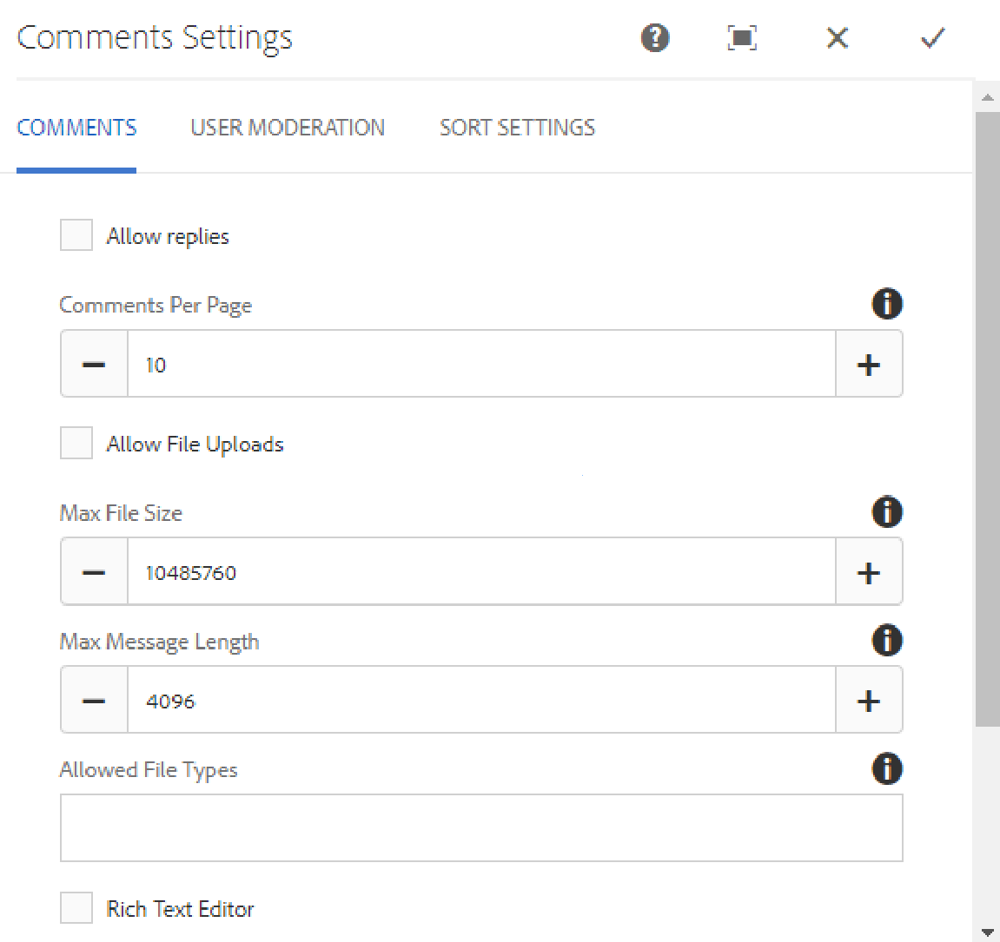

# Använda kommentarer {#using-comments}

## Introduktion {#introduction}

Kommentarsfunktionen används för att låta besökare (medlemmar) på den inloggade webbplatsen dela med sig av sina åsikter och kunskaper om innehållet på webbplatsen. Den här funktionen finns ofta redan i andra funktioner, men kan läggas till på alla webbplatser.

Dokumentet beskriver:

* Lägger till `Comments` på en sida.
* Konfigurationsinställningar för komponenten `Comments`.

>[!NOTE]
>
>Anonym publicering av en kommentar stöds inte. Besökarna måste registrera sig (bli medlem) och logga in för att kunna delta.

### Lägga till kommentarer på en sida {#adding-comments-to-a-page}

Om du vill lägga till en `Comments`-komponent på en sida i redigeringsläge använder du komponentwebbläsaren för att hitta

* `Communities / Comments`

och dra den till rätt plats på en sida, t.ex. en position i förhållande till funktionen som användarna kan kommentera på, eller helt enkelt längst ned på sidan.

Mer information finns på [Grunderna för communitykomponenter](/help/communities/basics.md).

När de [nödvändiga klientbiblioteken](/help/communities/essentials-comments.md#essentials-for-client-side) inkluderas visas `Comments`-komponenten på det här sättet.

>[!NOTE]
>
>Det får bara finnas en `Comments`-komponent på en sida. Observera att flera communityfunktioner redan innehåller kommentarer, t.ex. en blogg, kalender, forum, QnA och recensioner.

### Konfigurera kommentarer {#configuring-comments}

Markera den monterade `Comments`-komponenten som du vill komma åt och välj ikonen `Configure` som öppnar redigeringsdialogrutan.

#### Fliken Kommentarer {#comments-tab}

Under fliken **Kommentarer** anger du hur besökare ska ange kommentarer.

* **Tillåt svar**

  Om det här alternativet är markerat kan medlemmarna svara på befintliga kommentarer. Standard är avmarkerat.

* **Kommentarer per sida**

  Begränsar antalet kommentarer som visas per sida och antalet svar som visas. Standardvärdet är 10.

* **Tillåt filöverföringar**

  Om du markerar det här alternativet visas textrutan för alternativet att överföra en fil. Standard är avmarkerat.

* **Maximal filstorlek**

  Endast relevant om Tillåt filöverföringar är markerat. Det här värdet begränsar storleken på den överförda filen. Standardgränsen är 10 MB.

* **Maximal meddelandelängd**

  Maximalt antal tecken som kan anges i textrutan. Standardvärdet är 4 096 tecken.

* **Tillåtna filtyper**

  Endast relevant om Tillåt filöverföringar är markerat. En kommaavgränsad lista med filnamnstillägg med punktavgränsaren. Exempel: .jpg, .jpeg, .png, .doc, .docx, .pdf. Om någon filtyp anges tillåts inte de som inte anges. Ingen standard har angetts så att alla filtyper tillåts.

* **RTF-redigerare**

  Om det här alternativet är markerat infogas kommentarerna med kod. Standard är avmarkerat.

* **Tillåt röstning**

  Om det här alternativet är markerat visas textrutan med alternativet att rösta upp eller ned. Standard är avmarkerat.

* **Tillåt följande**

  Om det här alternativet är markerat kan medlemmarna följa kommentarerna. Standard är avmarkerat.

* **Visa emblem**

  Om du markerar det här alternativet tillåts visning av färdiga och tilldelade märken. Standard är avmarkerat.

#### Fliken Användarmoderering {#user-moderation-tab}

Under fliken **Användarmoderering** anger du hur de publicerade kommentarerna ska hanteras. Mer information finns i [Moderating User Generated Content](/help/communities/moderate-ugc.md).

* **Före-moderering**

  Om det här alternativet är markerat måste kommentarerna godkännas innan de visas på en publiceringsplats. Standard är avmarkerat.

* **Ta bort kommentarer**

  Om det här alternativet är markerat kan den medlem som publicerade kommentaren ta bort den. Standard är avmarkerat.

* **Neka kommentarer**

  Om det här alternativet är markerat tillåter du moderatorerna att neka kommentarer. Standard är avmarkerat.

* **Stäng/öppna kommentarer igen**

  Om det här alternativet är markerat kan moderatorerna stänga och öppna kommentarerna igen. Standard är avmarkerat.

* **Flagga kommentarer**

  Om det här alternativet är markerat kan medlemmarna flagga kommentarer som olämpliga. Standard är avmarkerat.

* **Flaggorsakslista**

  Om det här alternativet är markerat kan medlemmarna i en nedrullningsbar lista välja orsaken till att en kommentar flaggas som olämplig. Standard är avmarkerat.

* **Anledning till anpassad flagga**

  Om det här alternativet är markerat kan medlemmarna ange en egen orsak till att en kommentar flaggas som olämplig. Standard är avmarkerat.

* **Modereringströskel**

  Ange hur många gånger en kommentar måste flaggas av medlemmarna innan moderatorerna meddelas. Standard är en gång (1).

* **Flaggningsgräns**

  Ange hur många gånger en kommentar måste flaggas innan den döljs för den offentliga vyn. Talet måste vara större än eller lika med **modereringströskeln**. Standardvärdet är 5.

#### Fliken Sorteringsinställningar {#sort-settings-tab}

Under fliken **Sorteringsinställningar** anger du hur de bokförda kommentarerna ska sorteras när de visas.

* **Sorteringsfält**

  Dra ned för att välja en av `Newest, Oldest, Last Updated, Most Viewed, Most Active, Most Followed` eller `Most Liked`.

* **Sorteringsordning**

  Dra ned för att välja en av `Ascending` eller `Descending`.

### Ändra till en anpassad kommentarstyp {#changing-to-a-custom-comment-type}

Genom att ändra kommentarsresurstypen genererar inte längre kommentarsystemet en instans av en kommentar med standardinställningen, utan en som har anpassats (utökats) av utvecklarna.

När de anpassade resurstyperna är kända anger du [designläge](/help/sites-authoring/default-components-designmode.md) och dubbelklickar på den monterade `Comments` -komponenten för att öppna en dialogruta med en extra flik.

Under fliken **Resurstyper** anger du anpassad resourceType för nya instanser av komponenterna `Comments or Voting`:

* **Resurstyp för kommentarer**

  Navigera till resourceType för en utökad `comment`-komponent (en kommentar) i /apps. Exempel: `/apps/social/commons/components/hbs/comments/comment`

  Den här resursen identifierar den resourceType för den UGC som skapas när en besökare publicerar en kommentar.

* **Resurstyp för röstning**

  Navigera till resourceType för en utökad `voting`-komponent i /apps. Exempel: `/apps/social/components/hbs/voting`

  Den här resursen identifierar resurstypen för användargenererat innehåll som skapas när en besökare publicerar en röst.

* **Resurstyp för kommentarsystem**

  Navigera till resourceType för en utökad `comments`-komponent (kommentarsystemet) i /apps. Lämna tomt om inte sidmallen [dynamiskt inkluderar](/help/communities/scf.md#add-or-include-a-communities-component) kommentarsystemet i det underliggande skriptet, i stället för att läggas till på sidan som en resurs (kommentarsnod). Läs mer om [`{{include}}`-hjälpen](/help/communities/handlebars-helpers.md#include).

### Site Visitor Experience {#site-visitor-experience}

#### Styrelsemedlemmar och administratörer {#moderators-and-administrators}

När den inloggade användaren har moderator- eller administratörsbehörighet kan de utföra de modereringsåtgärder som tillåts av komponentens konfiguration, oavsett vem som skapade kommentaren.

#### Medlemmar {#members}

När besökaren är inloggad, beroende på konfigurationen, kan de

* Post - en ny kommentar
* Redigera en egen kommentar
* Ta bort en egen kommentar
* Flagga andras kommentarer

#### Anonym {#anonymous}

Besökare som inte är inloggade kan endast läsa publicerade kommentarer, översätta dem om de stöds, men kan inte lägga till en kommentar eller flagga andras kommentarer.

### Ytterligare information {#additional-information}

Mer information finns på sidan [Comments Essentials](/help/communities/essentials-comments.md) för utvecklare.

Mer information om moderering av publicerade kommentarer finns i [Moderating User Generated Content](/help/communities/moderate-ugc.md) (Moderating User Generated Content).

Mer information om översättning av bokförda kommentarer finns i [Översätta användargenererat innehåll](/help/communities/translate-ugc.md).
