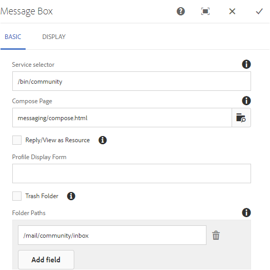
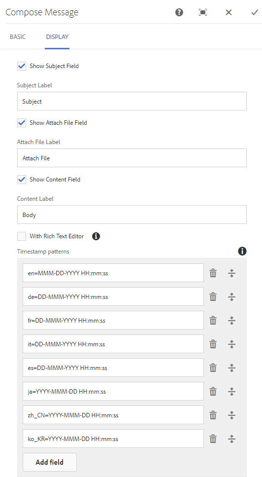

# Meddelandefunktion{#messaging-feature}

Förutom de synliga interaktionerna som förekommer i forum och kommentarer, gör meddelandefunktionen i** **AEM Communities det möjligt för communitymedlemmar att interagera med varandra mer privat.

Den här funktionen kan inkluderas när en [communitywebbplats](/help/communities/overview.md#communitiessites) skapas.

Med meddelandefunktionen kan du:

**A** - skicka ett meddelande till en eller flera communitymedlemmar **B** - skicka direktmeddelanden i [grupp till communitymedlemsgrupper](/help/communities/messaging.md#group-messaging)**C** - skicka ett meddelande med bilagor **D** - vidarebefordra ett meddelande**E - **svara på ett meddelande **** F¥ - ta bort ett meddelande**G **- återställ ett borttaget meddelande

 

Information om hur du aktiverar och ändrar meddelandefunktionen finns i:

* [Konfigurera meddelanden](/help/communities/messaging.md) för administratörer
* [Meddelandefunktioner](/help/communities/essentials-messaging.md) för utvecklare

>[!NOTE]
>
>Det går inte att lägga till `Compose Message, Message, or Message List` komponenter (finns i `Communities`komponentgruppen) på en sida i redigeringsläge för författare.

## Konfigurera meddelandekomponenter {#configure-messaging-components}

När meddelanden har aktiverats för en community-webbplats konfigureras den utan någon ytterligare konfiguration. Informationen tillhandahålls om det finns behov av att ändra standardkonfigurationen.

### Konfigurera meddelandelista (meddelanderuta) {#configure-message-list-message-box}

Om du vill ändra konfigurationen för listan med meddelanden för **Inkorgen**, **Skickat** och **Papperskorgen **sidor för meddelandefunktionen öppnar du webbplatsen i [redigeringsläge](/help/communities/sites-console.md#authoring-site-content).

1. I `Preview`läget väljer du länken **Messages **för att öppna huvudmeddelandesidan. Välj sedan antingen **Inkorg**, **Skickat **eller **Papperskorgen **för att konfigurera komponenten för den meddelandelistan.

1. Markera komponenten på sidan i `Edit` läget.
1. Om du vill öppna konfigurationsdialogrutan avbryter du arv genom att markera `link`ikonen.
När arvet har avbrutits går det att välja konfigurationsikonen för att öppna konfigurationsdialogrutan.

1. När konfigurationen är klar är det nödvändigt att återställa arvet genom att markera `broken link` -ikonen.

#### Fliken Grundläggande {#basic-tab}

* **Tjänstväljaren**(*obligatoriskt*) Ange värdet för egenskapen**`serviceSelector.name`** från [AEM Communities Messaging Operations Service](/help/communities/messaging.md#messaging-operations-service).

* **Disponera sida**(*obligatoriskt*) Den sida som ska öppnas när en medlem klickar på knappen **`Reply`**. Målsidan ska innehålla **formuläret Dispositionsmeddelande** .

* **Svara/Visa som resurs** Om det här alternativet är markerat refererar URL:en för svar och vy till en resurs. Annars skickas data som frågeparametrar i URL:en.

* **Profilvisningsformulär** Profilformuläret som ska användas för att visa avsändarprofilen.

* **Om alternativet är markerat visas endast meddelanden som har flaggats som borttagna (papperskorg) i den här meddelandelistekomponenten**.

* **Mappsökvägar**(*obligatoriskt*) som refererar till de värden som angetts för **inbox.path.name** och **sentitems.path.name **i [AEM Communities Messaging Operations Service](/help/communities/messaging.md#messaging-operations-service). När du konfigurerar för en `Inbox`post lägger du till en post med värdet för **inbox.path.name**. När du konfigurerar för en `Outbox`post lägger du till en post med värdet för **sentitems.path.name**. När du konfigurerar för `Trash`lägger du till två poster med båda värdena.

#### Fliken Visa {#display-tab}

* **Markera Läs-knapp** Om det här alternativet är markerat visas en `Read`knapp som gör att ett meddelande kan markeras som läst.

* **Markera oläst knapp** Om det här alternativet är markerat visas en `Mark Unread` knapp som gör att ett meddelande kan markeras som läst.

* **Om alternativet Ta bort knapp**&#x200B;är markerat visas en `Delete`knapp där ett meddelande kan markeras som läst. Duplicerar borttagningsfunktionen om **`Message Options`** även den är markerad.

* **Meddelandealternativ** Om det här alternativet är markerat visas **`Reply`**, **`Reply All`**, **`Forward`**och **`Delete`**knappar som gör att ett meddelande kan skickas igen eller tas bort. Duplicerar borttagningsfunktionen om **`Delete Button`** även den är markerad.

* **Meddelanden per sida** Det angivna antalet är det maximala antalet meddelanden som visas per sida i ett sidnumreringsschema. Om inget tal anges (vänster tomt) visas alla meddelanden och ingen sidnumrering visas.

* **Tidsstämpelmönster** Tillhandahåller tidsstämpelmönster för ett eller flera språk. Standard är för en, de, fr, it, es, ja, zh_CN, ko_KR.

* **Visa användare** Välj antingen **`Sender`**eller **`Recipients`**för att avgöra om avsändaren eller mottagarna ska visas.

### Konfigurera dispositionsmeddelande {#configure-compose-message}

Om du vill ändra konfigurationen för den sammansatta meddelandesidan öppnar du webbplatsen i [redigeringsläge](/help/communities/sites-console.md#authoring-site-content).

* I `Preview`läget väljer du länken **Messages **för att öppna huvudmeddelandesidan. Klicka sedan på knappen Nytt meddelande för att öppna `Compose Message` sidan.

* I `Edit` läget markerar du huvudkomponenten på sidan som innehåller meddelandetexten.
* Om du vill öppna konfigurationsdialogrutan avbryter du arv genom att markera `link`ikonen.
När arvet har avbrutits går det att välja konfigurationsikonen för att öppna konfigurationsdialogrutan.

* När konfigurationen är klar måste du återställa arvet genom att välja `broken link`ikonen.

#### Fliken Grundläggande {#basic-tab-1}

* **Omdirigerings-URL** Ange URL-adressen till sidan som visas när meddelandet har skickats. Exempel, `../messaging.html`.

* **Avbryt URL** Ange URL-adressen till sidan som visas om avsändaren avbryter meddelandet. Exempel, `../messaging.html`.

* **Maximal längd för meddelandemotiv** Det maximala antalet tecken som tillåts i ämnesfältet. Till exempel 500. Standard är ingen gräns.

* **Maximal längd på meddelandetext** Det maximala antalet tecken som tillåts i fältet Innehåll. Exempel: 10000. Standard är ingen gräns.

* **Tjänstväljaren**(*obligatoriskt*) Ange värdet för egenskapen**`serviceSelector.name`** från [AEM Communities Messaging Operations Service](/help/communities/messaging.md#messaging-operations-service).

#### Fliken Visa {#display-tab-1}

* **Visa ämnesfält** Om det här alternativet är markerat visar du `Subject` fältet och aktiverar möjligheten att lägga till ett ämne i meddelandet. Standard är inte markerat.

* **Ämnesetikett** Ange texten som ska visas bredvid `Subject` fältet. Standardvärdet är `Subject`.

* **Visa Bifoga filfält** Om det är markerat, visa `Attachment` fältet och aktivera tillägg av bifogade filer i meddelandet. Standard är inte markerat.

* **Bifoga filetikett** Ange den text som ska visas bredvid `Attachment` fältet. Standardvärdet är **`Attach File`**.

* **Visa innehållsfält** Om det är markerat visar du `Content` fältet och aktiverar tillägg av meddelandetext. Standard är inte markerat.

* **Innehållsetikett** Ange den text som ska visas bredvid `Content` fältet. Standardvärdet är **`Body`**.

* **Om alternativet är markerat med RTF-redigeraren** visar det att en anpassad textruta med formaterad text används. Standard är inte markerat.

* **Tidsstämpelmönster** Tillhandahåller tidsstämpelmönster för ett eller flera språk. Standard är för en, de, fr, it, es, ja, zh_CN, ko_KR.

