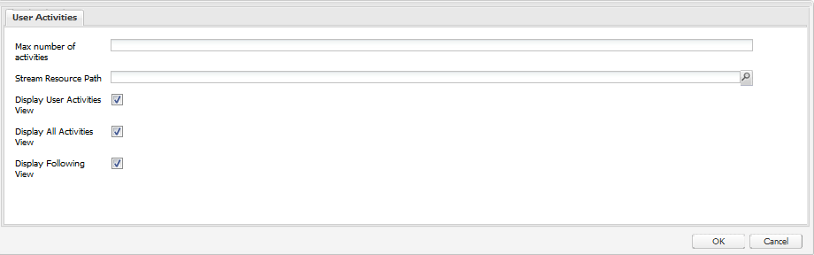

# Grundläggande om poäng och emblem{#scoring-and-badges-essentials}

Funktionen AEM Communities-poäng och -badges gör det möjligt att identifiera och belöna communitymedlemmar.

Information om hur du konfigurerar funktionen finns i

* [Communities Scoring and Badges](/help/communities/implementing-scoring.md)

Den här sidan innehåller ytterligare teknisk information:

* hur du [visar ett märke](#displaying-badges) som bild eller text
* aktivera omfattande [felsökningsloggning](#debug-log-for-scoring-and-badging)
* hur du [får åtkomst till UGC](#ugc-for-scoring-and-badging) för bedömning och märkning

>[!CAUTION]
>
>Implementeringsstrukturen som visas i CRXDE Lite kan komma att ändras.

## Visar emblem {#displaying-badges}

Om ett märke visas som text eller bild styrs på klientsidan i HBS-mallen.

Sök till exempel efter `this.isAssigned` i `/libs/social/forum/components/hbs/topic/list-item.hbs`, :

```
{{#each author.badges}}

  {{#if this.isAssigned}}

    <div class="scf-badge-text">

      {{this.title}}

    </div>

  {{/if}}

{{/each}}

{{#each author.badges}}

  {{#unless this.isAssigned}}

    

  {{/unless}}

{{/each}}
```

Om värdet är true anger isAssigned att märket har tilldelats en roll och att märket ska visas som text.

Om värdet är false anges märket Tilldelad att märket tilldelats för ett upparbetat resultat och att märket ska visas som en bild.

Alla ändringar av detta beteende bör göras i ett anpassat skript (antingen åsidosätt eller övertäckning). Se Anpassa [på klientsidan](/help/communities/client-customize.md).

## Felsökningslogg för poängsättning och märkning {#debug-log-for-scoring-and-badging}

En anpassad loggfil kan konfigureras för felsökning av poängsättning och badging. Innehållet i loggfilen kan sedan tillhandahållas kundsupporten om problem uppstår med funktionen.

Detaljerade anvisningar finns i [Skapa en anpassad loggfil](/help/sites-deploying/monitoring-and-maintaining.md#create-a-custom-log-file).

Så här konfigurerar du snabbt en slinglog-fil:

1. få tillgång till loggsupport **för** Adobe Experience Manager Web Console, till exempel

   * https://localhost:4502/system/console/slinglog

1. välj **Lägg till ny loggare**

   1. välj `DEBUG`för **loggnivå**

   1. ange ett namn för **loggfilen**, till exempel

      * logs/scoring-debug.log
   1. ange två **Logger **(class)-poster (med `+` ikon)

      * `com.adobe.cq.social.scoring`
      * `com.adobe.cq.social.badging`
   1. välj **Spara**


Visa loggposter

* från webbkonsolen

   * under menyn **Status **i
   * markera **loggfiler**
   * sök efter loggfilens namn, till exempel `scoring-debug`

* på serverns lokala disk

   * loggfilen finns på &lt;*server-install-dir*>/crx-quickstart/logs/&lt;*log-file-name*>.log

   * for example, `.../crx-quickstart/logs/scoring-debug.log`


## UGC för poängsättning och märkning {#ugc-for-scoring-and-badging}

Det går att visa användargenererat innehåll som är relaterat till poängsättning och märkning när den valda SRP är antingen JSRP eller MSRP, men inte ASRP. (Om du inte känner till dessa termer läser du Översikt över [Community Content Storage](/help/communities/working-with-srp.md) and [Storage Resource Provider](/help/communities/srp.md).)

Beskrivningarna för att komma åt betygs- och badging-data använder JSRP, eftersom UGC är lätt att komma åt med [CRXDE Lite](/help/sites-developing/developing-with-crxde-lite.md).

**JSRP on author** : när du experimenterar i redigeringsmiljön resulterar det i användargenererat innehåll som bara är synligt från författarmiljön.

**JSRP vid publicering** : På samma sätt måste du vid testning i publiceringsmiljön få tillgång till CRXDE Lite med administratörsbehörighet för en publiceringsinstans. Om publiceringsinstansen körs i [produktionsläge](/help/sites-administering/production-ready.md) (noSampleContent Runmode) måste du [aktivera CRXDE Lite](/help/sites-administering/enabling-crxde-lite.md).

UGC:s basplats på JSRP är `/content/usergenerated/asi/jcr/`.

### API:er för klassificering och märkning {#scoring-and-badging-apis}

Följande API:er kan användas:

* [com.adobe.cq.social.scoring.api](https://docs.adobe.com/content/docs/en/aem/6-3/develop/ref/javadoc/com/adobe/cq/social/scoring/api/package-summary.html)
* [com.adobe.cq.social.badging.api](https://docs.adobe.com/content/docs/en/aem/6-3/develop/ref/javadoc/com/adobe/cq/social/badging/api/package-summary.html)

De senaste Javadocs-filerna för det installerade funktionspaketet är tillgängliga för utvecklare från Adobe-databasen. Se [Använda Maven for Communities: Javadocs](/help/communities/maven.md#javadocs).

**Platsen och formatet för användargenererat innehåll i databasen kan ändras utan förvarning**.

### Exempelinställningar {#example-setup}

Skärmbilderna av databasdata kommer från att konfigurera poängsättning och märkning för ett forum på två olika AEM-webbplatser:

1. En AEM-webbplats *med* ett unikt ID (communitywebbplats skapad med guide):

* med hjälp av självstudiekursen Komma igång (engagera) som skapades under självstudiekursen [Komma igång](/help/communities/getting-started.md)
* hitta forumsidnoden

   * `/content/sites/engage/en/forum/jcr:content`

* lägga till egenskaper för poängsättning och märkning

       &quot;
 ScoringRules = [/etc/community/scoring/rules/comments-scoring,     
 /etc/community/scoring/rules/forums-scoring]     
 &quot;     
     
    
     
     
     ¥badgingRules =[/etc/community/badging/rules/comments-scoring,¥/etc/community/badging/rules/forums-scoring]String¥&quot;
   
* hitta forumkomponentnoden

   * `/content/sites/engage/en/forum/jcr:content/content/primary/forum`
( `sling:resourceType = social/forum/components/hbs/forum`)

* lägg till egenskap för att visa emblem

   * `allowBadges = true`

* en användare loggar in, skapar ett forumämne och tilldelas ett bronze-märke

1. En AEM-webbplats *utan* unikt ID:

* använda guiden [Community Components](/help/communities/components-guide.md)
* hitta forumsidnoden

   * `/content/community-components/en/forum/jcr:content`

* lägga till egenskaper för poängsättning och märkning

   ```
       scoringRules = [/etc/community/scoring/rules/comments-scoring,
        /etc/community/scoring/rules/forums-scoring]
       ```
   
       ```
       badgingRules =[/etc/community/badging/rules/comments-scoring,
        /etc/community/badging/rules/forums-scoring]
       ```
   
* hitta forumkomponentnoden

   * `/content/community-components/en/forum/jcr:content/content/forum`
( `sling:resourceType = social/forum/components/hbs/forum`)

* lägg till egenskap för att visa emblem

   * `allowBadges = true`

* en användare loggar in, skapar ett forumämne och tilldelas ett bronze-märke

1. en användare tilldelas ett moderatormärke med cURL:

```shell
curl -i -X POST -H "Accept:application/json" -u admin:admin -F ":operation=social:assignBadge" -F "badgeContentPath=/etc/community/badging/images/moderator/jcr:content/moderator.png" https://localhost:4503/home/users/community/w271OOup2Z4DjnOQrviv/profile.social.json
```

Eftersom en användare har fått två bronze-märken och tilldelats ett moderatormärke, är detta vad användaren visas med sitt foruminlägg:


>[!NOTE]
>
>Det här exemplet följer inte följande metodtips:
>
>* Poängregelnamnen ska vara globalt unika. de ska inte sluta med samma namn.
   >  Ett exempel på vad *inte ska göra:
   >  /etc/community/scoring/rules/site1/forums-scoring
   >  /etc/community/scoring/rules/site2/forums-scoring
   >
   >
* skapa unika märkesbilder för olika AEM-webbplatser
>


### UGC för åtkomstbedömning {#access-scoring-ugc}

Du bör använda [API:erna](#scoring-and-badging-apis) .

I undersökningssyfte, till exempel med JSRP, är baskamappen som innehåller poäng

* `/content/usergenerated/asi/jcr/scoring`

Den underordnade noden för `scoring`är resultatregelns namn. Det bästa sättet är alltså att betygsregelnamn på en server är globalt unika.

För Geometrixx Engage-webbplatsen finns användaren och poängen i en sökväg som är konstruerad med namnet på bedömningsregeln, communityplatsens webbplats-ID ( `engage-ba81p`), ett unikt ID och användarens ID:

* `.../scoring/forums-scoring/engage-ba81p/6d179715c0e93cb2b20886aa0434ca9b5a540401/riley`

För stödwebbplatsen för Community Components är användaren och poängen i en sökväg som konstruerats med resultatregelnamnet, ett standard-ID ( `default-site`), ett unikt ID och användarens ID:

* `.../scoring/forums-scoring/default-site/b27a17cb4910a9b69fe81fb1b492ba672d2c086e/riley`

Ljudspåret lagras i egenskapen `scoreValue_tl` som bara kan innehålla ett värde eller indirekt referera till en atomicCounter.


### Access Badging UGC {#access-badging-ugc}

Du bör använda [API:erna](#scoring-and-badging-apis) .

I undersökningssyfte, till exempel med JSRP, är baskappen som innehåller information om tilldelade eller tilldelade märken

* /content/usergenerated/asi/jcr

Följs av sökvägen till användarens profil och avslutas i en badges-mapp, till exempel

* /home/users/community/w271Oup2Z4DjnOQrviv/profile/badges

#### tilldelat märke {#awarded-badge}



#### tilldelat märke {#assigned-badge}


## Additional Information {#additional-information}

Så här visar du en sorterad lista med medlemmar baserat på punkter:

* [Ledarpanelsfunktion](/help/communities/functions.md#leaderboard-function) för att ingå i en communitywebbplats eller gruppmall.
* [Leaderboard-komponenten](/help/communities/enabling-leaderboard.md), den komponent som finns i Leaderboard-funktionen, för framtagning av sidor.

