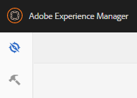

# Communities-konsoler {#communities-consoles}

AEM Communities-konsolerna, som finns i författarmiljön från den globala navigeringspanelen, ger åtkomst till administrativa uppgifter som:

* [Skapa en communitywebbplats](sites-console.md)
* Lägga till [grupper](groups.md) som är kapslade på platsen
* Hantera mallar för [communitywebbplatser](sites.md)
* Hantera [communitymedlemmar](members.md)
* [Moderating](moderate-ugc.md) user generated content (UGC)
* Skapa [egna märken](badges.md)
* Konfigurera [standardlagring för UGC](srp-config.md)

När [UGC-lagring](working-with-srp.md) är konfigurerad för att vara en gemensam butik som delas av skribent- och publiceringsmiljöer, fungerar [moderationskonsolen](moderation.md), som finns i både författar- och publiceringsmiljöer, på en enda instans av UGC.

När du har loggat in med administratörsbehörighet i redigeringsmiljön är konsolerna tillgängliga från navigerings- och verktygskonsolerna `Communities` .

>[!NOTE]
>
>I publiceringsmiljön visar en [communitywebbplats](sites-console.md) ett `Administration` menyalternativ när den inloggade medlemmen har lämplig behörighet.

## Global navigeringspanel {#global-navigation-panel}

Markera `Adobe Experience Manager` ikonen i det övre vänstra hörnet för att öppna den globala navigeringspanelen och få tillgång till två ikoner:

* [Navigeringskonsol](#navigation-console)
* [Verktygskonsol](tools.md)

## Navigeringskonsol {#navigation-console}

Om du vill komma åt de olika webbgruppskonsolerna väljer du **navigering, Webbgrupper**.

* [Sites](sites-console.md)

   Webbplatskonsolen är tillgänglig i författarmiljön för att skapa och hantera communitywebbplatser och dess [grupper](groups.md).

* [Moderering](moderation.md)

   Moderationskonsolen används för massmoderering av UGC och i författarmiljön. En liknande masmodereringskonsol är tillgänglig i publiceringsmiljön för communitymedlemmar som tilldelats rollen som [community-moderator](users.md#publishenvironmentusersandgroups) för en eller flera communitywebbplatser.

* [Medlemmar, grupper](members.md)

   Konsolerna Medlemmar och Grupper används för att hantera communitymedlemmar och medlemsgrupper som finns i publiceringsmiljön från författarmiljön.

* [Rapporter](reports.md)

   I rapportkonsolen kan rapporter om tilldelningar, sidvisningar och publicerat innehåll (UGC) genereras när en communitywebbplats har [aktiverat Adobe Analytics](sites-console.md#analytics). Konsolen är bara tillgänglig i författarmiljön.

* [Resurser](resources.md)

   Resurskonsolen är där [aktiveringshanterare](enablement.md#communitymanagers) skapar, hanterar och tilldelar resurser till medlemmar på en [aktiveringscommunitywebbplats](overview.md#enablement-community). Konsolen är bara tillgänglig i författarmiljön.

## Verktygskonsol {#tools-console}

Så här kommer du åt [webbgruppsverktyg](tools.md) (tidigare administrationskonsolen) från global navigering: **[!UICONTROL Verktyg > Communities]**
