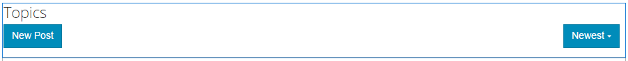

# Skapa en ny communitywebbplats{#author-a-new-community-site}

## Skapa en communitywebbplats {#create-a-community-site}

Använd författarinstansen för att skapa en community-webbplats. I AEM Author-instans:

1. Logga in med administratörsbehörighet.
1. Från global navigering går du till **Navigering, Communities, Sites.**

Konsolen Communities Sites innehåller en guide som hjälper dig att skapa en communityplats. Du kan gå vidare till `Next` steget eller `Back` till föregående steg innan du implementerar platsen i det sista steget.

Så här börjar du skapa en ny community-webbplats:

* Markera `Create`knappen.

### Steg 1: Webbplatsmall {#step-site-template}

I steget Webbplatsmall anger du en titel, en beskrivning, namnet på webbadressen och väljer en mall för en community-webbplats, till exempel:

* **Webbplatstitel** för communityn: `Getting Started Tutorial`
* **Beskrivning** av communityplats: `A site for engaging with the community.`
* **Rotadress** för communityplats: (lämna tomt för standardroten `/content/sites`)
* **Molnkonfigurationer**: (lämna tomt om ingen molnkonfiguration har angetts) ange sökvägen till de angivna molnkonfigurationerna.
* **Grundspråk** för communitywebbplats: (lämnas orört för ett enda språk: På engelska) använder du listrutan för att välja ett *eller flera* basspråk bland de tillgängliga språken - tyska, italienska, franska, japanska, spanska, portugisiska (Brasilien), kinesiska (traditionell) och kinesiska (förenklad). En communitywebbplats kommer att skapas för varje språk som läggs till och kommer att finnas i samma webbplatsmapp enligt bästa praxis som beskrivs i [Översätta innehåll för flerspråkiga webbplatser](/help/sites-administering/translation.md). Rotsidan för varje webbplats kommer att innehålla en underordnad sida med språkkoden för ett av de valda språken, till exempel &quot;en&quot; för engelska eller &quot;fr&quot; för franska.

* **Namn på** communitywebbplats: engagera

   * Dubbelkontrollera namnet eftersom det inte är lätt att ändra efter att webbplatsen har skapats
   * Den inledande URL:en visas under namnet på communitywebbplatsen
   * Ange en giltig URL genom att lägga till en baskod + &quot;.html&quot;
   * *Till exempel* https://localhost:4502/content/sites/ `engage/en.html`

* **Mall**: dra nedåt för att välja `Reference Site`

Markera **nästa**

### Steg 2: Design {#step-design}

Designsteget presenteras i två avsnitt där du kan välja tema och varumärkesbanderoll:

#### TEMA PÅ GEMENSKAPENS WEBBPLATS {#community-site-theme}

Välj det format som du vill använda på mallen. När du väljer det här alternativet kommer temat att överlappas av en bock.

#### GEMENSKAPENS WEBBPLATSHANTERING {#community-site-branding}

(Valfritt) Ladda upp en banderollbild som ska visas på webbplatsens sidor. Banderollen är fäst vid webbläsarens vänstra kant, mellan communitysidhuvudet och navigeringslänkarna. Banderollhöjden beskärs till 120 pixlar. Banderollens storlek ändras inte så att den passar webbläsarens bredd och höjden 120 pixlar.

 

Välj **Nästa**.

### Steg 3: Inställningar {#step-settings}

Observera, innan du väljer Inställningar, att det finns sju avsnitt som ger åtkomst till konfigurationer som användarhantering, taggning, moderering, grupphantering, analys, översättning och aktivering. `Next`

Gå till [självstudiekursen Komma igång med AEM Communities för att få](/help/communities/getting-started-enablement.md) hjälp med att aktivera funktioner.

#### Användarhantering {#user-management}

Markera alla kryssrutor för [användarhantering](/help/communities/sites-console.md#user-management)

* Tillåta besökare att registrera sig själva
* Så här kan besökare på webbplatsen visa den utan att logga in
* Så här tillåter du medlemmar att skicka och ta emot meddelanden från andra communitymedlemmar
* Tillåt inloggning på Facebook i stället för att registrera och skapa en profil
* Så här tillåter du inloggning med Twitter i stället för att registrera och skapa en profil

>[!NOTE]
>
>För en produktionsmiljö är det nödvändigt att skapa anpassade Facebook- och Twitter-program. Se [Social Login med Facebook och Twitter](/help/communities/social-login.md).

#### TAGGING {#tagging}

De taggar som kan användas för communityinnehåll kontrolleras genom att AEM-namnutrymmen som tidigare definierats via [taggningskonsolen](/help/sites-administering/tags.md#tagging-console) (till exempel namnutrymmet [Tutorial](/help/communities/setup.md#create-tutorial-tags)) väljs.

Det är enkelt att hitta namnutrymmen med typsnittssökning. Exempel:

* Typ `tut`
* Välj `Tutorial`

#### ROLLER {#roles}

[Gruppmedlemsroller](/help/communities/users.md) tilldelas via inställningarna i avsnittet Roller.

Om du vill att en community-medlem (eller grupp av medlemmar) ska kunna uppleva webbplatsen som community-hanterare använder du typsnittssökningen och väljer medlemmens eller gruppens namn bland alternativen i listrutan.

Exempel:

* Typ `q`
* Välj [Quinn Harper](/help/communities/enablement-setup.md#publishcreateenablementmembers)

>[!NOTE]
>
>[Tunneltjänsten](https://helpx.adobe.com/experience-manager/6-3/help/communities/deploy-communities.html#tunnel-service-on-author) tillåter endast urval av medlemmar och grupper som finns i publiceringsmiljön.

#### MODERATION {#moderation}

Acceptera de globala standardinställningarna för [moderering](/help/communities/sites-console.md#moderation) av användargenererat innehåll (UGC).

#### ANALYS {#analytics}

Om Adobe Analytics är licensierat och en molntjänst och ett ramverk i Analytics har konfigurerats går det att aktivera Analytics och välja ramverket.

Se [Analyskonfiguration för communityfunktioner](/help/communities/analytics.md).

#### ÖVERSÄTTNING {#translation}

I [översättningsinställningarna](/help/communities/sites-console.md#translation) anges grundspråket för webbplatsen samt om UGC kan översättas och till vilket språk.

* Kontrollera **Tillåt maskinöversättning**
* Låt standardspråken vara markerade för översättning av standardmaskinöversättningstjänsten
* Lämna standardöversättningsprovider och -konfiguration
* Ingen global butik behövs eftersom det inte finns några språkversioner
* Markera **Översätt hela sidan**
* Lämna standardalternativet för beständighet

#### AKTIVERING {#enablement}

Lämna tomt när du skapar en engagemangscommunity.

En liknande självstudiekurs för att snabbt skapa en [aktiveringscommunity](/help/communities/overview.md#enablement-community)finns i [Komma igång med AEM Communities för aktivering](/help/communities/getting-started-enablement.md).

Välj **Nästa**.

### Steg 4: Skapa webbgruppsplats {#step-create-communities-site}

Välj **Skapa.**

När processen är klar visas mappen för den nya platsen i konsolen Communities - Sites.

## Publicera communitywebbplatsen {#publish-the-community-site}

Den skapade webbplatsen bör hanteras från konsolen Communities - Sites, samma konsol som nya platser kan skapas från.

När du har valt att öppna gruppplatsens mapp för att öppna den håller du pekaren över platsikonen så att fyra åtgärdsikoner visas:

När du väljer den fjärde ellipsikonen (Fler åtgärder) visas alternativen Exportera plats och Ta bort plats.

Från vänster till höger är de:

* **Öppna webbplats**

   Välj pennikonen för att öppna communitywebbplatsen i redigeringsläge för författare, för att lägga till och/eller konfigurera sidkomponenter

* **Redigera webbplats**

   Välj egenskapsikonen för att öppna communitywebbplatsen för ändring av egenskaper, som titeln eller för att ändra temat

* **Publicera webbplats**

   Välj världsikonen om du vill publicera communitywebbplatsen (till exempel om publiceringsservern körs på den lokala datorn, och sedan till localhost:4503 som standard)

* **Exportera webbplats**

   Välj exportikonen om du vill skapa ett paket för communitywebbplatsen som både lagras i [pakethanteraren](/help/sites-administering/package-manager.md) och hämtas.
Observera att UGC inte ingår i platspaketet.

* **Ta bort plats**

   Välj ikonen Ta bort om du vill ta bort communitywebbplatsen från **[UIControl Communities > Sites console]**. Den här åtgärden tar bort alla objekt som är associerade med platsen, till exempel UGC, användargrupper, resurser och databasposter.

>[!NOTE]
>
>Om du inte använder standardporten 4503 för publiceringsinstansen redigerar du standardreplikeringsagenten och anger portnumret till rätt värde.
>
>På författarinstansen från huvudmenyn:
>
>1. Navigera till **[UIControl-verktyg > Åtgärder > Replikering]** -menyn.
>1. Välj **[UIControl-agenter för författaren]**.
>1. Välj **[UIControl-standardagent (publicera)]**.
>1. Bredvid **[UIControl-inställningar]** väljer du **[UIControl-redigering]**.
>1. I popup-dialogrutan för agentinställningar väljer du fliken **[UIControl-transport]** .
>1. I URI ändrar du portnumret 4503 till önskat portnummer >
   >    * Om du till exempel vill använda port 6103:
      >      https://localhost:6103/bin/receive?sling:authRequestLogin=1
>
1. Välj **[UIControl OK]**.
1. (Valfritt) Välj **[UIControl Clear]** eller **[UIControl Force Retry]** för att återställa replikeringskön.

### Välj Publicera {#select-publish}

När du har kontrollerat att publiceringsservern körs väljer du världsikonen för att publicera communitywebbplatsen.

När communitywebbplatsen har publicerats visas ett kort meddelande:

### Nya användargrupper {#new-community-user-groups}

Tillsammans med den nya communitywebbplatsen skapas nya användargrupper som har rätt behörigheter för olika administrativa funktioner. Mer information finns i [Användargrupper för communitysajter](/help/communities/users.md#usergroupsforcommunitysites).

Med tanke på webbplatsens namn&quot;engagera&quot; i steg 1 kan de fyra nya användargrupperna ses från [gruppkonsolen](/help/communities/members.md) (global navigering: Communities, Groups):

* Community Engage Community managers
* Administratörer för communityinteraktionsgrupper
* Medlemmar i communityengagemang
* Moderatorer för communityengagemang
* Privilegierade medlemmar för communityengagemang
* Content Manager för communitywebbplats

Observera att [Aaron McDonald](/help/communities/tutorials.md#demo-users) är medlem i

* Community Engage Community managers
* Moderatorer för communityengagemang
* Medlemmar i communityn (indirekt som medlem i gruppen Moderatorer)

#### https://localhost:4503/content/sites/engage/en.html {#http-localhost-content-sites-engage-en-html}

## Konfigurera för autentiseringsfel {#configure-for-authentication-error}

När en webbplats har konfigurerats och publicerats [konfigurerar du inloggningsmappningen](/help/communities/sites-console.md#configure-for-authentication-error) ( `Adobe Granite Login Selector Authentication Handler`) på publiceringsinstansen. Fördelen är att när inloggningsuppgifterna inte anges korrekt kommer autentiseringsfelet att visa inloggningssidan för communitywebbplatsen igen med ett felmeddelande.

Lägg till en `Login Page Mapping` som

* `/content/sites/engage/en/signin:/content/sites/engage/en`

## Valfria steg {#optional-steps}

### Ändra standardhemsidan {#change-the-default-home-page}

När du arbetar med publiceringswebbplatsen i demonstrationssyfte kan det vara praktiskt att ändra standardhemsidan till den nya webbplatsen.

För att göra det måste du använda [CRXDE](https://localhost:4503/crx/de) Lite för att redigera [resursmappningstabellen](/help/sites-deploying/resource-mapping.md) vid publicering.

Så här kommer du igång:

1. Logga in med administratörsbehörighet vid publicering.
1. Gå till [https://localhost:4503/crx/de](https://localhost:4503/crx/de).
1. Utöka i projektwebbläsaren `/etc/map.`
1. Markera `http` noden:

   * Välj **Skapa nod:**

      * **Namnge** localhost.4503(använd *inte* &#39;:&#39;)

      * **textsling** : [mappning](https://sling.apache.org/documentation/the-sling-engine/mappings-for-resource-resolution.html)

1. Med den nyskapade `localhost.4503` noden markerad:

   * Lägg till egenskap:

      * **Namnsling** :match
      * **Type** String
      * **Värde** localhost.4503/$(måste sluta med tecknet &#39;$&#39;)
   * Lägg till egenskap:

      * **Namnsling** :internalRedirect
      * **Type** String
      * **Värde** /content/sites/engage/en.html

1. Välj **Spara alla.**
1. (Valfritt) Ta bort webbläsarhistoriken.
1. Gå till https://localhost:4503/.

   * Ankomst till https://localhost:4503/content/sites/engage/en.html

>[!NOTE]
>
>Om du vill inaktivera det anger du bara ett prefix för egenskapsvärdet med ett &quot;x&quot; - `sling:match` - och `xlocalhost.4503/$` Spara alla ****.

#### Felsökning: Fel när kartan sparades {#troubleshooting-error-saving-map}

Om det inte går att spara ändringarna måste du se till att nodnamnet är `localhost.4503`, med en punktavgränsare och inte `localhost:4503` med en kolonavgränsare, vilket inte `localhost`är ett giltigt namnområdesprefix.

#### Felsökning: Det gick inte att omdirigera {#troubleshooting-fail-to-redirect}

&quot;**$**&quot; i slutet av `sling:match`strängen för det reguljära uttrycket är avgörande, så att bara exakt `https://localhost:4503/` mappas, annars läggs omdirigeringsvärdet till alla sökvägar som kan finnas efter server:port i URL:en. När AEM försöker dirigera om till inloggningssidan misslyckas den således.

### Ändra platsen {#modify-the-site}

När webbplatsen har skapats kan författare använda ikonen  Open Site för att utföra vanliga AEM-redigeringsaktiviteter.

Dessutom kan administratörer använda ikonen  Redigera plats för att ändra egenskaper för platsen, till exempel titeln.

Kom ihåg att **spara** och **publicera** webbplatsen igen efter eventuella ändringar.

>[!NOTE]
>
>Om du inte känner till AEM läser du dokumentationen om [grundläggande hantering](/help/sites-authoring/basic-handling.md) och en [snabbguide till redigeringssidorna](/help/sites-authoring/qg-page-authoring.md).

