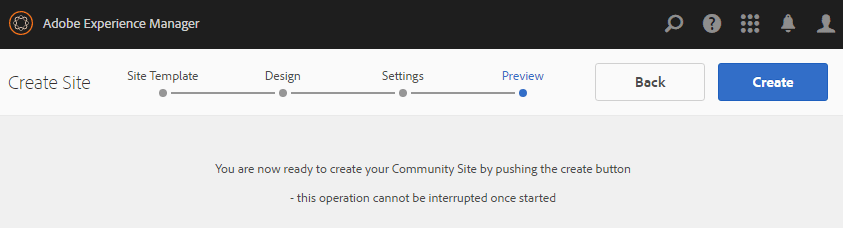

# Skapa en communitywebbplats{#author-a-new-community-site}

## Skapa en communitywebbplats {#create-a-community-site}

Använd författarinstansen för att skapa en community-webbplats. AEM författarinstans:

1. Logga in med administratörsbehörighet.
1. Gå till **[!UICONTROL Communities]** > **[!UICONTROL Sites]** från global navigering.

Konsolen Communities Sites innehåller en guide som hjälper dig att skapa en communityplats. Det går att gå framåt till `Next`-steget eller `Back` till föregående steg innan webbplatsen implementeras i det sista steget.

Så här börjar du skapa en community-webbplats:

* Välj knappen `Create`.

### Steg 1: Platsmall {#step-site-template}

I [steget Webbplatsmall](/help/communities/sites-console.md#step2013asitetemplate) anger du en titel, en beskrivning, namnet på webbadressen och väljer en mall för en community-webbplats, till exempel:

* **Webbplatstitel för community**: `Getting Started Tutorial`
* **Beskrivning av communityplats**: `A site for engaging with the community.`
* **Webbplatsrot för community**: (lämna tomt för standardroten `/content/sites`)
* **Molnkonfigurationer**: (lämna tomt om inga molnkonfigurationer anges) ange sökvägen till de angivna molnkonfigurationerna.
* **Bas för communitywebbplats**: (lämna orört för engelska) använd listrutan för att välja ett *eller flera* basspråk från de tillgängliga språken - tyska, italienska, franska, japanska, spanska, portugisiska (Brasilien), kinesiska (traditionell) och kinesiska (förenklad). En community-webbplats skapas för varje språk som läggs till och finns i samma webbplatsmapp enligt den bästa metoden som beskrivs i [Översätta innehåll för flerspråkiga platser](/help/sites-administering/translation.md). Rotsidan för varje webbplats innehåller en underordnad sida som namnges med språkkoden för ett av de valda språken, till exempel &quot;en&quot; för engelska eller &quot;fr&quot; för franska.

* **Namn på communitywebbplats**: engagera

   * Dubbelkontrollera namnet eftersom det inte är lätt att ändra efter att webbplatsen har skapats
   * Den inledande URL:en visas under namnet på communitywebbplatsen
   * Ange en giltig URL genom att lägga till en baskod + &quot;.html&quot;
   * *Till exempel*, https://localhost:4502/content/sites/ `engage/en.html`

* **Mall**: välj `Reference Site` i listrutan

* Välj **Nästa**.

### Steg 2: Design {#step-design}

Designsteget presenteras i två avsnitt där du kan välja tema och varumärkesbanderoll:

#### TEMA PÅ GEMENSKAPENS WEBBPLATS {#community-site-theme}

Välj det format du vill använda på mallen. När du väljer det här alternativet ersätts temat med en bock.

#### GEMENSKAPENS WEBBPLATSHANTERING {#community-site-branding}

(Valfritt) Ladda upp en banderollbild som ska visas på webbplatsens sidor. Banderollen är fäst vid webbläsarens vänstra kant, mellan communitysidhuvudet och navigeringslänkarna. Banderollhöjden beskärs till 120 pixlar. Banderollens storlek ändras inte så att den passar webbläsarens bredd och höjden 120 pixlar.

Välj **Nästa**.

### Steg 3: Inställningar {#step-settings}

I steget Inställningar, innan du väljer `Next`, finns det sju avsnitt som ger åtkomst till konfigurationer som användarhantering, taggning, moderering, grupphantering, analys och översättning.

#### Användarhantering {#user-management}

Markera alla kryssrutor för [användarhantering](/help/communities/sites-console.md#user-management)

* Tillåta besökare att registrera sig själva
* Så här kan besökare på webbplatsen visa den utan att logga in
* Så här tillåter du medlemmar att skicka och ta emot meddelanden från andra communitymedlemmar
* Tillåt inloggning med Facebook i stället för att registrera och skapa en profil
* Tillåt inloggning med Twitter i stället för att registrera och skapa en profil

>[!NOTE]
>
>I en produktionsmiljö måste du skapa anpassade Facebook- och Twitter-program. Se [Social inloggning med Facebook och Twitter](/help/communities/social-login.md).

#### TAGGNING {#tagging}

De taggar som används för communityinnehåll kontrolleras genom att AEM namnutrymmen som tidigare definierats via [taggningskonsolen](/help/sites-administering/tags.md#tagging-console) väljs (till exempel namnutrymmet [Tutorial](/help/communities/setup.md#create-tutorial-tags)).

Det är enkelt att hitta namnutrymmen med typsnittssökning. Exempel:

* Typ `tut`
* Välj `Tutorial`

#### ROLLER {#roles}

[Medlemsmedlemsroller](/help/communities/users.md) tilldelas via inställningarna i avsnittet Roller.

Om du vill att en community-medlem (eller grupp av medlemmar) ska kunna uppleva webbplatsen som community-hanterare använder du typsnittssökningen och väljer medlemmens eller gruppens namn bland alternativen i listrutan.

Exempel:

* Typ `q`
* Välj Quinn Harper

>[!NOTE]
>
>[Tunneltjänsten](https://helpx.adobe.com/experience-manager/6-3/help/communities/deploy-communities.html#tunnel-service-on-author) tillåter endast urval av medlemmar och grupper som finns i publiceringsmiljön.

#### MODERATION {#moderation}

Acceptera de globala standardinställningarna för [moderering](/help/communities/sites-console.md#moderation) användargenererat innehåll (UGC).

#### ANALYS {#analytics}

Om Adobe Analytics är licensierat och en Analytics Cloud-tjänst och ett-ramverk har konfigurerats går det att aktivera Analytics och välja ramverket.

Se [Analyskonfiguration för communityfunktioner](/help/communities/analytics.md).

#### ÖVERSÄTTNING {#translation}

[Översättningsinställningarna](/help/communities/sites-console.md#translation) anger basspråket för webbplatsen och om UGC kan översättas och till vilket språk, om så är fallet.

* Kontrollera **Tillåt maskinöversättning**
* Låt standardspråken vara markerade för översättning av standardmaskinöversättningstjänsten
* Lämna standardöversättningsprovider och -konfiguration
* Ingen global butik behövs eftersom det inte finns några språkversioner
* Markera **Översätt hela sidan**
* Lämna standardalternativet för beständighet

### Steg 4: Skapa webbgruppsplats {#step-create-communities-site}

Välj **Skapa.**

När processen är klar visas mappen för den nya platsen i konsolen Communities - Sites.

## Publish Community Site {#publish-the-community-site}

Den skapade webbplatsen bör hanteras från konsolen Communities - Sites, samma konsol som nya platser kan skapas från.

När du har valt att öppna gruppplatsens mapp för att öppna den håller du pekaren över platsikonen så att fyra åtgärdsikoner visas:

När du väljer den fjärde ellipsikonen (Fler åtgärder) visas alternativen Exportera plats och Ta bort plats.

Från vänster till höger är de:

* **Öppna webbplats**

  När du väljer pennikonen öppnas communitywebbplatsen i redigeringsläget Författare, där du kan lägga till eller konfigurera sidkomponenter.

* **Redigera plats**

  Om du väljer egenskapsikonen öppnas communitywebbplatsen för ändring av egenskaper, till exempel titeln, eller för att ändra temat.

* **Publish Site**

  Om du väljer en världsikon publiceras communityplatsen (om publiceringsservern till exempel körs på den lokala datorn, så skickas den till localhost:4503 som standard).

* **Exportera plats**

  Om du väljer exportikonen skapas ett paket med communitywebbplatsen som både lagras i [Package Manager](/help/sites-administering/package-manager.md) och hämtas. UGC ingår inte i webbplatspaketet.

* **Ta bort plats**

  Om du väljer ikonen Ta bort tas communitywebbplatsen bort från **[!UICONTROL Communities > Sites console]**. Den här åtgärden tar bort alla objekt som är associerade med platsen, till exempel UGC, användargrupper, resurser och databasposter.

>[!NOTE]
>
>Om du inte använder standardporten 4503 för publiceringsinstansen redigerar du standardreplikeringsagenten och anger portnumret till rätt värde.
>
>På författarinstansen från huvudmenyn:
>
>1. Navigera till menyn **[!UICONTROL Tools]** > **[!UICONTROL Operations]** > **[!UICONTROL Replication]**.
>1. Välj **[!UICONTROL Agents on author]**.
>1. Välj **[!UICONTROL Default Agent (publish)]**.
>1. Välj **[!UICONTROL Edit]** bredvid **[!UICONTROL Settings]**.
>1. Välj fliken **[!UICONTROL Transport]** i popup-dialogrutan för agentinställningar.
>1. I URI ändrar du portnumret 4503 till önskat portnummer. Om du till exempel vill använda port 6103: https://localhost:6103/bin/receive?sling:authRequestLogin=1
>1. Välj **[!UICONTROL OK]**.
>1. (Valfritt) Välj **[!UICONTROL Clear]** eller **[!UICONTROL Force Retry]** om du vill återställa replikeringskön.

### Välj Publish {#select-publish}

När du har kontrollerat att publiceringsservern körs väljer du världsikonen för att publicera communitywebbplatsen.

När communitywebbplatsen har publicerats visas ett kort meddelande med texten&quot;Publicerad webbplats&quot;.

### Nya användargrupper {#new-community-user-groups}

Tillsammans med den nya communitywebbplatsen skapas nya användargrupper som har rätt behörigheter för olika administrativa funktioner. Mer information finns i [Användargrupper för communityplatser](/help/communities/users.md#usergroupsforcommunitysites).

Med tanke på webbplatsens namn&quot;engagera&quot; i steg 1 kan de fyra nya användargrupperna visas i [gruppkonsolen](/help/communities/members.md) (global navigering: Communities, Groups) för den nya communityn:

* Community Engagement Community Managers
* Administratörer för communitygrupper
* Medlemmar i communityengagemang
* Moderatorer för communityengagemang
* Privilegierade medlemmar för communityengagemang
* Content Manager för communitywebbplats

[Aaron McDonald](/help/communities/tutorials.md#demo-users) är medlem i

* Community Engagement Community Managers
* Moderatorer för communityengagemang
* Medlemmar i communityn (indirekt som medlem i gruppen Moderatorer)

#### https://localhost:4503/content/sites/engage/en.html {#http-localhost-content-sites-engage-en-html}

## Konfigurera för autentiseringsfel {#configure-for-authentication-error}

När en webbplats har konfigurerats och publicerats för publicering [konfigurerar du inloggningsmappning](/help/communities/sites-console.md#configure-for-authentication-error) ( `Adobe Granite Login Selector Authentication Handler`) för publiceringsinstansen. Fördelen är att när inloggningsuppgifterna inte anges korrekt visas inloggningssidan för communitywebbplatsen igen med ett felmeddelande.

Lägg till en `Login Page Mapping` som

* `/content/sites/engage/en/signin:/content/sites/engage/en`

## Valfria steg {#optional-steps}

### Ändra standardhemsidan {#change-the-default-home-page}

När du arbetar med publiceringswebbplatsen i demonstrationssyfte kan det vara praktiskt att ändra standardhemsidan till den nya webbplatsen.

Om du vill göra det måste du använda [CRXDE](https://localhost:4503/crx/de) Lite för att redigera tabellen [resource-mapping](/help/sites-deploying/resource-mapping.md) vid publicering.

Så här kommer du igång:

1. Logga in med administratörsbehörighet vid publicering.
1. Gå till [https://localhost:4503/crx/de](https://localhost:4503/crx/de).
1. Expandera `/etc/map.` i projektwebbläsaren
1. Markera noden `http`:

   * Välj **Skapa nod:**

      * **Namn** localhost.4503
(använd *inte* &#39;:&#39;)

      * **Type** [sling:Mapping](https://sling.apache.org/documentation/the-sling-engine/mappings-for-resource-resolution.html)

1. Med den nyskapade noden `localhost.4503` markerad:

   * Lägg till egenskap:

   * **Namn**, snedstreck:matchning
      * **Type**-sträng
      * **Värde** localhost.4503/$
(måste sluta med tecknet &#39;$&#39;)

   * Lägg till egenskap:

      * **Namn** sling:internalRedirect
      * **Type**-sträng
      * **Värde** /content/sites/engage/en.html

1. Välj **Spara alla.**
1. (Valfritt) Ta bort webbläsarhistoriken.
1. Gå till https://localhost:4503/.

   * Ankomst till https://localhost:4503/content/sites/engage/en.html

>[!NOTE]
>
>Om du vill inaktivera funktionen anger du bara ett prefix för egenskapsvärdet `sling:match` med ett x - `xlocalhost.4503/$` - och **Spara alla**.

#### Felsökning: Fel när kartan sparades {#troubleshooting-error-saving-map}

Om det inte går att spara ändringarna måste du kontrollera att nodnamnet är `localhost.4503`, med en punktavgränsare och inte `localhost:4503` med en kolonavgränsare, eftersom `localhost` inte är ett giltigt namnområdesprefix.

#### Felsökning: Det gick inte att omdirigera {#troubleshooting-fail-to-redirect}

**$** i slutet av strängen för det reguljära uttrycket `sling:match` är avgörande, så att bara `https://localhost:4503/` mappas, annars prefixeras omdirigeringsvärdet till alla sökvägar som kan finnas efter server:port i URL:en. När AEM försöker dirigera om till inloggningssidan misslyckas den därför.

### Ändra platsen {#modify-the-site}

När webbplatsen har skapats kan författare använda ikonen [Öppna plats](/help/communities/sites-console.md#authoring-site-content) för att utföra AEM.

Dessutom kan administratörer använda ikonen [Redigera plats](/help/communities/sites-console.md#modifying-site-properties) för att ändra egenskaper för platsen, till exempel titeln.

När du har ändrat något bör du komma ihåg att **spara** och **Publish** om webbplatsen.

>[!NOTE]
>
>Om du inte känner till AEM kan du läsa dokumentationen om [grundläggande hantering](/help/sites-authoring/basic-handling.md) och en [snabbguide till redigeringssidor](/help/sites-authoring/qg-page-authoring.md).
