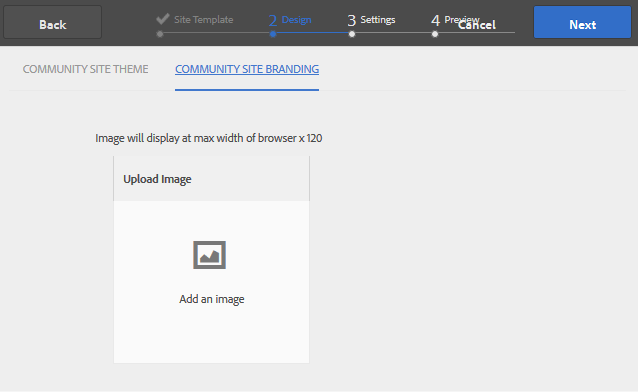

# Skapa en communitywebbplats{#author-a-new-community-site}

## Skapa en communitywebbplats {#create-a-community-site}

Använd författarinstansen för att skapa en community-webbplats. AEM författarinstans:

1. Logga in med administratörsbehörighet.
1. Från global navigering, gå till **[!UICONTROL Communities]** > **[!UICONTROL Sites]**.

Konsolen Communities Sites innehåller en guide som hjälper dig att skapa en communityplats. Det går att gå vidare till `Next` steg eller `Back` till föregående steg innan webbplatsen implementeras i det sista steget.

Så här börjar du skapa en community-webbplats:

* Välj `Create` -knappen.

### Steg 1: Platsmall {#step-site-template}

På [Steg för webbplatsmall](/help/communities/sites-console.md#step2013asitetemplate), ange en titel, beskrivning, namnet på URL:en och välj en mall för en community-webbplats, till exempel:

* **Rubrik för communitywebbplats**: `Getting Started Tutorial`
* **Beskrivning av communityplats**: `A site for engaging with the community.`
* **Community-platsrot**: (lämna tomt för standardroten `/content/sites`)
* **Molnkonfigurationer**: (lämna tomt om ingen molnkonfiguration har angetts) ange sökvägen till de angivna molnkonfigurationerna.
* **Bas-språk för communitywebbplats**: (lämna orört för engelska) använd listrutan för att välja ett språk *eller mer* basspråk från tillgängliga språk - tyska, italienska, franska, japanska, spanska, portugisiska (Brasilien), kinesiska (traditionell) och kinesiska (förenklad). En communitywebbplats skapas för varje språk som läggs till och finns i samma webbplatsmapp enligt de rutiner som beskrivs i [Översätta innehåll för flerspråkiga webbplatser](/help/sites-administering/translation.md). Rotsidan för varje webbplats innehåller en underordnad sida som namnges med språkkoden för ett av de valda språken, till exempel &quot;en&quot; för engelska eller &quot;fr&quot; för franska.

* **Namn på communitywebbplats**: engage

   * Dubbelkontrollera namnet eftersom det inte är lätt att ändra efter att webbplatsen har skapats
   * Den inledande URL:en visas under namnet på communitywebbplatsen
   * Ange en giltig URL genom att lägga till en baskod + &quot;.html&quot;
   * *Till exempel*, https://localhost:4502/content/sites/ `engage/en.html`

* **Mall**: nedrullningsbar meny för att välja `Reference Site`

* Välj **Nästa**.

### Steg 2: Design {#step-design}

Designsteget presenteras i två avsnitt där du kan välja tema och varumärkesbanderoll:

#### TEMA PÅ GEMENSKAPENS WEBBPLATS {#community-site-theme}

Välj det format du vill använda på mallen. När du väljer det här alternativet ersätts temat med en bock.

#### GEMENSKAPENS WEBBPLATSHANTERING {#community-site-branding}

(Valfritt) Ladda upp en banderollbild som ska visas på webbplatsens sidor. Banderollen är fäst vid webbläsarens vänstra kant, mellan communitysidhuvudet och navigeringslänkarna. Banderollhöjden beskärs till 120 pixlar. Banderollens storlek ändras inte så att den passar webbläsarens bredd och höjden 120 pixlar.

Välj **Nästa**.

### Steg 3: Inställningar {#step-settings}

I steget Inställningar, innan du väljer `Next`, finns det sju avsnitt som ger åtkomst till konfigurationer som användarhantering, taggning, moderering, grupphantering, analys och översättning.

#### Användarhantering {#user-management}

Markera alla kryssrutor för [Användarhantering](/help/communities/sites-console.md#user-management)

* Tillåta besökare att registrera sig själva
* Så här kan besökare på webbplatsen visa den utan att logga in
* Så här tillåter du medlemmar att skicka och ta emot meddelanden från andra communitymedlemmar
* Tillåt inloggning med Facebook i stället för att registrera och skapa en profil
* Tillåt inloggning med Twitter i stället för att registrera och skapa en profil

>[!NOTE]
>
>I en produktionsmiljö måste du skapa anpassade Facebook- och Twitter-program. Se [Social inloggning med Facebook och Twitter](/help/communities/social-login.md).

#### TAGGNING {#tagging}

De taggar som används i communityinnehåll kontrolleras genom att AEM namnutrymmen som tidigare definierats i [Taggningskonsolen](/help/sites-administering/tags.md#tagging-console) (till exempel [Namnutrymme för självstudiekurs](/help/communities/setup.md#create-tutorial-tags)).

Det är enkelt att hitta namnutrymmen med typsnittssökning. Till exempel,

* Typ `tut`
* Välj `Tutorial`

#### ROLLER {#roles}

[Medlemsroller i communityn](/help/communities/users.md) tilldelas via inställningarna i avsnittet Roller.

Om du vill att en community-medlem (eller grupp av medlemmar) ska kunna uppleva webbplatsen som community-hanterare använder du typsnittssökningen och väljer medlemmens eller gruppens namn bland alternativen i listrutan.

Till exempel,

* Typ `q`
* Välj Quinn Harper

>[!NOTE]
>
>[Tunneltjänst](https://helpx.adobe.com/experience-manager/6-3/help/communities/deploy-communities.html#tunnel-service-on-author) gör att du kan välja medlemmar och grupper som bara finns i publiceringsmiljön.

#### MODERATION {#moderation}

Acceptera de globala standardinställningarna för [moderera](/help/communities/sites-console.md#moderation) användargenererat innehåll.

#### ANALYS {#analytics}

Om Adobe Analytics är licensierat och en Analytics Cloud-tjänst och ett-ramverk har konfigurerats går det att aktivera Analytics och välja ramverket.

Se [Analyskonfiguration för communityfunktioner](/help/communities/analytics.md).

#### ÖVERSÄTTNING {#translation}

The [Översättningsinställningar](/help/communities/sites-console.md#translation) Ange basspråket för webbplatsen och om användargenererat innehåll kan översättas och till vilket språk, om så är fallet.

* Kontrollera **Tillåt maskinöversättning**
* Låt standardspråken vara markerade för översättning av standardmaskinöversättningstjänsten
* Lämna standardöversättningsprovider och -konfiguration
* Ingen global butik behövs eftersom det inte finns några språkversioner
* Välj **Översätt hela sidan**
* Lämna standardalternativet för beständighet

### Steg 4: Skapa webbgruppsplats {#step-create-communities-site}

Välj **Skapa.**

När processen är klar visas mappen för den nya platsen i konsolen Communities - Sites.

## Publicera communitywebbplatsen {#publish-the-community-site}

Den skapade webbplatsen bör hanteras från konsolen Communities - Sites, samma konsol som nya platser kan skapas från.

När du har valt att öppna gruppplatsens mapp för att öppna den håller du pekaren över platsikonen så att fyra åtgärdsikoner visas:

När du väljer den fjärde ellipsikonen (Fler åtgärder) visas alternativen Exportera plats och Ta bort plats.

Från vänster till höger är de:

* **Öppna webbplats**

  När du väljer pennikonen öppnas communitywebbplatsen i redigeringsläget Författare, där du kan lägga till eller konfigurera sidkomponenter.

* **Redigera webbplats**

  Om du väljer egenskapsikonen öppnas communitywebbplatsen för ändring av egenskaper, till exempel titeln, eller för att ändra temat.

* **Publicera webbplats**

  Om du väljer en världsikon publiceras communityplatsen (om publiceringsservern till exempel körs på den lokala datorn, så skickas den till localhost:4503 som standard).

* **Exportera webbplats**

  Om du väljer exportikonen skapas ett paket med communitywebbplatsen som båda lagras i [Pakethanteraren](/help/sites-administering/package-manager.md) och laddas ned. UGC ingår inte i webbplatspaketet.

* **Ta bort plats**

  Om du väljer ikonen Ta bort tas communitywebbplatsen bort från **[!UICONTROL Communities > Sites console]**. Den här åtgärden tar bort alla objekt som är associerade med platsen, till exempel UGC, användargrupper, resurser och databasposter.

>[!NOTE]
>
>Om du inte använder standardporten 4503 för publiceringsinstansen redigerar du standardreplikeringsagenten och anger portnumret till rätt värde.
>
>På författarinstansen från huvudmenyn:
>
>1. Navigera till **[!UICONTROL Tools]** > **[!UICONTROL Operations]** > **[!UICONTROL Replication]** -menyn.
>1. Välj **[!UICONTROL Agents on author]**.
>1. Välj **[!UICONTROL Default Agent (publish)]**.
>1. Nästa till **[!UICONTROL Settings]**, markera **[!UICONTROL Edit]**.
>1. I popup-dialogrutan för agentinställningar väljer du **[!UICONTROL Transport]** -fliken.
>1. I URI ändrar du portnumret 4503 till önskat portnummer. Om du till exempel vill använda port 6103: https://localhost:6103/bin/receive?sling:authRequestLogin=1
>1. Välj **[!UICONTROL OK]**.
>1. (Valfritt) Välj **[!UICONTROL Clear]** eller **[!UICONTROL Force Retry]** för att återställa replikeringskön.

### Välj Publicera {#select-publish}

När du har kontrollerat att publiceringsservern körs väljer du världsikonen för att publicera communitywebbplatsen.

När communitywebbplatsen har publicerats visas ett kort meddelande med texten&quot;Publicerad webbplats&quot;.

### Nya användargrupper {#new-community-user-groups}

Tillsammans med den nya communitywebbplatsen skapas nya användargrupper som har rätt behörigheter för olika administrativa funktioner. Mer information finns på [Användargrupper för communityplatser](/help/communities/users.md#usergroupsforcommunitysites).

Med tanke på webbplatsens namn&quot;engagera&quot; i steg 1 kan de fyra nya användargrupperna ses från [Gruppkonsol](/help/communities/members.md) (global navigering: Communities, Groups):

* Community Engagement Community Managers
* Administratörer för communitygrupper
* Medlemmar i communityengagemang
* Moderatorer för communityengagemang
* Privilegierade medlemmar för communityengagemang
* Content Manager för communitywebbplats

[Aaron McDonald](/help/communities/tutorials.md#demo-users) är medlem i

* Community Engagement Community Managers
* Moderatorer för communityengagemang
* Medlemmar i communityn (indirekt som medlem i gruppen Moderatorer)

#### https://localhost:4503/content/sites/engage/en.html {#http-localhost-content-sites-engage-en-html}

## Konfigurera för autentiseringsfel {#configure-for-authentication-error}

När en webbplats har konfigurerats och publicerats, [konfigurera inloggningsmappning](/help/communities/sites-console.md#configure-for-authentication-error) ( `Adobe Granite Login Selector Authentication Handler`) på publiceringsinstansen. Fördelen är att när inloggningsuppgifterna inte anges korrekt visas inloggningssidan för communitywebbplatsen igen med ett felmeddelande.

Lägg till en `Login Page Mapping` as

* `/content/sites/engage/en/signin:/content/sites/engage/en`

## Valfria steg {#optional-steps}

### Ändra standardhemsidan {#change-the-default-home-page}

När du arbetar med publiceringswebbplatsen i demonstrationssyfte kan det vara praktiskt att ändra standardhemsidan till den nya webbplatsen.

För att göra detta måste du använda [CRXDE](https://localhost:4503/crx/de) Lite för att redigera [resursmappning](/help/sites-deploying/resource-mapping.md) tabell vid publicering.

Så här kommer du igång:

1. Logga in med administratörsbehörighet vid publicering.
1. Bläddra till [https://localhost:4503/crx/de](https://localhost:4503/crx/de).
1. Utöka i projektwebbläsaren `/etc/map.`
1. Välj `http` nod:

   * Välj **Skapa nod:**

      * **Namn** localhost.4503 (do *not* använd &#39;:&#39;)

      * **Typ** [sling:mappning](https://sling.apache.org/documentation/the-sling-engine/mappings-for-resource-resolution.html)

1. Med nyskapade `localhost.4503` markerad nod:

   * Lägg till egenskap:

   * **Namn** sling:match
      * **Typ** Sträng
      * **Värde** localhost.4503/$ (måste sluta med &#39;$&#39;-tecken)

   * Lägg till egenskap:

      * **Namn** sling:internalRedirect
      * **Typ** Sträng
      * **Värde** /content/sites/engage/en.html

1. Välj **Spara alla.**
1. (Valfritt) Ta bort webbläsarhistoriken.
1. Gå till https://localhost:4503/.

   * Ankomst till https://localhost:4503/content/sites/engage/en.html

>[!NOTE]
>
>Om du vill inaktivera kan du bara göra prefixet `sling:match` egenskapsvärde med x - `xlocalhost.4503/$` - och **Spara alla**.

#### Felsökning: Fel när kartan sparades {#troubleshooting-error-saving-map}

Om det inte går att spara ändringarna bör du kontrollera att nodnamnet är `localhost.4503`, med en punktavgränsare, och inte `localhost:4503` med en kolonavgränsare, som `localhost`är inte ett giltigt namnområdesprefix.

#### Felsökning: Det gick inte att omdirigera {#troubleshooting-fail-to-redirect}

The **$**&#39; i slutet av det reguljära uttrycket `sling:match`sträng är avgörande, så att endast `https://localhost:4503/` är mappad, annars läggs omdirigeringsvärdet till en sökväg som kan finnas efter server:port i URL:en. När AEM försöker dirigera om till inloggningssidan misslyckas den därför.

### Ändra platsen {#modify-the-site}

När webbplatsen har skapats kan författare använda [Ikonen Öppna webbplats](/help/communities/sites-console.md#authoring-site-content) för att utföra AEM.

Dessutom kan administratörer använda [Ikonen Redigera webbplats](/help/communities/sites-console.md#modifying-site-properties) om du vill ändra egenskaper för platsen, t.ex. titeln.

Kom ihåg att efter varje ändring **Spara** och **Publicera** webbplatsen.

>[!NOTE]
>
>Om du inte känner till AEM kan du läsa dokumentationen om [grundläggande hantering](/help/sites-authoring/basic-handling.md) och [snabbguide till framtagning av sidor](/help/sites-authoring/qg-page-authoring.md).
