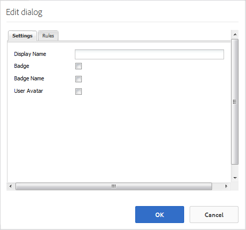

# Skapa en ny communitywebbplats för aktivering {#author-a-new-community-site-for-enablement}

## Skapa communitywebbplats {#create-community-site}

[När du skapar](/help/communities/sites-console.md) en community-webbplats används en guide som vägleder dig genom de olika stegen för att skapa en community-webbplats. Du kan gå vidare till `Next` steget eller `Back` till föregående steg innan du implementerar platsen i det sista steget.

Så här kommer du igång med att skapa en ny community-webbplats:

Använda [författarinstansen](https://localhost:4502/)

* Logga in med administratörsbehörighet
* Navigera till **[UIControl Communities > Sites]**

* Välj **Skapa**

### Steg 1: Webbplatsmall {#step-site-template}

I steget **Webbplatsmall** anger du en titel, en beskrivning, namnet på webbadressen och väljer en mall för en community-webbplats, till exempel:

* **Webbplatstitel** för communityn: `Enablement Tutorial`

* **Beskrivning** av communityplats: `A site for enabling the community to learn.`

* **Rotadress** för communityplats: (lämna tomt för standardroten `/content/sites`)

* **Molnkonfigurationer**: (lämna tomt om ingen molnkonfiguration har angetts) ange sökvägen till de angivna molnkonfigurationerna.
* **Grundspråk** för communitywebbplats: (lämnas orört för ett enda språk: På engelska) använder du listrutan för att välja ett *eller flera* basspråk bland de tillgängliga språken - tyska, italienska, franska, japanska, spanska, portugisiska (Brasilien), kinesiska (traditionell) och kinesiska (förenklad). En communitywebbplats kommer att skapas för varje språk som läggs till och kommer att finnas i samma webbplatsmapp enligt bästa praxis som beskrivs i [Översätta innehåll för flerspråkiga webbplatser](/help/sites-administering/translation.md). Rotsidan för varje webbplats kommer att innehålla en underordnad sida med språkkoden för ett av de valda språken, till exempel &quot;en&quot; för engelska eller &quot;fr&quot; för franska.

* **Namn på** communitywebbplats: `enable`

   * Den inledande URL:en visas under namnet på communitywebbplatsen
   * Ange en giltig URL genom att lägga till en baskod + &quot;.html&quot;
      *Till exempel* https://localhost:4502/content/sites/ `enable/en.html`

* **Referensplatsmall**: dra nedåt för att välja `Reference Structured Learning Site Template`

Markera **nästa**

### Steg 2: Design {#step-design}

Designsteget presenteras i två avsnitt där du kan välja tema och varumärkesbanderoll:

#### TEMA PÅ GEMENSKAPENS WEBBPLATS {#community-site-theme}

Välj det format som du vill använda på mallen. När du väljer det här alternativet överlagras temat med en bockmarkering.

#### GEMENSKAPENS WEBBPLATSHANTERING {#community-site-branding}

(valfritt) Ladda upp en banderollbild som ska visas på webbplatsens sidor. Banderollen är fäst vid webbläsarens vänstra kant, mellan communitywebbplatsens sidhuvud och meny (navigeringslänkar). Banderollhöjden beskärs till 120 pixlar. Banderollens storlek ändras inte så att den passar webbläsarens bredd och höjden 120 pixlar.

 

Välj **Nästa**.

### Steg 3: Inställningar {#step-settings}

Observera att det finns sju avsnitt som ger åtkomst till konfigurationer som användarhantering, taggning, roller, moderering, analys, översättning och aktivering i steget Inställningar innan du väljer `Next`.

#### ANVÄNDARHANTERING {#user-management}

Vi rekommenderar att [aktiveringscommunityn](/help/communities/overview.md#enablement-community) är privata.

En communitywebbplats är privat när anonyma besökare på webbplatsen nekas åtkomst, inte får registrera sig själv och inte får använda social inloggning.

Kontrollera att de flesta kryssrutor är avmarkerade för [användarhantering](/help/communities/sites-console.md#user-management) :

* Tillåt INTE webbplatsbesökare att registrera sig själva
* Tillåt INTE anonyma webbplatsbesökare att visa webbplatsen
* Valfritt om meddelanden ska tillåtas bland communitymedlemmar eller inte
* Tillåt INTE inloggning med Facebook
* Tillåt INTE inloggning med Twitter

#### TAGGING {#tagging}

De taggar som kan användas för communityinnehåll kontrolleras genom att AEM-namnutrymmen som tidigare definierats via [taggningskonsolen](/help/sites-administering/tags.md#tagging-console) (till exempel namnutrymmet [Tutorial](/help/communities/enablement-setup.md#create-tutorial-tags)) väljs.

Om du väljer Taggnamnutrymmen för communitywebbplatsen begränsas dessutom det urval som visas när du definierar kataloger och aktiveringsresurser. Viktig information finns i [Tagga aktiveringsresurser](/help/communities/tag-resources.md) .

Det är enkelt att hitta namnutrymmen med typsnittssökning. Exempel:

* Typ `tut`
* Välj `Tutorial`

### ROLLER {#roles}

[Gruppmedlemsroller](/help/communities/users.md) tilldelas via inställningarna i avsnittet Roller.

Om du vill att en community-medlem (eller grupp av medlemmar) ska kunna uppleva webbplatsen som community-hanterare använder du typsnittssökningen och väljer medlemmens eller gruppens namn bland alternativen i listrutan.

Exempel:

* Typ `q`
* Välj [Quinn Harper](/help/communities/enablement-setup.md#publishcreateenablementmembers)

>[!NOTE]
>
>[Tunneltjänsten](/help/communities/deploy-communities.md#tunnel-service-on-author) tillåter endast urval av medlemmar och grupper som finns i publiceringsmiljön.

#### MODERATION {#moderation}

Acceptera de globala standardinställningarna för [moderering](/help/communities/sites-console.md#moderation) av användargenererat innehåll (UGC).

#### ANALYS {#analytics}

I listrutan väljer du Analytics-molntjänstramverket som är konfigurerat för den här communitywebbplatsen.

Det som visas på skärmbilden `Communities`är ramverksexemplet från [konfigurationsdokumentationen.](/help/communities/analytics.md#aem-analytics-framework-configuration)

#### ÖVERSÄTTNING {#translation}

I [översättningsinställningarna](/help/communities/sites-console.md#translation) anges om UGC kan översättas och till vilket språk.

* Kontrollera **Tillåt maskinöversättning**
* Använd standardinställningarna

#### AKTIVERING {#enablement}

För en aktiveringscommunity måste du identifiera en eller flera aktiveringsansvariga i communityn.

* **Aktivitetshanterare**(krävs) Medlemmar i `Community Enablement Managers` gruppen kan väljas för att hantera den här communitywebbplatsen.

   * Typ `s`
   * Välj `Sirius Nilson`

* **Organisations-ID** för Marketing Cloud (valfritt) ID:t för ett Adobe Analytics-konto som är nödvändigt när [Video Heartbeat Analytics](/help/communities/analytics.md#video-heartbeat-analytics) inkluderas i aktiveringsrapporten.

Välj **Nästa**.

### Steg 4: Skapa communitywebbplats {#step-create-community-site}

Välj **Skapa.**

När processen är klar visas mappen för den nya platsen i konsolen Communities > Sites.

### Publicera den nya communitywebbplatsen {#publish-the-new-community-site}

Den skapade webbplatsen bör hanteras från konsolen Communities - Sites, samma konsol som nya platser kan skapas från.

När du har valt communityplatsens mapp hovrar du över platsikonen så att fyra åtgärdsikoner visas:

När du markerar ellipsikonen (ikonen Fler åtgärder) visas alternativen Exportera plats och Ta bort plats.

Från vänster till höger är de:

* **Öppna webbplats**

   Välj pennikonen för att öppna communitywebbplatsen i redigeringsläge för författare, för att lägga till och/eller konfigurera sidkomponenter

* **Redigera webbplats**

   Välj egenskapsikonen för att öppna communitywebbplatsen för ändring av egenskaper, som titeln eller för att ändra temat

* **Publicera webbplats**

   Välj världsikonen för att publicera communitywebbplatsen (till localhost:4503 som standard)

* **Exportera webbplats**

   Välj exportikonen om du vill skapa ett paket för communitywebbplatsen som både lagras i [pakethanteraren](/help/sites-administering/package-manager.md) och hämtas.
Observera att UGC inte ingår i platspaketet.

* **Ta bort plats**

   Om du vill ta bort communitywebbplatsen väljer du ikonen Ta bort plats som visas när du håller muspekaren över webbplatsen i Webbplatskonsolen. Den här åtgärden tar bort alla objekt som är associerade med platsen, till exempel UGC, användargrupper, resurser och databasposter.

#### Välj Publicera {#select-publish}

Välj världsikonen för att publicera communitywebbplatsen.

Det kommer att finnas en indikation på att webbplatsen har publicerats.

## Community-användare och användargrupper {#community-users-user-groups}

### Meddelande om nya användargrupper {#notice-new-community-user-groups}

Tillsammans med den nya communitywebbplatsen skapas nya användargrupper som har rätt behörigheter för olika administrativa funktioner. Mer information finns i [Användargrupper för communitysajter](/help/communities/users.md#usergroupsforcommunitysites).

Med tanke på webbplatsens namn&quot;enable&quot; i steg 1 kan de nya användargrupper som finns i publiceringsmiljön ses från konsolen  Communities Members &amp; Groups:

### Tilldela medlemmar till gruppen Aktivera medlemmar {#assign-members-to-community-enable-members-group}

När tunneltjänsten är aktiverad kan [användare som skapats under den första konfigurationen](/help/communities/enablement-setup.md#publishcreateenablementmembers) tilldelas till communitymedlemsgruppen för den nyligen skapade communitywebbplatsen.

Med hjälp av gruppkonsolen kan medlemmar läggas till individuellt eller genom medlemskap i en grupp.

I det här exemplet `Community Ski Class` läggs gruppen till som medlem i gruppen `Community Enable Members` samt medlem `Quinn Harper`.

* Navigera till **Communities, Groups** console
* Markera gruppen Aktivera medlemmar *för* grupp
* Ange&quot;ski&quot; i sökrutan **Lägg till medlemmar i grupp**
* Välj *Community Ski Class* (grupp av elever)
* Ange &#39;quinn&#39; i sökrutan
* Välj *Quinn Harper* (kontakt för aktiveringsresurs)

* Välj **Spara**

## Konfigurationer vid publicering {#configurations-on-publish}

`https://localhost:4503/content/sites/enable/en.html {#http-localhost-content-sites-enable-en-html}`

### Konfigurera för autentiseringsfel {#configure-for-authentication-error}

När en webbplats har konfigurerats och publicerats [konfigurerar du inloggningsmappningen](/help/communities/sites-console.md#configure-for-authentication-error) ( `Adobe Granite Login Selector Authentication Handler`) på publiceringsinstansen. Fördelen är att när inloggningsuppgifterna inte anges korrekt kommer autentiseringsfelet att visa inloggningssidan för communitywebbplatsen igen med ett felmeddelande.

Lägg till en `Login Page Mapping` som

* `/content/sites/enable/en/signin:/content/sites/enable/en`

### (Valfritt) Ändra standardhemsidan {#optional-change-the-default-home-page}

När du arbetar med publiceringswebbplatsen i demonstrationssyfte kan det vara praktiskt att ändra standardhemsidan till den nya webbplatsen.

Om du vill göra det måste du använda [CRX|DE](https://localhost:4503/crx/de) Lite för att redigera [resursmappningstabellen](/help/sites-deploying/resource-mapping.md) vid publicering.

För att komma igång

1. Vid publicering får du åtkomst till CRXDE och loggar in med administratörsbehörighet

   * Bläddra till exempel till [https://localhost:4503/crx/de](https://localhost:4503/crx/de) och logga in med `admin/admin`

1. Utöka i projektwebbläsaren `/etc/map`
1. Markera `http` noden

   * Välj **Skapa nod**

      * **Namn** localhost.4503

         (använd *inte* &#39;:&#39;)

      * **textsling** : [mappning](https://sling.apache.org/documentation/the-sling-engine/mappings-for-resource-resolution.html)

1. Med den nyskapade `localhost.4503` noden markerad

   * Lägg till egenskap

      * **Namnsling** :match
      * **Type** String
      * **Värde** localhost.4503/$
   (måste sluta med tecknet &#39;$&#39;)

   * Lägg till egenskap

      * **Namnsling** :internalRedirect
      * **Type** String
      * **Värde** /content/sites/enable/en.html

1. Välj **Spara alla**
1. (Valfritt) Ta bort webbläsarhistoriken
1. Gå till https://localhost:4503/

   * Ankomst till https://localhost:4503/content/sites/enable/en.html

>[!NOTE]
>
>Om du vill inaktivera föränger du bara `sling:match` egenskapsvärdet med&quot;x&quot; - `xlocalhost.4503/$` - och **Spara alla**.

#### Felsökning: Fel när kartan sparades {#troubleshooting-error-saving-map}

Om det inte går att spara ändringarna måste du se till att nodnamnet är `localhost.4503`, med en punktavgränsare och inte `localhost:4503` med en kolonavgränsare, eftersom `localhost` det inte är ett giltigt namnområdesprefix.

#### Felsökning: Det gick inte att omdirigera {#troubleshooting-fail-to-redirect}

&quot;**$**&quot; i slutet av `sling:match`strängen för det reguljära uttrycket är avgörande, så att bara exakt `https://localhost:4503/` mappas. I annat fall läggs omdirigeringsvärdet till alla sökvägar som kan finnas efter server:port i URL:en. När AEM försöker dirigera om till inloggningssidan misslyckas den således.

## Ändra communityplatsen {#modifying-the-community-site}

När webbplatsen har skapats kan författare använda ikonen  Open Site för att utföra vanliga AEM-redigeringsaktiviteter.

Dessutom kan administratörer använda ikonen  Redigera plats för att ändra egenskaper för platsen, till exempel titeln.

Kom ihåg att **spara** och **publicera** webbplatsen igen efter eventuella ändringar.

>[!NOTE]
>
>Om du inte känner till AEM läser du dokumentationen om [grundläggande hantering](/help/sites-authoring/basic-handling.md) och en [snabbguide till redigeringssidorna](/help/sites-authoring/qg-page-authoring.md).

### Lägg till en katalog {#add-a-catalog}

Den communityplatsmall som valts för den här communitywebbplatsen bör innehålla katalogfunktionen.

Om inte kan du enkelt lägga till katalogfunktionen. På så sätt kan andra medlemmar i communityn, som inte är tilldelade till aktiveringsresurser eller en utbildningsväg, välja aktiveringsresurser från en katalog.

Om platsstrukturen redan innehåller katalogfunktionen kan dess namn ändras.

Om du vill ändra platsens struktur går du till konsolen **Webbplatser** , öppnar `enable` mappen och väljer ikonen **Redigera plats** för att komma åt egenskaperna för `Enablement Tutorial`.

Välj STRUKTURpanelen om du vill lägga till en katalog eller ändra en befintlig katalog:

* **Titel**: `Ski Catalog`

* **URL**: `catalog`

* **Markera alla namnutrymmen**: lämna som standard.
* välj **Spara**

Använd placeringsikonen för att flytta katalogfunktionen till den andra positionen, efter tilldelningar.

Välj **Spara** i det övre högra hörnet om du vill spara ändringarna på communitywebbplatsen.

Publicera sedan om **webbplatsen** .

