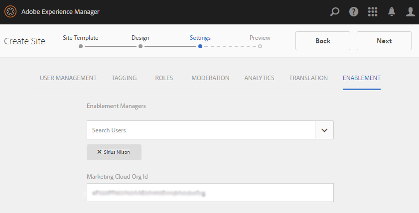

# Skapa en ny communitywebbplats för aktivering {#author-a-new-community-site-for-enablement}

## Skapa communitywebbplats {#create-community-site}

[Skapa communitysajter](/help/communities/sites-console.md) använder en guide som vägleder dig genom de olika stegen för att skapa en community-webbplats. Det går att gå vidare till `Next` steg eller `Back` till föregående steg innan webbplatsen implementeras i det sista steget.

Så här kommer du igång med att skapa en ny community-webbplats:

Använda [författarinstans](https://localhost:4502/)

* Logga in med administratörsbehörighet och navigera till **[!UICONTROL Communities]** > **[!UICONTROL Sites]**.

* Välj **Skapa**.

### Steg 1: Webbplatsmall {#step-site-template}

På **Webbplatsmall** anger du en titel, beskrivning, URL-adressen och väljer en mall för en community-webbplats, till exempel:

* **Rubrik för communitywebbplats**: `Enablement Tutorial`.

* **Beskrivning av communityplats**: `A site for enabling the community to learn.`

* **Community-platsrot**: (lämna tomt för standardroten `/content/sites`)

* **Molnkonfigurationer**: (lämna tomt om ingen molnkonfiguration har angetts) ange sökvägen till de angivna molnkonfigurationerna.
* **Bas-språk för communitywebbplats**: (lämnas orört för ett enda språk: på engelska) använd listrutan för att välja en *eller mer* basspråk från tillgängliga språk - tyska, italienska, franska, japanska, spanska, portugisiska (Brasilien), kinesiska (traditionell) och kinesiska (förenklad). En community-webbplats skapas för varje språk som läggs till och finns i samma webbplatsmapp enligt de rutiner som beskrivs i [Översätta innehåll för flerspråkiga webbplatser](/help/sites-administering/translation.md). Rotsidan för varje webbplats kommer att innehålla en underordnad sida med språkkoden för ett av de valda språken, till exempel &quot;en&quot; för engelska eller &quot;fr&quot; för franska.

* **Namn på communitywebbplats**: `enable`

   * Den inledande URL:en visas under namnet på communitywebbplatsen
   * Ange en giltig URL genom att lägga till en baskod + &quot;.html&quot;
      *Till exempel*, https://localhost:4502/content/sites/ `enable/en.html`

* **Referensplatsmall**: dra nedåt för att välja `Reference Structured Learning Site Template`

Välj **Nästa**.

### Steg 2: Design {#step-design}

Designsteget presenteras i två avsnitt där du kan välja tema och varumärkesbanderoll:

#### TEMA PÅ GEMENSKAPENS WEBBPLATS {#community-site-theme}

Välj det format som du vill använda på mallen. När du väljer det här alternativet överlagras temat med en bockmarkering.

#### GEMENSKAPENS WEBBPLATSHANTERING {#community-site-branding}

(Valfritt) Ladda upp en banderollbild som ska visas på webbplatsens sidor. Banderollen är fäst vid webbläsarens vänstra kant, mellan communitywebbplatsens sidhuvud och meny (navigeringslänkar). Banderollhöjden beskärs till 120 pixlar. Banderollens storlek ändras inte så att den passar webbläsarens bredd och höjden 120 pixlar.

Välj **Nästa**.

### Steg 3: Inställningar {#step-settings}

I steget Inställningar, innan du väljer `Next`, observera att det finns sju avsnitt som ger åtkomst till konfigurationer som användarhantering, taggning, roller, moderering, analys, översättning och aktivering.

#### ANVÄNDARHANTERING {#user-management}

Vi rekommenderar att [aktiveringscommunityn](/help/communities/overview.md#enablement-community) vara privat.

En communitywebbplats är privat när anonyma besökare på webbplatsen nekas åtkomst, inte får registrera sig själv och inte får använda social inloggning.

Kontrollera att de flesta kryssrutor är avmarkerade för [Användarhantering](/help/communities/sites-console.md#user-management) :

* Tillåt INTE webbplatsbesökare att registrera sig själva.
* Tillåt INTE anonyma webbplatsbesökare att visa webbplatsen.
* Valfritt om meddelanden ska tillåtas bland communitymedlemmar eller inte.
* Tillåt INTE inloggning med Facebook.
* Tillåt INTE inloggning med Twitter.

#### TAGGNING {#tagging}

De taggar som kan användas för communityinnehåll kontrolleras genom att AEM namnutrymmen som tidigare definierats i [Taggningskonsolen](/help/sites-administering/tags.md#tagging-console) (t.ex. [Namnutrymme för självstudiekurs](/help/communities/enablement-setup.md#create-tutorial-tags)).

Om du väljer Taggnamnutrymmen för communitywebbplatsen begränsas dessutom det urval som visas när du definierar kataloger och aktiveringsresurser. Se [Aktiveringsresurser för taggning](/help/communities/tag-resources.md) för viktig information.

Det är enkelt att hitta namnutrymmen med typsnittssökning. Till exempel,

* Typ `tut`
* Välj `Tutorial`

### ROLLER {#roles}

[Medlemsroller i communityn](/help/communities/users.md) tilldelas via inställningarna i avsnittet Roller.

Om du vill att en community-medlem (eller grupp av medlemmar) ska kunna uppleva webbplatsen som community-hanterare använder du typsnittssökningen och väljer medlemmens eller gruppens namn bland alternativen i listrutan.

Till exempel,

* Typ `q`
* Välj [Quinn Harper](/help/communities/enablement-setup.md#publishcreateenablementmembers)

>[!NOTE]
>
>[Tunneltjänst](/help/communities/deploy-communities.md#tunnel-service-on-author) gör att du kan välja medlemmar och grupper som bara finns i publiceringsmiljön.

#### MODERATION {#moderation}

Acceptera de globala standardinställningarna för [moderera](/help/communities/sites-console.md#moderation) användargenererat innehåll (UGC).

#### ANALYS {#analytics}

I listrutan väljer du Analytics-molntjänstramverket som är konfigurerat för den här communitywebbplatsen.

Markeringen som visas på skärmbilden, `Communities`, är ramverksexemplet från [konfigurationsdokumentation.](/help/communities/analytics.md#aem-analytics-framework-configuration)

#### ÖVERSÄTTNING {#translation}

The [Översättningsinställningar](/help/communities/sites-console.md#translation) Ange om användargenererat innehåll får översättas och till vilket språk.

* Kontrollera **Tillåt maskinöversättning**
* Använd standardinställningarna

#### AKTIVERING {#enablement}

För en aktiveringscommunity måste du identifiera en eller flera aktiveringsansvariga i communityn.

* **Aktivitetshanterare**
(obligatoriskt) Medlemmar i 
`Community Enablement Managers` gruppen är tillgänglig för att väljas för att hantera den här communitywebbplatsen.

   * Typ `s`
   * Välj `Sirius Nilson`

* **Marketing Cloud organisation-ID**
(valfritt) ID:t för ett Adobe Analytics-konto som krävs när du inkluderar [Analys av pulsslag för video](/help/communities/analytics.md#video-heartbeat-analytics) i aktiveringsrapporteringen.

Välj **Nästa**.

### Steg 4: Skapa communitywebbplats {#step-create-community-site}

Välj **Skapa.**

När processen är klar visas mappen för den nya platsen i konsolen Communities > Sites.

### Publicera den nya communitywebbplatsen {#publish-the-new-community-site}

Den skapade webbplatsen bör hanteras från konsolen Communities - Sites, samma konsol som nya platser kan skapas från.

När du har valt communityplatsens mapp för du muspekaren över platsikonen så att fyra åtgärdsikoner visas:

När du markerar ellipsikonen (ikonen Fler åtgärder) visas alternativen Exportera plats och Ta bort plats.

Från vänster till höger är de:

* **Öppna webbplats**

   Välj pennikonen för att öppna communitywebbplatsen i redigeringsläge för författare för att lägga till och/eller konfigurera sidkomponenter.

* **Redigera webbplats**

   Välj egenskapsikonen för att öppna communitywebbplatsen för ändring av egenskaper, till exempel titeln, eller för att ändra temat.

* **Publicera webbplats**

   Välj ikonen world om du vill publicera communitywebbplatsen (till localhost:4503 som standard).

* **Exportera webbplats**

   Välj exportikonen för att skapa ett paket för communitywebbplatsen som båda lagras i [pakethanterare](/help/sites-administering/package-manager.md) och laddas ned.
Observera att UGC inte ingår i platspaketet.

* **Ta bort plats**

   Om du vill ta bort communitywebbplatsen väljer du ikonen Ta bort plats som visas när du håller muspekaren över webbplatsen i Webbplatskonsolen. Den här åtgärden tar bort alla objekt som är associerade med platsen, till exempel UGC, användargrupper, resurser och databasposter.

   

#### Välj Publicera {#select-publish}

Välj världsikonen för att publicera communitywebbplatsen.

Det kommer att finnas en indikation på att webbplatsen har publicerats.

## Community-användare och användargrupper {#community-users-user-groups}

### Meddelande om nya användargrupper {#notice-new-community-user-groups}

Tillsammans med den nya communitywebbplatsen skapas nya användargrupper som har rätt behörigheter för olika administrativa funktioner. Mer information finns på [Användargrupper för communityplatser](/help/communities/users.md#usergroupsforcommunitysites).

Med tanke på webbplatsens namn&quot;enable&quot; i steg 1 kan de nya användargrupperna som finns i publiceringsmiljön ses från [Konsol för gruppmedlemmar och grupper](/help/communities/members.md#groups-console):

### Tilldela medlemmar till gruppen Aktivera medlemmar {#assign-members-to-community-enable-members-group}

När tunneltjänsten är aktiverad kan du tilldela [användare som skapades under den första installationen](/help/communities/enablement-setup.md#publishcreateenablementmembers) till communitymedlemsgruppen för den nyligen skapade communitywebbplatsen.

Med hjälp av gruppkonsolen kan medlemmar läggas till individuellt eller genom medlemskap i en grupp.

I det här exemplet `Community Ski Class` läggs till som medlem i gruppen `Community Enable Members` samt medlem `Quinn Harper`.

* Navigera till **Communities, Groups** konsol
* Välj *Community-aktivera medlemmar* grupp
* Ange &#39;skidor&#39; i **Lägg till medlemmar i grupp** sökruta
* Välj *Klassen Community Ski* (grupp av studerande)
* Ange &#39;quinn&#39; i sökrutan
* Välj *Quinn Harper* (aktivera resurskontakt)

* Välj **Spara**

## Konfigurationer vid publicering {#configurations-on-publish}

`https://localhost:4503/content/sites/enable/en.html {#http-localhost-content-sites-enable-en-html}`

### Konfigurera för autentiseringsfel {#configure-for-authentication-error}

När en webbplats har konfigurerats och publicerats, [konfigurera inloggningsmappning](/help/communities/sites-console.md#configure-for-authentication-error) ( `Adobe Granite Login Selector Authentication Handler`) på publiceringsinstansen. Fördelen är att när inloggningsuppgifterna inte anges korrekt kommer autentiseringsfelet att visa inloggningssidan för communitywebbplatsen igen med ett felmeddelande.

Lägg till en `Login Page Mapping` as:

* `/content/sites/enable/en/signin:/content/sites/enable/en`

### (Valfritt) Ändra standardhemsidan {#optional-change-the-default-home-page}

När du arbetar med publiceringswebbplatsen i demonstrationssyfte kan det vara praktiskt att ändra standardhemsidan till den nya webbplatsen.

För att göra detta måste du använda [CRX|DE](https://localhost:4503/crx/de) Lite för att redigera [resursmappning](/help/sites-deploying/resource-mapping.md) tabell vid publicering.

Så här kommer du igång:

1. Vid publicering får du åtkomst till CRXDE och loggar in med administratörsbehörighet

   * Bläddra till exempel till [https://localhost:4503/crx/de](https://localhost:4503/crx/de) och logga in med `admin/admin`

1. Utöka i projektwebbläsaren `/etc/map`
1. Välj `http` nod

   * Välj **Skapa nod**

      * **Namn** localhost.4503

         (do *not* använd &#39;:&#39;)

      * **Typ** [sling:mappning](https://sling.apache.org/documentation/the-sling-engine/mappings-for-resource-resolution.html)

1. Med nyskapade `localhost.4503` markerad nod

   * Lägg till egenskap

      * **Namn** sling:match
      * **Typ** Sträng
      * **Värde** localhost.4503/$

   (måste sluta med tecknet &#39;$&#39;)

   * Lägg till egenskap

      * **Namn** sling:internalRedirect
      * **Typ** Sträng
      * **Värde** /content/sites/enable/en.html

1. Välj **Spara alla**
1. (Valfritt) Ta bort webbläsarhistoriken
1. Gå till https://localhost:4503/

   * Ankomst till https://localhost:4503/content/sites/enable/en.html

>[!NOTE]
>
>Om du vill inaktivera föränger du `sling:match` egenskapsvärde med x - `xlocalhost.4503/$` - och **Spara alla**.

#### Felsökning: Fel när kartan sparades {#troubleshooting-error-saving-map}

Om det inte går att spara ändringarna måste du kontrollera att nodnamnet är `localhost.4503`, med en punktavgränsare, och inte `localhost:4503` med en kolonavgränsare, som `localhost` är inte ett giltigt namnområdesprefix.

#### Felsökning: Det gick inte att omdirigera {#troubleshooting-fail-to-redirect}

The **$**&#39; i slutet av det reguljära uttrycket `sling:match` sträng är avgörande, så att bara exakt `https://localhost:4503/` är mappad, annars läggs omdirigeringsvärdet till en sökväg som kan finnas efter server:port i URL:en. När AEM försöker dirigera om till inloggningssidan misslyckas den alltså.

## Ändra communityplatsen {#modifying-the-community-site}

När webbplatsen har skapats kan författare använda [Ikonen Öppna webbplats](/help/communities/sites-console.md#authoring-site-content) för att utföra AEM.

Dessutom kan administratörer använda [Ikonen Redigera webbplats](/help/communities/sites-console.md#modifying-site-properties) om du vill ändra egenskaper för platsen, t.ex. titeln.

Kom ihåg att efter varje ändring **Spara** och **Publicera** sajten.

>[!NOTE]
>
>Om du inte känner till AEM kan du läsa dokumentationen om [grundläggande hantering](/help/sites-authoring/basic-handling.md) och [snabbguide till framtagning av sidor](/help/sites-authoring/qg-page-authoring.md).

### Lägg till en katalog {#add-a-catalog}

Den communityplatsmall som valts för den här communitywebbplatsen bör innehålla katalogfunktionen.

Om inte kan du enkelt lägga till katalogfunktionen. På så sätt kan andra medlemmar i communityn, som inte är tilldelade till aktiveringsresurser eller en utbildningsväg, välja aktiveringsresurser från en katalog.

Om platsstrukturen redan innehåller katalogfunktionen kan dess namn ändras.

Om du vill ändra platsens struktur går du till **[!UICONTROL Communities]** > **[!UICONTROL Sites]** konsolen, öppna `enable` och väljer **Redigera webbplats** -ikonen för att komma åt egenskaperna för `Enablement Tutorial`.

Välj STRUKTURpanelen om du vill lägga till en katalog eller ändra en befintlig katalog:

* **Titel**: `Ski Catalog`

* **URL**: `catalog`

* **Markera alla namnutrymmen**: lämna som standard.

* Välj **Spara**.

Använd placeringsikonen för att flytta katalogfunktionen till den andra positionen, efter tilldelningar.

Välj **Spara** i det övre högra hörnet för att spara ändringarna på communitywebbplatsen.

Gör sedan om **Publicera** sajten.
