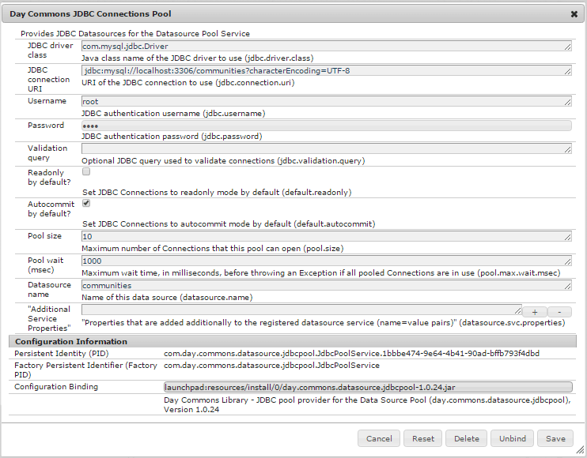

# Community-funktioner{#community-functions}

Den typ av funktioner som förväntas av en community-upplevelse är välkända. Community-funktioner är tillgängliga som communityfunktioner. De är i princip en eller flera sidor som är färdiga för implementering av en communityfunktion som kräver mer än att bara lägga till en komponent på en sida i redigeringsläge. De är byggstenarna som används för att definiera strukturen för en mall [för en](/help/communities/sites.md) community-webbplats från vilken communitysajter [skapas](/help/communities/sites-console.md).

När en community-webbplats har skapats kan innehåll läggas till på de resulterande sidorna med hjälp av standardläget [för](/help/sites-authoring/editing-content.md)AEM-redigering. Olika communityfunktioner är tillgängliga enligt vad som visas i användarfunktionskonsolen.

>[!NOTE]
>
>Konsolerna för att skapa [communitysajter](/help/communities/sites-console.md), [communitymallar](/help/communities/sites.md), mallar [för](/help/communities/tools-groups.md)communitygrupper och [communityfunktioner](/help/communities/functions.md) är endast avsedda att användas i författarmiljön.

## Community Function Console {#community-functions-console}

För att nå användarfunktionskonsolen i redigeringsmiljön

* från global navigering: **Verktyg, Communities, Community Function**

## Fördefinierade funktioner {#pre-built-functions}

Här följer en kort beskrivning av funktionerna som levereras med AEM Communities. Varje funktion innehåller en eller flera AEM-sidor med Communities-komponenter som kopplats ihop till en funktion som enkelt kan integreras i en mall [för](/help/communities/sites.md)communitysajter.

En mall för en community-webbplats innehåller strukturen för en community-webbplats, inklusive inloggning, användarprofiler, meddelanden, meddelanden, webbplatsmeny, sökning, teman och varumärken.

### Titel- och URL-inställningar {#title-and-url-settings}

**Titel **och **URL **är egenskaper som är gemensamma för alla communityfunktioner.

När en communityfunktion läggs till i en mall för en community-webbplats eller läggs till när du [ändrar](/help/communities/sites-console.md#modifying-site-properties) strukturen för en community-webbplats öppnas funktionens dialogruta så att titeln och URL-adressen kan konfigureras.

#### Information om konfigurationsfunktion {#configuration-function-details}

* **Titel**(*obligatoriskt*) Den text som visas på menyn med funktioner för webbplatsen

* **URL**(*obligatoriskt*) Namnet som används för att generera URI:n. Namnet måste följa de [namngivningskonventioner](/help/sites-developing/naming-conventions.md) som ålagts av AEM och JCR.

Om du till exempel använder den webbplats som skapas i [självstudiekursen Komma igång](/help/communities/getting-started.md) , om

* Titel = webbsida
* URL = sida

URL:en till sidan är https://localhost:4503/content/sites/engage/en/**page**.html

och menylänken för sidan visas som:

### Funktion för aktivitetsström {#activity-stream-function}

Funktionen för aktivitetsström är en sida med en [aktivitetsströmkomponent](/help/communities/activities.md) med alla vyer markerade (alla aktiviteter, användaraktiviteter och följande). Se även [Activity Stream Essentials](/help/communities/essentials-activities.md) för utvecklare.

När du lägger till en mall öppnas följande dialogruta:

#### Information om konfigurationsfunktion {#configuration-function-details-1}

* [Titel- och URL-inställningar](#title-and-url-settings)
* **Visa vyn**&quot;Mina aktiviteter&quot; Om du väljer det här alternativet innehåller sidan Aktiviteter en flik som filtrerar aktiviteter baserat på aktiviteter som genererats i communityn av den aktuella medlemmen. Standard är valt.

* **Visa vyn** Alla aktiviteter Om du väljer det här alternativet innehåller sidan Aktiviteter en flik som innehåller alla aktiviteter som genereras i den community som den aktuella medlemmen har åtkomst till. Standard är valt.

* **Visa vyn** Nyhetsfeed Om du väljer det här alternativet innehåller aktivitetssidorna en flik som filtrerar aktiviteter baserade på de som den aktuella medlemmen följer. Standard är valt.

### Tilldelningsfunktion {#assignments-function}

Tilldelningsfunktionen är den grundläggande funktionen som definierar en [communitywebbplats för aktivering](/help/communities/overview.md#enablement-community). Det gör det möjligt att tilldela aktiveringsresurser till communitymedlemmar. Se även [Tilldelningar Grundläggande](/help/communities/essentials-assignments.md) för utvecklare.

Den här funktionen är tillgänglig som en funktion i [aktiveringstillägget](/help/communities/enablement.md). Tillägget kräver ytterligare licenser för användning i en produktionsmiljö.

När du lägger till en mall är den enda konfigurationen för [titel- och URL-inställningarna](#title-and-url-settings).

### Bloggfunktion {#blog-function}

Bloggfunktionen är en sida med en [Blog-komponent](/help/communities/blog-feature.md) som är konfigurerad för taggning, filöverföring, följning av medlemmar för självredigering, röstning och moderering. Se även [Blog Essentials](/help/communities/blog-developer-basics.md) för utvecklare.

När du lägger till en mall öppnas följande dialogruta:

* [Titel- och URL-inställningar](#title-and-url-settings)
* **Tillåt behöriga medlemmar** Om du väljer det här alternativet tillåts endast behöriga medlemmar att skapa artiklar i bloggen genom att tillåta val av en [privilegierad medlemsgrupp](/help/communities/users.md#privileged-members-group). Om det inte är markerat kan alla community-medlemmar skapa. Standard är avmarkerat.

* **Tillåt filöverföringar** Om du väljer det här alternativet kan medlemmar ladda upp filer i bloggen. Standard är valt.

* **Tillåt kopplade svar** Om det inte är markerat tillåter bloggen svar (kommentarer) på en artikel, men det är inte tillåtet att svara på kommentarer. Standard är valt.

* **Tillåt aktuellt innehåll** Om du väljer det här alternativet identifieras bloggen som [aktuellt innehåll](/help/communities/featured.md). Standard är valt.

### Kalenderfunktion {#calendar-function}

Kalenderfunktionen är en sida med en [kalenderkomponent](/help/communities/calendar.md) som är konfigurerad för att tillåta taggning. Se även [Calendar Essentials](/help/communities/calendar-basics-for-developers.md) för utvecklare.

När du lägger till en mall öppnas följande dialogruta:

* se [Titel- och URL-inställningar](#title-and-url-settings)
* **Tillåt fästa** Om du väljer det här alternativet kan ämnessvar fästs till början av kommentarlistan. Standard är valt.

* **Tillåt behöriga medlemmar** Om du väljer det här alternativet tillåts endast behöriga medlemmar att skapa artiklar i bloggen genom att tillåta val av en [privilegierad medlemsgrupp](/help/communities/users.md#privileged-members-group). Om det inte är markerat kan alla community-medlemmar skapa. Standard är avmarkerat.

* **Tillåt filöverföringar** Om du väljer det här alternativet kan medlemmar ladda upp filer i bloggen. Standard är valt.

* **Tillåt kopplade svar** Om det inte är markerat tillåter bloggen svar (kommentarer) på en artikel, men det är inte tillåtet att svara på kommentarer. Standard är valt.

* **Tillåt aktuellt innehåll** Om du väljer det här alternativet identifieras innehållet som [aktuellt innehåll](/help/communities/featured.md). Standard är valt.

### Katalogfunktion {#catalog-function}

Katalogfunktionen gör det möjligt för [communitymedlemmar](/help/communities/overview.md#enablement-community) att bläddra bland aktiveringsresurser som inte är tilldelade dem. Se [Tagga aktiveringsresurser](/help/communities/tag-resources.md) och [Katalog Essentials](/help/communities/catalog-developer-essentials.md) för utvecklare.

Alla aktiveringsresurser och utbildningsvägar för communitywebbplatsen visas i alla kataloger om egenskapen ` [Show in Catalog](/help/communities/resources.md)`är inställd på true. Om du vill inkludera resurser och utbildningsvägar explicit måste du använda ett [förfilter](/help/communities/catalog-developer-essentials.md#pre-filters) i katalogen.

När den läggs till i en mall tillåter konfigurationen att du anger taggnamnutrymmen som används för att konfigurera taggfiltret som visas för webbplatsens besökare:

* [Titel- och URL-inställningar](#title-and-url-settings)
* **Välj Alla namnutrymmen**De markerade taggnamnutrymmena definierar vilka taggar som besökare kan markera för att filtrera listan med aktiveringsresurser som finns i katalogen.
Om det här alternativet är markerat är alla taggnamnutrymmen som är tillåtna för communitywebbplatsen tillgängliga.
Om du avmarkerar det här alternativet kan du välja ett eller flera namnutrymmen som är tillåtna för communitywebbplatsen.
Standard är valt.

### Funktion för aktuellt innehåll {#featured-content-function}

Funktionen för aktuellt innehåll är en sida med en [innehållskomponent](/help/communities/featured.md) som är konfigurerad att tillåta att kommentarer läggs till och tas bort.

Funktionen kan vara tillåten eller otillåten per komponent (se [Bloggfunktion](#blog-function), [Kalenderfunktion](#calendar-function), [forumfunktion](#forum-function), [Ideationsfunktion](#ideation-function)och [QnA-funktion](#qna-function)).

När du lägger till en mall är den enda konfigurationen för [titel- och URL-inställningarna](#title-and-url-settings).

### Filbiblioteksfunktion {#file-library-function}

Filbiblioteksfunktionen är en sida med en [filbibliotekskomponent](/help/communities/file-library.md) som tillåter att kommentarer läggs till och tas bort.

När du lägger till en mall är den enda konfigurationen för [titel- och URL-inställningarna](#title-and-url-settings).

### Forum {#forum-function}

Forumfunktionen är en sida med en [forumkomponent](/help/communities/forum.md) som är konfigurerad för taggning, filöverföringar, följda, medlemmar som kan redigera själva, rösta och moderera.

När du lägger till en mall öppnas följande dialogruta:

#### Information om konfigurationsfunktion {#configuration-function-details-2}

* [Titel- och URL-inställningar](#title-and-url-settings)
* **Tillåt fästa** Om du väljer det här alternativet kan ämnessvar fästs till början av kommentarlistan. Standard är valt.

* **Tillåt behöriga medlemmar** Om det här alternativet är markerat tillåter forumet endast behöriga medlemmar att publicera ämnen genom att tillåta val av en [privilegierad medlemsgrupp](/help/communities/users.md#privileged-members-group). Om det inte är markerat får alla community-medlemmar publicera. Standard är avmarkerat.

* **Tillåt filöverföringar** Om du väljer det här alternativet kan medlemmarna ladda upp filer. Standard är valt.

* **Tillåt kopplade svar** Om det inte är markerat tillåter forumet kommentarer om ett ämne, men svar på dessa kommentarer tillåts inte. Standard är valt.

* **Tillåt aktuellt innehåll** Om du väljer det här alternativet identifieras komponentens innehåll som [aktuellt innehåll](/help/communities/featured.md). Standard är valt.

### Funktionen Grupper {#groups-function}

>[!CAUTION]
>
>Gruppfunktionen får inte *vara den *första eller enda* funktionen i en webbplats struktur eller i en mall för communityplats.
>
>Alla andra funktioner, till exempel [sidfunktionen](#page-function), måste inkluderas och listas först.

Med gruppfunktionen kan communitymedlemmar skapa undergrupper på communitywebbplatsen i publiceringsmiljön.

Beroende på [inställningarna](/help/communities/sites-console.md#groupmanagement) när funktionen Grupper ingår i en [community-webbplatsmall](/help/communities/sites.md)kan grupperna vara offentliga eller privata och en eller flera communitygruppsmallar kan konfigureras för att ge dig möjlighet att välja mellan mallar när communitygruppen faktiskt skapas (t.ex. från publiceringsmiljön). En mall [för en](/help/communities/tools-groups.md) community-grupp anger vilka communityfunktioner som skapas för gruppsidorna, till exempel forum och kalendrar.

När en community-grupp skapas skapas en medlemsgrupp dynamiskt för den nya gruppen, som medlemmar kan tilldelas eller ansluta till. Mer information finns i [Hantera användare och användargrupper](/help/communities/users.md).

När det gäller [funktionspaket 1](/help/communities/deploy-communities.md#latestfeaturepack)för Communities skapas communitygrupper i författarmiljön med hjälp av gruppkonsolen [för](/help/communities/groups.md)Communities Sites och kan skapas i publiceringsmiljön när detta är aktiverat.

När du lägger till en mall öppnas följande dialogruta:

* [Titel- och URL-inställningar](#title-and-url-settings)
* **Välj Gruppmallar** En listruta där du kan välja mellan en eller flera aktiverade gruppmallar som den framtida skaparen av en ny community-grupp (i publiceringsmiljön) kan välja.

* **Tillåt behöriga medlemmar** Om det här alternativet är markerat tillåter forumet endast behöriga medlemmar att publicera ämnen genom att tillåta val av en [behörig medlemssäkerhetsgrupp](/help/communities/users.md#privileged-members-group). Om det inte är markerat får alla community-medlemmar publicera. Standard är avmarkerat.

* **Tillåt publiceringsskapande**Om det här alternativet är markerat kan behöriga communitymedlemmar skapa en grupp i publiceringsmiljön. Om du avmarkerar det här alternativet kan nya grupper (undergrupper) bara skapas i författarmiljön från gruppkonsolen Webbplatser.
Standard är valt.

### Ideationsfunktion {#ideation-function}

Idéfunktionen är en sida med en [Ideation-komponent](/help/communities/ideation-feature.md).

När du lägger till en mall öppnas följande dialogruta, som anger standardnamn för titel och URL samt standardvisningsinställningar för mallen:

* [Titel- och URL-inställningar](#title-and-url-settings)
* **Tillåt behöriga medlemmar** Om det här alternativet är markerat tillåter forumet endast behöriga medlemmar att publicera ämnen genom att tillåta val av en [behörig medlemssäkerhetsgrupp](/help/communities/users.md#privileged-members-group). Om det inte är markerat får alla community-medlemmar publicera. Standard är avmarkerat.

* **Tillåt filöverföringar** Om du väljer det här alternativet inkluderar idén möjligheten för medlemmar att överföra filer. Standard är valt.

* **Tillåt kopplade svar** Om alternativet inte är markerat tillåter idén svar (kommentarer) på ett ämne, men svar på kommentarer tillåts inte. Standard är valt.

* **Tillåt aktuellt innehåll** Om du väljer det här alternativet identifieras innehållet som [aktuellt innehåll](/help/communities/featured.md). Standard är valt.

### Ledarbordsfunktion {#leaderboard-function}

Ledpanelsfunktionen är en sida med en [huvudpanelskomponent](/help/communities/enabling-leaderboard.md).

**OBS**: Ledarpanelskomponenten behöver konfigureras ytterligare *när* en community-webbplats har skapats från en community-mall som innehåller funktionen Ledarpanel. Ange huvudpanelskomponentens [regler](/help/communities/enabling-leaderboard.md#rules-tab), som är beroende av konfigurationen av [poäng och emblem](/help/communities/implementing-scoring.md) för communityplatsen.

När du lägger till en mall öppnas följande dialogruta, som anger standardnamn för titel och URL samt standardvisningsinställningar för mallen:

* [Titel- och URL-inställningar](#title-and-url-settings)
* **Visa emblem**Om du väljer det här alternativet inkluderas en kolumn för ikoner för emblem i rankinglistan.
Standard är avmarkerat.

* **Visa märkesnamn**Om du väljer det här alternativet inkluderas en kolumn för märkordsnamnet i resultatlistan.
Standard är avmarkerat.

* **Visa Avatar**Om du väljer det här alternativet inkluderas medlemmens avatarbild i ledningsgruppen bredvid namnlänken till medlemsprofilen.
Standard är avmarkerat.

### Sidfunktion {#page-function}

Sidfunktionen lägger till en tom sida på communitywebbplatsen som den är kopplad till funktionerna på communitywebbplatsen: inloggning, meny, meddelanden, meddelanden, teman och branding. Innehåll läggs till på sidan med [standardläget](/help/sites-authoring/editing-content.md)för AEM-redigering.

När du lägger till en mall är den enda konfigurationen för [titel- och URL-inställningarna](#title-and-url-settings).

### QnA-funktion {#qna-function}

QnA-funktionen är en sida med en [QnA-komponent](/help/communities/working-with-qna.md) som är konfigurerad för taggning, filöverföringar, som följer, medlemmar för självredigering, röstning och moderering.

När konfigurationen läggs till i en mall tillåts begränsningar för behöriga medlemmar:

* [Titel- och URL-inställningar](#title-and-url-settings)
* **Tillåt fästa** Om du väljer det här alternativet kan ämnessvar fästs till början av kommentarlistan. Standard är valt.

* **Tillåt behöriga medlemmar** Om det här alternativet är markerat tillåter QnA-forumet endast behöriga medlemmar att publicera frågor genom att tillåta val av en [privilegierad medlemsgrupp](/help/communities/users.md#privileged-members-group). Om det inte är markerat får alla community-medlemmar publicera. Standard är avmarkerat.

* **Tillåt filöverföringar** Om det här alternativet väljs innehåller QnA-forumet möjlighet för medlemmar att överföra filer. Standard är valt.

* **Tillåt kopplade svar** Om det inte är markerat tillåter QnA-forumet kommentarer (svar) till en publicerad fråga, men svar på svar tillåts inte. Standard är valt.

* **Tillåt aktuellt innehåll** Om du väljer det här alternativet identifieras innehållet som [aktuellt innehåll](/help/communities/featured.md). Standard är valt.

## Skapa community-funktion {#create-community-function}

Du kan skapa en communityfunktion genom att välja `Create Community Function` -ikonen längst upp i användarfunktionskonsolen. Flera funktioner som är baserade på samma AEM-skiss kan skapas och sedan anpassas unikt genom att man öppnar dem i redigeringsläget.

### Community-funktionsnamn {#community-function-name}

På panelen Community Function Name konfigureras ett namn, en beskrivning och om funktionen är aktiverad eller inaktiverad:

* **Community Function Name**&#x200B;är funktionsnamnet som används för visning och lagring

* **Community Function Description** the function description for display

* **Inaktiverad/aktiverad** en växlingsväxling som styr om funktionen kan refereras

### AEM Blueprint {#aem-blueprint}

På `AEM Blueprint` panelen är det möjligt att välja en plan som är den underliggande implementeringen av communityfunktionen.

Community-funktionen är en miniwebbplats som innehåller en eller flera sidor som är färdiga att ingå i en community-webbplats, inklusive inloggning, användarprofiler, meddelanden, webbplatsmeny, söknings-, teman- och varumärkesfunktioner. När funktionen har skapats kan du [öppna funktionen](#open-community-function) i redigeringsläget och anpassa sidan eller komponentinställningarna.

Eftersom communityfunktionen implementeras som en [live-kopia](/help/sites-administering/msm.md#live-copies) av en [plan](/help/sites-administering/msm-livecopy.md#creatingablueprint)är det möjligt att göra ändringar i en funktion som påverkar alla communitywebbplatssidor som skapats från den mall [för](/help/communities/sites.md) communitysajt eller en mall [för](/help/communities/tools-groups.md) communitygrupper som innehåller funktionen. Det går också att ta bort kopplingen mellan en sida och dess överordnade plan för att göra ändringar på sidnivå.

Se även [Multi Site Manager](/help/sites-administering/msm.md).

### Miniatyrbild {#thumbnail}

På miniatyrpanelen kan en bild överföras för visning i [användarfunktionskonsolen](#community-functions-console).

## Öppen communityfunktion {#open-community-function}

Markera `Open Community Function` ikonen om du vill aktivera redigeringsläget för författare när du redigerar sidinnehållet och ändrar konfigurationen för funktionskomponenterna.

### Konfigurera komponenter {#configuring-components}

En communityfunktion implementeras som en Live-kopia av ett AEM-utkast, vars information finns under [Multi Site Manager](/help/sites-administering/msm.md).

Det går inte bara att skapa sidinnehåll utan även att konfigurera komponenter.

Om du konfigurerar en komponent på en sida i en skapad community-webbplats kan det vara nödvändigt att avbryta [arvet](/help/sites-administering/msm-livecopy.md#changing-live-copy-content) för att konfigurera komponenten. Arv bör återupprättas när konfigurationen slutförs.

Mer konfigurationsinformation finns i Komponenter [för](/help/communities/author-communities.md) användargrupper för författare.

## Redigera communityfunktion {#edit-community-function}

Markera `Edit Community Function` ikonen om du vill redigera funktionens egenskaper med samma paneler som när du [skapar en communityfunktion](#create-community-function), inklusive aktivering eller inaktivering av funktionen.
