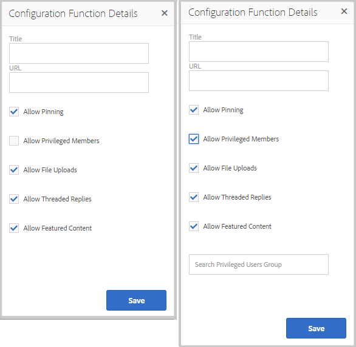

# Community-funktioner{#community-functions}

Den typ av funktioner som förväntas av en community-upplevelse är välkända. Community-funktioner är tillgängliga som communityfunktioner. De är i princip en eller flera sidor som är färdiga för implementering av en communityfunktion som kräver mer än att bara lägga till en komponent på en sida i redigeringsläge. De är byggstenarna som används för att definiera strukturen för en [community-webbplatsmall](/help/communities/sites.md) från vilken communitywebbplatser [skapas](/help/communities/sites-console.md).

När en community-webbplats har skapats kan innehåll läggas till på de resulterande sidorna med hjälp av standardredigeringsläget [AEM](/help/sites-authoring/editing-content.md). Olika communityfunktioner är tillgängliga enligt vad som visas i användarfunktionskonsolen.

>[!NOTE]
>
>Konsolerna för att skapa [communitywebbplatser](/help/communities/sites-console.md), [mallar för communitywebbplatser](/help/communities/sites.md), [mallar för communitygrupper](/help/communities/tools-groups.md) och [communityfunktioner](/help/communities/functions.md) är endast avsedda att användas i författarmiljön.

## Community Function Console {#community-functions-console}

Så här når du användarfunktionskonsolen i författarmiljön:

* Navigera till **[!UICONTROL Tools]** > **[!UICONTROL Communities]** > **[!UICONTROL Community Functions]**.

## Fördefinierade funktioner {#pre-built-functions}

Här följer en kort beskrivning av funktionerna i AEM Communities. Varje funktion innehåller en eller flera AEM sidor som innehåller webbgruppskomponenter sammankopplade till en funktion som enkelt kan införlivas i en [communitywebbplatsmall](/help/communities/sites.md).

En mall för en community-webbplats innehåller strukturen för en community-webbplats, inklusive inloggning, användarprofiler, meddelanden, meddelanden, webbplatsmeny, sökning, teman och varumärken.

### Titel- och URL-inställningar {#title-and-url-settings}

**Titel** och **URL** är egenskaper som är gemensamma för alla communityfunktioner.

När en communityfunktion läggs till i en mall för en community-webbplats eller läggs till när [strukturen för en community-webbplats ändras](/help/communities/sites-console.md#modifying-site-properties) öppnas funktionens dialogruta så att titeln och URL-adressen kan konfigureras.

#### Information om konfigurationsfunktion {#configuration-function-details}

* **Titel**

  (*Obligatoriskt*) Texten som visas på menyn med funktioner för webbplatsen

* **URL**

  (*Obligatoriskt*) Namnet som används för att generera URI:n. Namnet måste följa de [namnkonventioner](/help/sites-developing/naming-conventions.md) som anges av AEM och JCR.

Använd till exempel den webbplats som skapas från följande självstudiekurs [Komma igång](/help/communities/getting-started.md) om

* Titel = webbsida
* URL = sida

Därefter är URL:en till sidan https://localhost:4503/content/sites/engage/en/page.html

och menylänken för sidan visas som:

### Funktion för aktivitetsström {#activity-stream-function}

Aktivitetsströmsfunktionen är en sida med en [aktivitetsströmkomponent](/help/communities/activities.md) med alla vyer markerade (alla aktiviteter, användaraktiviteter och följande). Se även [Grundläggande om aktivitetsström](/help/communities/essentials-activities.md) för utvecklare.

När du lägger till en mall öppnas följande dialogruta:

#### Information om konfigurationsfunktion {#configuration-function-details-1}

* [Titel- och URL-inställningar](#title-and-url-settings)

* **Visa vyn Mina aktiviteter**

  Om du väljer det här alternativet innehåller sidan Aktiviteter en flik som filtrerar aktiviteter baserat på aktiviteter som genererats i communityn av den aktuella medlemmen. Standard är valt.

* **Visa vyn Alla aktiviteter**

  Om du väljer det här alternativet innehåller sidan Aktiviteter en flik som innehåller alla aktiviteter som genereras i den community som den aktuella medlemmen har tillgång till. Standard är valt.

* **Visa vyn Nyhetsfeed**

  Om du väljer det här alternativet innehåller aktivitetssidorna en flik som filtrerar aktiviteter baserat på de som den aktuella medlemmen följer. Standard är valt.

### Bloggfunktion {#blog-function}

Bloggfunktionen är en sida med en [Blog-komponent](/help/communities/blog-feature.md) som är konfigurerad för taggning, filöverföringar, som följer, medlemmar som kan redigera, rösta och moderera själva. Se även [Blog Essentials](/help/communities/blog-developer-basics.md) för utvecklare.

När du lägger till en mall öppnas följande dialogruta:

* [Titel- och URL-inställningar](#title-and-url-settings)

* **Tillåt behöriga medlemmar**

  Om det här alternativet är markerat tillåter bloggen endast behöriga medlemmar att skapa artiklar genom att tillåta val av en [privilegierad medlemsgrupp](/help/communities/users.md#privileged-members-group). Om det inte är markerat kan alla community-medlemmar skapa. Standard är avmarkerat.

* **Tillåt filöverföringar**

  Om du väljer det här alternativet kan medlemmarna ladda upp filer. Standard är valt.

* **Tillåt kopplade svar**

  Om det inte är markerat tillåter bloggen svar (kommentarer) på en artikel, men det är inte tillåtet att svara på kommentarer. Standard är valt.

* **Tillåt aktuellt innehåll**

  Om du väljer det här alternativet identifieras bloggen som [aktuellt innehåll](/help/communities/featured.md). Standard är valt.

### Kalenderfunktion {#calendar-function}

Kalenderfunktionen är en sida med en [kalenderkomponent](/help/communities/calendar.md) som är konfigurerad att tillåta taggning. Se även [Calendar Essentials](/help/communities/calendar-basics-for-developers.md) för utvecklare.

När du lägger till en mall öppnas följande dialogruta:

* [Titel- och URL-inställningar](#title-and-url-settings)

* **Tillåt fästa**

  Om du väljer det här alternativet kan ämnessvar fästas till början av kommentarlistan. Standard är valt.

* **Tillåt behöriga medlemmar**

  Om det här alternativet är markerat tillåter bloggen endast behöriga medlemmar att skapa artiklar genom att tillåta val av en [privilegierad medlemsgrupp](/help/communities/users.md#privileged-members-group). Om det inte är markerat kan alla community-medlemmar skapa. Standard är avmarkerat.

* **Tillåt filöverföringar**

  Om du väljer det här alternativet kan medlemmarna ladda upp filer. Standard är valt.

* **Tillåt kopplade svar**

  Om det inte är markerat tillåter bloggen svar (kommentarer) på en artikel, men det är inte tillåtet att svara på kommentarer. Standard är valt.

* **Tillåt aktuellt innehåll**

  Om det här alternativet är markerat identifieras dess innehåll som [aktuellt innehåll](/help/communities/featured.md). Standard är valt.

### Funktion för aktuellt innehåll {#featured-content-function}

Funktionen för aktuellt innehåll är en sida med en [innehållskomponent](/help/communities/featured.md) som är konfigurerad för att tillåta att kommentarer läggs till och tas bort.

Möjligheten att använda innehåll kan vara tillåten eller otillåten per komponent (se [bloggfunktion](#blog-function), [kalenderfunktion](#calendar-function), [forumfunktion](#forum-function), [Ideationsfunktion](#ideation-function) och [QnA-funktion](#qna-function)).

När det läggs till i en mall är den enda konfigurationen för [titel- och URL-inställningarna](#title-and-url-settings).

### Filbiblioteksfunktion {#file-library-function}

Filbiblioteksfunktionen är en sida med en [filbibliotekskomponent](/help/communities/file-library.md) som tillåter att kommentarer läggs till och tas bort.

När det läggs till i en mall är den enda konfigurationen för [titel- och URL-inställningarna](#title-and-url-settings).

### Forum {#forum-function}

Forumfunktionen är en sida med en [forumkomponent](/help/communities/forum.md) som är konfigurerad för taggning, filöverföringar, följda medlemmar som kan redigera, rösta och moderera själva.

När du lägger till en mall öppnas följande dialogruta:

#### Information om konfigurationsfunktion {#configuration-function-details-2}

* [Titel- och URL-inställningar](#title-and-url-settings)

* **Tillåt fästa**

  Om du väljer det här alternativet kan ämnessvar fästas till början av kommentarlistan. Standard är valt.

* **Tillåt behöriga medlemmar**

  Om det här alternativet är markerat tillåter forumet endast behöriga medlemmar att publicera ämnen genom att tillåta val av en [privilegierad medlemsgrupp](/help/communities/users.md#privileged-members-group). Om det inte är markerat får alla community-medlemmar publicera. Standard är avmarkerat.

* **Tillåt filöverföringar**

  Om du väljer det här alternativet kan medlemmarna ladda upp filer. Standard är valt.

* **Tillåt kopplade svar**

  Om det inte är markerat tillåter forumet kommentarer om ett ämne, men det är inte tillåtet att svara på dessa kommentarer. Standard är valt.

* **Tillåt aktuellt innehåll**

  Om du väljer det här alternativet identifieras komponentens innehåll som [aktuellt innehåll](/help/communities/featured.md). Standard är valt.

### Funktionen Grupper {#groups-function}

>[!CAUTION]
>
>Gruppfunktionen får *inte* vara den *första eller den enda* funktionen i en webbplats struktur eller i en community-webbplatsmall.
>
>Alla andra funktioner, till exempel [sidfunktionen](#page-function), måste inkluderas och listas först.

Med gruppfunktionen kan communitymedlemmar skapa undergrupper på communitywebbplatsen i publiceringsmiljön.

Beroende på [inställningar](/help/communities/sites-console.md#groupmanagement) när funktionen Grupper ingår i en [community-webbplatsmall](/help/communities/sites.md) kan grupperna vara offentliga eller privata och en eller flera community-gruppmallar kan konfigureras för att tillhandahålla ett val av mallar när community-gruppen faktiskt skapas (t.ex. från publiceringsmiljön). En [community-gruppmall](/help/communities/tools-groups.md) anger vilka communityfunktioner som skapas för gruppsidorna, till exempel forum och kalendrar.

När en community-grupp skapas skapas en medlemsgrupp dynamiskt för den nya gruppen, som medlemmar kan tilldelas eller ansluta till. Mer information finns i [Hantera användare och användargrupper](/help/communities/users.md).

Från och med [funktionspaketet &#x200B;](/help/communities/deploy-communities.md#latestfeaturepack) för Communities skapas communitygrupper i författarmiljön med hjälp av [gruppkonsolen för Communities](/help/communities/groups.md) och kan skapas i publiceringsmiljön när det är aktiverat.

När du lägger till en mall öppnas följande dialogruta:

* [Titel- och URL-inställningar](#title-and-url-settings)

* **Välj gruppmallar**

  En nedrullningsbar meny som gör det möjligt att välja mellan en eller flera aktiverade gruppmallar som den som skapar en ny community (i publiceringsmiljön) kan välja mellan.

* **Tillåt behöriga medlemmar**

  Om det här alternativet är markerat tillåter forumet endast behöriga medlemmar att publicera ämnen genom att tillåta val av en [privilegierad medlemssäkerhetsgrupp](/help/communities/users.md#privileged-members-group). Om det inte är markerat får alla community-medlemmar publicera. Standard är avmarkerat.

* **Tillåt skapande av Publish**

  Om du väljer det här alternativet kan auktoriserade communitymedlemmar skapa en grupp i publiceringsmiljön. Om du avmarkerar det här alternativet kan nya grupper (undergrupper) bara skapas i författarmiljön från gruppkonsolen Webbplatser.
Standard är valt.

### Ideationsfunktion {#ideation-function}

Identifieringsfunktionen är en sida med en [Ideation-komponent](/help/communities/ideation-feature.md).

När du lägger till en mall öppnas följande dialogruta, som anger standardnamn för titel och URL samt standardvisningsinställningar för mallen:

* [Titel- och URL-inställningar](#title-and-url-settings)

* **Tillåt behöriga medlemmar**

  Om det här alternativet är markerat tillåter forumet endast behöriga medlemmar att publicera ämnen genom att tillåta val av en [privilegierad medlemssäkerhetsgrupp](/help/communities/users.md#privileged-members-group). Om det inte är markerat får alla community-medlemmar publicera. Standard är avmarkerat.

* **Tillåt filöverföringar**

  Om du väljer det här alternativet kan medlemmarna överföra filer. Standard är valt.

* **Tillåt kopplade svar**

  Om du inte väljer det här alternativet tillåts svar (kommentarer) på ett ämne, men det är inte tillåtet att svara på kommentarer. Standard är valt.

* **Tillåt aktuellt innehåll**

  Om det här alternativet är markerat identifieras dess innehåll som [aktuellt innehåll](/help/communities/featured.md). Standard är valt.

### Ledarbordsfunktion {#leaderboard-function}

Ledpanelsfunktionen är en sida med en [Leaderboard-komponent](/help/communities/enabling-leaderboard.md).

**OBS!**: Ledarpanelskomponenten behöver konfigureras ytterligare *när* en community-webbplats har skapats från en community-mall som innehåller Ledarpanelsfunktionen. Ange ledningskomponentens [regler](/help/communities/enabling-leaderboard.md#rules-tab), som är beroende av konfigurationen av [poängsättning och badges](/help/communities/implementing-scoring.md) för communitywebbplatsen.

När du lägger till en mall öppnas följande dialogruta, som anger standardnamn för titel och URL samt standardvisningsinställningar för mallen:

* [Titel- och URL-inställningar](#title-and-url-settings)

* **Visningsmärke**

  Om du väljer det här alternativet inkluderas en kolumn för ikoner för emblem i rankningslistan.
Standard är avmarkerat.

* **Visa märkesnamn**

  Om du väljer det här alternativet inkluderas en kolumn för märkordsnamnet i resultatlistan.
Standard är avmarkerat.

* **Display Avatar**

  Om du väljer det här alternativet inkluderas avatarbilden för medlemmen i ledningsgruppen bredvid namnlänken till medlemsprofilen.
Standard är avmarkerat.

### Sidfunktion {#page-function}

Sidfunktionen lägger till en tom sida på communitywebbplatsen som den är kopplad till funktionerna på communitywebbplatsen: inloggning, meny, meddelanden, meddelanden, teman och varumärken. Innehåll läggs till på sidan med hjälp av [AEM standardredigeringsläget](/help/sites-authoring/editing-content.md).

När det läggs till i en mall är den enda konfigurationen för [titel- och URL-inställningarna](#title-and-url-settings).

### QnA-funktion {#qna-function}

QnA-funktionen är en sida med en [QnA-komponent](/help/communities/working-with-qna.md) som är konfigurerad för taggning, filöverföringar, följda, medlemmar för självredigering, röstning och moderering.

När konfigurationen läggs till i en mall tillåts begränsningar för behöriga medlemmar:

* [Titel- och URL-inställningar](#title-and-url-settings)

* **Tillåt fästa**

  Om du väljer det här alternativet kan ämnessvar fästas till början av kommentarlistan. Standard är valt.

* **Tillåt behöriga medlemmar**

  Om det här alternativet är markerat tillåter QnA-forumet endast behöriga medlemmar att publicera frågor genom att tillåta val av en [privilegierad medlemsgrupp](/help/communities/users.md#privileged-members-group). Om det inte är markerat får alla community-medlemmar publicera. Standard är avmarkerat.

* **Tillåt filöverföringar**

  Om du väljer det här alternativet kan medlemmarna ladda upp filer. Standard är valt.

* **Tillåt kopplade svar**

  Om det inte är markerat tillåter QnA-forumet kommentarer (svar) till en publicerad fråga, men svar på svar tillåts inte. Standard är valt.

* **Tillåt aktuellt innehåll**

  Om det här alternativet är markerat identifieras dess innehåll som [aktuellt innehåll](/help/communities/featured.md). Standard är valt.

## Skapa communityfunktion {#create-community-function}

Du kan skapa en communityfunktion genom att välja ikonen `Create Community Function` som finns högst upp i användarfunktionskonsolen. Flera funktioner som är baserade på samma AEM kan skapas och sedan anpassas unikt genom att du öppnar i redigeringsläget.

### Community-funktionsnamn {#community-function-name}

På panelen Community Function Name konfigureras ett namn, en beskrivning och om funktionen är aktiverad eller inaktiverad:

* **Community-funktionsnamn**

  Det funktionsnamn som används för visning och lagring.

* **Beskrivning av communityfunktion**

  Funktionsbeskrivningen för visning.

* **Inaktiverad/aktiverad**

  En växlingsväxling som styr om funktionen kan refereras.

### AEM {#aem-blueprint}

På panelen `AEM Blueprint` är det möjligt att välja en plan som är den underliggande implementeringen av communityfunktionen.

Community-funktionen är en miniwebbplats som innehåller en eller flera sidor som är färdiga att ingå i en community-webbplats, inklusive inloggning, användarprofiler, meddelanden, webbplatsmeny, söknings-, teman- och varumärkesfunktioner. När funktionen har skapats kan du [öppna funktionen](#open-community-function) i redigeringsläget för författare och anpassa sidan eller komponentinställningarna.

Eftersom communityfunktionen implementeras som en [live-kopia](/help/sites-administering/msm.md#live-copies) av en [plan](/help/sites-administering/msm-livecopy.md#creatingablueprint) är det möjligt att göra ändringar som gjorts i en funktion som påverkar alla communitywebbplatssidor som skapats från [communitywebbplatsmallen](/help/communities/sites.md) eller [communitygruppsmallen](/help/communities/tools-groups.md) som innehåller funktionen. Det går också att ta bort kopplingen mellan en sida och dess överordnade plan för att göra ändringar på sidnivå.

Se även [Multi Site Manager](/help/sites-administering/msm.md).

### Miniatyrbild {#thumbnail}

På miniatyrpanelen kan en bild överföras för visning i [användarfunktionskonsolen](#community-functions-console).

## Öppen communityfunktion {#open-community-function}

Markera ikonen `Open Community Function` om du vill aktivera redigeringsläget för författare för redigering av sidinnehållet och ändring av konfigurationen för funktionskomponenten/funktionskomponenterna.

### Konfigurera komponenter {#configuring-components}

En communityfunktion implementeras som en Live-kopia av en AEM, som beskrivs i [Multi Site Manager](/help/sites-administering/msm.md).

Det går inte bara att skapa sidinnehåll utan även att konfigurera komponenter.

Om du konfigurerar en komponent på en sida i en skapad community-webbplats kan det vara nödvändigt att avbryta [arvet](/help/sites-administering/msm-livecopy.md#changing-live-copy-content) för att konfigurera komponenten. Arv bör återupprättas när konfigurationen slutförs.

Mer konfigurationsinformation finns på [Webbgruppskomponenter](/help/communities/author-communities.md) för författare.

## Redigera communityfunktion {#edit-community-function}

Markera ikonen `Edit Community Function` om du vill redigera funktionens egenskaper med samma paneler som [skapar en communityfunktion](#create-community-function), inklusive att aktivera eller inaktivera funktionen.
