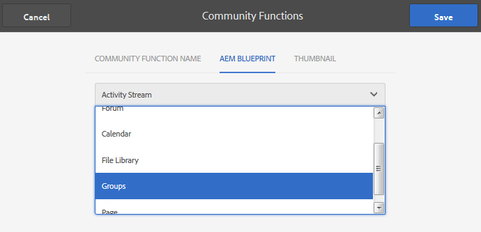

# Community-funktioner{#community-functions}

Den typ av funktioner som förväntas av en community-upplevelse är välkända. Community-funktioner är tillgängliga som communityfunktioner. De är i princip en eller flera sidor som är färdiga för implementering av en communityfunktion som kräver mer än att bara lägga till en komponent på en sida i redigeringsläge. De är byggstenarna som används för att definiera strukturen för en [community-webbplatsmall](/help/communities/sites.md) från vilken communitywebbplatser [skapas](/help/communities/sites-console.md).

När en communitywebbplats har skapats kan innehåll läggas till på de resulterande sidorna med hjälp av standardredigeringsläget [AEM](/help/sites-authoring/editing-content.md). Olika communityfunktioner är tillgängliga enligt vad som visas i användarfunktionskonsolen.

>[!NOTE]
>
>Konsolerna för att skapa [communitywebbplatser](/help/communities/sites-console.md), [mallar för communitywebbplatser](/help/communities/sites.md), [mallar för communitygrupper](/help/communities/tools-groups.md) och [communityfunktioner](/help/communities/functions.md) är endast avsedda att användas i redigeringsmiljön.

## Community Function Console {#community-functions-console}

Så här når du användarfunktionskonsolen i författarmiljön:

* Navigera till **[!UICONTROL Tools]** > **[!UICONTROL Communities]** > **[!UICONTROL Community Functions]**.

## Fördefinierade funktioner {#pre-built-functions}

Här följer en kort beskrivning av funktionerna i AEM Communities. Varje funktion innehåller en eller flera AEM sidor som innehåller webbgruppskomponenter sammankopplade till en funktion som enkelt kan integreras i en [community-webbplatsmall](/help/communities/sites.md).

En mall för en community-webbplats innehåller strukturen för en community-webbplats, inklusive inloggning, användarprofiler, meddelanden, meddelanden, webbplatsmeny, sökning, teman och varumärken.

### Titel- och URL-inställningar {#title-and-url-settings}

**Titlar** och  **** URL är egenskaper som är gemensamma för alla communityfunktioner.

När en communityfunktion läggs till i en mall för en community-webbplats eller läggs till när [strukturen för en community-plats ändras, öppnas funktionens dialogruta så att titeln och URL:en kan konfigureras.](/help/communities/sites-console.md#modifying-site-properties)

#### Information om konfigurationsfunktion {#configuration-function-details}

* **Titel**

   (*Obligatoriskt*) Den text som visas på menyn med funktioner för platsen

* **Webbadress**

   (*Obligatoriskt*) Namnet som används för att generera URI:n. Namnet måste följa de [namnkonventioner](/help/sites-developing/naming-conventions.md) som AEM och JCR har infört.

Använd till exempel den webbplats som skapas från följande [självstudiekurs för att komma igång](/help/communities/getting-started.md), om

* Titel = webbsida
* URL = sida

Därefter är URL:en till sidan https://localhost:4503/content/sites/engage/en/page.html

och menylänken för sidan visas som:

### Funktion för aktivitetsström {#activity-stream-function}

Aktivitetsströmsfunktionen är en sida med en [aktivitetsströmkomponent](/help/communities/activities.md) med alla vyer markerade (alla aktiviteter, användaraktiviteter och följande). Se även [Activity Stream Essentials](/help/communities/essentials-activities.md) för utvecklare.

När du lägger till en mall öppnas följande dialogruta:

#### Information om konfigurationsfunktion {#configuration-function-details-1}

* [Titel- och URL-inställningar](#title-and-url-settings)

* **Visa vyn&quot;Mina aktiviteter&quot;**

   Om du väljer det här alternativet innehåller sidan Aktiviteter en flik som filtrerar aktiviteter baserat på aktiviteter som genererats i communityn av den aktuella medlemmen. Standard är valt.

* **Visa vyn Alla aktiviteter**

   Om du väljer det här alternativet innehåller sidan Aktiviteter en flik som innehåller alla aktiviteter som genereras i den community som den aktuella medlemmen har tillgång till. Standard är valt.

* **Visa vyn Nyhetsfeed**

   Om du väljer det här alternativet innehåller aktivitetssidorna en flik som filtrerar aktiviteter baserat på de som den aktuella medlemmen följer. Standard är valt.

### Tilldelningsfunktion {#assignments-function}

Tilldelningsfunktionen är den grundläggande funktionen som definierar en [community-webbplats för aktivering](/help/communities/overview.md#enablement-community). Det gör det möjligt att tilldela aktiveringsresurser till communitymedlemmar. Se även [Tilldelningar Grundläggande](/help/communities/essentials-assignments.md) för utvecklare.

Den här funktionen är tillgänglig som en funktion i [aktiveringstillägget](/help/communities/enablement.md). Tillägget kräver ytterligare licenser för användning i en produktionsmiljö.

När du lägger till en mall är den enda konfigurationen för [titel- och URL-inställningarna](#title-and-url-settings).

### Bloggfunktion {#blog-function}

Bloggfunktionen är en sida med en [Blog-komponent](/help/communities/blog-feature.md) som är konfigurerad för taggning, filöverföringar, följda, medlemmar som kan redigera själva, rösta och moderera. Se även [Blog Essentials](/help/communities/blog-developer-basics.md) för utvecklare.

När du lägger till en mall öppnas följande dialogruta:

* [Titel- och URL-inställningar](#title-and-url-settings)

* **Tillåt behöriga medlemmar**

   Om det här alternativet är markerat tillåter bloggen endast behöriga medlemmar att skapa artiklar genom att tillåta val av en [privilegierad medlemsgrupp](/help/communities/users.md#privileged-members-group). Om det inte är markerat kan alla community-medlemmar skapa. Standard är avmarkerat.

* **Tillåt filöverföringar**

   Om du väljer det här alternativet kan medlemmarna ladda upp filer. Standard är valt.

* **Tillåt kopplade svar**

   Om det inte är markerat tillåter bloggen svar (kommentarer) på en artikel, men det är inte tillåtet att svara på kommentarer. Standard är valt.

* **Tillåt innehåll**

   Om du väljer det här alternativet identifieras bloggen som [aktuellt innehåll](/help/communities/featured.md). Standard är valt.

### Kalenderfunktion {#calendar-function}

Kalenderfunktionen är en sida med en [kalenderkomponent](/help/communities/calendar.md) som är konfigurerad för att tillåta taggning. Se även [Calendar Essentials](/help/communities/calendar-basics-for-developers.md) för utvecklare.

När du lägger till en mall öppnas följande dialogruta:

* [Titel- och URL-inställningar](#title-and-url-settings)

* **Tillåt fästa**

   Om du väljer det här alternativet kan ämnessvar fästas till början av kommentarlistan. Standard är valt.

* **Tillåt behöriga medlemmar**

   Om det här alternativet är markerat tillåter bloggen endast behöriga medlemmar att skapa artiklar genom att tillåta val av en [privilegierad medlemsgrupp](/help/communities/users.md#privileged-members-group). Om det inte är markerat kan alla community-medlemmar skapa. Standard är avmarkerat.

* **Tillåt filöverföringar**

   Om du väljer det här alternativet kan medlemmarna ladda upp filer. Standard är valt.

* **Tillåt kopplade svar**

   Om det inte är markerat tillåter bloggen svar (kommentarer) på en artikel, men det är inte tillåtet att svara på kommentarer. Standard är valt.

* **Tillåt innehåll**

   Om det här alternativet är markerat identifieras dess innehåll som [aktuellt innehåll](/help/communities/featured.md). Standard är valt.

### Katalogfunktion {#catalog-function}

Katalogfunktionen gör att medlemmar i [communityn för aktivering](/help/communities/overview.md#enablement-community) kan bläddra bland aktiveringsresurser som de inte har tilldelats. Se [Tagga aktiveringsresurser](/help/communities/tag-resources.md) och [Catalog Essentials](/help/communities/catalog-developer-essentials.md) för utvecklare.

Alla aktiveringsresurser och utbildningsvägar för communitywebbplatsen visas i alla kataloger om egenskapen ` [Show in Catalog](/help/communities/resources.md)` är inställd på true. Om du vill inkludera resurser och utbildningsvägar explicit måste du använda ett [förfilter](/help/communities/catalog-developer-essentials.md#pre-filters) i katalogen.

När den läggs till i en mall tillåter konfigurationen att du anger taggnamnutrymmen som används för att konfigurera taggfiltret som visas för webbplatsens besökare:

* [Titel- och URL-inställningar](#title-and-url-settings)

* **Markera alla namnutrymmen**

   De markerade taggnamnutrymmena definierar vilka taggar som besökare kan markera för att filtrera listan med aktiveringsresurser som finns i katalogen.
Om det här alternativet är markerat är alla taggnamnutrymmen som är tillåtna för communitywebbplatsen tillgängliga.
Om du avmarkerar det här alternativet kan du välja ett eller flera namnutrymmen som är tillåtna för communitywebbplatsen.
Standard är valt.

### Funktionen Innehåll {#featured-content-function}

Funktionen för aktuellt innehåll är en sida med en [innehållskomponent](/help/communities/featured.md) som är konfigurerad för att tillåta att kommentarer läggs till och tas bort.

Möjligheten att använda innehåll kan vara tillåten eller otillåten per komponent (se [Bloggfunktion](#blog-function), [Kalenderfunktion](#calendar-function), [Forumfunktion](#forum-function), [Ideationsfunktion](#ideation-function) och [QnA-funktion](#qna-function)).

När du lägger till en mall är den enda konfigurationen för [titel- och URL-inställningarna](#title-and-url-settings).

### Filbiblioteksfunktion {#file-library-function}

Filbiblioteksfunktionen är en sida med en [filbibliotekskomponent](/help/communities/file-library.md) som är konfigurerad för att tillåta att kommentarer läggs till och tas bort.

När du lägger till en mall är den enda konfigurationen för [titel- och URL-inställningarna](#title-and-url-settings).

### Forum Function {#forum-function}

Forumfunktionen är en sida med en [forumkomponent](/help/communities/forum.md) som är konfigurerad för taggning, filöverföringar, och efterföljande medlemmar som kan redigera, rösta och moderera själva.

När du lägger till en mall öppnas följande dialogruta:

#### Information om konfigurationsfunktion {#configuration-function-details-2}

* [Titel- och URL-inställningar](#title-and-url-settings)

* **Tillåt fästa**

   Om du väljer det här alternativet kan ämnessvar fästas till början av kommentarlistan. Standard är valt.

* **Tillåt behöriga medlemmar**

   Om det här alternativet är markerat tillåter forumet endast behöriga medlemmar att publicera ämnen genom att tillåta val av en [privilegierad medlemsgrupp](/help/communities/users.md#privileged-members-group). Om det inte är markerat får alla community-medlemmar publicera. Standard är avmarkerat.

* **Tillåt filöverföringar**

   Om du väljer det här alternativet kan medlemmarna ladda upp filer. Standard är valt.

* **Tillåt kopplade svar**

   Om det inte är markerat tillåter forumet kommentarer om ett ämne, men svar på dessa kommentarer tillåts inte. Standard är valt.

* **Tillåt innehåll**

   Om det här alternativet är markerat identifieras komponentens innehåll som [aktuellt innehåll](/help/communities/featured.md). Standard är valt.

### Gruppfunktion {#groups-function}

>[!CAUTION]
>
>Gruppfunktionen får *inte* vara *först eller den enda*-funktionen i strukturen för en plats eller i en community-platsmall.
>
>Alla andra funktioner, till exempel [sidfunktionen](#page-function), måste inkluderas och visas först.

Med gruppfunktionen kan communitymedlemmar skapa undergrupper på communitywebbplatsen i publiceringsmiljön.

Beroende på [inställningarna](/help/communities/sites-console.md#groupmanagement) när funktionen Grupper ingår i en [community-webbplatsmall](/help/communities/sites.md), kan grupperna vara offentliga eller privata och en eller flera community-gruppmallar kan konfigureras för att tillhandahålla ett urval av mallar när communitygruppen faktiskt skapas (t.ex. från publiceringsmiljön). En [community-gruppmall](/help/communities/tools-groups.md) anger vilka communityfunktioner som skapas för gruppsidorna, till exempel forum och kalendrar.

När en community-grupp skapas skapas en medlemsgrupp dynamiskt för den nya gruppen, som medlemmar kan tilldelas eller ansluta till. Mer information finns i [Hantera användare och användargrupper](/help/communities/users.md).

Från och med Communities [feature pack 1](/help/communities/deploy-communities.md#latestfeaturepack) skapas communitygrupper i författarmiljön med [Konsolen Webbgrupper](/help/communities/groups.md), och kan skapas i publiceringsmiljön när den är aktiverad.

När du lägger till en mall öppnas följande dialogruta:

* [Titel- och URL-inställningar](#title-and-url-settings)

* **Välj gruppmallar**

   En nedrullningsbar meny som gör det möjligt att välja mellan en eller flera aktiverade gruppmallar som den som skapar en ny community (i publiceringsmiljön) kan välja mellan.

* **Tillåt behöriga medlemmar**

   Om det här alternativet är markerat tillåter forumet endast behöriga medlemmar att publicera ämnen genom att tillåta val av en [privilegierad medlemssäkerhetsgrupp](/help/communities/users.md#privileged-members-group). Om det inte är markerat får alla community-medlemmar publicera. Standard är avmarkerat.

* **Tillåt skapande av publicering**

   Om du väljer det här alternativet kan auktoriserade communitymedlemmar skapa en grupp i publiceringsmiljön. Om du avmarkerar det här alternativet kan nya grupper (undergrupper) bara skapas i författarmiljön från gruppkonsolen Webbplatser.
Standard är valt.

### Ideationsfunktion {#ideation-function}

Idéfunktionen är en sida med en [Ideation-komponent](/help/communities/ideation-feature.md).

När du lägger till en mall öppnas följande dialogruta, som anger standardnamn för titel och URL samt standardvisningsinställningar för mallen:

* [Titel- och URL-inställningar](#title-and-url-settings)

* **Tillåt behöriga medlemmar**

   Om det här alternativet är markerat tillåter forumet endast behöriga medlemmar att publicera ämnen genom att tillåta val av en [privilegierad medlemssäkerhetsgrupp](/help/communities/users.md#privileged-members-group). Om det inte är markerat får alla community-medlemmar publicera. Standard är avmarkerat.

* **Tillåt filöverföringar**

   Om du väljer det här alternativet kan medlemmarna överföra filer. Standard är valt.

* **Tillåt kopplade svar**

   Om du inte väljer det här alternativet tillåts svar (kommentarer) på ett ämne, men det är inte tillåtet att svara på kommentarer. Standard är valt.

* **Tillåt innehåll**

   Om det här alternativet är markerat identifieras dess innehåll som [aktuellt innehåll](/help/communities/featured.md). Standard är valt.

### Ledarpanelsfunktion {#leaderboard-function}

Ledpanelsfunktionen är en sida med en [Leaderboard-komponent](/help/communities/enabling-leaderboard.md).

**OBS**: Komponenten Leaderboard behöver konfigureras ytterligare  ** när en community-webbplats skapas från en community-mall som innehåller funktionen Ledarpanel. Ange Leaderboard-komponentens [regler](/help/communities/enabling-leaderboard.md#rules-tab), som är beroende av konfigurationen av [poängsättning och badges](/help/communities/implementing-scoring.md) för communitywebbplatsen.

När du lägger till en mall öppnas följande dialogruta, som anger standardnamn för titel och URL samt standardvisningsinställningar för mallen:

* [Titel- och URL-inställningar](#title-and-url-settings)

* **Visa märke**

   Om du väljer det här alternativet inkluderas en kolumn för ikoner för emblem i rankningslistan.
Standard är avmarkerat.

* **Visa märkesnamn**

   Om du väljer det här alternativet inkluderas en kolumn för märkordsnamnet i resultatlistan.
Standard är avmarkerat.

* **Display Avatar**

   Om du väljer det här alternativet inkluderas avatarbilden för medlemmen i ledningsgruppen bredvid namnlänken till medlemsprofilen.
Standard är avmarkerat.

### Sidfunktion {#page-function}

Sidfunktionen lägger till en tom sida på communitywebbplatsen som den är kopplad till funktionerna på communitywebbplatsen: inloggning, meny, meddelanden, meddelanden, teman och branding. Innehåll läggs till på sidan med [AEM standardredigeringsläge](/help/sites-authoring/editing-content.md).

När du lägger till en mall är den enda konfigurationen för [titel- och URL-inställningarna](#title-and-url-settings).

### QnA-funktion {#qna-function}

QnA-funktionen är en sida med en [QnA-komponent](/help/communities/working-with-qna.md) som är konfigurerad för taggning, filöverföringar, följda medlemmar för självredigering, röstning och moderering.

När konfigurationen läggs till i en mall tillåts begränsningar för behöriga medlemmar:

* [Titel- och URL-inställningar](#title-and-url-settings)

* **Tillåt fästa**

   Om du väljer det här alternativet kan ämnessvar fästas till början av kommentarlistan. Standard är valt.

* **Tillåt behöriga medlemmar**

   Om det här alternativet är markerat tillåter QnA-forumet endast behöriga medlemmar att skicka frågor genom att tillåta val av en [privilegierad medlemsgrupp](/help/communities/users.md#privileged-members-group). Om det inte är markerat får alla community-medlemmar publicera. Standard är avmarkerat.

* **Tillåt filöverföringar**

   Om du väljer det här alternativet kan medlemmarna ladda upp filer. Standard är valt.

* **Tillåt kopplade svar**

   Om det inte är markerat tillåter QnA-forumet kommentarer (svar) till en publicerad fråga, men svar på svar tillåts inte. Standard är valt.

* **Tillåt innehåll**

   Om det här alternativet är markerat identifieras dess innehåll som [aktuellt innehåll](/help/communities/featured.md). Standard är valt.

## Skapa communityfunktion {#create-community-function}

Du kan skapa en communityfunktion genom att välja ikonen `Create Community Function` längst upp i användarfunktionskonsolen. Flera funktioner som är baserade på samma AEM kan skapas och sedan anpassas unikt genom att du öppnar i redigeringsläget.

### Community-funktionsnamn {#community-function-name}

På panelen Community Function Name konfigureras ett namn, en beskrivning och om funktionen är aktiverad eller inaktiverad:

* **Community-funktionsnamn**

   Det funktionsnamn som används för visning och lagring.

* **Beskrivning av communityfunktion**

   Funktionsbeskrivningen för visning.

* **Handikappade/aktiverade**

   En växlingsväxling som styr om funktionen kan refereras.

### AEM blå {#aem-blueprint}

På panelen `AEM Blueprint` är det möjligt att välja den plan som är den underliggande implementeringen av communityfunktionen.

Community-funktionen är en miniwebbplats som innehåller en eller flera sidor som är färdiga att ingå i en community-webbplats, inklusive inloggning, användarprofiler, meddelanden, webbplatsmeny, söknings-, teman- och varumärkesfunktioner. När funktionen har skapats kan du [öppna funktionen](#open-community-function) i redigeringsläget för författare och anpassa sidan eller komponentinställningarna.

Eftersom communityfunktionen är implementerad som en [live-kopia](/help/sites-administering/msm.md#live-copies) av en [plan](/help/sites-administering/msm-livecopy.md#creatingablueprint), är det möjligt att göra ändringar i en funktion som påverkar alla communitywebbplatssidor som skapats från [communitywebbplatsmallen](/help/communities/sites.md) eller [communitygruppsmallen](/help/communities/tools-groups.md) som innehåller funktionen. Det går också att ta bort kopplingen mellan en sida och dess överordnade plan för att göra ändringar på sidnivå.

Se även [Multi Site Manager](/help/sites-administering/msm.md).

### Miniatyrbild {#thumbnail}

På miniatyrpanelen kan en bild överföras för visning i [Community Function-konsolen](#community-functions-console).

## Öppna communityfunktion {#open-community-function}

Välj ikonen `Open Community Function` för att öppna redigeringsläget för författare för redigering av sidinnehållet och ändring av konfigurationen av funktionskomponenterna.

### Konfigurerar komponenter {#configuring-components}

En communityfunktion implementeras som en Live-kopia av en AEM, som beskrivs i [Multi Site Manager](/help/sites-administering/msm.md).

Det går inte bara att skapa sidinnehåll utan även att konfigurera komponenter.

Om du konfigurerar en komponent på en sida i en skapad community-webbplats kan det vara nödvändigt att avbryta [arv](/help/sites-administering/msm-livecopy.md#changing-live-copy-content) för att konfigurera komponenten. Arv bör återupprättas när konfigurationen slutförs.

Mer konfigurationsinformation finns på [Webbgruppskomponenter](/help/communities/author-communities.md) för författare.

## Redigera communityfunktion {#edit-community-function}

Välj ikonen `Edit Community Function` om du vill redigera funktionens egenskaper med samma paneler som [när du skapar en community-funktion](#create-community-function), inklusive att aktivera eller inaktivera funktionen.
