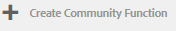

# Community-funktioner{#community-functions}

Den typ av funktioner som förväntas av en community-upplevelse är välkända. Community-funktioner är tillgängliga som communityfunktioner. De är i princip en eller flera sidor som är färdiga för implementering av en communityfunktion som kräver mer än att bara lägga till en komponent på en sida i redigeringsläge. De är de byggstenar som används för att definiera strukturen för en [mall för communitywebbplats](/help/communities/sites.md) från vilka communitywebbplatser [skapad](/help/communities/sites-console.md).

När en communitywebbplats har skapats kan innehåll läggas till på de resulterande sidorna med hjälp av standarden [AEM](/help/sites-authoring/editing-content.md). Olika communityfunktioner är tillgängliga enligt vad som visas i användarfunktionskonsolen.

>[!NOTE]
>
>Konsolerna för att skapa [communitysajter](/help/communities/sites-console.md), [mallar för communitysajter](/help/communities/sites.md), [communitygruppsmallar](/help/communities/tools-groups.md)och [communityfunktioner](/help/communities/functions.md) används endast i författarmiljön.

## Community Function Console {#community-functions-console}

Så här når du användarfunktionskonsolen i författarmiljön:

* Navigera till **[!UICONTROL Tools]** > **[!UICONTROL Communities]** > **[!UICONTROL Community Functions]**.

## Fördefinierade funktioner {#pre-built-functions}

Här följer en kort beskrivning av funktionerna i AEM Communities. Varje funktion innehåller en eller flera AEM sidor som innehåller komponenterna i användargrupperna sammankopplade till en funktion som enkelt kan införlivas i en [mall för communitywebbplats](/help/communities/sites.md).

En mall för en community-webbplats innehåller strukturen för en community-webbplats, inklusive inloggning, användarprofiler, meddelanden, meddelanden, webbplatsmeny, sökning, teman och varumärken.

### Titel- och URL-inställningar {#title-and-url-settings}

**Titel** och **URL** är egenskaper som är gemensamma för alla communityfunktioner.

När en communityfunktion läggs till i en mall för en community-webbplats eller läggs till när [ändra](/help/communities/sites-console.md#modifying-site-properties) strukturen för en communitywebbplats öppnas funktionens dialogruta så att titeln och URL:en kan konfigureras.

#### Information om konfigurationsfunktion {#configuration-function-details}

* **Titel**

   (*Obligatoriskt*) Texten som visas på menyn med funktioner för webbplatsen

* **Webbadress**

   (*Obligatoriskt*) Namnet som används för att generera URI:n. Namnet måste överensstämma med [namnkonventioner](/help/sites-developing/naming-conventions.md) som ålagts av AEM och JCR.

Använd till exempel den webbplats som skapas från följande [Komma igång](/help/communities/getting-started.md) självstudiekurs, om

* Titel = webbsida
* URL = sida

Därefter är URL:en till sidan https://localhost:4503/content/sites/engage/en/page.html

och menylänken för sidan visas som:

### Funktion för aktivitetsström {#activity-stream-function}

Funktionen för aktivitetsström är en sida med en [Aktivitetsströmkomponent](/help/communities/activities.md) med alla vyer markerade (alla aktiviteter, användaraktiviteter och följande). Se även [Grundläggande om aktivitetsström](/help/communities/essentials-activities.md) för utvecklare.

När du lägger till en mall öppnas följande dialogruta:

#### Information om konfigurationsfunktion {#configuration-function-details-1}

* [Titel- och URL-inställningar](#title-and-url-settings)

* **Visa vyn&quot;Mina aktiviteter&quot;**

   Om du väljer det här alternativet innehåller sidan Aktiviteter en flik som filtrerar aktiviteter baserat på aktiviteter som genererats i communityn av den aktuella medlemmen. Standard är valt.

* **Visa vyn Alla aktiviteter**

   Om du väljer det här alternativet innehåller sidan Aktiviteter en flik som innehåller alla aktiviteter som genereras i den community som den aktuella medlemmen har tillgång till. Standard är valt.

* **Visa vyn Nyhetsfeed**

   Om du väljer det här alternativet innehåller aktivitetssidorna en flik som filtrerar aktiviteter baserat på de som den aktuella medlemmen följer. Standard är valt.

### Tilldelningsfunktion {#assignments-function}

Tilldelningsfunktionen är den grundläggande funktionen som definierar en [communitywebbplats för aktivering](/help/communities/overview.md#enablement-community). Det gör det möjligt att tilldela aktiveringsresurser till communitymedlemmar. Se även [Grundläggande om uppdrag](/help/communities/essentials-assignments.md) för utvecklare.

Den här funktionen är tillgänglig som en funktion i [Aktivera tillägg](/help/communities/enablement.md). Tillägget kräver ytterligare licenser för användning i en produktionsmiljö.

När det läggs till i en mall är den enda konfigurationen för [Titel- och URL-inställningar](#title-and-url-settings).

### Bloggfunktion {#blog-function}

Bloggfunktionen är en sida med en [Bloggkomponent](/help/communities/blog-feature.md) konfigurerade för taggning, filöverföringar, följda, medlemmar för självredigering, röstning och moderering. Se även [Blog Essentials](/help/communities/blog-developer-basics.md) för utvecklare.

När du lägger till en mall öppnas följande dialogruta:

* [Titel- och URL-inställningar](#title-and-url-settings)

* **Tillåt behöriga medlemmar**

   Om du väljer det här alternativet tillåter bloggen endast behöriga medlemmar att skapa artiklar genom att tillåta val av en [privilegierad medlemsgrupp](/help/communities/users.md#privileged-members-group). Om det inte är markerat kan alla community-medlemmar skapa. Standard är avmarkerat.

* **Tillåt filöverföringar**

   Om du väljer det här alternativet kan medlemmarna ladda upp filer. Standard är valt.

* **Tillåt kopplade svar**

   Om det inte är markerat tillåter bloggen svar (kommentarer) på en artikel, men det är inte tillåtet att svara på kommentarer. Standard är valt.

* **Tillåt innehåll**

   Om du väljer det här alternativet identifieras bloggen som [innehåll](/help/communities/featured.md). Standard är valt.

### Kalenderfunktion {#calendar-function}

Kalenderfunktionen är en sida med en [Kalenderkomponent](/help/communities/calendar.md) konfigurerad för att tillåta taggning. Se även [Grundläggande kalender](/help/communities/calendar-basics-for-developers.md) för utvecklare.

När du lägger till en mall öppnas följande dialogruta:

* [Titel- och URL-inställningar](#title-and-url-settings)

* **Tillåt fästa**

   Om du väljer det här alternativet kan ämnessvar fästas till början av kommentarlistan. Standard är valt.

* **Tillåt behöriga medlemmar**

   Om du väljer det här alternativet tillåter bloggen endast behöriga medlemmar att skapa artiklar genom att tillåta val av en [privilegierad medlemsgrupp](/help/communities/users.md#privileged-members-group). Om det inte är markerat kan alla community-medlemmar skapa. Standard är avmarkerat.

* **Tillåt filöverföringar**

   Om du väljer det här alternativet kan medlemmarna ladda upp filer. Standard är valt.

* **Tillåt kopplade svar**

   Om det inte är markerat tillåter bloggen svar (kommentarer) på en artikel, men det är inte tillåtet att svara på kommentarer. Standard är valt.

* **Tillåt innehåll**

   Om det här alternativet är markerat identifieras dess innehåll som [innehåll](/help/communities/featured.md). Standard är valt.

### Katalogfunktion {#catalog-function}

Katalogfunktionen ger möjlighet att [användargrupper](/help/communities/overview.md#enablement-community) medlemmar för att bläddra bland aktiveringsresurser som inte är tilldelade dem. Se [Aktiveringsresurser för taggning](/help/communities/tag-resources.md) och [Catalog Essentials](/help/communities/catalog-developer-essentials.md) för utvecklare.

Alla aktiveringsresurser och utbildningsvägar för communitysajten visas i alla kataloger, om de tillhör en sådan, ` [Show in Catalog](/help/communities/resources.md)`, är inställt på true. Om du vill inkludera resurser och utbildningsvägar explicit måste du använda en [förfiltrera](/help/communities/catalog-developer-essentials.md#pre-filters) till katalogen.

När den läggs till i en mall tillåter konfigurationen att du anger taggnamnutrymmen som används för att konfigurera taggfiltret som visas för webbplatsens besökare:

* [Titel- och URL-inställningar](#title-and-url-settings)

* **Markera alla namnutrymmen**

   De markerade taggnamnutrymmena definierar vilka taggar som besökare kan markera för att filtrera listan med aktiveringsresurser som finns i katalogen.
Om det här alternativet är markerat är alla taggnamnutrymmen som är tillåtna för communitywebbplatsen tillgängliga.
Om du avmarkerar det här alternativet kan du välja ett eller flera namnutrymmen som är tillåtna för communitywebbplatsen.
Standard är valt.

### Funktion för aktuellt innehåll {#featured-content-function}

Den aktuella innehållsfunktionen är en sida med en [Innehållskomponent](/help/communities/featured.md) konfigurerad så att kommentarer kan läggas till och tas bort.

Möjligheten att använda innehåll kan vara tillåten eller otillåten per komponent (se [Bloggfunktion](#blog-function), [Kalenderfunktion](#calendar-function), [Forum](#forum-function), [Ideationsfunktion](#ideation-function)och [QnA-funktion](#qna-function)).

När det läggs till i en mall är den enda konfigurationen för [Titel- och URL-inställningar](#title-and-url-settings).

### Filbiblioteksfunktion {#file-library-function}

Filbiblioteksfunktionen är en sida med en [Filbibliotekskomponent](/help/communities/file-library.md) konfigurerad så att kommentarer kan läggas till och tas bort.

När det läggs till i en mall är den enda konfigurationen för [Titel- och URL-inställningar](#title-and-url-settings).

### Forum {#forum-function}

Forum-funktionen är en sida med en [Forumkomponent](/help/communities/forum.md) konfigurerade för taggning, filöverföringar, följda, medlemmar för självredigering, röstning och moderering.

När du lägger till en mall öppnas följande dialogruta:

#### Information om konfigurationsfunktion {#configuration-function-details-2}

* [Titel- och URL-inställningar](#title-and-url-settings)

* **Tillåt fästa**

   Om du väljer det här alternativet kan ämnessvar fästas till början av kommentarlistan. Standard är valt.

* **Tillåt behöriga medlemmar**

   Om det här alternativet är markerat tillåter forumet endast behöriga medlemmar att publicera ämnen genom att tillåta val av en [privilegierad medlemsgrupp](/help/communities/users.md#privileged-members-group). Om det inte är markerat får alla community-medlemmar publicera. Standard är avmarkerat.

* **Tillåt filöverföringar**

   Om du väljer det här alternativet kan medlemmarna ladda upp filer. Standard är valt.

* **Tillåt kopplade svar**

   Om det inte är markerat tillåter forumet kommentarer om ett ämne, men svar på dessa kommentarer tillåts inte. Standard är valt.

* **Tillåt innehåll**

   Om det här alternativet är markerat identifieras komponentens innehåll som [innehåll](/help/communities/featured.md). Standard är valt.

### Funktionen Grupper {#groups-function}

>[!CAUTION]
>
>Funktionen groups måste *not* vara *först eller bara* fungerar i en webbplats struktur eller i en mall för en community-webbplats.
>
>Alla andra funktioner, till exempel [sidfunktion](#page-function), måste inkluderas och listas först.

Med gruppfunktionen kan communitymedlemmar skapa undergrupper på communitywebbplatsen i publiceringsmiljön.

Beroende på [inställningar](/help/communities/sites-console.md#groupmanagement) när funktionen Grupper ingår i en [mall för communitywebbplats](/help/communities/sites.md), kan grupperna vara offentliga eller privata och en eller flera communitygruppsmallar kan konfigureras för att erbjuda ett urval av mallar när communitygruppen faktiskt skapas (t.ex. från publiceringsmiljön). A [community-gruppmall](/help/communities/tools-groups.md) anger vilka communityfunktioner som skapas för gruppsidorna, t.ex. forum och kalendrar.

När en community-grupp skapas skapas en medlemsgrupp dynamiskt för den nya gruppen, som medlemmar kan tilldelas eller ansluta till. Mer information finns i [Hantera användare och användargrupper](/help/communities/users.md).

Från och med Communities [funktionspaket 1](/help/communities/deploy-communities.md#latestfeaturepack), skapas communitygrupper i författarmiljön med hjälp av [Konsol för Communities Sites&#39; Groups](/help/communities/groups.md)och kan skapas i publiceringsmiljön när det är aktiverat.

När du lägger till en mall öppnas följande dialogruta:

* [Titel- och URL-inställningar](#title-and-url-settings)

* **Välj gruppmallar**

   En nedrullningsbar meny som gör det möjligt att välja mellan en eller flera aktiverade gruppmallar som den som skapar en ny community (i publiceringsmiljön) kan välja mellan.

* **Tillåt behöriga medlemmar**

   Om det här alternativet är markerat tillåter forumet endast behöriga medlemmar att publicera ämnen genom att tillåta val av en [säkerhetsgrupp för behöriga medlemmar](/help/communities/users.md#privileged-members-group). Om det inte är markerat får alla community-medlemmar publicera. Standard är avmarkerat.

* **Tillåt skapande av publicering**

   Om du väljer det här alternativet kan auktoriserade communitymedlemmar skapa en grupp i publiceringsmiljön. Om du avmarkerar det här alternativet kan nya grupper (undergrupper) bara skapas i författarmiljön från gruppkonsolen Webbplatser.
Standard är valt.

### Ideationsfunktion {#ideation-function}

Idéfunktionen är en sida med en [Idékomponent](/help/communities/ideation-feature.md).

När du lägger till en mall öppnas följande dialogruta, som anger standardnamn för titel och URL samt standardvisningsinställningar för mallen:

* [Titel- och URL-inställningar](#title-and-url-settings)

* **Tillåt behöriga medlemmar**

   Om det här alternativet är markerat tillåter forumet endast behöriga medlemmar att publicera ämnen genom att tillåta val av en [säkerhetsgrupp för behöriga medlemmar](/help/communities/users.md#privileged-members-group). Om det inte är markerat får alla community-medlemmar publicera. Standard är avmarkerat.

* **Tillåt filöverföringar**

   Om du väljer det här alternativet kan medlemmarna överföra filer. Standard är valt.

* **Tillåt kopplade svar**

   Om du inte väljer det här alternativet tillåts svar (kommentarer) på ett ämne, men det är inte tillåtet att svara på kommentarer. Standard är valt.

* **Tillåt innehåll**

   Om det här alternativet är markerat identifieras dess innehåll som [innehåll](/help/communities/featured.md). Standard är valt.

### Ledarbordsfunktion {#leaderboard-function}

Ledpanelsfunktionen är en sida med en [Ledarpanelskomponent](/help/communities/enabling-leaderboard.md).

**ANMÄRKNING**: Komponenten Leaderboard behöver konfigureras ytterligare *efter* en communitywebbplats skapas från en community-mall som innehåller funktionen Ledarpanel. Ange komponenterna i Ledarpanelen [regler](/help/communities/enabling-leaderboard.md#rules-tab), som är beroende av konfigurationen av [poängsättning och märken](/help/communities/implementing-scoring.md) för communitywebbplatsen.

När du lägger till en mall öppnas följande dialogruta, som anger standardnamn för titel och URL samt standardvisningsinställningar för mallen:

* [Titel- och URL-inställningar](#title-and-url-settings)

* **Visa märke**

   Om du väljer det här alternativet inkluderas en kolumn för ikoner för emblem i rankningslistan.
Standard är avmarkerat.

* **Visa märkesnamn**

   Om du väljer det här alternativet inkluderas en kolumn för märkordsnamnet i resultatlistan.
Standard är avmarkerat.

* **Display Avatar**

   Om du väljer det här alternativet inkluderas avatarbilden för medlemmen i ledningsgruppen bredvid namnlänken till medlemsprofilen.
Standard är avmarkerat.

### Sidfunktion {#page-function}

Sidfunktionen lägger till en tom sida på communitywebbplatsen som den är kopplad till funktionerna på communitywebbplatsen: inloggning, meny, meddelanden, meddelanden, teman och branding. Innehållet läggs till på sidan med [AEM](/help/sites-authoring/editing-content.md).

När det läggs till i en mall är den enda konfigurationen för [Titel- och URL-inställningar](#title-and-url-settings).

### QnA-funktion {#qna-function}

QnA-funktionen är en sida med en [QnA-komponent](/help/communities/working-with-qna.md) konfigurerade för taggning, filöverföringar, följda, medlemmar för självredigering, röstning och moderering.

När konfigurationen läggs till i en mall tillåts begränsningar för behöriga medlemmar:

* [Titel- och URL-inställningar](#title-and-url-settings)

* **Tillåt fästa**

   Om du väljer det här alternativet kan ämnessvar fästas till början av kommentarlistan. Standard är valt.

* **Tillåt behöriga medlemmar**

   Om det här alternativet är markerat tillåter QnA-forumet endast behöriga medlemmar att skicka frågor genom att tillåta val av en [privilegierad medlemsgrupp](/help/communities/users.md#privileged-members-group). Om det inte är markerat får alla community-medlemmar publicera. Standard är avmarkerat.

* **Tillåt filöverföringar**

   Om du väljer det här alternativet kan medlemmarna ladda upp filer. Standard är valt.

* **Tillåt kopplade svar**

   Om det inte är markerat tillåter QnA-forumet kommentarer (svar) till en publicerad fråga, men svar på svar tillåts inte. Standard är valt.

* **Tillåt innehåll**

   Om det här alternativet är markerat identifieras dess innehåll som [innehåll](/help/communities/featured.md). Standard är valt.

## Skapa community-funktion {#create-community-function}

Du kan skapa en communityfunktion genom att välja `Create Community Function` ikonen längst upp i användarfunktionskonsolen. Flera funktioner som är baserade på samma AEM kan skapas och sedan anpassas unikt genom att du öppnar i redigeringsläget.

### Community-funktionsnamn {#community-function-name}

På panelen Community Function Name konfigureras ett namn, en beskrivning och om funktionen är aktiverad eller inaktiverad:

* **Community-funktionsnamn**

   Det funktionsnamn som används för visning och lagring.

* **Beskrivning av communityfunktion**

   Funktionsbeskrivningen för visning.

* **Handikappade/aktiverade**

   En växlingsväxling som styr om funktionen kan refereras.

### AEM Blueprint {#aem-blueprint}

På `AEM Blueprint` kan du välja en plan som är den underliggande implementeringen av communityfunktionen.

Community-funktionen är en miniwebbplats som innehåller en eller flera sidor som är färdiga att ingå i en community-webbplats, inklusive inloggning, användarprofiler, meddelanden, webbplatsmeny, söknings-, teman- och varumärkesfunktioner. När funktionen har skapats är det möjligt att [öppna funktionen](#open-community-function) i redigeringsläget och anpassa sid- eller komponentinställningarna.

Eftersom communityfunktionen är implementerad som en [live copy](/help/sites-administering/msm.md#live-copies) av [skiss](/help/sites-administering/msm-livecopy.md#creatingablueprint)är det möjligt att göra ändringar i en funktion som påverkar alla communitywebbplatssidor som skapas från [mall för communitywebbplats](/help/communities/sites.md) eller [community-gruppmall](/help/communities/tools-groups.md) som innehåller funktionen. Det går också att ta bort kopplingen mellan en sida och dess överordnade plan för att göra ändringar på sidnivå.

Se även [Multi Site Manager](/help/sites-administering/msm.md).

### Miniatyrbild {#thumbnail}

På panelen Miniatyrbilder kan en bild överföras för visning i [Konsol för communityfunktioner](#community-functions-console).

## Öppen communityfunktion {#open-community-function}

Välj `Open Community Function` ikon för att öppna redigeringsläget för redigering av sidinnehållet och ändring av konfigurationen av funktionskomponenten(erna).

### Konfigurera komponenter {#configuring-components}

En communityfunktion implementeras som en Live-kopia av ett AEM-utkast, som beskrivs i [Multi Site Manager](/help/sites-administering/msm.md).

Det går inte bara att skapa sidinnehåll utan även att konfigurera komponenter.

Om du konfigurerar en komponent på en sida i en skapad community-webbplats kan du behöva avbryta [arv](/help/sites-administering/msm-livecopy.md#changing-live-copy-content) för att konfigurera komponenten. Arv bör återupprättas när konfigurationen slutförs.

Mer konfigurationsinformation finns på [Communities-komponenter](/help/communities/author-communities.md) för författare.

## Redigera communityfunktion {#edit-community-function}

Välj `Edit Community Function` om du vill redigera funktionens egenskaper med samma paneler som [skapa en communityfunktion](#create-community-function), inklusive att aktivera eller inaktivera funktionen.
