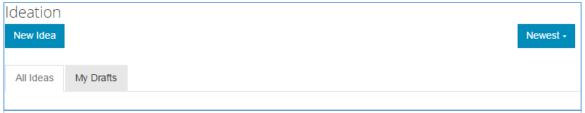

# Idéfunktion {#ideation-feature}

## Introduktion {#introduction}

Idéfunktionen är ett område där besökare (community-medlemmar) i Publish-miljön kan logga in för att:

* Skapa idéer att dela med communityn.
* Visa och kommentera idéer.
* Följ en idé.
* Rösta på en idé.

I det här avsnittet av dokumentationen beskrivs:

* Lägga till idéfunktionen på en AEM webbplats.
* Konfigurationsinställningar för Ideation-komponenten.

### Lägga till en idé på en sida {#adding-a-ideation-to-a-page}

Om du vill lägga till en `Ideation`-komponent på en sida i redigeringsläge använder du komponentwebbläsaren för att hitta

* `Communities / Ideation`

Dra den till en plats på en sida där idén ska visas.

Mer information finns på [Grunderna för communitykomponenter](/help/communities/basics.md).

När de [nödvändiga klientbiblioteken](/help/communities/ideation.md#essentials-for-client-side) inkluderas visas `Ideation`-komponenten så här:

### Konfigurera en idé {#configuring-an-ideation}

Markera den monterade `Ideation`-komponenten så att du kan komma åt och markera ikonen `Configure` som öppnar redigeringsdialogrutan.

#### Fliken Inställningar {#settings-tab}

Ange inställningar för idéer och kommentarer på fliken **[!UICONTROL Settings]**:

* **Tillåt miniatyrbild för bifogad fil**
* **Maximal storlek för miniatyrbildsanslutning**
* **Minsta bildstorlek för miniatyrbild**
* **Maximal miniatyrstorlek**
* **Tillåt behöriga medlemmar**
* **Tillåtna behöriga medlemmar**
* **Blockera användargenererat innehåll i redigeringsläget för författare**
* **Identitetstitel**

* Idéns visningsrubrik. Standardvärdet är `Ideation`.
* **Ideationsbeskrivning**

  En beskrivning som ska visas som underrubrik till idén. Standardvärdet är ingen beskrivning.

* **Ämnen per sida**

  Definierar antalet idéer/inlägg som visas per sida. Standardvärdet är 10.

* **Modererad**

  Om det här alternativet är markerat måste publicering av idéer och kommentarer godkännas innan de kan visas på en publiceringsplats. Standard är avmarkerat.

* **Stängd**

  Om det här alternativet är markerat är idéforumet stängt för nya idéer och kommentarer. Standard är avmarkerat.

* **RTF-redigerare**

  Om du markerar det här alternativet kan du lägga in kommentarer och idéer. Standard är avmarkerat.

* **Tillåt taggning**

  Om det här alternativet är markerat kan medlemmar lägga till taggetiketter i sina inlägg (se fliken **[!UICONTROL Tag field]**). Standard är avmarkerat.

* **Tillåt filöverföringar**

  Om du markerar det här alternativet kan du tillåta att bifogade filer läggs till i idén eller kommentaren. Standard är avmarkerat.

* **Maximal filstorlek**

  Endast relevant om `Allow File Uploads` är markerat. Det här fältet begränsar storleken (i byte) på en överförd fil. Standardvärdet är 104857600 (10 MB).

* **Tillåtna filtyper**

  Endast relevant om `Allow File Uploads` är markerat. En kommaavgränsad lista med filtillägg med punktavgränsaren. Exempel: .jpg, .jpeg, .png, .doc, .docx, .pdf. Om någon filtyp har angetts kan de inte överföras. Ingen standard har angetts så att alla filtyper tillåts.

* **Maximal filstorlek för bifogad bild**

  Endast relevant om Tillåt filöverföringar är markerat. Maximalt antal byte som en överförd bildfil kan ha. Standardvärdet är 2097152 (2 MB).

* **Tillåt svar**

  Om det här alternativet är markerat tillåts svar på kommentarer som har lagts till i idén. Standard är avmarkerat.

* **Tillåt röstning**

  Om det här alternativet är markerat tillåts omröstning om en idés kommentarer. Standard är avmarkerat.

* **Tillåt användare att ta bort kommentarer och ämnen**

  Om det här alternativet är markerat kan medlemmarna ta bort de kommentarer och idéer som de publicerade. Standard är avmarkerat.

* **Tillåt följande**

  Om du markerar det här alternativet inkluderar du följande funktion för idéinlägg, som gör att medlemmar kan [meddelas](/help/communities/notifications.md) om nya inlägg. Standard är avmarkerat.

* **Tillåt e-postprenumerationer**

  Om det här alternativet är markerat kan medlemmar meddelas om nya inlägg via e-post ([prenumeration](/help/communities/subscriptions.md)). Kräver att `Allow Following` kontrolleras och att [e-post konfigureras](/help/communities/email.md). Standard är avmarkerat.

* **Tillåt röstning**

  Om det här alternativet är markerat tillåts omröstning om en idés kommentarer. Standard är avmarkerat.

* **Visa emblem**

  Om det här alternativet är markerat visas intjänade och tilldelade [emblem](/help/communities/implementing-scoring.md) med en medlems idé. Standard är avmarkerat.

* **Hämta inte svar på listsidan**

* **Tillåt aktuellt innehåll**

  Om det här alternativet är markerat går det att identifiera idén som [aktuellt innehåll](/help/communities/featured.md). Standard är avmarkerat.

* **Aktivera omnämnande**
* **Max antal omnämnanden**
* **Mönster för gränssnittets omnämnande**

#### Fliken Användarmoderering {#user-moderation-tab}

Under fliken **[!UICONTROL User Moderation]** anger du hur publicerade idéer och kommentarer (användargenererat innehåll) hanteras. Mer information finns i [Moderating User Generated Content](/help/communities/moderate-ugc.md).

* **Neka inlägg**

  Om det här alternativet är markerat kan pålitliga medlemsmoderatorer neka inlägg och förhindra att de visas på det offentliga forumet. Standard är avmarkerat.

* **Stäng/öppna avsnitt igen**

  Om det här alternativet är markerat kan pålitliga medlemsmoderatorer stänga ett ämne för ytterligare redigeringar och kommentarer, och kan även öppna ett avsnitt på nytt. Standard är avmarkerat.

* **Flagga inlägg**

  Om det här alternativet är markerat kan medlemmar flagga andras ämnen eller kommentarer som olämpliga. Standard är avmarkerat.

* **Flaggorsakslista**

  Om det här alternativet är markerat kan medlemmarna välja, från en nedrullningsbar lista, orsaken till att ett ämne eller en kommentar har flaggats som olämplig. Standard är avmarkerat.

* **Anledning till anpassad flagga**

  Om det här alternativet är markerat kan medlemmarna ange en egen orsak till att ett ämne eller en kommentar flaggas som olämplig. Standard är avmarkerat.

* **Modereringströskel**

  Ange hur många gånger ett ämne eller en kommentar måste flaggas av medlemmar innan moderatorerna meddelas. Standardvärdet är 1 (en gång).

* **Flaggningsgräns**

  Ange hur många gånger ett ämne eller en kommentar måste flaggas innan det döljs för den offentliga vyn. Om värdet är -1 döljs aldrig det flaggade ämnet eller kommentaren från den offentliga vyn. Annars måste talet vara större än eller lika med modereringströskeln. Standardvärdet är 5.

#### Fliken Taggfält {#tag-field-tab}

Under fliken **[!UICONTROL Tag field]** är de taggar som kan användas, om de tillåts under fliken **[!UICONTROL Settings]**, begränsade enligt de namnutrymmen som har valts.

* **Tillåtna namnutrymmen**

  Relevant om `Allow Tagging` är markerat under fliken **[!UICONTROL Settings]**. De taggar som kan användas är begränsade till de inom de namnutrymmeskategorier som kontrolleras. Listan med namnutrymmen innehåller&quot;Standardtaggar&quot; (standardnamnutrymmet) och&quot;Inkludera alla taggar&quot;. Standardvärdet är inget markerat, vilket betyder att alla namnutrymmen är tillåtna.

* **Förslagsgräns**

  Ange antalet taggar som ska visas som ett förslag till medlemmens inlägg i forumet. Värdet **-1** betyder ingen gräns. Standardvärdet är 0.

#### Fliken Sorteringsinställningar {#sort-settings-tab}

Under fliken **[!UICONTROL Sort Settings]** anger du hur de bokförda kommentarerna ska sorteras när de visas.

* **Sortera efter**

  Kontrollera alla tillåtna sorteringsval: `Newest, Oldest, Last Updated, Most Viewed, Most Active, Most Followed and Most Liked`. Standardvärdet är `Newest, Oldest, Last Updated`.

* **Ange som standard**

  Dra nedåt om du vill välja något av de markerade sorteringsalternativen som ska visas som standard. Standardvärdet är `Newest`.

* **Välj tidsalternativ för sortering av analyser**

  Dra ned för att välja en av `All, Last 24 Hours, Last 7 Days, Last 30 Days`. Standardvärdet är `All`.

## Site Visitor Experience {#site-visitor-experience}

### Skapar Idea {#creating-idea}

Precis som med alla communityfunktioner kan en besökare på webbplatsen endast läsa idéer och se andra åsikter (genom kommentarer och röstning/gilla-markeringar).

När medlemmen har loggat in kan han eller hon skapa en idé.

Innan du skickar in en idé kan medlemmen spara ett utkast.

Genom att markera knappen `Save as Draft` sparas ett utkast.

När du visar sparade utkast på fliken `My Drafts` väljer du `Read More` för att gå tillbaka till redigeringsläget:

#### Ge feedback {#providing-feedback}

När idén har publicerats kan andra medlemmar logga in, öppna idén ( `Read More`) och gilla idén, och på så sätt lägga till fler röster och göra kommentarer.

### Ytterligare information {#additional-information}

Mer information finns på sidan [Ideation Essentials](/help/communities/ideation.md) för utvecklare.

moderering av publicerade ämnen och kommentarer finns i [Moderating User Generated Content](/help/communities/moderate-ugc.md) (Moderating User Generated Content).

Information om hur du taggar publicerade ämnen och kommentarer finns i [Tagga användargenererat innehåll](/help/communities/tag-ugc.md).
