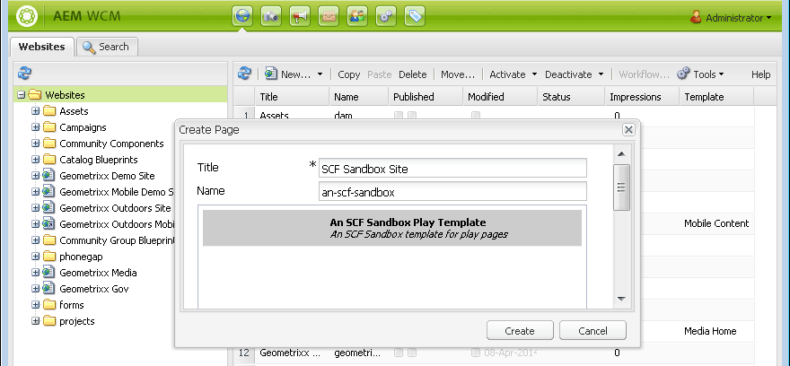

# Ursprungligt sandlådeinnehåll {#initial-sandbox-content}

I det här avsnittet skapar du följande sidor som alla använder [sidmallen](initial-app.md#createthepagetemplate):

* SCF Sandbox Site, som dirigerar om till den engelska versionen av huvudsidan.

   * SCF Sandbox - Huvudsidan för den engelska versionen av webbplatsen.

   * SCF Play - Underordnad till den huvudsida som ska spelas upp.

Även om den här självstudiekursen inte omfattar [språkkopior](../../help/sites-administering/tc-prep.md)är den utformad så att rotsidan kan implementera identifiering av det språk som användaren föredrar via HTML-rubriken och dirigera om till rätt huvudsida för språket. Konventionen är att använda landskoden med två bokstäver för sidans nodnamn, t.ex. &quot;en&quot; för engelska, &quot;fr&quot; för franska och så vidare.

## Skapa första sidor {#create-first-pages}

Nu när det finns en [sidmall](initial-app.md#createthepagetemplate)kan vi skapa webbplatsens rotsida i katalogen /content.

1. Standardgränssnittet innehåller för närvarande utkast för att skapa webbplatser. Det klassiska användargränssnittet är användbart eftersom den här självstudiekursen skapar en enkel webbplats.

   Om du vill växla till det klassiska användargränssnittet väljer du global navigering och håller pekaren över den högra sidan av projektikonen. Välj ikonen *Växla till klassiskt gränssnitt* som visas:

   

   Möjligheten att växla till det klassiska användargränssnittet måste [aktiveras av en administratör](../../help/sites-administering/enable-classic-ui.md).

1. På välkomstsidan [för det](http://localhost:4502/welcome.html)klassiska användargränssnittet väljer du **[!UICONTROL Websites]**.

   

   Du kan även få tillgång till det klassiska användargränssnittet för webbplatser direkt genom att gå till [/siteAdmin.](http://localhost:4502/siteadmin)

1. I utforskarrutan markerar du **[!UICONTROL Websites]** och väljer sedan **[!UICONTROL New]** > **[!UICONTROL New Page]** i verktygsfältet.

   Ange följande i **[!UICONTROL Create Page]** dialogrutan:

   * Titel: `SCF Sandbox Site`
   * Namn: `an-scf-sandbox`
   * Välj **[!UICONTROL An SCF Sandbox Play Template]**
   * Klicka på **[!UICONTROL Create]**

   

1. Markera den sida du just skapade i Utforskarfönstret `/Websites/SCF Sandbox Site`och klicka på **[!UICONTROL New]** > **[!UICONTROL New Page]**:

   * Titel: `SCF Sandbox`
   * Namn: `en`
   * Välj **[!UICONTROL An SCF Sandbox Play Template]**
   * Klicka på **[!UICONTROL Create]**

1. Markera den sida du just skapade i Utforskarfönstret `/Websites/SCF Sandbox Site/SCF Sandbox`och klicka på **[!UICONTROL New]** > **[!UICONTROL New Page]**

   * Titel: `SCF Play`
   * Namn: `play`
   * Välj **[!UICONTROL An SCF Sandbox Play Template]**
   * Klicka på **[!UICONTROL Create]**

1. Så här visas webbplatsen nu i webbplatskonsolen. Observera att underordnade sidor för objektet som är markerat i utforskarrutan visas i den högra rutan där de kan hanteras.

   

   Det här är databasvyn över vad som har skapats med webbplatsverktyget och mallen:

   

## Lägg till designbanan {#add-the-design-path}

Egenskapen &quot; ` [/etc/designs/an-scf-sandbox](setup-website.md#setupthedesigntreeetcdesigns)`

* `cq:template="/libs/wcm/core/templates/designpage"`

har definierats, vilket ger möjlighet att referera till designresurser i ett skript med `currentDesign.getPath()`. Till exempel

* `% String favIcon = currentDesign.getPath() + "/favicon.ico"; %`

   * Namn: `cq:designPath`
   * Typ: `String`
   * Värde: `/etc/designs/an-scf-sandbox`

* Klicka på den gröna `[+] Add`

Databasen ska vara som följer:

* Klicka på **[!UICONTROL Save All]**

Om det uppstår problem när konfigurationen sparas kan du logga in igen och konfigurera igen.

>[!NOTE]
>
>Användningen av `cq:designPath` är valfri och har inget samband med [användningen av clientlibs](develop-app.md#includeclientlibsintemplate), som i huvudsak krävs eftersom SCF-komponenterna använder [klientlibs](client-customize.md#clientlibs-for-scf) för att hantera sin JS och CSS.

