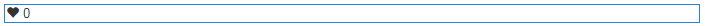

# Använda Länk {#using-liking}

The `Liking` -komponenten är ett användbart verktyg som gör att användare kan uttrycka sin åsikt om en viss del av innehållet, till exempel en kommentar i ett forum. Med `Liking` -komponenten väljer medlemmarna hjärtikonen för att ange en positiv åsikt.

## Lägga till länkning på en sida {#adding-liking-to-a-page}

Lägga till en `Liking` -komponent till en sida i redigeringsläge använder du komponentwebbläsaren för att leta upp

* `Communities / Liking`

och dra den till rätt plats på en sida, t.ex. i förhållande till funktionen som användarna kan gilla.

Nödvändig information finns på [Grunderna för communitykomponenter](basics.md).

När [nödvändiga bibliotek på klientsidan](essentials-liking.md#essentials-for-client-side) ingår så här `Liking` visas.

## Konfigurerar länk {#configuring-liking}

Markera den monterade `Liking` -komponenten som ska få åtkomst till och markera `Configure` som öppnar redigeringsdialogrutan.

Under **[!UICONTROL Texts & Labels]** anger du de egenskaper som används för att spela in gilla-markeringar.

* **[!UICONTROL Positive Response Label]**

   (*Obligatoriskt*) Egenskapsnamnet för ett positivt svar.

* **[!UICONTROL Negative Response Label]**

   (*Obligatoriskt*) Egenskapsnamnet för ett negativt svar.

* **[!UICONTROL Tally Name]**

   (*Obligatoriskt*) Det interna, identifierbara egenskapsnamnet för den här instansen av en röstningskomponent.

## Site Visitor Experience {#site-visitor-experience}

### Medlemmar {#members}

Medlemmarna kan när som helst ändra sig.

### Anonym {#anonymous}

Anonym länkning stöds inte. Besökare på webbplatsen måste registrera sig (bli medlem) och logga in för att kunna vara med.

## Ytterligare information {#additional-information}

Mer information finns på [Länka viktiga](essentials-liking.md) för utvecklare.
