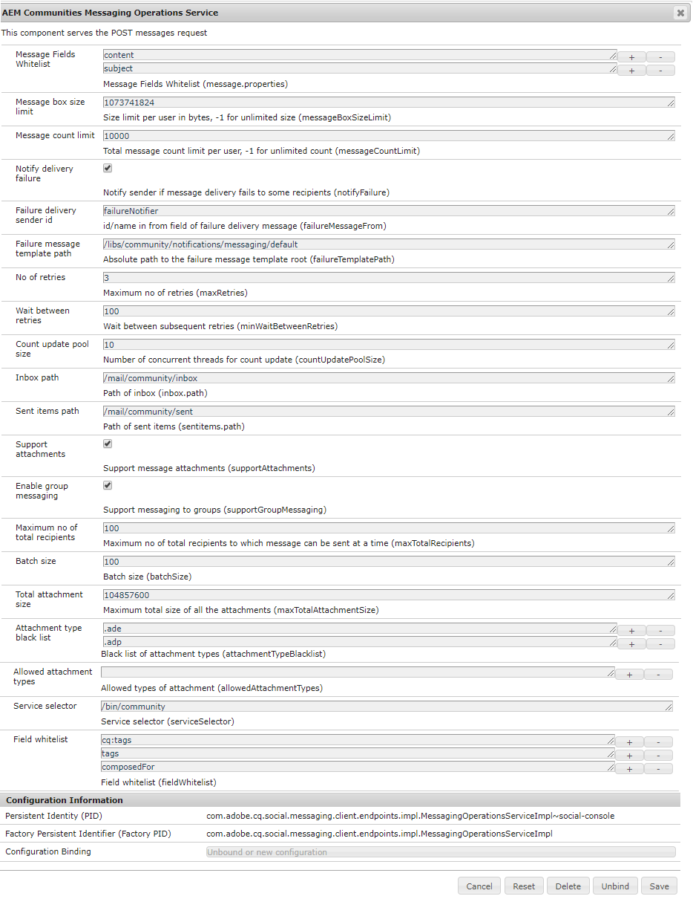

# Konfigurera meddelanden{#configure-messaging}

## Översikt {#overview}

Meddelandefunktionen för AEM Communities ger möjlighet för inloggade webbplatsbesökare (medlemmar) att skicka meddelanden till varandra som är tillgängliga när de loggar in på webbplatsen.

Meddelanden aktiveras för en community-webbplats genom att en kryssruta markeras när en [community-webbplats skapas](/help/communities/sites-console.md).

Den här sidan innehåller information om standardkonfigurationen och eventuella justeringar.

Mer information för utvecklare finns i [Messaging Essentials](/help/communities/essentials-messaging.md).

## Tjänsten Meddelandeåtgärder {#messaging-operations-service}

Konfigurationen av tjänsten  AEM Communities Messaging Operations identifierar slutpunkten som hanterar meddelanderelaterade begäranden, de mappar som tjänsten ska använda för att lagra meddelanden och, om meddelanden kan innehålla bifogade filer, vilka filtyper som tillåts.

För communitysajter som skapats med `Communities Sites console`finns det redan en instans av tjänsten med inkorgen inställd på `/mail/inbox`.

### Tjänsten Community Messaging Operations {#community-messaging-operations-service}

Så som visas nedan finns det en konfiguration av tjänsten för webbplatser som skapats med guiden [Skapa](/help/communities/sites-console.md)plats. Du kan visa eller redigera konfigurationen genom att välja pennikonen bredvid konfigurationen.

### Lägg till ny konfiguration {#add-new-configuration}

Om du vill lägga till en ny konfiguration väljer du plusikonen &quot;**+**&quot; bredvid tjänstens namn:

* **Vitlista** för meddelandefält Anger vilka egenskaper som användare kan redigera och behålla för komponenten Disposition Message. Om nya formulärelement läggs till måste element-ID läggas till om det ska lagras i SRP. Standard är två poster: ämne ** och *innehåll*.

* **Storleksgräns** för meddelanderuta Det maximala antalet byte i varje användares meddelanderuta. Standardvärdet är *1073741824 *(1 GB).

* **Gräns** för antal meddelanden Det totala antalet meddelanden som tillåts per användare. Värdet -1 anger att ett obegränsat antal meddelanden tillåts, enligt storleksgränsen för meddelanderutan. Standardvärdet är *1000* (10 kB).

* **Meddela leveransfel** Om det är markerat ska du meddela avsändaren om meddelandeleveransen misslyckas för vissa mottagare. Standard är *markerat*.

* **Avsändarens ID**-nummer för leveransfel som visas i leveransmeddelandet misslyckades. Standardvärdet är *errorNotifier*.

* **Mallsökvägen** Absolut till leveransmallroten för misslyckade meddelanden. Standard är */etc/notification/messaging/default*.

* **Antal försök** Antal gånger att försöka skicka meddelande som inte kan levereras igen. Standardvärdet är *3*.

* **Vänta mellan försök** Antal sekunder att vänta mellan försök att skicka meddelandet igen när det inte går att skicka. Standardvärdet är *100 *(sekunder).

* **Antal poolstorlekar** för uppdatering Antal samtidiga trådar som används för inventeringsuppdatering. Standardvärdet är *10*.

* **Inkorgssökväg**(*obligatoriskt*) Sökvägen som ska användas för *mappen i förhållande till användarens nod (/home/users/* username **`inbox`** ). Sökvägen får INTE avslutas med ett avslutande snedstreck (/). Standard är */e-post/inkorg.*

* **Sökväg** till skickade objekt (*obligatoriskt*) Sökvägen, i förhållande till användarens nod (/home/users/*username*), som ska användas för **`send items`** mappen. Sökvägen får INTE avslutas med ett avslutande snedstreck (/). Standardvärdet är */mail/sentists* .

* **Stödja bilagor** Om det här alternativet är markerat kan användare lägga till bilagor i sina meddelanden. Standard är *markerat*.

* **Aktivera gruppmeddelanden** Om det här alternativet är markerat kan registrerade användare skicka gruppmeddelanden till en grupp medlemmar. Standard är *avmarkerat*.

* **Högsta antal av det totala antalet mottagare** Om gruppmeddelanden är aktiverat anger du det maximala antalet mottagare som gruppmeddelanden kan skickas till åt gången. Standardvärdet är *100*.

* **Batchstorlek** Antal meddelanden som ska grupperas tillsammans för en sändning när den skickas till en stor grupp mottagare. Standardvärdet är *100*.

* **Total bilagestorlek** Om supportAttachments är markerat anger det här värdet den största tillåtna totala storleken (i byte) för alla bilagor. Standardvärdet är *104857600* (100 MB).

* **Black list** A black list of filename extensions, prefixed with &#39;**.**&#39;, som kommer att refuseras av systemet. Om inte svartlistas är tillägget tillåtet. Tillägg kan läggas till eller tas bort med ikonerna **+** och **-**.

* **Tillåtna bilagetyper**
   **(*Åtgärd krävs*)** En vitlista med filnamnstillägg, motsatsen till svartlistan. Om du vill tillåta alla filnamnstillägg, förutom de som är svartlistade, använder du ikonen &#39;**-**&#39; för att ta bort den tomma posten.

* **Tjänstväljare**(*obligatoriskt*) En absolut sökväg (slutpunkt) genom vilken tjänsten anropas (en virtuell resurs). Roten för den valda sökvägen måste vara en som ingår i konfigurationsinställningen för *körningssökvägar* i OSGi-konfigurationen [ `Apache Sling Servlet/Script Resolver and Error Handler`](https://localhost:4502/system/console/configMgr/org.apache.sling.servlets.resolver.SlingServletResolver)som `/bin/`, `/apps/`och `/services/`. Om du vill välja den här konfigurationen för en webbplats meddelandefunktion anges den här slutpunkten som **`Service selector`** värde för `Message List and Compose Message components` (se [Meddelandefunktion](/help/communities/configure-messaging.md)).
Standardvärdet är */bin/messaging* .

* **Fältvitlista** Använd vitlista för **meddelandefält**.

>[!CAUTION]
>
>Varje gång en `Messaging Operations Service` konfiguration öppnas för redigering, om den `allowedAttachmentTypes.name` tagits bort, läggs en tom post till så att egenskapen kan konfigureras. En enda tom post inaktiverar effektivt bifogade filer.
>
>Om du vill tillåta alla filnamnstillägg, förutom de som visas svartlistade, använder du ikonen &quot;**-**&quot; för att (igen) ta bort den tomma posten innan du klickar på **Spara**.

## Gruppmeddelanden {#group-messaging}

Om du vill tillåta registrerade användare att skicka direktmeddelanden i grupp till användargrupper, ska du se till att **Aktivera gruppmeddelanden **i följande två instanser av konfigurationen för **meddelandetjänster** :

* com.adobe.cq.social.messaging.client.endpoints.impl.MessagingOperationsServiceImpl~social-console
* com.adobe.cq.social.messaging.client.endpoints.impl.MessagingOperationsServiceImpl~social-messaging

**Tjänsten Meddelandeåtgärder: social konsol**

**Tjänsten Meddelandeåtgärder: sociala meddelanden**

## Felsökning {#troubleshooting}

Ett sätt att felsöka problem är att aktivera [felsökningsmeddelanden i loggen.](/help/sites-administering/troubleshooting.md)

Se även [Loggare and Writers for Individual Services](/help/sites-deploying/configure-logging.md#loggers-and-writers-for-individual-services).

Paketet som ska övervakas är `com.adobe.cq.social.messaging`.
