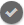

# Moderationskonsol {#moderation-console}

I AEM Communities går det att moderera [communityinnehåll](/help/communities/moderate-ugc.md) satsvis både från författar- och publiceringsmiljöer av administratörer och community-moderatorer (betrodda communitymedlemmar tilldelade som moderatorer).

Administratörer och community-moderatorer kan även utföra [sammanhangsbaserad moderering](/help/communities/in-context.md) i publiceringsmiljön.

En funktion för alla [communitywebbplatser](/help/communities/sites-console.md) är ett `Administration`-menyalternativ som är tillgängligt för användare som loggar in med administratörsbehörighet. Länken `Administration` ger åtkomst till modereringskonsolen.

Från modereringskonsolen har administratörer och moderatorer åtkomst till allt användargenererat innehåll (UGC) som de har behörighet att moderera. Om du tillåter att flera webbplatser modereras kan du visa inlägg på alla webbplatser eller filtrera efter utvalda communityplatser.

Mer information finns på [Hantera användare och användargrupper](/help/communities/users.md).

Moderationskonsolen har stöd för:

* Utföra flera modereringsåtgärder samtidigt.
* Söker i UGC.
* Visa UGC-information.
* Visa information om UGC-författare.

Modereringsåtgärder kan endast utföras om du är inloggad som administratör, eller som medlem med ` [moderator permissions](/help/communities/in-context.md#identifyingtrustedmembers)`.

## Publiceringsmiljöåtkomst {#publish-environment-access}

Åtkomst till moderationskonsolen från en publicerad communitywebbplats sker via en administrationslänk som visas när en community-moderator är inloggad.

Genom att välja administrationslänken visas modereringskonsolen:

## Åtkomst till författarmiljö {#author-environment-access}

I författarmiljön kan du nå Kontrollen för moderering

* Välj **[!UICONTROL Communities]** > **[!UICONTROL Moderation]** från global navigering.

Modereringsåtgärder kan bara utföras om du är inloggad som administratör eller som medlem med [moderatorbehörigheter](/help/communities/in-context.md#identifyingtrustedmembers). Det enda communityinnehåll som visas är det som den inloggade medlemmen får moderera.

>[!NOTE]
>
>UGC från publiceringsmiljön visas bara för författaren om den valda SRP implementerar en gemensam butik. Som standard är exempelvis lagringen JSRP, som inte är en gemensam butik för författare och publicering. Se [Community Content Storage](/help/communities/working-with-srp.md).

## Moderationskonsolens användargränssnitt {#moderation-console-ui}

Bortsett från den vänstra navigeringslisten (som visas på författaren men inte vid publicering) har modereringsgränssnittet följande huvudområden:

* **[Övre navigeringsfältet](#top-navigation-bar)**
* **[Verktygsfält](#toolbar)**
* **[Innehållsområde](#content-area)**

### Övre navigeringsfält {#top-navigation-bar}

Det övre navigeringsfältet är konstant för alla konsoler. Mer information finns i [Grundläggande hantering](/help/sites-authoring/basic-handling.md).

### Verktygsfält {#toolbar}

Verktygsfältet, som finns under det övre navigeringsfältet, har följande växlingsknapp till vänster:

* [Filtrera ](/help/communities/moderation.md#filterrail)
räls öppnar en räl som du kan välja vilka egenskaper som innehållet ska filtreras efter.

Verktygsfältet, som finns under det övre navigeringsfältet, har följande växlingsknapp till vänster:

[När du väljer Sök öppnas en ](/help/communities/moderation.md#filterrail)
remsa där du kan välja vilka egenskaper som innehållet ska filtreras efter.

### Innehållsområde {#content-area}

Innehållsområdet innehåller information för publicerad UGC:

* UGC har bokförts
* Medlemsnamn
* Medlem avatar
* Platsen för inlägget.
* När den bokfördes.
* Antal svar till posten.
* [Känslighet ](/help/communities/moderate-ugc.md#sentiment) som är kopplad till posten
* Om det godkänns visas en bock.
* Om det finns en bifogad fil visas ett gem.

>[!NOTE]
> 
>Innehållsområdet har en *oändlig rullning*, vilket innebär att du kan fortsätta rulla tills du har nått slutet av innehållet. Verktygsfältet ligger kvar på en fast, synlig plats ovanför innehållsområdet även när du bläddrar.

### Filterspår {#ootbfilters}

Ikonen för sidopanelen öppnar filterlisten. Filtercirkeln, som visas till vänster om innehållsområdet, innehåller olika filter, som båda har en omedelbar effekt på den refererade UGC:n som visas i innehållsområdet.

Filtren i varje kategori är **OR** tillsammans, och filtren i olika kategorier är **AND**.

Om du till exempel markerar både **Fråga** och **Svar**, kommer du att se innehåll som antingen är en **fråga** *eller* ett **svar**.

Om du däremot markerar **Fråga** och **Väntande**, visas endast innehåll som är en **fråga** och är **Väntande**.

>[!NOTE]
>
>Moderatorer för communityn kan skapa bokmärken för fördefinierade filter i modereringskonsolens användargränssnitt. När dessa filter läggs till i slutet av URL:en (som frågesträngsparametrar) kan moderatorerna senare gå tillbaka till bokmärkesfiltren och även dela dessa länkar.

När filterlisten är öppen växlar ikonen Sök och sidopanelen stängs. Om du vill stänga filterfältet och bara visa det innehåll som användaren skapat klickar du på ikonen Sök och väljer alternativet Endast innehåll.

#### Innehållssökväg {#content-path}

Innehållssökväg begränsar den UGC-referens som visas för inlägg i den angivna innehållsdatabasen.

#### Textsökning {#text-search}

Textsökning begränsar den refererade UGC som visas till inlägg som innehåller den angivna texten.

#### Plats {#site}

Webbplatsen begränsar den refererade UGC som visas till inlägg på valda communitywebbplatser. Om inga platser är markerade visas alla referenser till UGC.

>[!NOTE]
>
>När en administratör öppnar konsolen för gruppmoderering visas alla referenser till UGC, inklusive webbplatser som inte skapats med guiden [Skapa plats](/help/communities/sites-console.md), till exempel Geometrixx.
>
>När gruppmodereringskonsolen öppnas vid publicering av en betrodd community-medlem visas endast referenser till UGC som skapats för communitywebbplatser som medlemmen har behörighet att moderera och kan filtreras med platsfiltret.

#### Innehållstyp {#content-type}

Innehållstyp begränsar den refererade UGC-enheten som visas till inlägg av den valda resurstypen. Du kan välja en eller flera av följande typer. Alla typer visas om inget är markerat.

* **Kommentar**
* **Forum**
* **Forum Reply**
* **QnA-fråga**
* **QnA-svar**
* **Bloggartikel**
* **Bloggkommentar**
* **Kalenderhändelse**
* **Kalenderkommentar**
* **Filbiblioteksmapp**
* **Filbiblioteksdokument**
* **Idea**
* **Idékommentar**

#### Ytterligare innehållstyper {#additional-content-types}

Så här lägger du till ytterligare resurser att filtrera:

* Logga in på din författarinstans som administratör.
* Öppna [webbkonsolen](https://localhost:4502/system/console/configMgr).
* Leta reda på `AEM Communities Moderation Dashboard Filters`.
* Välj den konfiguration som ska öppnas i redigeringsläge.
* Ange den ResourceType för en komponent som du vill filtrera:

   * Om du till exempel vill filtrera på de medföljande röstkomponenterna anger du:

      `Voting=social/tally/components/hbs/voting`
   

* Välj Spara.
* Uppdatera webbcommunityn - modereringskonsolen.

Resultatet är ett nytt valbart filter för `Voting` under filtergruppen `Content Type`.

När det filtret är markerat visar kontrollpanelens innehåll UGC som matchar någon av de ResourceTypes som har angetts.

#### Status {#status}

Status begränsar den refererade UGC:n som visas till inlägg med den valda statusen, som kan vara en eller flera av Väntande, Godkänd, Nekad eller Stängd, samt Utkast eller Schemalagt för Blog-artiklar samt Svarat eller Inte besvarat för QnA-frågor. Om ingen är markerad visas alla.

>[!NOTE]
>
>Om du bara väljer statusen Inte besvarat visas allt innehåll (för alla innehållstyper) utom de besvarade frågorna. Det beror på att den egenskap som ansvarar för den besvarade frågan inte finns för frågor som inte besvarats och annat innehåll som forumämne, bloggartikel eller kommentarer.

#### Flaggar {#flagging}

Flaggning begränsar det refererade användargenererat innehåll som visas till inlägg som är flaggade eller dolda.

När en del av innehållet har flaggats, fortsätter det att flaggas tills du bryter flaggan för den delen av innehållet genom att markera knappen **Flagga** igen. Observera att det inte finns några flaggningsnivåer, som important eller följup.

#### Medlemmar {#members}

Medlemmar begränsar den refererade UGC som visas för UGC som har bokförts av det angivna medlemsnamnet.

#### Anslaget i de sista {#posted-in-the-last}

Bokförd i sista begränsa hur den refererade UGC:n visas för inlägg gjorda i sista timmen, dagen, veckan, månaden eller året.

#### Sentiment {#sentiment}

 Sentimentbegränsar den refererade UGC-enheten som visas till inlägg med ett känslomässigt värde som är antingen positivt, negativt eller neutralt.

## Egna filter {#custom-filters}

Förutom filtren i rutan [Filterspår](/help/communities/moderation.md#ootbfilters) kan ytterligare anpassade metadatafilter läggas till i modereringsgränssnittet. Utvecklare kan använda exempelkoden i Github för att utöka de befintliga gränssnittsfiltren för moderering.

[Exempelprojektet](https://github.com/Adobe-Marketing-Cloud/aem-communities-extensions/tree/main/aem-communities-moderation-filter) i Github implementerar taggfiltret för att filtrera UGC-listan baserat på om de specifika taggarna används på användargenererat innehåll. Du kan följa exempelkoden och skapa analoga filter för andra liknande UGC-metadatafält.

Så här installerar du exemplet för taggfiltret:

1. Öppna pakethanteraren på AEM Author-instansen ([https://[aem-author]:4502/crx/packmgr/index.jsp](https://aem65-communities-demo.corp.adobe.com:4502/crx/packmgr/index.jsp)) och AEM Publish-instansen ([https://[aem-publish]:4503/crx/packmgr/index.jsp](https://aem65-communities-demo.corp.adobe.com:4502/crx/packmgr/index.jsp)).
1. Bygg paketet `com.adobe.social.sample.moderation.filter.ui.apps-1.0-SNAPSHOT.zip` från Github-koden och installera och aktivera det.
1. Öppna paketkonsolen på AEM Author-instansen ( `https://[aem-author]:4502/system/console/bundles`) och AEM Publish-instansen ( `https://[aem-publish]:4503/system/console/bundles`).
1. Bygg paketet ` [com](https://sample-moderation-filter.com/).adobe.social.sample.moderation.filter.core-1.0-SNAPSHOT.jar` från Github och installera och aktivera det.
1. Gå till instansen **/apps/social/moderation/facets** på AEM Author ([https://[aem-author]:4502/crx/de/index.jsp#/apps/social/moderation/facets](https://aem65-communities-demo.corp.adobe.com:4502/crx/de/index.jsp#/apps/social/moderation/facets)) och AEM Publish ([https://[aem-publish]:4502/crx/de/index.jsp#/apps/social/moderation/facets](https://aem65-communities-demo.corp.adobe.com:4502/crx/de/index.jsp#/apps/social/moderation/facets)).
1. Lägg till en teknisk användare **communities-utility-reader** med `jcr:read` behörigheter.

Så här visar du anpassade filter på befintliga communityplatser:

1. Redigera `Clientlibs` för den befintliga modereringssidan `/content/we-retail/us/en/community/moderation/shell3/jcr:content/head/clientlibs.`

   * Lägg till ny kategori `cq.social.hbs.moderation.v2.`

1. Gå till `/content/we-retail/us/en/community/moderation/shell3/jcr:content/rails/searchWell/items/filters.`

   * Ange som ny komponent `sling:resourceType = social/moderation/v2/filters.`

1. Gå till `/content/we-retail/us/en/community/moderation/shell3/jcr:content/views/content/items/modcontainer`.

   * Ange som ny komponent `sling:resourceType = social/moderation/v2/modcontainer`.

## Modereringsåtgärder {#moderation-actions}

[Modereringsåtgärder ](/help/communities/moderate-ugc.md#moderation-actions) kan utföras på en eller flera markeringar som gjorts i innehållsområdet eller när du visar innehållsdetaljer.

Om du vill göra inläggen större och mindre vanliga klickar du i innehållsområdet på markeringsikonen () på ett inlägg, som visas när du håller muspekaren över det med musen (skrivbordet) eller trycker och håller ett finger på inlägget (mobilen). Genom att göra detta aktiverar du flervalsläget och kan nu välja de efterföljande inlägg som ska gruppmodereras genom att klicka på dem. Använd de knappar som visas i verktygsfältet för att utföra modereringsåtgärder för de valda inläggen. Alla åtgärder uppmanas att bekräfta.

Om du vill ändra ett inlägg i innehållsområdet till en viss nivå håller du pekaren över det med musen (skrivbordet) eller trycker och håller ned ett finger på posten (mobilen) så att knapparna visas på posten. När du arbetar med en enskild innehållsdetalj uppmanas du bara att bekräfta borttagningsåtgärden.

### Modererar flera inlägg {#moderating-multiple-posts}

Ange läget för gruppval genom att klicka på ikonen `Select` för ett inlägg:

Om du vill avsluta gruppmarkeringsläget väljer du ikonen Avbryt (x) i verktygsfältet:

Modereringsåtgärderna som kan utföras på flera inlägg är:

* Neka
* Ta bort
* Stäng/öppna inlägg igen

Ikonerna som tillåter dessa åtgärder visas bara i verktygsfältet när flera inlägg är markerade.

### Modererar ett enstaka inlägg {#moderating-a-single-post}

I läget för en markering är det möjligt att:

* Visa användarinformation genom att välja användarens namn.
* Visa inlägget i sitt sammanhang genom att markera länken till inlägget.
* [Svara](#reply)
* [Tillåt](#allow)
* [Neka](#deny)
* [Ta bort](#delete)
* [Stäng](#close)
* Visa [Modereringshistorik](#moderation-history)
* [Visa detaljer](#viewdetails)

I kortvyn ovanför ikonerna för modereringsåtgärder finns texten i posten och nedan finns data som indikerar:

* Om den har svar, och om så är fallet, föregås av antalet svar.
* Om den har flaggats.
* Om det har godkänts.
* När användargenererat innehåll bokfördes.

#### Svara {#reply}

När du arbetar med ett enstaka inlägg visas en svarsikon om UGC-typen stöder svar och är konfigurerad för att tillåta svar.

#### Tillåt {#allow}

När du arbetar med ett enstaka inlägg visas ikonen Tillåt när inlägget antingen har flaggats eller nekats. Om du väljer Tillåt kommer alla flaggor att tas bort.

#### Neka {#deny}

Modereringsåtgärden **Neka** är bara tillgänglig för innehåll som är modererat och visas inte för omodererat innehåll förutom i flervalsläge.

Innehåll som inte är modererat godkänns alltid.

Innehåll som modereras från början försätts i ett väntande läge och kan senare ändras för att godkännas eller nekas.

Innehåll som lämnar det väntande läget kan aldrig återgå till ett väntande läge. Innehåll som markerats som godkänt eller nekat kan när som helst ändras till ett annat läge.

#### Ta bort {#delete}

I envalsläge eller gruppläge kan du markera objekt och ta bort dem. Borttagningsåtgärden resulterar i en bekräftelsedialogruta. När de har tagits bort försvinner dessa objekt omedelbart från innehållsområdet. **När UGC har tagits bort tas den bort permanent från databasen och kan inte hämtas** senare.

#### Stäng {#close}

När du arbetar med ett enstaka inlägg visas en stängningsikon om UGC-typen stöder möjligheten att förhindra fler inlägg för den resursen.

#### Modereringshistorik {#moderation-history}

När du arbetar med ett enstaka inlägg visas en ikon för historik för moderering när du hovrar över det. Om du väljer ikonen visas en ruta med en historik över åtgärder som har vidtagits för UGC-inlägget.

Om du vill återgå till visning av flera UGC-inlägg i innehållsområdet markerar du X:et i det övre högra hörnet av rutan med vydetaljer.

Till exempel:

#### Visa detalj {#view-detail}

När du arbetar med ett enstaka inlägg kan du visa mer information genom att öppna UGC i detaljerat läge.

Om du vill göra det för du markören över inlägget för att visa ikonen `View Detail` och markerar det för att visa en panel med mer information om inlägget.

Om du vill återgå till visning av flera UGC-inlägg i innehållsområdet markerar du X:et i det övre högra hörnet av rutan med vydetaljer.

Till exempel:

