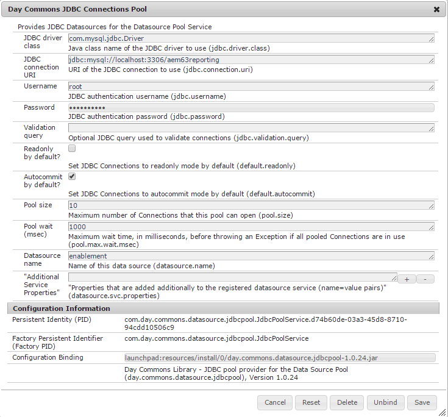

# MySQL-konfiguration för aktiveringsfunktioner {#mysql-configuration-for-enablement-features}

MySQL är en relationsdatabas som främst används för SCORM-spårning och rapportdata för aktiveringsresurser. Här finns tabeller för andra funktioner som att spåra paus/återupptagning av video.

Dessa instruktioner beskriver hur du ansluter till MySQL-servern, skapar aktiveringsdatabasen och fyller i databasen med initiala data.

## Krav {#requirements}

Innan du konfigurerar aktiveringsfunktionen i MySQL för Communities måste du se till att

* Installera [MySQL-server](https://dev.mysql.com/downloads/mysql/) Community Server version 5.6:
   * Version 5.7 stöds inte för SCORM.
   * Kan vara samma server som AEM.
* Installera den officiella [JDBC-drivrutinen för MySQL](deploy-communities.md#jdbc-driver-for-mysql) på alla AEM instanser.
* Installera [MySQL workbench](https://dev.mysql.com/downloads/tools/workbench/).
* Installera [SCORM-paketet](enablement.md#scorm) på alla AEM instanser.

## Installerar MySQL {#installing-mysql}

MySQL ska laddas ned och installeras enligt instruktionerna för måloperativsystemet.

### Gemener i tabellnamn {#lower-case-table-names}

Eftersom SQL inte är skiftlägeskänsligt måste du, för skiftlägeskänsliga operativsystem, inkludera en inställning som anger alla tabellnamn med gemener.

Om du till exempel vill ange alla tabellnamn med gemener i ett Linux-operativsystem:

* Redigera filen `/etc/my.cnf`
* Lägg till följande rad i avsnittet `[mysqld]`: `lower_case_table_names = 1`

### UTF8-teckenuppsättning {#utf-character-set}

För att få bättre stöd för flera språk måste du använda teckenuppsättningen UTF8.

Ändra MySQL till att ha UTF8 som teckenuppsättning:
* mysql > SET NAME &#39;utf8&#39;;

Ändra MySQL-databasen till standard till UTF8:
* Redigera filen `/etc/my.cnf`
* Lägg till följande i avsnittet `[client]`: `default-character-set=utf8`
* Lägg till följande i avsnittet `[mysqld]`: `character-set-server=utf8`

## Installerar MySQL Workbench {#installing-mysql-workbench}

MySQL Workbench tillhandahåller ett gränssnitt för körning av SQL-skript som installerar schemat och initiala data.

MySQL Workbench ska laddas ned och installeras enligt instruktionerna för måloperativsystemet.

## Aktivera anslutning {#enablement-connection}

När MySQL Workbench startas första gången visas inga anslutningar, såvida den inte redan används för andra syften:

### Nya anslutningsinställningar {#new-connection-settings}

1. Markera +-ikonen till höger om `MySQL Connections`.
1. I dialogrutan `Setup New Connection` anger du värden som är lämpliga för din plattform i demonstrationssyfte, med författarinstansen AEM och MySQL på samma server:
   * Anslutningsnamn: `Enablement`
   * Anslutningsmetod: `Standard (TCP/IP)`
   * Värdnamn: `127.0.0.1`
   * Användarnamn: `root`
   * Lösenord: `no password by default`
   * Standardschema: `leave blank`
1. Välj `Test Connection` för att verifiera anslutningen till den MySQL-tjänst som körs.

**Anteckningar**:
* Standardporten är `3306`.
* Det `Connection Name` som valts anges som `datasource`-namn i [JDBC OSGi-konfiguration](#configure-jdbc-connections).

#### Anslutningen {#successful-connection} lyckades

#### Ny aktiveringsanslutning {#new-enablement-connection}

## Databasinställningar {#database-setup}

Observera att det finns ett testschema och standardanvändarkonton när du öppnar den nya aktiveringsanslutningen.

### Hämta SQL-skript {#obtain-sql-scripts}

SQL-skripten hämtas med CRXDE Lite på författarinstansen. [SCORM-paketet](deploy-communities.md#scorm) måste vara installerat:

1. Bläddra till CRXDE Lite:
   * Till exempel [http://localhost:4502/crx/de](http://localhost:4502/crx/de)
1. Expandera mappen `/libs/social/config/scorm/`
1. Hämta `database_scormengine.sql`
1. Hämta `database_scorm_integration.sql`

En metod för att hämta schemat är:

* Markera noden `jcr:content` för sql-filen.
* Observera att värdet för egenskapen `jcr:data` är en visningslänk.
* Klicka på vylänken om du vill spara data i en lokal fil.

### Skapa SCORM-databas {#create-scorm-database}

Den Aktivera SCORM-databas som ska skapas är:

* name: `ScormEngineDB`
* som skapats från skript:
   * schema: `database_scormengine.sql`
   * data: `database_scorm_integration.sql`
Följ stegen nedan (
[öppna](#step-open-sql-file),  [kör](#step-execute-sql-script)) för att installera varje  [SQL-skript](#obtain-sql-scripts) . [Uppdatera ](#refresh) vid behov för att se resultatet av skriptkörningen.

Installera schemat innan du installerar data.

>[!CAUTION]
>
>Om databasnamnet ändras måste du ange det korrekt i:
>
>* [JDBC-konfiguration](#configure-jdbc-connections)
>* [SCORM-konfiguration](#configure-scorm)

#### Steg 1: öppna SQL-fil {#step-open-sql-file}

I MySQL Workbench

* I listrutan Arkiv
* Välj `Open SQL Script ...`
* Välj något av följande i den här ordningen:
   1. `database_scormengine.sql`
   1. `database_scorm_integration.sql`

#### Steg 2: kör SQL-skript {#step-execute-sql-script}

I Workbench-fönstret för filen som öppnas i steg 1 väljer du `lightening (flash) icon` för att köra skriptet.

Observera att körningen av `database_scormengine.sql`-skriptet för att skapa SCORM-databasen kan ta en minut att slutföra.

#### Uppdatera {#refresh}

När skripten har körts måste du uppdatera `SCHEMAS`-avsnittet i `Navigator` för att kunna se den nya databasen. Använd uppdateringsikonen till höger om SCHEMAS:

#### Resultat: scormenginedb {#result-scormenginedb}

När du har installerat och uppdaterat SCHEMAS visas `scormenginedb`.

## Konfigurera JDBC-anslutningar {#configure-jdbc-connections}

OSGi-konfigurationen för **Day Commons JDBC Connections Pool** konfigurerar MySQL JDBC Driver.

Alla publicerings- och författarinstanser AEM peka på samma MySQL-server.

När MySQL körs på en annan server än AEM måste servervärdnamnet anges i stället för localhost i JDBC-kopplingen (som fyller i [ScormEngine](#configurescormengineservice)-konfigurationen).

* På varje författare och publicera AEM
* Inloggad med administratörsbehörighet
* Åtkomst till [webbkonsolen](../../help/sites-deploying/configuring-osgi.md)
   * Till exempel [http://localhost:4502/system/console/configMgr](http://localhost:4502/system/console/configMgr)
* Leta reda på `Day Commons JDBC Connections Pool`
* Välj ikonen `+` för att skapa en ny konfiguration

   

* Ange följande värden:
   * **[!UICONTROL JDBC driver class]**: `com.mysql.jdbc.Driver`
   * **URIJ** för DBC-anslutning:  `jdbc:mysql://localhost:3306/aem63reporting` Ange server i stället för localhost om MySQL-servern inte är samma som &#39;this&#39; AEM server.
   * **[!UICONTROL Username]**: Rotera eller ange det konfigurerade användarnamnet för MySQL-servern, om inte &#39;root&#39;.
   * **[!UICONTROL Password]**: Rensa det här fältet om inget lösenord har angetts för MySQL, annars anger du det konfigurerade lösenordet för MySQL-användarnamnet.
   * **[!UICONTROL Datasource name]**: Namn som angetts för  [MySQL-anslutningen](#new-connection-settings), till exempel &#39;enablement&#39;.
* Välj **[!UICONTROL Save]**.

## Konfigurera Scorm {#configure-scorm}

### Tjänsten AEM Communities ScormEngine {#aem-communities-scormengine-service}

OSGi-konfigurationen för **AEM Communities ScormEngine-tjänsten** konfigurerar SCORM för användning av MySQL-servern för en aktiveringscommunity.

Den här konfigurationen finns när [SCORM-paketet](deploy-communities.md#scorm-package) är installerat.

Alla publicerings- och författarinstanser pekar på samma MySQL-server.

När MySQL körs på en annan server än AEM måste servervärdnamnet anges i stället för localhost i ScormEngine-tjänsten, som vanligtvis fylls i från konfigurationen [JDBC Connection](#configure-jdbc-connections).

* På varje författare och publicera AEM
* Inloggad med administratörsbehörighet
* Åtkomst till [webbkonsolen](../../help/sites-deploying/configuring-osgi.md)
   * Till exempel [http://localhost:4502/system/console/configMgr](http://localhost:4502/system/console/configMgr)
* Leta reda på `AEM Communities ScormEngine Service`
* Markera redigeringsikonen

   

* Kontrollera att följande parametervärden är konsekventa med konfigurationen [JDBC Connection](#configurejdbcconnectionspool):
   * **[!UICONTROL JDBC connection URI]**:  `jdbc:mysql://localhost:3306/ScormEngineDB` ** ScormEngineDBär standarddatabasnamnet i SQL-skripten
   * **[!UICONTROL Username]**: Rot eller ange det konfigurerade användarnamnet för MySQL-servern, om inte &#39;root&#39;
   * **[!UICONTROL Password]**: Rensa det här fältet om inget lösenord har angetts för MySQL, annars anger du det konfigurerade lösenordet för MySQL-användarnamnet
* Angående följande parameter:
   * **[!UICONTROL Scorm User Password]**: REDIGERA INTE

      Endast för intern användning: Den är avsedd för en särskild serviceanvändare som används av AEM Communities för att kommunicera med skorm-motorn.
* Välj **[!UICONTROL Save]**

### Adobe Granite CSRF-filter {#adobe-granite-csrf-filter}

För att se till att aktiveringskurser fungerar korrekt i alla webbläsare måste Mozilla läggas till som en användaragent som inte är markerad av CSRF-filtret.

* Logga in på AEM publiceringsinstans med administratörsbehörighet.
* Åtkomst till [webbkonsolen](../../help/sites-deploying/configuring-osgi.md)
   * Till exempel [http://localhost:4503/system/console/configMgr](http://localhost:4503/system/console/configMgr)
* Leta reda på `Adobe Granite CSRF Filter`.
* Välj redigeringsikonen.

   

* Välj ikonen `[+]` för att lägga till en säker användaragent.
* Ange `Mozilla/*`.
* Välj **[!UICONTROL Save]**.

