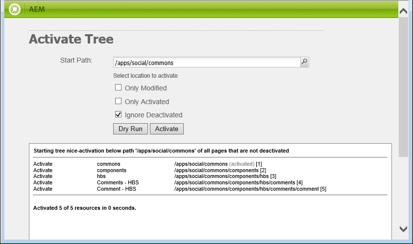

# Upplev den publicerade webbplatsen {#experience-the-published-site}

## Bläddra till Ny webbplats vid publicering {#browse-to-new-site-on-publish}

Nu när den nyligen skapade communitywebbplatsen har publicerats bläddrar du till den URL som visas när du skapar webbplatsen, men på publiceringsservern, t.ex.

* författarens URL = https://localhost:4502/content/sites/engage/en.html
* publicerings-URL = https://localhost:4503/content/sites/engage/en.html

För att minimera förvirring om vilken medlem som är inloggad på författare och publicera bör du använda olika webbläsare för varje instans.

Vid första ankomsten till den publicerade webbplatsen är besökaren vanligtvis inte redan inloggad och anonym.

`https://localhost:4503/content/sites/engage/en.html {#http-localhost-content-sites-engage-en-html}`

## Anonym webbplatsbesökare {#anonymous-site-visitor}

En anonym besökare ser följande i användargränssnittet:

* Webbplatsens namn. Det här är självstudiekursen Komma igång
* ingen profillänk
* ingen meddelandelänk
* ingen meddelandelänk
* sökfält
* Inloggningslänk
* Varumärkesbanderollen
* Menylänkar för de komponenter som ingår i referenswebbplatsmallen

Om du markerar olika länkar är de skrivskyddade.

### Förhindra anonym åtkomst på JCR {#prevent-anonymous-access-on-jcr}

En känd begränsning exponerar communityinnehållet för anonyma besökare via jcr-innehåll och json, även om anonym åtkomst **** är inaktiverat för webbplatsens innehåll. Det här beteendet kan dock styras med delningsbegränsningar som en tillfällig lösning.

Följ de här stegen för att skydda communityplatsens innehåll från anonyma användare genom jcr-innehåll och json:

1. På AEM Author-instansen går du till https://&lt;host>:&lt;port>/editor.html/content/site/&lt;sitename>.html.

   >[!NOTE]
   >
   >Gå inte till den lokaliserade webbplatsen.

1. Gå till **Sidegenskaper**.

   

1. Gå till fliken **Avancerat **.

   

1. Aktivera **autentiseringskrav**.
1. Lägg till inloggningssidans sökväg. Till exempel **/innehåll/...... ./GetStarted**.
1. Publicera sidan.

## Betrodd medlem i användargruppen {#trusted-community-member}

Den här upplevelsen förutsätter att [Aaron McDonald](/help/communities/tutorials.md#demo-users) har tilldelats rollerna [community manager och moderator](/help/communities/create-site.md#roles). Om inte, gå tillbaka till utvecklingsmiljön för att [ändra webbplatsinställningarna](/help/communities/sites-console.md#modifying-site-properties) och välj Aaron McDonald som både community manager och moderator.

I det övre högra hörnet markerar du `Log in`och signerar med användarnamnet&quot;aaron.mcdonald@mailinator.com&quot; och lösenordet&quot;password&quot;. Lägg märke till möjligheten att logga in med Twitter- eller Facebook-inloggningsuppgifter.

När du har loggat in som registrerad community-medlem kan du lägga märke till följande menyalternativ för att klicka och utforska din community-webbplats:

* **Med Profil** kan du visa och redigera din profil.
* [Alternativet Meddelanden](/help/communities/configure-messaging.md) dirigerar dig till avsnittet för direktmeddelanden, där du kan:

1. Visa direktmeddelanden som du har tagit emot (Inkorgen), skickat (Skickat) och tagit bort (Papperskorgen).
1. Skapa nya direktmeddelanden att skicka till enskilda personer och grupper.

* [Alternativet Meddelanden](/help/communities/notifications.md) dirigerar dig till meddelandeavsnittet, där du kan visa dina intressanta händelser och redigera meddelandeinställningar.
* [Administrationen](/help/communities/published-site.md#moderationlink) dirigerar dig till AEM Communities Moderation Page, om du har modereringsbehörighet.

Observera att kalendersidan är hemsidan eftersom den valda referensplatsmallen inkluderade kalenderfunktionen först, följt av aktivitetsströmfunktion, forumfunktion osv. Den här strukturen visas från konsolen [Platsmall](/help/communities/sites.md#edit-site-template) eller när du ändrar platsegenskaper i författarmiljön:

>[!NOTE]
>
>Mer information om Communities-komponenter och -funktioner finns på
>
>* [Communities-komponenter](/help/communities/author-communities.md) (för författare)
>* [Komponent-, funktions- och](/help/communities/essentials.md) funktionsfunktioner (för utvecklare)
>

### Formlänk {#forum-link}

Visa den grundläggande forumfunktionen genom att välja länken Forum.

Medlemmarna kan publicera ett nytt ämne eller följa ett ämne.

Besökarna kan visa inlägg och sortera dem på olika sätt.

### Länken Grupper {#groups-link}

Eftersom Aaron är gruppadministratör kan Aron skapa en ny community-grupp genom att välja länken Grupper, välja en gruppmall, bild, om gruppen är öppen eller hemlig och bjuda in medlemmar.

Detta är ett exempel där en grupp skapas i publiceringsmiljön.

Grupper kan också skapas i författarmiljön och hanteras i communitywebbplatsen i författarmiljön ( [Community Groups Console](/help/communities/groups.md)). Upplevelsen av [att skapa grupper på författare](/help/communities/nested-groups.md) är nästa i den här självstudiekursen.

Skapa en referensgrupp:

1. välj **Ny grupp**
1. **Fliken Inställningar**

   * Gruppnamn: `Sports`
   * Beskrivning : `A parent group for various sporting groups`
   * Grupp-URL-namn: `sports`
   * välj `Open Group` (tillåt alla community-medlemmar att delta genom att gå med)

1. **Fliken Mallar**

   * select `Reference Group` (innehåller en gruppfunktion i sin struktur för att tillåta kapslade grupper)

1. välj **Skapa grupp**

När en ny grupp har skapats **väljer du den nya sportgruppen** för att skapa två grupper (kapslade) i den. Eftersom en platsstruktur inte kan börja med gruppfunktionen måste du välja länken Grupper när du har öppnat gruppen Sport:

Den andra uppsättningen länkar, med början `Blog`, tillhör den markerade gruppen, `Sports`gruppen. Genom att välja `Groups` länken Sport är det möjligt att kapsla två grupper i gruppen Sport.

Som ett exempel lägger du till två n `ew groups.`

* en namngiven `Baseball`

   * lämna det angivet som ett `Open Group` (obligatoriskt medlemskap)
   * på fliken Mallar väljer du `Conversational Group`

* en namngiven `Gymnastics`

   * ändra inställningen till `Member Only Group` (begränsat medlemskap)
   * på fliken Mallar väljer du `Conversational Group`

**Meddelande **:

* en uppdatering av sidan kan behövas innan båda grupperna visas
* den här mallen innehåller inte *gruppfunktionen, så det går inte att kapsla in grupper ytterligare
* om du är författare kan du göra ett tredje val i [gruppkonsolen](/help/communities/groups.md) - ett `Public Group` (valfritt medlemskap)

När båda grupperna har skapats väljer du Baseball-gruppen, en öppen grupp, och lägger märke till dess länkar:

`Discussions` `What's New` `Members`

Gruppens länkar visas under huvudplatsens länkar och ger följande resultat:

Vid författare - med administratörsbehörighet går du till konsolen  Communities Groups (Communities Groups) och lägger till Weston McCall i `Community Engage Gymnastics <uid> Members` gruppen.

Fortsätt publicera, logga ut som Aaron McDonald och visa grupperna i Sports Group som en anonym besökare:

* från startsidan
* markera `Groups`länk
* markera `Sports`länk
* välj `Groups`länken Sport

Bara Baseball-gruppen syns.

Logga in som Weston McCall (weston.mccall@dodgit.com / lösenord) och navigera till samma plats. Observera att Weston kan `Join` öppna `Baseball` gruppen och antingen `enter or Leave` den privata `Gymnastics`gruppen.

### Länk till webbsida {#web-page-link}

Visa den grundläggande webbsidan som finns på webbplatsen genom att välja länken Webbsida. Standardverktygen för AEM-redigering kan användas för att lägga till innehåll på den här sidan i författarmiljön.

Gå till exempel till **författarinstansen** , öppna `engage` mappen i [webbgruppskonsolen](/help/communities/sites-console.md)och välj ikonen **Öppna webbplats** för att öppna redigeringsläget. Välj sedan förhandsvisningsläget för att markera `Web Page`länken och välj sedan redigeringsläget för att lägga till titel- och textkomponenter. Publicera sedan om antingen bara sidan eller hela webbplatsen.

### Modereringslänk {#moderationlink}

När communitymedlemmen har modereringsbehörighet visas länken Moderering och om du väljer den visas det communityinnehåll som publicerats och det kan [modereras](/help/communities/moderate-ugc.md) på ett sätt som liknar [modereringskonsolen](/help/communities/moderation.md) i författarmiljön.

Använd webbläsarens bakåtknapp för att gå tillbaka till den publicerade webbplatsen. De flesta konsoler är inte tillgängliga via global navigering i publiceringsmiljön. 

## Självregistrering {#self-registration}

När du har loggat ut kan du skapa en ny användarregistrering.

* select `Log In`
* select `Sign up for a new account`

 

Som standard är e-postadressen inloggnings-ID. Om alternativet inte är markerat kan besökaren ange ett eget inloggnings-ID (användarnamn). Användarnamnet måste vara unikt i publiceringsmiljön.

När du har angett användarens namn, e-postadress och lösenord `Sign Up`skapas användaren och kan signeras om du väljer det.

När du är inloggad är den första sidan deras `Profile`sida, som de kan anpassa.

Om medlemmen glömmer sitt inloggnings-ID är det möjligt att återställa med sin e-postadress.

