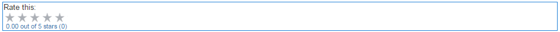

# Använda klassificeringar {#using-ratings}

Komponenten `Rating` används fristående eller tillsammans med andra webbgruppsfunktioner. Med den här komponenten kan inloggade communitymedlemmar uttrycka sina åsikter genom att gradera innehåll.

## Lägga till en klassificering på en sida {#adding-a-rating-to-a-page}

Om du vill lägga till en `Rating`-komponent på en sida i redigeringsläge, letar du reda på komponenten `Communities / Rating` och drar den till rätt plats på en sida, till exempel i förhållande till funktionen som medlemmarna ska betygsätta.

Mer information finns på [Grunderna för communitykomponenter](basics.md).

När de [nödvändiga klientbiblioteken](rating-basics.md#essentials-for-client-side) inkluderas visas `Rating`-komponenten på det här sättet.

## Konfigurerar klassificering {#configuring-rating}

Markera den monterade `Rating`-komponenten så att du kan komma åt och markera ikonen `Configure` som öppnar redigeringsdialogrutan.

Under fliken **[!UICONTROL Texts & Labels]** anger du den interna identifieraren för klassificeringen.

**[!UICONTROL Tally Name]**
(*Obligatoriskt*) Ett enkelt namn för `Rating` som unikt identifierar den här instansen. Måste vara ett giltigt nodnamn för databasen.

## Site Visitor Experience {#site-visitor-experience}

### Medlemmar {#members}

Endast ett omdöme per medlem tillåts. Medlemmen kan när som helst ändra sin klassificering.

### Anonym {#anonymous}

Anonym publicering av en klassificering stöds inte. Besökarna måste registrera sig (bli medlem) och logga in för att kunna delta.

## Ytterligare information {#additional-information}

Mer information finns på sidan [Värderingsgrunder](rating-basics.md) för utvecklare.
