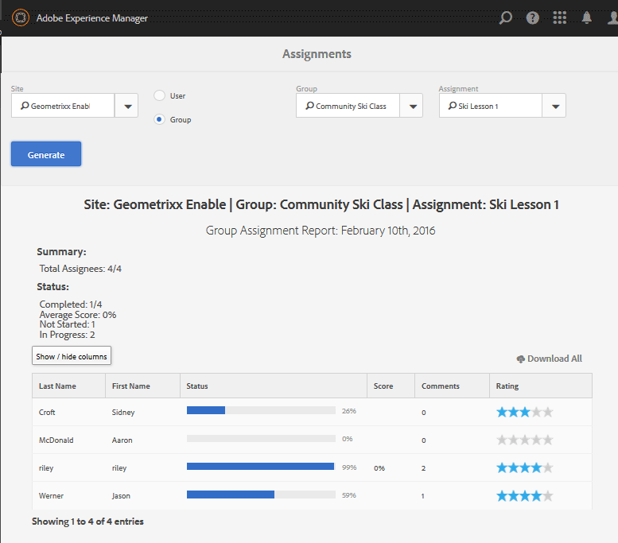

# Rapportkonsol {#reports-console}

## Översikt {#overview}

För AEM Communities finns det olika rapporter som du kan få åtkomst till på flera sätt från författarmiljön.

De olika rapporterna är i allmänhet följande:

* [Uppdragsrapport](#assignments-report)

   För en [aktiveringscommunity](/help/communities/overview.md#enablement-community) ger en översikt över hur eleverna arbetar med sina uppdrag, inklusive en poäng om SCORM-standarden implementeras.

* [Vyrapport](#views-report)

   Ger en översikt över vad communitymedlemmar och besökare tycker om communitysajter.

* [Inläggsrapport](#posts-report)

   Ger en översikt över olika typer av inlägg från communitymedlemmar på alla communitysajter.

När [Adobe Analytics är aktiverat](/help/communities/sites-console.md#analytics) innehåller rapporter antalet vyer, uppspelningar, kommentarer och omdömen för varje aktiveringsresurs över tiden.

Tabellrapporter kan exporteras i CSV-format för efterföljande bearbetning.

## Rapporteringskonsoler {#reporting-consoles}

### Rapporter för communityplatser {#reports-for-community-sites}

* Från global navigering: **[!UICONTROL Navigation]** > **[!UICONTROL Communities]** > **[!UICONTROL Reports]**

* Välj bland:

   * **[!UICONTROL Assignments Report]**

      * Generera en rapport för den valda communityplatsen, användaren eller gruppen och tilldelningen.
   * **[!UICONTROL Posts Report]**

      * Generera en rapport för den valda communityplatsen, innehållstypen och tidsperioden.
   * **[!UICONTROL Views Report]**

      * generera en rapport för den valda communityplatsen, innehållstypen och tidsperioden.

### Rapporter om aktiveringsresurser och utbildningssökvägar {#reports-for-enablement-resources-and-learning-paths}

* Från global navigering: **[!UICONTROL Navigation]** > **[!UICONTROL Communities]** > **[!UICONTROL Resources]**

* Välj en befintlig webbplats för aktiveringscommunityn:

   * Välj **Ikonen Rapport** om du vill generera rapporter som omfattar alla aktiveringsresurser.
   * Välj en utbildningsväg för aktivering.
   * Välj **ikonen Rapport** om du vill generera rapporter för:

      * De medföljande aktiveringsresurserna.
      * De studerande som är tilldelade inlärningsbanan.

* Rapporterna innehåller följande:

   * Tabelldata, kan hämtas som CSV:

      * Identifiera studerande
      * Deras status
      * Om du har tilldelats eller fått åtkomst via katalog
      * Antal kommentarer
      * Stjärngradering

Mer information finns i [avsnittet Rapporter](/help/communities/resources.md#report) i Resurskonsolen.

## Uppdragsrapport {#assignments-report}

På uppdragskonsolen kan rapporter filtreras efter aktiveringscommunityplats, användare eller grupper samt tilldelning.

Rapporten innehåller information om hur de fortskrider samt eventuella kommentarer eller betyg som lämnats.

Välj villkor för rapporten:

* **Plats**

   Välj en community-webbplats för aktivering.

* **Användare eller grupp**
   * Välj Användare om du vill generera en rapport för en elev.
   * Välj Grupp om du vill generera en rapport för en grupp av studerande.

   Tunneltjänsten kommer att få åtkomst till medlemmar och medlemsgrupper från publiceringsmiljön.

* **Tilldelning**

   Välj bland de aktiveringsresurser som tilldelats de valda eleverna.

Välj **Generera** för att skapa rapporten:

## Vyrapport {#views-report}

Med hjälp av vykonsolen kan rapporter genereras på sidvisningar av communityfunktioner under en viss tidsperiod.

Välj villkor för rapporten:

* **[!UICONTROL Site]**

   Välj en community-webbplats.

* **[!UICONTROL Content Type]**

   Välj Allt innehåll eller någon av funktionerna på webbplatsen.

* **[!UICONTROL Time frame]**

   Välj något av följande:

   * De senaste 7 dagarna
   * De senaste 30 dagarna
   * De senaste 90 dagarna
   * Förra året

Välj **[!UICONTROL Generate]** för att skapa rapporten.

## Inläggsrapport {#posts-report}

Med publiceringskonsolen kan rapporter genereras om antalet inlägg till communityfunktioner under en viss tidsperiod.

Välj villkor för rapporten:

* **[!UICONTROL Site]**

   Välj en community-webbplats.

* **[!UICONTROL Content Type]**

   Välj Allt innehåll eller någon av funktionerna på webbplatsen.

* **[!UICONTROL Time frame]**

   Välj något av följande:

   * De senaste 7 dagarna
   * De senaste 30 dagarna
   * De senaste 90 dagarna
   * Förra året

Välj **[!UICONTROL Generate]** för att skapa rapporten.

## Felsökning {#troubleshooting}

### Inga communitywebbplatser har listats {#no-community-sites-listed}

Om det inte finns några communitysajter i listan kontrollerar du att Adobe Analytics har aktiverats för en webbplats. Om du väljer rapporter om tilldelningar måste du se till att tilldelningsfunktionen finns i communityplatsens struktur.

### Rapporterna visas inte i AEM Author-instansen {#reports-do-not-show-in-aem-author-instance}

Om rapporter inte visas i AEM Author-instansen kontrollerar du om det finns anpassningar, till exempel URL-mappning i Publish-instansen. Om URL-mappning endast görs på AEM Publish-instansen av communitywebbplatsen kontrollerar du att samma har konfigurerats i AEM Author-instansen i **Site Trend Report Social Component Factory**-konfigurationen.

