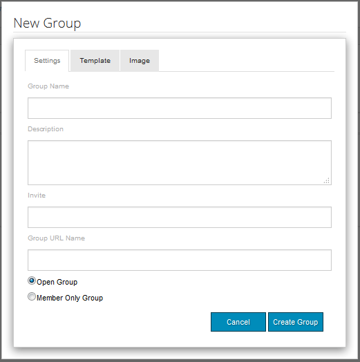

# Rapportkonsol{#reports-console}

## Översikt {#overview}

För AEM Communities finns det olika rapporter som kan nås på flera sätt från författarmiljön.

De olika rapporterna är i allmänhet följande:

* [Uppdragsrapport](#assignments-report) - för en community [för](/help/communities/overview.md#enablement-community)aktivering ger en översikt över elevens framsteg i sina uppdrag, inklusive ett associerat poängvärde om SCORM-standarden implementeras
* [Vyrapport](#views-report) - ger en översikt över vad communitymedlemmar och besökare tycker om communitysajter
* [Inläggsrapport](#posts-report) - innehåller en lista över olika typer av inlägg från communitymedlemmar på valfri communitywebbplats

När [Adobe Analytics är aktiverat](/help/communities/sites-console.md#analytics)innehåller rapporterna antalet visningar, uppspelningar, kommentarer och omdömen för varje aktiveringsresurs över tiden

Tabellrapporter kan exporteras i CSV-format för efterföljande bearbetning.

## Rapporteringskonsoler {#reporting-consoles}

### Rapporter om communitysajter {#reports-for-community-sites}

* från global navigering: **Navigation**, **Communities, Reports**

* välj bland

   * **Uppdragsrapport**

      * generera en rapport för den valda communitywebbplatsen, användaren eller gruppen samt tilldelningen

      * **Inläggsrapport**

         * generera en rapport för den valda communityplatsen, innehållstypen och tidsperioden
      * **Vyrapport**

         * generera en rapport för den valda communityplatsen, innehållstypen och tidsperioden

### Rapporter om aktiveringsresurser och utbildningsvägar {#reports-for-enablement-resources-and-learning-paths}

* från global navigering: **Navigation**, **Communities, Resources**

* välj en befintlig webbplats för aktiveringscommunityn

   * välj **Report **icon för att generera rapporter som täcker alla aktiveringsresurser
   * välj en utbildningsväg för aktivering
   * välj **Report **icon för att generera rapporter för

      * de medföljande aktiveringsresurserna
      * de studerande som är tilldelade inlärningsbanan

* Rapporterna innehåller följande uppgifter:

   * tabelldata, kan hämtas som CSV

      * identifiera studerande
      * deras status
      * om de har tilldelats eller öppnats via katalog
      * antal kommentarer
      * stjärnklassificering har angetts

Mer information finns i avsnittet [Rapporter](/help/communities/resources.md#report) i resurskonsolen.

## Uppdragsrapport {#assignments-report}

På uppdragskonsolen kan rapporter filtreras efter aktiveringscommunityplats, användare eller grupper samt tilldelning.

Rapporten innehåller information om hur de fortskrider samt eventuella kommentarer eller betyg som lämnats.

Välj villkor för rapporten:

* **Plats**

   välj en webbplats för aktiveringscommunityn

* **Användare eller grupp**
   * välj Användare för att generera en rapport för en elev
   * välj Grupp för att generera en rapport för en grupp studerande
   Tunneltjänsten kommer att få åtkomst till medlemmar och medlemsgrupper från publiceringsmiljön

* **Tilldelning**

   Välj bland de aktiveringsresurser som tilldelats de valda eleverna

Välj **Generera** för att skapa rapporten:

## Vyrapport {#views-report}

Med hjälp av vykonsolen kan rapporter genereras på sidvisningar av communityfunktioner under en viss tidsperiod.

Välj villkor för rapporten:

* **Plats**

   välj en communitywebbplats

* **Innehållstyp**

   kan välja Allt innehåll eller någon av funktionerna på webbplatsen

* tidsram

   välj en av

   * De senaste 7 dagarna
   * De senaste 30 dagarna
   * De senaste 90 dagarna
   * Förra året

Välj **Generera** för att skapa rapporten:

## Inläggsrapport {#posts-report}

Med publiceringskonsolen kan rapporter genereras om antalet inlägg till communityfunktioner under en viss tidsperiod.

Välj villkor för rapporten:

* **Plats**

   välj en communitywebbplats

* **Innehållstyp**

   kan välja Allt innehåll eller någon av funktionerna på webbplatsen

* tidsram

   välj en av

   * De senaste 7 dagarna
   * De senaste 30 dagarna
   * De senaste 90 dagarna
   * Förra året

Välj **Generera** för att skapa rapporten:

## Felsökning {#troubleshooting}

### Inga communitywebbplatser har angetts {#no-community-sites-listed}

Om det inte finns några communitysajter i listan kontrollerar du att Adobe Analytics har aktiverats för en webbplats. Om du väljer rapporter om tilldelningar måste du se till att tilldelningsfunktionen finns i communityplatsens struktur.

### Rapporterna visas inte i AEM Author-instansen {#reports-do-not-show-in-aem-author-instance}

Om rapporter inte visas i AEM Author-instansen kontrollerar du om det finns anpassningar, till exempel URL-mappning i Publish-instansen. Om URL-mappning endast görs på AEM Publish-instansen av communitywebbplatsen kontrollerar du att samma har konfigurerats i AEM Author-instansen i **Site Trend Report Social Component Factory **configuration.

