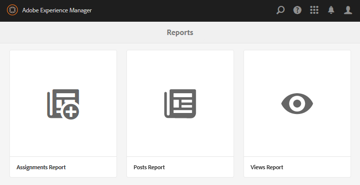

# Rapportkonsol {#reports-console}

## Ökning {#overview}

För AEM Communities finns det olika rapporter som du kan få åtkomst till på flera sätt från författarmiljön.

De olika rapporterna är i allmänhet följande:

* [Vyrapport](#views-report)

  Ger en översikt över vad communitymedlemmar och besökare tycker om communitysajter.

* [Inläggsrapport](#posts-report)

  Ger en översikt över olika typer av inlägg från communitymedlemmar på alla communitysajter.

Tabellrapporter kan exporteras i CSV-format för efterföljande bearbetning.

## Rapporteringskonsoler {#reporting-consoles}

### Rapporter om communitysajter {#reports-for-community-sites}

* Från global navigering: **[!UICONTROL Navigation]** > **[!UICONTROL Communities]** > **[!UICONTROL Reports]**

* Välj bland:

   * **[!UICONTROL Assignments Report]**

      * Generera en rapport för den valda communityplatsen, användaren eller gruppen och tilldelningen.

   * **[!UICONTROL Posts Report]**

      * Generera en rapport för den valda communityplatsen, innehållstypen och tidsperioden.

   * **[!UICONTROL Views Report]**

      * generera en rapport för den valda communityplatsen, innehållstypen och tidsperioden.

## Vyrapport {#views-report}

Med hjälp av vykonsolen kan rapporter genereras på sidvyer av communityfunktioner under en viss tidsperiod.

Välj villkor för rapporten:

* **[!UICONTROL Site]**

  Välj en community-webbplats.

* **[!UICONTROL Content Type]**

  Välj Allt innehåll eller någon av funktionerna på webbplatsen.

* **[!UICONTROL Time frame]**

  Välj något av följande:

   * De senaste 7 dagarna
   * De senaste 30 dagarna
   * De senaste 90 dagarna
   * Förra året

Välj **[!UICONTROL Generate]** om du vill skapa rapporten.

## Inläggsrapport {#posts-report}

På postkonsolen kan rapporter skapas om antalet inlägg i communityfunktioner under en viss tidsperiod.

Välj villkor för rapporten:

* **[!UICONTROL Site]**

  Välj en community-webbplats.

* **[!UICONTROL Content Type]**

  Välj Allt innehåll eller någon av funktionerna på webbplatsen.

* **[!UICONTROL Time frame]**

  Välj något av följande:

   * De senaste 7 dagarna
   * De senaste 30 dagarna
   * De senaste 90 dagarna
   * Förra året

Välj **[!UICONTROL Generate]** om du vill skapa rapporten.

## Felsökning {#troubleshooting}

### Inga communitywebbplatser har angetts {#no-community-sites-listed}

Om det inte finns några communitysajter i listan kontrollerar du att Adobe Analytics har aktiverats för en webbplats. Om du väljer rapporter om tilldelningar måste du se till att tilldelningsfunktionen finns i communityplatsens struktur.

### Rapporterna visas inte i AEM Author-instansen {#reports-do-not-show-in-aem-author-instance}

Om rapporter inte visas i AEM Author-instansen kontrollerar du om det finns anpassningar, till exempel URL-mappning för Publish-instansen. Om URL-mappning endast görs på den AEM Publish-instansen av communitywebbplatsen kontrollerar du att samma har konfigurerats i AEM Author-instansen i konfigurationen **Platstrend Report Social Component Factory**.

