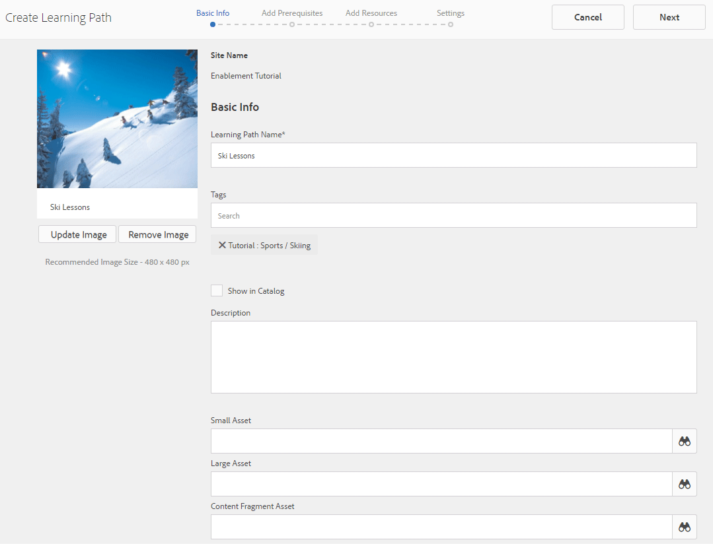

# Skapa och tilldela aktiveringsresurser {#create-and-assign-enablement-resources}

## Lägg till en aktiveringsresurs {#add-an-enablement-resource}

Så här lägger du till en aktiveringsresurs på den nya communitywebbplatsen:

* Logga in som systemadministratör på författarinstansen:
   * Till exempel [http://localhost:4502/](http://localhost:4503/)
* Välj **[!UICONTROL Communities]** > **[!UICONTROL Resources från global navigering]**

   

   
* Välj den community där aktiveringsresurser läggs till:
   * Välj **[!UICONTROL Aktivera självstudiekurs]**.
* From the menu, select **[!UICONTROL Create]**.
* Välj **[!UICONTROL Resurs]**.

### Grundläggande information {#basic-info}

Fyll i grundläggande information för resursen:

* **[!UICONTROL Platsnamn]**

   Ange namnet på den valda communitywebbplatsen: Självstudiekurs om aktivering

* **[!UICONTROL Resursnamn&amp;stämpel;senaste;]**

   Ski Lesson 1

* **[!UICONTROL Taggar]**

   Självstudiekurs: Idrott/skidåkning

* **[!UICONTROL Visa i katalog]**

   Ställ in den på **På**.

* **[!UICONTROL Beskrivning]**

   Snön snurrar för nybörjare.

* **[!UICONTROL Lägg till bild]**

   Lägg till en bild som representerar resursen för medlemmen i uppdragsvyn.

   

* Markera **[!UICONTROL nästa]**

### Lägg till innehåll {#add-content}

Det ser ut som om flera resurser kan väljas, men bara en är tillåten.

Markera `'+' icon`i det övre högra hörnet när du vill börja välja resursen genom att identifiera källan.

 

Överför en resurs. Om det är en videoresurs kan du antingen överföra en anpassad bild som ska visas innan videon börjar spelas upp eller tillåta att en miniatyrbild genereras från videon (kan ta några minuter - det är inte nödvändigt att vänta).

* Välj **[!UICONTROL Nästa]**.

### Inställningar {#settings}

* **[!UICONTROL Sociala inställningar]**

   Lämna standardinställningarna så att eleverna kan kommentera och betygsätta aktiveringsresurser.

* **[!UICONTROL Förfallodatum]**

   *(Valfritt)* Ett datum då uppdraget ska vara slutfört kan väljas.

* **[!UICONTROL Resursförfattare]**

   *(Valfritt)* Lämna tomt.

* **[!UICONTROL Resurskontakt&amp;stämpel;ast;]**

   *(Obligatoriskt)* Använd listrutan för att välja medlem `Quinn Harper`.

* **[!UICONTROL Resursexpert]**

   *(Valfritt)* Lämna tomt.

   **Obs**: Om användare eller grupper inte visas kontrollerar du att de har lagts till i `Community Enable Members` gruppen och *sparats* i publiceringsinstansen.

   

* Markera **[!UICONTROL nästa]**

### Uppdrag {#assignments}

* **[!UICONTROL Lägg till tilldelningar]**

   Låt vara unset eftersom den här aktiveringsresursen läggs till i en utbildningsväg. Om en elev tilldelas till den enskilda aktiveringsresursen samt en learningsökväg som innehåller aktiveringsresursen, tilldelas eleven till aktiveringsresursen två gånger.

   

* Välj **[!UICONTROL Skapa]**

   

Resursen har skapats och återgår till resurskonsolen med den nyligen skapade resursen markerad. Från den här konsolen går det att publicera, lägga till deltagare och ändra andra inställningar.

Om du vill överföra en ny version av aktiveringsresursen rekommenderar vi att du skapar en ny resurs och sedan avregistrerar medlemmar från den gamla versionen och registrerar dem i den nya versionen.

### Publicera resursen {#publish-the-resource}

Innan registrerare kan se den tilldelade kursen måste den publiceras:

* Välj World `Publish` icon

Aktiveringen har bekräftats med ett meddelande:

## Lägg till en andra aktiveringsresurs {#add-a-second-enablement-resource}

Upprepa stegen ovan för att skapa och publicera en andra relaterad aktiveringsresurs som en inlärningsväg skapas från.

**Publicera** den andra resursen.

Gå tillbaka till självstudiekursen om aktivering av dess resurser.

*Tips: Uppdatera sidan om båda resurserna inte visas.*

## Lägg till en utbildningssökväg {#add-a-learning-path}

En inlärningsväg är en logisk gruppering av aktiveringsresurser som utgör en kurs.

* I resurskonsolen väljer du `+ Create`
* Välj **[!UICONTROL utbildningssökväg]**

Lägg till **[!UICONTROL grundläggande information]**:

* **[!UICONTROL Namn på utbildningssökväg]**

   Ski-lektioner

* **[!UICONTROL Taggar]**

   Självstudiekurs: Skickar

* **[!UICONTROL Visa i katalog]**

   Lämna omarkerad

* **[!UICONTROL Överföra en bild]**

   För att visa utbildningssökvägen i resurskonsolen.

   

* Välj **[!UICONTROL Nästa]**.

Hoppa över nästa panel eftersom det inte finns några nödvändiga inlärningsvägar att lägga till.

* Markera **[!UICONTROL nästa]**

På panelen Lägg till resurser:

* Välj `+ Add Resources` att välja de två skidlektionsresurserna som ska läggas till i inlärningsbanan.

   Obs! Endast **publicerade** resurser kan markeras.

>[!NOTE]
>
>Du kan bara välja resurser på samma nivå som utbildningsvägen. För en inlärningsväg som skapats i en grupp är t.ex. endast resurserna på gruppnivå tillgängliga. för en inlärningsväg som skapats på en community-webbplats finns resurserna på den webbplatsen tillgängliga för tillägg till inlärningsvägen.

* Välj **[!UICONTROL Skicka]**.

   

   

* Markera **[!UICONTROL nästa]**

   

* **[!UICONTROL Lägg till tilldelningar]**

   Använd listrutemenyn för att markera `Community Ski Class` gruppen som ska innehålla medlemmar `Riley Taylor` och `Sidney Croft.`

* **[!UICONTROL Lär dig sökvägskontakt&amp;stämpel;ast;]**

   *(Obligatoriskt)* Använd listrutan för att välja medlem `Quinn Harper`.

* Välj **[!UICONTROL Skapa]**.

   

Utbildningssökvägen har skapats och återgår till resurskonsolen med den nya utbildningssökvägen markerad. Från den här konsolen går det att publicera, lägga till deltagare och ändra andra inställningar.

**Publicera** utbildningsvägen.

