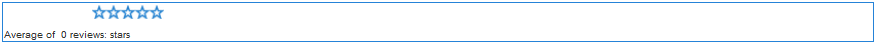

# Använda granskningar och granskningar - sammanfattning (visning) {#using-reviews-and-reviews-summary-display}

Komponenten är en `Reviews`sammansättning av [ och `Comments`](comments.md)[ `Rating`](rating.md) komponenter som är klara att användas.

Komponenten innehåller en sammanfattning av en aktiv eller stängd instans av en `Reviews Summary (Display)` `Reviews` komponent som kan visas någon annanstans på webbplatsen.

>[!NOTE]
>
>Anonym publicering av en granskning stöds inte. Besökare måste registrera sig (bli medlem) och logga in för att kunna delta. Den inloggade besökaren kan uppdatera sin granskning när som helst.

## Lägga till en granskning på en sida {#adding-a-review-to-a-page}

Om du vill lägga till en `Reviews` komponent på en sida i redigeringsläge använder du komponentwebbläsaren för att leta reda på `Communities / Reviews` och dra komponenten till en plats på en sida, till exempel en placering i förhållande till funktionen som användarna ska granska.

Mer information finns i Grunderna för [communitykomponenter](basics.md).

När de [nödvändiga klientbiblioteken](reviews-basics.md#essentials-for-client-side) inkluderas visas `Reviews`komponenten så här.

## Konfigurera granskningar {#configuring-reviews}

Markera den monterade `Reviews` komponent som du vill öppna och välj den `Configure` ikon som öppnar redigeringsdialogrutan.

Under fliken **[!UICONTROL Tillåtna klassificeringar]** anger du den fullständiga listan över klassificeringar som ska visas för medlemmarna. Det första omdömet bör vara ett övergripande/allmänt omdöme, eftersom det är omdömet som ger det genomsnittliga omdömet för `Review Summary (Display)` komponenten. De två följande klassificeringarna i standardkonfigurationen bör ha en annan rubrik än &quot;Undergrupp 1&quot; eller &quot;Undergrupp 2&quot;.

* **[!UICONTROL Tillåtna omdömen]**

   En lista med klassificeringar som en medlem kan välja från.

   Använd uppilen, nedpilen och borttagningsknapparna för att ändra de synliga markeringarna.

   Klicka på **[!UICONTROL Lägg till objekt]** för att lägga till ett annat klassificeringsalternativ.

Under fliken **[!UICONTROL Nödvändiga omdömen]** anger du objekt igen i listan över **[!UICONTROL tillåtna omdömen]** som ska klassificeras. Om ett objekt bara anges på fliken Tillåtna klassificeringar kan det lämnas omarkerat när medlemmen skickar in det.

På webbplatsen markeras nödvändiga klassificeringar med en asterisk. Om ett objekt är obligatoriskt och inte markerat visas ett meddelande för medlemmen och överföringen nekas tills alla nödvändiga klassificeringar har markerats.

* **[!UICONTROL Nödvändiga omdömen]**

   En delmängd av tillåtna klassificeringar, som anger vilka klassificeringar som krävs.

   Använd uppilen, nedpilen och borttagningsknapparna för att ändra de synliga markeringarna.

   Klicka på **[!UICONTROL Lägg till objekt]** för att lägga till ett annat svarsalternativ.

>[!NOTE]
>
>Om ett objekt anges på fliken **[!UICONTROL Nödvändiga klassificeringar]** som inte anges på fliken **[!UICONTROL Tillåtna klassificeringar]** , inkluderas det inte i posterna som ska värderas.

Ange hur granskningar ska hanteras på fliken **[!UICONTROL Granska]** .

* **[!UICONTROL Tillåt svar]** Om det här alternativet är markerat tillåter du svar på granskningar. Standard är avmarkerat.

* **[!UICONTROL Stängd]** Om det här alternativet är markerat stängs granskningen av nya granskningar och svar. Standard är avmarkerat.

* **[!UICONTROL Tillåt filöverföringar]** Om det här alternativet är markerat tillåter du att bifogade filer överförs för granskningen. Standard är avmarkerat.

* **Maximal filstorlek **är bara relevant om**[!UICONTROL Tillåt filöverföringar ]**är markerat. Det här fältet begränsar storleken (i byte) på en överförd fil. Standardvärdet är 10 MB.

* **[!UICONTROL Maximal meddelandelängd]** Maximalt antal tecken som kan anges i textrutan. Standardvärdet är 4 096 tecken.

* **[!UICONTROL Tillåtna filtyper]**&#x200B;är bara relevanta om **[!UICONTROL Tillåt filöverföringar]** är markerat. En kommaavgränsad lista med filtillägg med&quot;punktavgränsaren&quot;. Till exempel: .jpg, .jpeg, .png, .doc, .docx, .pdf. Om någon filtyp anges tillåts inte den som inte anges. Ingen standard har angetts så att alla filtyper tillåts.

* **[!UICONTROL RTF-redigerare]** Om det är markerat kan inlägg infogas med markeringar. Standard är avmarkerat.

* **[!UICONTROL Tillåt röstning]** Om det här alternativet är markerat inkluderas röstningsfunktionen för ett ämne. Standard är avmarkerat.

Ange hur de publicerade granskningarna ska hanteras på fliken **[!UICONTROL Användarmoderering]** . Mer information finns i [Hantera användargenererat innehåll](moderate-ugc.md).

* **[!UICONTROL Förhandsmoderering]** Om det här alternativet är markerat måste granskningarna godkännas innan de visas på en publiceringswebbplats. Standard är avmarkerat.

* **[!UICONTROL Ta bort granskningar]** Om det här alternativet är markerat kan den medlem som publicerade granskningen ta bort den. Standard är avmarkerat.

* **[!UICONTROL Neka granskningar]** Om det här alternativet är markerat tillåter du moderatorerna att neka granskningar. Standard är avmarkerat.

* **[!UICONTROL Stäng/öppna granskningar]** igen Om det här alternativet är markerat kan moderatorerna stänga och öppna granskningar igen. Standard är avmarkerat.

* **[!UICONTROL Flagggranskningar]** Om det här alternativet är markerat kan medlemmarna flagga granskningar som olämpliga. Standard är avmarkerat.

* **[!UICONTROL Om alternativet Flagga orsakslista]**&#x200B;är markerat kan medlemmarna i en nedrullningsbar lista välja orsaken till att en granskning flaggas som olämplig. Standard är avmarkerat.

* **[!UICONTROL Anledning]** till anpassad flagga Om den är markerad kan medlemmar ange en egen orsak till att en granskning har flaggats som olämplig. Standard är avmarkerat.

* **[!UICONTROL Moderationströskel]** Ange hur många gånger en granskning måste flaggas av medlemmar innan moderatorerna meddelas. Standard är en gång (1).

* **[!UICONTROL Flaggningsgräns]** Ange hur många gånger en granskning måste flaggas innan den döljs för den offentliga vyn. Talet måste vara större än eller lika med **[!UICONTROL modereringströskeln]**. Standardvärdet är 5.

### Lägga till en granskningssammanfattning (visning) på en sida {#adding-a-review-summary-display-to-a-page}

Om du vill lägga till en `Reviews Summary (Display)` komponent på en sida i redigeringsläge letar du reda på komponenten

* `Communities / Reviews Summary (Display)`

och dra den till rätt plats på en sida där en sammanfattning av en aktiv eller stängd granskning ska visas.

Mer information finns i Grunderna för [communitykomponenter](basics.md).

När de [nödvändiga klientbiblioteken](reviews-basics.md#essentials-for-client-side) inkluderas visas `Reviews Summary (Display)`komponenten så här.

>[!NOTE]
>
>&quot;Jämka&quot; motsvarar rösterna för den första posten på flikarna Tillåtna klassificeringar i den granskning som sammanfattas.

### Konfigurera sammanfattning av granskningar (visning) {#configuring-reviews-summary-display}

Markera den monterade `Reviews Summary (Display)` komponent som du vill öppna och välj den `Configure` ikon som öppnar redigeringsdialogrutan.

Under fliken **[!UICONTROL Granskningssammanfattning]**

* `Review Path`

   ange eller bläddra till den placerade instansen av `reviews`komponenten som ska sammanfattas, t.ex. om den läggs till på webbsidan för webbplatsen [Geometrixx Engage,](getting-started.md) så blir sökvägen:

   /content/sites/engage/en/page/jcr:content/content/primary/reviews

* `Include histogram`

   Om du markerar det här alternativet visas ett stolpdiagram som anger hur många stjärngraderingar det finns i de sammanfattade granskningarna. Standard är avmarkerat.

### Ändra till en anpassad granskningstyp {#changing-to-a-custom-review-type}

Komponenten Reviews använder kommentarsystemet.

Genom att ändra kommentarsresurstypen kommer kommentarsystemet inte längre att generera en instans av en kommentar med standardinställningen, utan en som har anpassats (utökats) av utvecklarna.

När de anpassade resurstyperna är kända går du till [designläge](../../help/sites-authoring/default-components-designmode.md) och dubbelklickar på den monterade `Comments` komponenten för att öppna en dialogruta med en extra flik.

Under fliken **[!UICONTROL Resurstyper]** anger du anpassad resourceType för nya instanser av `Comments or Voting`komponenterna:

* **[!UICONTROL Resurstyp för kommentar]**

   Navigera till resourceType för en utökad `comment`komponent (en kommentar) i /apps. Exempel, `/apps/social/commons/components/hbs/comments/comment`

   Den här resursen identifierar den resourceType för den UGC som skapas när en besökare publicerar en kommentar.

* **[!UICONTROL Typ av röstningsresurs]**

   Navigera till resourceType för en utökad `voting`komponent i /apps. Exempel, `/apps/social/components/hbs/voting`

   Den här resursen identifierar resurstypen för användargenererat innehåll som skapas när en besökare publicerar en röst.

* **[!UICONTROL Resurstyp för kommentarsystem]**

   Navigera till resourceType för en utökad `comments`komponent (kommentarsystemet) i /apps. Lämna tomt om inte sidmallen [dynamiskt inkluderar](scf.md#add-or-include-a-communities-component) kommentarsystemet i det underliggande skriptet i stället för att läggas till på sidan som en resurs (kommentarsnod). Läs mer om [{{include}}-hjälpen](handlebars-helpers.md#include)

## Site Visitor Experience {#site-visitor-experience}

### Styrelsemedlemmar och administratörer {#moderators-and-administrators}

När den inloggade användaren har moderator- eller administratörsbehörighet kan de utföra de modereringsåtgärder som tillåts av komponentens konfiguration, oavsett vem som skapade granskningen.

### Medlemmar {#members}

När besökaren är inloggad, beroende på konfigurationen, kan de

* Publicera en ny granskning
* Redigera en egen granskning
* Ta bort en egen granskning
* Flagga andras granskningskommentarer

Endast en klassificering per medlem tillåts. Medlemmen kan när som helst ändra sin klassificering.

### Anonym {#anonymous}

Besökare som inte är inloggade kan endast läsa publicerade granskningar, översätta dem om de stöds, men kan inte lägga till en klassificering eller en granskning eller flagga andras granskningskommentarer.

## Additional Information {#additional-information}

Mer information finns på sidan [Review Essentials](reviews-basics.md) för utvecklare.

Mer information om moderering av publicerade kommentarer finns i [Hantera användargenererat innehåll](moderate-ugc.md).

Information om översättning av bokförda kommentarer finns i [Översätta användargenererat innehåll](translate-ugc.md).
