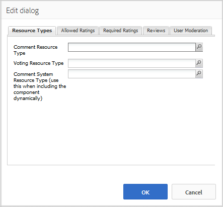

# Använda granskningar och granskningar - sammanfattning (visning) {#using-reviews-and-reviews-summary-display}

The `Reviews` är en sammansatt av [Kommentarer](comments.md) och [Klassificering](rating.md) komponenter som är klara att använda.

The `Reviews Summary (Display)` innehåller en sammanfattning av en aktiv eller stängd instans av en `Reviews` -komponent som ska visas någon annanstans på webbplatsen.

>[!NOTE]
>
>Anonym publicering av en granskning stöds inte. Besökarna måste registrera sig (bli medlem) och logga in för att kunna delta. Den inloggade besökaren kan uppdatera sin granskning när som helst.

## Lägga till en granskning på en sida {#adding-a-review-to-a-page}

Lägga till en `Reviews` -komponent till en sida i redigeringsläge använder du komponentwebbläsaren för att leta upp `Communities / Reviews` och dra den till rätt plats på en sida, t.ex. i förhållande till funktionen som användarna kan granska.

Nödvändig information finns på [Grunderna för communitykomponenter](basics.md).

När [nödvändiga bibliotek på klientsidan](reviews-basics.md#essentials-for-client-side) ingår så här `Reviews` visas.

## Konfigurera granskningar {#configuring-reviews}

Markera den monterade `Reviews` -komponenten som ska få åtkomst till och markera `Configure` som öppnar redigeringsdialogrutan.

Under **[!UICONTROL Allowed Ratings]** Ange den fullständiga listan över klassificeringar som ska visas för medlemmarna. Det första omdömet bör vara ett övergripande/allmänt omdöme, eftersom det är det omdöme som ger det genomsnittliga omdömet för `Review Summary (Display)` -komponenten. De två följande klassificeringarna i standardkonfigurationen bör ha en annan rubrik än &quot;Undergrupp 1&quot; eller &quot;Undergrupp 2&quot;.

* **[!UICONTROL Allowed Ratings]**

   En lista med klassificeringar som en medlem kan välja från.

   Använd uppilen, nedpilen och borttagningsknapparna för att ändra de synliga markeringarna.

   Klicka **[!UICONTROL Add Item]** för att lägga till ett annat klassificeringsval.

Under **[!UICONTROL Required Ratings]** -flik, ange objekt igen från listan med **[!UICONTROL Allowed Ratings]** som måste klassificeras. Om ett objekt bara anges på fliken Tillåtna klassificeringar kan det lämnas omarkerat när medlemmen skickar in det.

På webbplatsen markeras nödvändiga klassificeringar med en asterisk. Om ett objekt är obligatoriskt och inte markerat visas ett meddelande för medlemmen och överföringen nekas tills alla nödvändiga klassificeringar har markerats.

* **[!UICONTROL Required Ratings]**

   En delmängd av tillåtna klassificeringar, som anger vilka klassificeringar som krävs.

   Använd uppilen, nedpilen och borttagningsknapparna för att ändra de synliga markeringarna.

   Klicka **[!UICONTROL Add Item]** för att lägga till ett annat svarsalternativ.

>[!NOTE]
>
>Om en artikel anges på **[!UICONTROL Required Ratings]** som inte har angetts på **[!UICONTROL Allowed Ratings]** , tas det inte med i de artiklar som ska värderas.

Under **[!UICONTROL Reviews]** anger du hur granskningar ska hanteras.

* **[!UICONTROL Allow Replies]**

   Om det här alternativet är markerat tillåts svar på granskningar. Standard är avmarkerat.

* **[!UICONTROL Closed]**

   Om det här alternativet är markerat stängs granskningen av nya granskningar och svar. Standard är avmarkerat.

* **[!UICONTROL Allow File Uploads]**

   Om det här alternativet är markerat tillåter du att bifogade filer överförs för granskningen. Standard är avmarkerat.

* **Maximal filstorlek**

   Endast relevant om **[!UICONTROL Allow File Uploads]** är markerad. Det här fältet begränsar storleken (i byte) på en överförd fil. Standardvärdet är 10 MB.

* **[!UICONTROL Max Message Length]**

   Maximalt antal tecken som kan anges i textrutan. Standardvärdet är 4 096 tecken.

* **[!UICONTROL Allowed File Types]**

   Endast relevant om **[!UICONTROL Allow File Uploads]** är markerad. En kommaavgränsad lista med filtillägg med&quot;punktavgränsaren&quot;. Till exempel: .jpg, .jpeg, .png, .doc, .docx, .pdf. Om någon filtyp anges tillåts inte den som inte anges. Ingen standard har angetts så att alla filtyper tillåts.

* **[!UICONTROL Rich Text Editor]**

   Om det är markerat kan inlägg markeras. Standard är avmarkerat.

* **[!UICONTROL Allow Voting]**

   Inkludera röstfunktionen för ett ämne om det är markerat. Standard är avmarkerat.

Under **[!UICONTROL User Moderation]** anger du hur de publicerade granskningarna ska hanteras. Mer information finns i [Modererar användargenererat innehåll](moderate-ugc.md).

* **[!UICONTROL Pre-Moderation]**

   Om du markerar det här alternativet måste granskningarna godkännas innan de visas på en publiceringsplats. Standard är avmarkerat.

* **[!UICONTROL Delete Reviews]**

   Om det här alternativet är markerat kan den medlem som publicerade granskningen ta bort den. Standard är avmarkerat.

* **[!UICONTROL Deny Reviews]**

   Tillåt moderatorerna att neka granskningar om de är markerade. Standard är avmarkerat.

* **[!UICONTROL Close / Reopen Reviews]**

   Om det här alternativet är markerat kan moderatorerna stänga och öppna granskningar igen. Standard är avmarkerat.

* **[!UICONTROL Flag Reviews]**

   Om det här alternativet är markerat kan medlemmarna flagga granskningar som olämpliga. Standard är avmarkerat.

* **[!UICONTROL Flag Reason List]**

   Om det här alternativet är markerat kan medlemmarna välja, från en nedrullningsbar lista, anledningen till att en granskning flaggas som olämplig. Standard är avmarkerat.

* **[!UICONTROL Custom Flag Reason]**

   Om det här alternativet är markerat kan medlemmarna ange en egen orsak till att en granskning har flaggats som olämplig. Standard är avmarkerat.

* **[!UICONTROL Moderation Threshold]**

   Ange hur många gånger en granskning måste flaggas av medlemmar innan moderatorerna meddelas. Standard är en gång (1).

* **[!UICONTROL Flagging Limit]**

   Ange hur många gånger en granskning måste flaggas innan den döljs för den offentliga vyn. Talet måste vara större än eller lika med **[!UICONTROL Moderation Threshold]**. Standardvärdet är 5.

### Lägga till en granskningssammanfattning (visning) på en sida {#adding-a-review-summary-display-to-a-page}

Lägga till en `Reviews Summary (Display)` till en sida i redigeringsläge, leta reda på komponenten

* `Communities / Reviews Summary (Display)`

och dra den till rätt plats på en sida där en sammanfattning av en aktiv eller stängd granskning ska visas.

Nödvändig information finns på [Grunderna för communitykomponenter](basics.md).

När [nödvändiga bibliotek på klientsidan](reviews-basics.md#essentials-for-client-side) ingår så här `Reviews Summary (Display)`visas.

>[!NOTE]
>
>&quot;Jämka&quot; motsvarar rösterna för den första posten på flikarna Tillåtna klassificeringar i den granskning som sammanfattas.

### Konfigurera sammanfattning av granskningar (visning) {#configuring-reviews-summary-display}

Markera den monterade `Reviews Summary (Display)` -komponenten som ska få åtkomst till och markera `Configure` som öppnar redigeringsdialogrutan.

Under **[!UICONTROL Review Summary]** tab

* `Review Path`

   ange eller bläddra till den monterade instansen av `reviews`som ska sammanfattas, t.ex. om den har lagts till på webbsidan för [Geometrixx Engage site,](getting-started.md) banan skulle vara:

   `/content/sites/engage/en/page/jcr:content/content/primary/reviews`

* `Include histogram`

   Om du markerar det här alternativet visas ett stolpdiagram som anger hur många stjärngraderingar det finns i de sammanfattade granskningarna. Standard är avmarkerat.

### Ändra till en anpassad granskningstyp {#changing-to-a-custom-review-type}

Komponenten Reviews använder kommentarsystemet.

Genom att ändra kommentarsresurstypen kommer kommentarsystemet inte längre att generera en instans av en kommentar med standardinställningen, utan en som har anpassats (utökats) av utvecklarna.

När de anpassade resurstyperna är kända anger du [Designläge](../../help/sites-authoring/default-components-designmode.md) och dubbelklicka på `Comments` om du vill öppna en dialogruta med en extra flik.

Under **[!UICONTROL Resource Types]** anger du anpassad resourceType för nya instanser av `Comments or Voting` komponenter:

* **[!UICONTROL Comment Resource Type]**

   Navigera till resourceType för en utökad `comment`-komponent (en kommentar) i /apps. Till exempel, `/apps/social/commons/components/hbs/comments/comment`.

   Den här resursen identifierar den resourceType för den UGC som skapas när en besökare publicerar en kommentar.

* **[!UICONTROL Voting Resource Type]**

   Navigera till resourceType för en utökad `voting`i /apps. Till exempel, `/apps/social/components/hbs/voting`.

   Den här resursen identifierar resurstypen för användargenererat innehåll som skapas när en besökare publicerar en röst.

* **[!UICONTROL Comment System Resource Type]**

   Navigera till resourceType för en utökad `comments`-komponent (kommentarsystem) i /apps. Lämna tomt om inte sidmallen [innehåller](scf.md#add-or-include-a-communities-component) kommentarsystemet i det underliggande skriptet i stället för att läggas till på sidan som en resurs (kommentarsnod). Läs mer om [{{include}} hjälpare](handlebars-helpers.md#include).

## Site Visitor Experience {#site-visitor-experience}

### Styrelsemedlemmar och administratörer {#moderators-and-administrators}

När den inloggade användaren har moderator- eller administratörsbehörighet kan de utföra de modereringsåtgärder som tillåts av komponentens konfiguration, oavsett vem som skapade granskningen.

### Medlemmar {#members}

När besökaren är inloggad, beroende på konfigurationen, kan de:

* Publicera en ny granskning
* Redigera en egen granskning
* Ta bort en egen granskning
* Flagga andras granskningskommentarer

Endast en klassificering per medlem tillåts. Medlemmen kan när som helst ändra sin klassificering.

### Anonym {#anonymous}

Besökare som inte är inloggade kan endast läsa publicerade granskningar, översätta dem om de stöds, men kan inte lägga till en klassificering eller en granskning eller flagga andras granskningskommentarer.

## Ytterligare information {#additional-information}

Mer information finns på [Granska viktiga](reviews-basics.md) för utvecklare.

Mer information om moderering av kommentarer finns i [Modererar användargenererat innehåll](moderate-ugc.md).

För översättning av bokförda kommentarer, se [Översätter användargenererat innehåll](translate-ugc.md).
