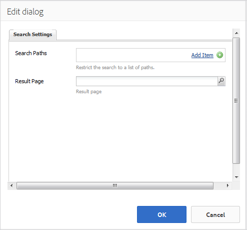

# Sökfunktion {#search-feature}

Sökfunktionen fungerar med olika andra funktioner, till exempel forum, som gör det möjligt att söka efter innehåll.

När du lägger till möjligheten att söka efter inlägg som angetts av communitymedlemmar, som kallas användargenererat innehåll (UGC), finns det två komponenter: [Sök](#search) och [Sökresultat](#search-results).

Sidan som innehåller komponenten `Search Results` har stöd för både sökning och visning av resultat.

På sidan som innehåller komponenten `Search` kan du starta en sökning med resultat som visas på sidan `Search Results`.

Sökfunktionen kan användas med andra funktioner som gör att besökare och medlemmar kan visa innehåll.

## Sök {#search-features}

### Lägg till sökning på en sida {#add-search-to-a-page}

Om du vill lägga till en `Search`-komponent på en sida i redigeringsläge använder du komponentwebbläsaren för att leta reda på `Communities / Search` och dra den till rätt plats på en sida. Användning av `Search` kräver en andra sida för `Search Results.`

Mer information finns på [Grunderna för communitykomponenter](basics.md).

När det nödvändiga klientbiblioteket, `cq.social.hbs.search`, inkluderas, visas `Search` -komponenten så här.

### Konfigurera den tillagda sökning {#configure-the-added-search}

Markera den monterade `Search`-komponenten som du vill komma åt och välj ikonen `Configure` som öppnar redigeringsdialogrutan.

Under fliken **[!UICONTROL Search Settings]** anger du hur sökvägarna ska genomsökas när en fråga anges av en besökare.

* **[!UICONTROL Search Paths]**
Genom att lägga till sökvägar med knappen Lägg till objekt begränsas innehållssökningen. Om du till exempel vill begränsa sökningen till ett specifikt forum väljer du en forumkomponent som placeras på en sida:

   * `/content/community-components/en/forum/jcr:content/content/forum`

* **[!UICONTROL Result Page]**
Resultatet visas på en separat sida som du anger genom att använda webbläsaren för att välja en sida som innehåller komponenten `Search Results` .

## Sökresultat {#search-results}

### Lägg till sökresultat på en sida {#add-search-results-to-a-page}

Om du vill lägga till en `Search Results`-komponent på en sida i redigeringsläge använder du komponentwebbläsaren för att hitta

* `Communities / Search Results`

och dra den till rätt plats på en sida. Till skillnad från sökkomponenten behövs ingen andra sida eftersom resultaten visas på samma sida.

Om du använder Sök någon annanstans på webbplatsen kan den här sidan med `Search Results` konfigureras som `Result Page` för någon eller alla instanser av `Search`.

Mer information finns på [Grunderna för communitykomponenter](basics.md).

När det nödvändiga klientbiblioteket, `cq.social.hbs.search`, inkluderas, visas `Search Result`-komponenten så här:

### Konfigurera det tillagda sökresultatet {#configure-the-added-search-result}

Markera den monterade `Search Results`-komponenten som du vill komma åt och välj ikonen `Configure` som öppnar redigeringsdialogrutan.

På fliken **[!UICONTROL Search Result Settings]** kan du ange vilka sökvägar som ska ingå i sökningen när en fråga anges av en besökare.

* **[!UICONTROL Search Results Per Page]**

  Definiera antalet ämnen/inlägg som visas per sida. Standardvärdet är 10.

* **[!UICONTROL Search Paths]**

  Genom att lägga till sökvägar med knappen Lägg till objekt begränsas innehållssökningen.

## Ytterligare information {#additional-information}

Mer information finns på sidan [Sök efter viktiga](search-implementation.md) för utvecklare.
