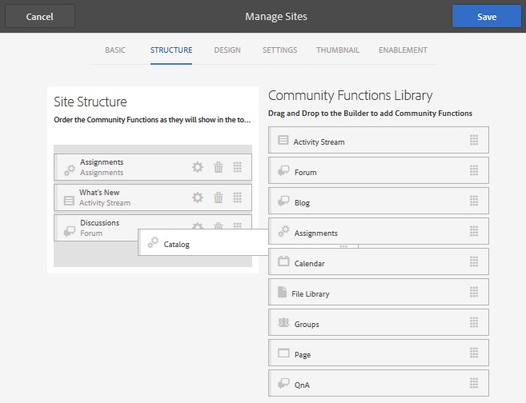

# Konsolen Webbplatser {#communities-sites-console}

Konsolen Communities Sites ger åtkomst till:

* Skapa webbplats
* Site editing
* Platshantering
* [Skapa och redigera kapslade grupper](/help/communities/groups.md) (undergrupper)

Se [Komma igång med AEM Communities](/help/communities/getting-started.md) där du kan se hur snabbt en communitywebbplats kan skapas i författarmiljön och hur du skapar communitygrupper från författar- och publiceringsmiljöer.

>[!NOTE]
>
>De viktigaste webbgruppsmenyerna för att skapa [communitywebbplatser](/help/communities/sites-console.md), [mallar för communitywebbplatser](/help/communities/sites.md), [mallar för communitygrupper](/help/communities/tools-groups.md) och [communityfunktioner](/help/communities/functions.md) är endast avsedda att användas i författarmiljön.

## Förutsättningar {#prerequisites}

Innan du skapar en community-webbplats är det *obligatoriskt* att:

* Kontrollera att en eller flera Publish-instanser körs.
* Aktivera [tunneltjänsten](/help/communities/deploy-communities.md#tunnel-service-on-author) för att hantera medlemmar och medlemsgrupper.
* Identifiera den [primära utgivaren](/help/communities/deploy-communities.md#primary-publisher).
* [Konfigurera replikering](/help/communities/deploy-communities.md#replication-agents-on-author) när den primära utgivarporten inte är standard (4503).

Det bästa sättet att se till att webbplatsen är förberedd för många funktioner är att utföra följande steg:

* Installera det [senaste funktionspaketet](/help/communities/deploy-communities.md#latestfeaturepack).
* Aktivera [Adobe Analytics](/help/communities/analytics.md) för AEM Communities.
* Konfigurera [e-post](/help/communities/email.md)
* Identifiera [communityadministratörer](/help/communities/users.md#creating-community-members).
* [Aktivera OAuth-hanteraren](/help/communities/social-login.md#adobe-granite-oauth-authentication-handler) för social inloggning.

## Åtkomst till webbgruppskonsolen {#accessing-communities-sites-console}

Om du vill nå konsolen Webbplatser i redigeringsmiljön:

* Från global navigering: **[!UICONTROL Communities]** > **[!UICONTROL Sites]**

Konsolen Communities Sites visar alla befintliga communityplatser. Från den här konsolen kan communitywebbplatser skapas, redigeras, hanteras och tas bort.

Om du vill skapa en community-webbplats väljer du ikonen **Skapa** .

Om du vill komma åt en befintlig communitywebbplats för att redigera, ändra, publicera, exportera eller lägga till en kapslad grupp, markerar du platsens mappikon.

## Skapa webbplats {#site-creation}

Konsolen för att skapa webbplatser innehåller ett stegvis tillvägagångssätt för att samla ihop funktioner på webbplatsen baserat på en vald [community-webbplatsmall](/help/communities/sites.md) och inställningar.

Varje webbplats som skapas innehåller en inloggningsfunktion eftersom besökarna måste logga in innan de kan publicera innehåll, skicka meddelanden eller delta i en grupp. Andra funktioner är användarprofiler, meddelanden, meddelanden, webbplatsmenyer, sökning, teman och varumärken.

Processen startas genom att du väljer knappen `Create` högst upp i konsolen Webbplatser för communities.

Skapandeprocessen är en serie steg som presenteras som paneler med en uppsättning funktioner som ska konfigureras (presenteras som underpaneler). Det går att gå vidare till **Nästa**-steget eller **Tillbaka** till föregående steg innan webbplatsen implementeras i det sista steget.

### Steg 1: Platsmall {#step-site-template}

På panelen Platsmall anges titel, beskrivning, platsrot, grundspråk, namn och platsmall:

* **Webbplatstitel för communityn**

  En visningsrubrik för webbplatsen.

  Titeln visas på den publicerade webbplatsen och i användargränssnittet för webbplatsadministratörer.

* **Beskrivning av communityplats**

  En beskrivning av platsen.

  Beskrivningen visas inte på den publicerade webbplatsen.

* **Webbplatsrot för community**

  Rotsökvägen till platsen.

  Standardroten är `/content/sites`, men roten kan flyttas till valfri plats på webbplatsen.

* **Bas för communitywebbplats**

  (Låt vara orört för ett språk: engelska) Använd listrutan för att välja ett *eller flera* basspråk från de tillgängliga språken - tyska, italienska, franska, japanska, spanska, portugisiska (Brasilien), kinesiska (traditionell) och kinesiska (förenklad). En community-webbplats skapas för varje språk som läggs till och finns i samma webbplatsmapp enligt den bästa metoden som beskrivs i [Översätta innehåll för flerspråkiga platser](/help/sites-administering/translation.md). Rotsidan för varje webbplats innehåller en underordnad sida som namnges med språkkoden för ett av de valda språken, till exempel &quot;en&quot; för engelska eller &quot;fr&quot; för franska.

* **Namn på communitywebbplats**:

  Namnet på webbplatsens rotsida som visas i URL:en.

   * Dubbelkontrollera namnet eftersom det inte är lätt att ändra efter att webbplatsen har skapats.
   * Bas-URL ( `https://server:port/site root/site name)`) visas under `Community Site Name`.

   * Ange en giltig URL genom att lägga till en baskod + &quot;.html&quot;

     *Till exempel*, `https://localhost:4502/content/sites/mysight/en.html`

* **Webbplatsmall för communityn**-menyn

  Använd listrutan för att välja en tillgänglig mall för [communitywebbplats](/help/communities/tools.md).

* Välj **Nästa**.

### Steg 2: Design {#step-design}

Designpanelen innehåller två underpaneler för att välja tema och varumärkesbanderoll:

#### TEMA PÅ GEMENSKAPENS WEBBPLATS {#community-site-theme}

Ramverket använder `Twitter Bootstrap` för att ge webbplatsen en responsiv, flexibel design. Ett av de många förinlästa Bootstrap-temana kan väljas för att formatera den valda communitywebbplatsmallen, eller så kan ett Bootstrap-tema överföras.

När du väljer det här alternativet överlappas temat av en ogenomskinlig blå bockmarkering.

När communitywebbplatsen har publicerats går det att [redigera egenskaperna](#modifying-site-properties) och välja ett annat tema.

#### GEMENSKAPENS WEBBPLATSHANTERING {#community-site-branding}

Webbplatsmärkning är en bild som visas som en rubrik högst upp på varje sida.

Bilden bör storleksändras så att den blir lika bred som den förväntade visningen av sidan i webbläsaren och 120 pixlar hög.

Tänk på följande när du skapar eller markerar en bild:

* Bildens höjd beskärs till 120 pixlar från bildens överkant.
* Bilden är fäst vid webbläsarfönstrets vänstra kant.
* Det finns ingen storleksändring av bilden, så att när bildbredden är...

   * Bilden upprepas vågrätt under webbläsarens bredd.
   * Bilden verkar beskuren eftersom den är större än webbläsarens bredd.

* Välj **Nästa**.

### Steg 3: Inställningar {#step-settings}

Panelen Inställningar innehåller flera underpaneler med funktioner som ska konfigureras innan du går till det sista steget för att skapa webbplatsen.

* [ANVÄNDARHANTERING](#user-management)
* [TAGGNING](#tagging)
* [ROLLER](#roles)
* [MODERATION](#moderation)
* [ANALYS](#analytics)
* [ÖVERSÄTTNING](#translation)

>[!NOTE]
>
>**Aktivera tunneltjänsten**
>
>Flera av underpanelerna Settings tillåter tilldelning av en betrodd medlem till måttlig användargenererad katalog, hantera grupper eller vara kontakter för aktiveringsresurser i publiceringsmiljön.
>
>Konventionen används för att [användare och användargrupper](/help/communities/users.md) (medlemmar och medlemsgrupper) på publiceringssidan inte ska dupliceras i författarmiljön.
>
>När du skapar en community-webbplats i författarmiljön och tilldelar betrodda medlemmar till olika roller måste du därför hämta medlemsdata från publiceringsmiljön.
>
>Detta uppnås genom att ` [AEM Communities Publish Tunnel Service](/help/communities/deploy-communities.md#tunnel-service-on-author)` aktiveras för författarmiljön.

#### ANVÄNDARHANTERING {#user-management}

* **Tillåt användarregistrering**

  Om det här alternativet är markerat kan besökarna bli communitymedlemmar genom självregistrering.
Om alternativet inte är markerat är communitywebbplatsen *begränsad* och webbplatsbesökarna måste tilldelas medlemsgruppen för communitywebbplatsen, göra en begäran eller skickas en inbjudan via e-post. Om alternativet inte är markerat bör anonym åtkomst inte tillåtas.
Avmarkera om det finns en *privat* community-webbplats. Standard är markerat.

* **Tillåt anonym åtkomst**

  Om det här alternativet är markerat är communitywebbplatsen *öppen* och alla besökare kan komma åt webbplatsen.
Om alternativet inte är markerat kan bara inloggade medlemmar få åtkomst till webbplatsen.
Avmarkera om det finns en *privat* community-webbplats. Standard är markerat.

* **Tillåt meddelanden**

  Om det här alternativet är markerat kan medlemmarna skicka meddelanden till varandra och till gruppen på communitywebbplatsen.
Om alternativet inte är markerat är meddelanden inte konfigurerade för communityn.
Standard är avmarkerat.

* **Tillåt sociala inloggningar: Facebook**

  Om det här alternativet är markerat kan webbplatsbesökare logga in med sina Facebook-kontouppgifter. Den valda [molnkonfigurationen för Facebook](/help/communities/social-login.md#create-a-facebook-connect-cloud-service) bör konfigureras att lägga till användare i medlemsgruppen för communitywebbplatsen när communitywebbplatsen har skapats.
Om du inte markerar det här alternativet visas ingen Facebook-inloggning.
Låt vara omarkerat för en *privat*-communitywebbplats. Standard är avmarkerat.

* **Tillåt sociala inloggningar: Twitter**

  Om det här alternativet är markerat tillåter du webbplatsbesökare att logga in med sina Twitter. Den markerade [Twitter-molnkonfigurationen](/help/communities/social-login.md#create-a-twitter-connect-cloud-service) bör konfigureras att lägga till användare i communityplatsens medlemsgrupp när community-webbplatsen har skapats.
Om du inte markerar det här alternativet visas ingen inloggning för Twitter.
Låt vara omarkerat för en *privat*-communitywebbplats. Standard är avmarkerat.

>[!NOTE]
>
>**Tillåta sociala inloggningar**
>
>Det kan finnas exempelkonfigurationer för Facebook och Twitter och de kan väljas för en [produktionsmiljö](/help/sites-administering/production-ready.md), men du måste skapa anpassade Facebook- och Twitter-program. Se [Social inloggning med Facebook och Twitter](/help/communities/social-login.md).

#### TAGGNING {#tagging}

De taggar som kan användas för communityinnehåll styrs genom att du väljer Taggnamnutrymmen som tidigare definierats via [taggningskonsolen](/help/sites-administering/tags.md#tagging-console).

Om du väljer taggnamnutrymmen för communitywebbplatsen begränsas dessutom det urval som visas när du definierar kataloger och resurser.

* textsökruta: Börja skriva för att identifiera taggar som kan användas på webbplatsen.

#### ROLLER {#roles}

[rollerna för communitymedlemmar](/help/communities/users.md) har tilldelats med de här inställningarna.

Det är enkelt att hitta communitymedlemmar med hjälp av typsnittssökning.

* **Community Managers**

  Börja skriva för att välja en eller flera community-medlemmar eller medlemsgrupper som kan hantera community-medlemmar och medlemsgrupper.

* **Community-moderatorer**

  Börja skriva för att välja en eller flera communitymedlemmar eller medlemsgrupper som ska betraktas som pålitliga som moderatorer för användargenererat innehåll.

* **Behöriga communitymedlemmar**

  Börja skriva för att välja en eller flera communitymedlemmar eller medlemsgrupper som ska kunna skapa innehåll när `Allow Privileged Member` har valts för en [communityfunktion](/help/communities/functions.md).

* **Community-administratörer**

  Börja skriva för att välja en eller flera webbplatsadministratörer som kan hantera webbplatsstrukturen oberoende av andra webbplatsadministratörer och standardadministratören. De kan skapa grupper på alla nivåer i hierarkin och bli standardadministratör för de kapslade grupperna (men de kan senare tas bort från administratörsrollen för kapslade grupper).

#### MODERATION {#moderation}

Den globala inställningen för moderering av användargenererat innehåll (UGC) styrs av dessa inställningar. Enskilda komponenter har ytterligare inställningar för att styra modereringen.

* **Innehållet är förmodererat**

  Om det här alternativet är markerat visas inte publicerat communityinnehåll förrän det har godkänts av en moderator. Standard är avmarkerat. Mer information finns i [Moderating Community Content](/help/communities/moderate-ugc.md#premoderation).

* **Tröskelvärde för flaggning innan innehållet döljs**

  Om värdet är större än 0 måste antalet gånger ett ämne eller ett inlägg flaggas innan det döljs för den offentliga vyn. Om värdet är -1 döljs aldrig det markerade ämnet eller inlägget från den offentliga vyn. Standardvärdet är 5.

#### ANALYS {#analytics}

* **Aktivera analys**

  Endast tillgängligt när Adobe Analytics har [konfigurerats](/help/communities/analytics.md) för webbgruppsfunktioner.
Standard är avmarkerat. När det här alternativet är markerat visas ytterligare en markeringsmeny:

* **Referens för konfigurationsramverk för molnet**

  I listrutan väljer du Analytics Cloud tjänstramverk som konfigurerats för den här communitywebbplatsen.
  `Communities` är ramverksexemplet från dokumentationen för [Analyskonfiguration för communityfunktioner](/help/communities/analytics.md#aem-analytics-framework-configuration).

#### ÖVERSÄTTNING {#translation}

* **Tillåt maskinöversättning**

  När det här alternativet är markerat (standardinställningen är avmarkerad) aktiveras maskinöversättning för UGC på platsen. Detta påverkar inte annat innehåll, t.ex. sidinnehåll, även om webbplatsen har konfigurerats som en flerspråkig webbplats. Mer information om hur du konfigurerar en licensierad översättningstjänst för AEM Communities finns i [Översätta användargenererat innehåll](/help/communities/translate-ugc.md). En fullständig översikt finns i [Översätta innehåll för flerspråkiga platser](/help/sites-administering/translation.md).

* **Aktivera maskinöversättning för valda språk**

  Språken som är aktiverade för maskinöversättning är standardinställningen för den systeminställning som anges av [integrationskonfigurationen för översättning](/help/communities/translate-ugc.md#translation-integration-configuration). Dessa standardinställningar kan åsidosättas för den här webbplatsen genom att standardinställningar tas bort och/eller genom att andra språk väljs i den nedrullningsbara menyn.

* **Välj en översättningsleverantör**

  Som standard är tjänsteleverantören en provtjänst som endast använder `microsoft` som exempel. Om ingen översättningstjänstprovider är licensierad bör **Tillåt maskinöversättning** avmarkeras.

* **Välj ett globalt delat arkiv**

  För en webbplats med flera språkkopior innehåller ett globalt delat arkiv en enda konversationstråd, som visas från varje språkkopia. Detta uppnås genom att välja ett av språken som ingår som en språkkopia. Standardvärdet är *Inget globalt delat arkiv*.

* **Välj konverteringsproviderkonfiguration**

  Välj ett [ramverk för översättningsintegrering](/help/sites-administering/tc-tic.md) som skapats för den licensierade översättningsprovidern.

* **Välj översättningsalternativ för communitywebbplatsen**

   * **Översätt hela sidan**

     Om du väljer det här alternativet översätts all UGC på en sida till sidans basspråk.

     Standard är *inte markerat*.

   * **Översätt endast markering**

     Om du väljer det här alternativet visas ett översättningsalternativ intill varje inlägg som gör att enskilda inlägg kan översättas till sidans grundspråk.
Standard är *markerat*.

* **Välj alternativ för beständighet**

   * **Översätt avgifter på användarbegäran och spara dem efteråt**
Om du väljer det här alternativet översätts inte innehållet förrän en begäran har gjorts. När översättningen är klar sparas översättningen i databasen.

     Standard är *inte markerat*.

   * **Behåll inte översättningar**

     Om du väljer det här alternativet lagras inte översättningar i databasen.

     Om det inte är markerat bevaras översättningar.

     Standard är *inte markerat*.

* **Smart rendering**

  Välj något av följande:

   * `Always show contributions in the original language` (standard)
   * `Always show contributions in user preferred language`
   * `Show contributions in user preferred language for only logged-in users`

### Steg 4: Skapa webbgruppswebbplats {#step-create-communities-site}

Om det behövs justeringar använder du knappen **Bakåt** för att göra dem.

När **Skapa** har valts och startats kan processen att skapa webbplatsen inte avbrytas.

När webbplatsen har skapats:

* Det går inte att ändra URL:en (nodnamn).
* Framtida ändringar av communitywebbplatsmallen påverkar inte den skapade communitywebbplatsen.
* Om du inaktiverar communityplatsmallen påverkas inte den skapade communitywebbplatsen.
* Det går att redigera [STRUKTUREN](#modify-structure) för en community-webbplats genom att ändra dess egenskaper.

När processen är klar visas mappen för den nya platsen i konsolen Webbplatser, där författare kan lägga till sidinnehåll, eller så kan administratörer ändra platsens egenskaper.

Om du vill redigera en community-plats väljer du projektmappen för den:

När du hovrar över en plats med en mus eller vidrör ett platskort visas ikoner som tillåter följande:

* [redigera webbplatsen i redigeringsläge](#authoring-site-content)
* [öppna webbplatsegenskaperna för ändring](#modifying-site-properties)
* [publicera webbplatsen](#publishing-the-site)
* [exportera webbplatsen](#exporting-the-site)
* [ta bort webbplatsen](#deleting-the-site)

## Skapa webbplatsinnehåll {#authoring-site-content}

Innehållet i en webbplats kan redigeras med samma verktyg som andra AEM. Om du vill öppna webbplatsen för redigering väljer du ikonen `Open Site` som visas när du hovrar webbplatsen med musen. Webbplatsen öppnas på en ny flik så att konsolen Webbplatser fortfarande är tillgänglig.

>[!NOTE]
>
>Om du inte känner till AEM kan du läsa dokumentationen om [grundläggande hantering](/help/sites-authoring/basic-handling.md) och en [snabbguide till redigeringssidor](/help/sites-authoring/qg-page-authoring.md).

## Ändra webbplatsegenskaper {#modifying-site-properties}

Egenskaperna för en befintlig plats, som anges när webbplatsen skapas, kan ändras genom att markera ikonen `Edit Site` som visas när du håller muspekaren över webbplatsen.

Avsnittet `Details of the following properties match the descriptions provided in the` [Skapa webbplats](#site-creation).

### Ändra grundläggande {#modify-basic}

På BASIC-panelen kan du ändra:

* Rubrik för communitywebbplats
* Beskrivning av communityplats

Det går inte att ändra namnet på communityplatsen.

Om du väljer en annan mall för en community-webbplats påverkas inte en befintlig community-webbplats eftersom det inte finns någon koppling mellan mallar och webbplatser.

I stället kan [STRUKTUREN](#modify-structure) för communitywebbplatsen ändras.

### Ändra struktur {#modify-structure}

STRUKTURpanelen gör att du kan ändra den struktur som ursprungligen skapades från den valda mallen för communitywebbplatser. På panelen kan du:

* Dra och släpp ytterligare [communityfunktioner](/help/communities/functions.md) till webbplatsstrukturen.
* En instans av en communityfunktion i webbplatsstrukturen:

   * **`gear icon`**

     Redigera inställningar, inklusive visningsrubrik och URL-namn, och [behöriga medlemsgrupper](/help/communities/users.md#privilegedmembersgroups).

   * **`trashcan icon`**

     Ta bort funktioner från platsstrukturen.

   * **`grid icon`**

     Ändra den ordning på funktioner som visas i navigeringsfältet på den översta nivån.

>[!NOTE]
>
>Du kan ändra ordningen på alla funktioner i platsstrukturen förutom funktionen längst upp. Det innebär att det inte går att ändra startsidan för en community-webbplats.

>[!CAUTION]
>
>* Visningsrubriken kan ändras utan biverkningar, men du bör inte redigera URL-namnet för en community-funktion som tillhör en community-webbplats.
>
>Om du t.ex. byter namn på URL-adressen flyttas inte befintlig UGC, vilket betyder&quot;förlorar&quot; UGC.

>[!CAUTION]
>
>Gruppfunktionen får *inte* vara den *första eller den enda* funktionen i platsstrukturen.
>
>Alla andra funktioner, till exempel [sidfunktionen](/help/communities/functions.md#page-function), måste inkluderas och listas först.

#### Exempel: Lägga till en katalogfunktion i en community-platsstruktur {#example-adding-a-catalog-function-to-a-community-site-structure}

### Ändra design {#modify-design}

På designpanelen kan du använda ett nytt tema:

* [Community Site Theme](#community-site-theme)
* [Varumärkning för communitysajter](#community-site-branding)

   * Bläddra till panelens nedre del så att du kan ändra varumärkesbilden.

### Ändra inställningar {#modify-settings}

Med hjälp av inställningspanelen får du tillgång till de flesta inställningarna under underpanelerna i steg 3 för att skapa en community-webbplats:

* [Användarhantering](#user-management)
* [Taggar](#tagging)
* [Moderering](#moderation)
* [Medlemsroller](#roles)
* [Analyser](#analytics)
* [Översättning](#translation)

### Ändra miniatyrbild {#modify-thumbnail}

På panelen MINIATYRBILD kan en bild överföras för att representera webbplatsen i webbgruppskonsolen.

## Publicera webbplatsen {#publishing-the-site}

När en community-webbplats har skapats eller ändrats på nytt kan du publicera (aktivera) webbplatsen genom att välja ikonen `Publish Site` som visas när du håller muspekaren över webbplatsen.

Det finns en indikation när webbplatsen har publicerats.

### Publicera med kapslade grupper {#publishing-with-nested-groups}

När du har publicerat en community-webbplats måste du publicera varje undergrupp (kapslad grupp) som skapats med [gruppkonsolen](/help/communities/groups.md) separat.

## Exportera platsen {#exporting-the-site}

Markera exportikonen när du för muspekaren över webbplatsen, så att du kan skapa ett paket av communitywebbplatsen som både lagras i [pakethanteraren](/help/sites-administering/package-manager.md) och hämtas.

UGC ingår inte i webbplatspaketet.

## Tar bort platsen {#deleting-the-site}

Om du vill ta bort communitywebbplatsen väljer du ikonen Ta bort plats som visas när du håller muspekaren över webbplatsen i Webbplatskonsolen. Den här åtgärden tar bort alla objekt som är associerade med platsen, till exempel UGC, användargrupper, resurser och databasposter.

## Skapade användargrupper i communityn {#created-community-user-groups}

När den nya communitywebbplatsen har publicerats skapas nya medlemsgrupper (användargrupper i publiceringsmiljön) som har rätt behörigheter för olika administrativa roller och medlemsroller.

Namnet som skapas för medlemsgrupperna innehåller *site-name* som anges i [Steg 1](#step13asitetemplate) (namnet som visas i URL:en). Det innehåller också ett unikt ID för att undvika konflikter med communitysajter och grupper som har samma platsnamn för olika communityrötter.

Om namnet till exempel är &quot;engage&quot; för en webbplats med namnet &quot;Getting Started Tutorial&quot;, skulle användargruppen för moderatorer vara:

* title: Moderatorer för communityengagemang
* name: community-*engage-uid*-moderators

Alla medlemmar som tilldelats roller som moderatorer eller gruppadministratörer när platsen skapas tilldelas till rätt grupp och tilldelas till medlemsgruppen. Dessa grupper och medlemstilldelningar skapas vid publicering när den nya webbplatsen publiceras.

Mer information finns i [Hantera användare och användargrupper](/help/communities/users.md).

>[!NOTE]
>
>Om [Tillåt social inloggning: Facebook](#user-management) aktiveras när användargruppen `community-<site-name>-<uid>-members`
>har skapats bör den [Facebook molntjänst](/help/communities/social-login.md#createafacebookcloudservice) som används konfigureras för att lägga till användare i den här gruppen.

## Konfigurera för autentiseringsfel {#configure-for-authentication-error}

Som standard dirigeras en community-webbplats om till en exempelinloggningssida när användaren anger fel inloggningsuppgifter och inte kan logga in. Den här exempelinloggningen finns inte på en [produktionsserver](/help/sites-administering/production-ready.md).

Om du vill omdirigera korrekt, när en webbplats har konfigurerats och publicerats, slutför du de här stegen för att få autentiseringsfel att omdirigera till communitywebbplatsen:

* På varje AEM publiceringsinstans.
* Logga in med administratörsbehörighet.
* Gå till [webbkonsolen](/help/sites-deploying/configuring-osgi.md).

   * Exempel: [https://localhost:4503/system/console/configMgr](https://localhost:4503/system/console/configMgr).

* Sök efter `Adobe Granite Login Selector Authentication Handler`.
* Markera ikonen `pencil` så att du kan öppna konfigurationen för redigering.
* Ange **Inloggningssidmappningar** enligt följande:

  `/content/sites/<site-name>/path/to/login/page:/content/sites/<site-name>`

  Till exempel:
  `/content/sites/engage/en/signin:/content/sites/engage/en`

* Välj **Spara**.

### Testa autentiseringsomdirigering {#test-authentication-redirection}

På samma AEM har publiceringsinstansen konfigurerats med en inloggningssidmappning för communitywebbplatsen:

* Bläddra till startsidan för communitywebbplatsen.

   * Exempel: [https://localhost:4503/content/sites/engage/en.html](https://localhost:4503/content/sites/engage/en.html)

* Välj Logga ut.
* Välj Logga in.
* Ange felaktiga inloggningsuppgifter, till exempel användarnamnet &quot;x&quot; och lösenordet &quot;x&quot;.
* Inloggningssidan ska visas med felmeddelandet&quot;ogiltig inloggning&quot;.

## Åtkomst till communityplatser från huvudplatskonsolen {#accessing-community-sites-from-main-sites-console}

Från den globala webbplatskonsolen finns communityplatser i mappen `Community Sites`.

Det går att komma åt en community-webbplats på det här sättet, men för administrativa uppgifter bör communitywebbplatsen nås från konsolen Webbplatser för communities.

