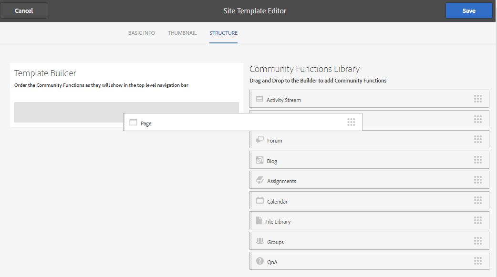

# Webbplatsmallar {#site-templates}

Konsolen Webbplatsmallar liknar konsolen [Gruppmallar](tools-groups.md) som är inriktad på funktioner som är av intresse för communitygrupper.

>[!NOTE]
>
>Konsolerna för att skapa [communitywebbplatser](sites-console.md), [mallar för communitywebbplatser](sites.md), [mallar för communitygrupper](tools-groups.md) och [communityfunktioner](functions.md) är endast avsedda att användas i författarmiljön.

## Konsol för webbplatsmallar {#site-templates-console}

I redigeringsmiljön kan du nå webbcommunityplatskonsolen:

* Från global navigering: **[!UICONTROL Tools > Communities > Site Templates]**

Den här konsolen visar mallarna som en [communityplats](sites-console.md) kan skapas från och tillåter att nya webbplatsmallar skapas.

## Skapa platsmall {#create-site-template}

Om du vill börja skapa en webbplatsmall väljer du `Create`.

Då öppnas panelen Platsredigeraren som innehåller tre underpaneler:

### Grundläggande information {#basic-info}

På panelen Grundläggande information konfigureras ett namn, en beskrivning och huruvida mallen är aktiverad eller inaktiverad:

* **[!UICONTROL Community Site Template Name]**

  Mallens namn-ID.

* **[!UICONTROL Community Site Template Description]**

  Mallbeskrivningen.

* **[!UICONTROL Disabled/Enabled]**

  En växlingsväxling som styr om mallen kan refereras.

### Miniatyrbild {#thumbnail}

(Valfritt) Välj ikonen Överför bild om du vill visa en miniatyrbild tillsammans med namnet och beskrivningen för användare som skapar communitywebbplatser.

### Struktur {#structure}

Om du vill lägga till communityfunktioner drar du från höger sida till vänster i den ordning som länkarna på webbplatsmenyn ska visas. Format används på mallen när webbplatsen skapas.

Om du till exempel vill ha en hemsida drar du funktionen Sida från biblioteket och släpper under mallbyggaren. Detta resulterar i att dialogrutan för sidkonfiguration öppnas. Mer information om konfigurationsdialogrutorna finns i [funktionskonsolen](functions.md).

Fortsätt att dra och släppa andra communityfunktioner som du vill ha för en community-webbplats som baseras på den här mallen.

Sidfunktionen ger en tom sida. Med funktionen Grupper kan du skapa en gruppwebbplats (subcommunity) på communitywebbplatsen.

>[!CAUTION]
>
>Funktionen Grupper får *inte vara den första eller enda*-funktionen i platsstrukturen.
>
>Alla andra funktioner, till exempel [sidfunktionen](functions.md#page-function), måste inkluderas och listas först.

### Gruppmallar för gruppfunktion {#group-templates-for-groups-function}

När du inkluderar en gruppfunktion i platsmallen, kräver konfigurationen att du anger vilka gruppmallsalternativ som tillåts när en ny grupp skapas i publiceringsmiljön.

>[!CAUTION]
>
>Funktionen Grupper får *inte vara den första eller enda*-funktionen i platsstrukturen.

Genom att välja två eller flera mallar för communitygrupper får gruppadministratören välja när en grupp faktiskt skapas i communityn.

## Redigera webbplatsmall {#edit-site-template}

När du visar webbplatsmallar i huvudkonsolen [Platsmallar](#site-templates-console) går det att välja en befintlig platsmall för redigering.

Den här processen innehåller samma paneler som [skapar en platsmall](#create-site-template).
