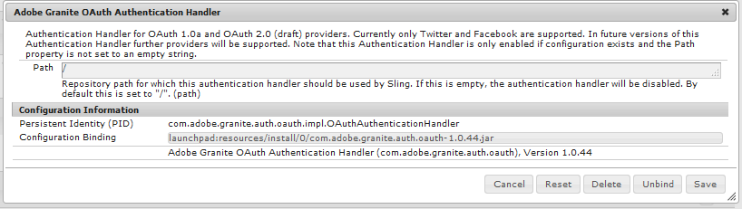

# Social inloggning med Facebook och Twitter {#social-login-with-facebook-and-twitter}

Inloggning via sociala medier är en funktion för att ge en besökare möjlighet att logga in med sitt Facebook- eller Twitter-konto. Därför bör du inkludera tillåtna Facebook- eller Twitter-data i deras AEM medlemsprofil.

## Översikt över social inloggning {#social-login-overview}

Om du vill inkludera social inloggning är det *obligatoriskt* att skapa anpassade Facebook- och Twitter-program.

Vi-exemplet innehåller exempel på Facebook- och Twitter-appar samt molntjänster, men de är inte tillgängliga på en [produktionswebbplats](../../help/sites-administering/production-ready.md).

De steg som krävs är:

1. [Aktivera OAuth-autentisering](#adobe-granite-oauth-authentication-handler) för alla AEM publiceringsinstanser.

   Om OAuth inte är aktiverat misslyckas inloggningsförsöken.

1. **Skapa** en social app och en molntjänst.

   * Så här hanterar du inloggning med Facebook:

      * Skapa en [Facebook-app](#create-a-facebook-app).
      * Skapa och publicera en [Facebook Connect-molntjänst](#create-a-facebook-connect-cloud-service).

   * Så här stöder du inloggning med Twitter:

      * Skapa en [Twitter-app](#create-a-twitter-app).
      * Skapa och publicera en [Twitter Connect-molntjänst](#create-a-twitter-connect-cloud-service).

1. [**Aktivera** social inloggning](#enable-social-login) för en community-webbplats.

Det finns två grundläggande begrepp:

1. **Scope** (behörigheter) anger vilka data som programmet kan begära.

   * Facebook- och Twitterna [Adobe Granite OAuth Application och Provider](#adobe-granite-oauth-application-and-provider) har som standard grundläggande programbehörigheter inom sitt omfång.

1. **Fält** (parametrar) anger aktuella data som begärts med URL-parametrar.

   * Dessa fält anges i [AEM Communities Facebook OAuth Provider](#aem-communities-facebook-oauth-provider) och [AEM Communities Twitter OAuth Provider](#aem-communities-twitter-oauth-provider).
   * Standardfälten räcker för de flesta fall, men kan ändras.

## Facebook Login {#facebook-login}

### Facebook API-version {#facebook-api-version}

Samtidig inloggning och Facebook-exemplet för webbförsäljning utvecklades när Facebook Graph API var version 1.0.
Från och med AEM 6.4 GA och AEM 6.3 SP1 uppdaterades den sociala inloggningen för att fungera med den nyare Facebook Graph API 2.5-versionen.

>[!NOTE]
>
>För äldre AEM versioner, om du råkar ut för ett undantag i loggarna **Det går inte att extrahera en token från**, uppgradera till den senaste bestrukna versionen för den AEM.

Versionsinformation om Facebook Graph API finns i [Facebook API-ändringsloggen](https://developers.facebook.com/docs/apps/changelog).

### Skapa en Facebook-app {#create-a-facebook-app}

Ett korrekt konfigurerat Facebook-program krävs för att aktivera Facebook inloggning för sociala medier.

Följ Facebook instruktioner på [https://developers.facebook.com/apps/](https://developers.facebook.com/apps/) om du vill skapa ett Facebook-program. Ändringar av instruktionerna återspeglas inte i följande information.

Från och med Facebook API v2.7:

* *Lägg till en ny Facebook-app*
   * Välj Webbplats för *Plattform*:
      * Ange `  https://<server>:<port>.` för *webbplats-URL*
      * För *Visningsnamn* anger du en titel som ska användas som titel för Facebook-anslutningstjänsten.
      * För *kategori* rekommenderar vi att du väljer *Appar för sidor*, men det kan vara vad som helst.
      * *Lägg till produkt: Facebook-inloggning*
      * Ange `  https://<server>:<port>.` för *giltiga omdirigerings-URI:er för OAuth*

>[!NOTE]
>
>http://localhost:4503 fungerar för utveckling.

Leta reda på inställningarna för **[!UICONTROL App ID]** och **[!UICONTROL App Secret]** när programmet har skapats. Den här informationen krävs för att konfigurera molntjänsten [Facebook](#createafacebookcloudservice).

### Skapa en Facebook Connect-Cloud Service {#create-a-facebook-connect-cloud-service}

Instansen [Adobe Granite OAuth Application och Provider](#adobe-granite-oauth-application-and-provider), som initieras genom att en molntjänstkonfiguration skapas, identifierar Facebook-programmet och medlemsgrupperna som de nya användarna läggs till i.

1. Logga in med administratörsbehörighet på AEM författarinstans.
1. Välj **[!UICONTROL Tools]** > **[!UICONTROL Cloud Services]** > **[!UICONTROL Facebook Social login configuration]** från global navigering.
1. Välj konfigurationen **[!UICONTROL context path]**.

   **[!UICONTROL Context path]** ska vara samma som molnkonfigurationssökvägen som du har valt när du skapar/redigerar en community-plats.

1. Kontrollera om din kontextsökväg är aktiverad för att skapa molntjänster under den.
1. Gå till **[!UICONTROL Tools]** > **[!UICONTROL General]** > **[!UICONTROL Configuration Browser]**. Välj kontext och redigera egenskaper. Aktivera molnkonfigurationer om de inte har aktiverats ännu.

   

   * Mer information finns i dokumentationen för [Configuration Browser](/help/sites-administering/configurations.md).

1. **Skapa/redigera** Facebook molntjänstkonfiguration.

   

   * **[!UICONTROL Title]** (*Required*) Ange en visningsrubrik som identifierar Facebook App. Använd samma namn som anges som *visningsnamn* för Facebook-programmet.
   * **[!UICONTROL App ID/API Key]** (*Required*) Ange ***program-ID*** för Facebook App. Detta identifierar instansen [Adobe Granite OAuth Application och Provider](https://helpx.adobe.com/se/experience-manager/6-3/communities/using/social-login.html#AdobeGraniteOAuthApplicationandProvider) som skapats från dialogrutan.
   * **[!UICONTROL App Secret]** (*Required*) Ange ***apphemlighet*** för Facebook App.
   * **[!UICONTROL Create Users]** Om det här alternativet är markerat skapas en AEM användarpost och läggs till som medlem i de valda användargrupperna när du loggar in med ett Facebook-konto.  Standard är markerat (rekommenderas starkt).
   * **[!UICONTROL Mask User IDs]**: Låt vara avmarkerat.
   * **[!UICONTROL Scope Email]**: användarens e-post-ID ska hämtas från Facebook.
   * **[!UICONTROL Add to User Groups]** Välj Lägg till användargrupp om du vill välja en eller flera [medlemsgrupper](https://helpx.adobe.com/se/experience-manager/6-3/communities/using/users.html) för den community som användarna ska läggas till i.

   >[!NOTE]
   >
   >Grupper kan läggas till eller tas bort när som helst. Men befintliga användares medlemskap påverkas inte. Automatiskt medlemskap gäller endast för nya användare som skapas efter den här fältuppdateringen. För webbplatser där anonyma användare är inaktiverade väljer du att lägga till användare i motsvarande community-medlemsgrupp som är avsedd för den stängda communitywebbplatsen.

   * Välj **[!UICONTROL SAVE]**.
   * **[!UICONTROL Publish]**.

Resultatet är en [Adobe Granite OAuth-programinstans och Provider](https://helpx.adobe.com/se/experience-manager/6-3/communities/using/social-login.html#adobe-granite-oauth-application-and-provider) som inte behöver ändras ytterligare om inte ytterligare scope (behörigheter) läggs till. Standardomfånget är standardbehörigheten för Facebook-inloggning. Om ytterligare omfattning önskas är det nödvändigt att redigera OSGI-konfigurationen direkt. Om ändringar görs direkt via system/konsol ska du undvika att redigera molntjänstkonfigurationerna från pekgränssnittet för att undvika att skriva över dem.

### AEM Communities Facebook OAuth Provider {#aem-communities-facebook-oauth-provider}

AEM Communities-providern utökar instansen [Adobe Granite OAuth Application och Provider](#adobe-granite-oauth-application-and-provider).

Den här providern behöver redigeras för att:

* Tillåt användaruppdateringar
* Lägg till ytterligare fält [inom omfånget](#adobe-granite-oauth-application-and-provider)

   * Alla fält som tillåts som standard inkluderas inte som standard.

Om redigering är nödvändig, för varje AEM publiceringsinstans:

1. Logga in med administratörsbehörighet.
1. Navigera till [webbkonsolen](../../help/sites-deploying/configuring-osgi.md). Exempel: http://localhost:4503/system/console/configMgr.
1. Hitta AEM Communities Facebook OAuth Provider.
1. Markera pennikonen som du vill öppna för redigering.

   

   * **[!UICONTROL OAuth Provider ID]**

     (*Obligatoriskt*) Standardvärdet är *soco -facebook*. Redigera inte.

   * **[!UICONTROL Cloud Service Config]**

     Standardvärdet är `/etc/  cloudservices /  facebookconnect`. Redigera inte.

   * **[!UICONTROL OAuth Provider Service Config]**

     Standardvärdet är `/apps/social/facebookprovider/config/`. Redigera inte.

   * **[!UICONTROL Enable Tags]**

     Redigera inte.

   * **[!UICONTROL User Path]**

     Plats i databasen där användardata lagras. För en communitywebbplats bör sökvägen vara */home/users/community* för att säkerställa behörighet för medlemmar att visa varandras profil.

   * **[!UICONTROL Enable fields]**

     Om du markerar det här alternativet anges fälten i listan på begäran till Facebook för användarautentisering och användarinformation. Standardvärdet är avmarkerat.

   * **[!UICONTROL Fields]**

     När fält är aktiverade inkluderas följande fält när du anropar Facebook Graph API. Fälten måste vara tillåtna inom det omfång som definieras i molntjänstkonfigurationen. Ytterligare fält kan behöva godkännas av Facebook. Se avsnittet Facebook inloggningsbehörigheter i Facebook-dokumentationen. Standardfälten som läggs till som parametrar är:

      * id
      * name
      * first_name
      * last_name
      * link
      * locale
      * bild
      * tidszon
      * uppdaterad_tid
      * verifierad
      * e-post

   Om något fält läggs till eller ändras, uppdaterar du motsvarande standardkonfiguration för synkroniseringshanteraren för att korrigera mappningen.

   * **[!UICONTROL Update User]**

     Om du markerar det här alternativet uppdateras användardata i databasen vid varje inloggning så att profiländringar eller ytterligare data som efterfrågas återspeglas. Standard är avmarkerat.

#### Nästa steg {#next-steps}

Nästa steg är samma för både Facebook och Twitter:

* [Publish molntjänstkonfigurationer](#publishcloudservices)
* [Aktivera för en community-webbplats](#enable-social-login)

## Inloggning för twitter {#twitter-login}

### Skapa en Twitter-app {#create-a-twitter-app}

Det krävs ett konfigurerat program för Twitter för att aktivera Twitternas inloggning för sociala medier.

Följ de senaste instruktionerna för att skapa ett Twitter-program på [https://apps.twitter.com](https://apps.twitter.com/).

I allmänhet:

1. Ange ett *namn* som identifierar ditt Twitter-program för webbplatsens användare.
1. Ange en *beskrivning*.
1. För *webbplats* - ange `https://<server>`.
1. För *Återanrops-URL* - ange `https://server`.

   >[!NOTE]
   >
   >Porten behöver inte anges.
   >
   >https://127.0.0.1/ fungerar för utveckling.

1. När programmet har skapats letar du reda på **[!UICONTROL Consumer (API) Key]** och **[!UICONTROL Consumer (API) Secret]**. Den här informationen behövs för att konfigurera molntjänsten [Twitter](#createatwittercloudservice).

#### Behörigheter {#permissions}

I Twitternas behörighetsavsnittet:

* **[!UICONTROL Access]**: Välj `Read only`.

   * Andra alternativ stöds inte

* **[!UICONTROL Additional Permissions]**: Välj `Request email addresses from users` om du vill.

   * Om du inte väljer det här alternativet inkluderas inte AEM e-postadress.
   * Twitternas instruktioner innehåller information om ytterligare steg som ska utföras.

Den enda REST-begäran som har gjorts för social inloggning är *[GET-konto/verifiera autentiseringsuppgifter](https://dev.twitter.com/rest/reference/get/account/verify_credentials)*.

### Skapa en Twitter Connect-Cloud Service {#create-a-twitter-connect-cloud-service}

OAuth-programmet och providern[&#128279;](#adobe-granite-oauth-application-and-provider) för Adobe Granite, som initieras genom att en molntjänstkonfiguration skapas, identifierar Twitterna och medlemsgrupperna som de nya användarna läggs till i.

1. Logga in med administratörsbehörighet på författarinstansen.
1. Välj **[!UICONTROL Tools]** > **[!UICONTROL Cloud Services]** > **[!UICONTROL Twitter Social login configuration]** från global navigering.
1. Välj **[!UICONTROL context path]**-konfigurationen.

   Kontextsökvägen ska vara samma som den molnkonfigurationssökväg som du valde när du skapade/redigerade en community-plats.

1. Kontrollera om din kontextsökväg är aktiverad för att skapa molntjänster under den.
1. Gå till **[!UICONTROL Tools]** > **[!UICONTROL General]** > **[!UICONTROL Configuration Browser]**. Välj kontext och redigera egenskaper. Aktivera molnkonfigurationer om de inte har aktiverats ännu.

   

   * Mer information finns i dokumentationen för [Configuration Browser](/help/sites-administering/configurations.md).

1. Skapa/redigera molntjänstkonfiguration för Twitter.

   

   * **[!UICONTROL Title]**

     (*Obligatoriskt*) Ange en visningsrubrik som identifierar Twitter App. Använd samma namn som anges som *visningsnamn* för Twitter-programmet.

   * **[!UICONTROL Consumer Key]**

     (*Obligatorisk*) Ange **API-nyckeln** för Twitterna. Detta identifierar instansen [Adobe Granite OAuth Application och Provider](https://helpx.adobe.com/se/experience-manager/6-3/communities/using/social-login.html#AdobeGraniteOAuthApplicationandProvider) som skapats från dialogrutan.

   * **[!UICONTROL Consumer Secret]**

     (*Obligatoriskt*) Ange ***API-hemlighet*** för Twitter App.

   * **[!UICONTROL Create Users]**

     Om du markerar det här alternativet skapas en AEM användarpost och läggs till som medlem i de markerade användargrupperna när du loggar in med ett användarkonto. Standard är markerat (rekommenderas starkt).

   * **[!UICONTROL Mask User IDs]**

     Låt vara avmarkerat.

   * **[!UICONTROL Add to User Groups]**

     Välj Lägg till användargrupp om du vill välja en eller flera [medlemsgrupper](https://helpx.adobe.com/se/experience-manager/6-3/communities/using/users.html) för den community som användarna ska läggas till i.

   >[!NOTE]
   >
   >Grupper kan läggas till eller tas bort när som helst. Befintliga användarmedlemskap påverkas dock inte. Automatiskt medlemskap gäller endast för nya användare som skapas efter den här fältuppdateringen. För webbplatser där anonyma användare är inaktiverade lägger du till användare i motsvarande community-medlemsgrupp som är avsedd för den stängda communitywebbplatsen.
   >

1. Välj **[!UICONTROL SAVE]** och **[!UICONTROL Publish]**.

Resultatet är en [Adobe Granite OAuth-programinstans och Provider](https://helpx.adobe.com/se/experience-manager/6-3/communities/using/social-login.html#adobe-granite-oauth-application-and-provider) som inte behöver ändras ytterligare. Standardomfånget är standardbehörigheten för Twitternas inloggning.

### AEM Communities Twitter OAuth Provider {#aem-communities-twitter-oauth-provider}

AEM Communities-konfigurationen utökar instansen [Adobe Granite OAuth Application och Provider](#adobe-granite-oauth-application-and-provider). Leverantören måste redigeras för att tillåta användaruppdateringar.

Om redigering är nödvändig, för varje AEM publiceringsinstans:

1. Logga in med administratörsbehörighet.
1. Navigera till [webbkonsolen](../../help/sites-deploying/configuring-osgi.md).

   Exempel: http://localhost:4503/system/console/configMgr.

1. Hitta AEM Communities Twitter OAuth Provider.
1. Markera pennikonen som du vill öppna för redigering.

   

   * **[!UICONTROL OAuth Provider ID]**

   (*Obligatoriskt*) Standardvärdet är *soco-twitter*. Redigera inte.

   * **[!UICONTROL Cloud Service Config]**

     Standardvärdet är *conf.* Redigera inte.

   * **[!UICONTROL OAuth Provider Service Config]**

     Standardvärdet är `/apps/social/twitterprovider/config/`. Redigera inte.

   * **[!UICONTROL User Path]**

     Plats i databasen där användardata lagras. För en communitywebbplats bör sökvägen vara `/home/users/community` som standard för att medlemmarna ska kunna se varandras profiler.

   * **[!UICONTROL Enable Params]** - redigera inte
   * **[!UICONTROL URL Parameters]** - redigera inte
   * **[!UICONTROL Update User]**

     Om du markerar det här alternativet uppdateras användardata i databasen vid varje inloggning så att profiländringar eller ytterligare data som efterfrågas återspeglas. Standardvärdet är avmarkerat.

#### Nästa steg {#next-steps-1}

Nästa steg är samma för både Facebook och Twitter:

* [Publish molntjänstkonfigurationer](#publishcloudservices)
* [Aktivera för en community-webbplats](#enable-social-login)

## Aktivera social inloggning {#enable-social-login}

### AEM Communities Sites Console {#aem-communities-sites-console}

När en molntjänst har konfigurerats kan den aktiveras för den relevanta inställningen för social inloggning för en community-webbplats med underpanelen [Inställningar för användarhantering](https://helpx.adobe.com/se/experience-manager/6-3/communities/using/sites-console.html#USERMANAGEMENT) när communitywebbplatsen [skapas](https://helpx.adobe.com/se/experience-manager/6-3/communities/using/sites-console.html#SiteCreation) eller [hanteras](https://helpx.adobe.com/se/experience-manager/6-3/communities/using/sites-console.html#ModifyingSiteProperties).

1. Välj den platskonfiguration där du sparade dina konfigurationer för social inloggning.

1. Ange molnkonfigurationer på fliken Allmänt.

   

1. Aktivera **[!UICONTROL Social Logins]** och Spara på fliken Inställningar.

   

## Testa social inloggning {#test-social-login}

* Kontrollera att [Adobe Granite OAuth-autentiseringshanterare](#adobe-granite-oauth-authentication-handler) har aktiverats för alla publiceringsinstanser.
* Kontrollera att molntjänsterna har publicerats.
* Kontrollera att communitywebbplatsen har publicerats.
* Starta den publicerade webbplatsen i en webbläsare.
Till exempel http://localhost:4503/content/sites/engage/en.html
* Välj **[!UICONTROL Login In]**.
* Välj antingen **[!UICONTROL Sign in with Facebook]** eller **[!UICONTROL Sign in with Twitter]**.
* Om du inte redan är inloggad på Facebook eller Twitter loggar du in med rätt autentiseringsuppgifter.
* Det kan vara nödvändigt att bevilja behörighet beroende på vilken dialogruta som visas i Facebook- eller Twitter-appen.
* Observera att verktygsfältet högst upp på sidan uppdateras för att återspegla den lyckade inloggningen.
* Välj **[!UICONTROL Profile]**: På profilsidan visas användarens avatarbild, förnamn och efternamn. Den visar även information från Facebook- eller Twitter-profilen enligt tillåtna fält/parametrar.

## OAuth-konfigurationer för AEM {#aem-platform-oauth-configurations}

### Adobe Granite OAuth-autentiseringshanterare {#adobe-granite-oauth-authentication-handler}

`Adobe Granite OAuth Authentication Handler` är inte aktiverat som standard och ***måste aktiveras för alla AEM publiceringsinstanser.***

Aktivera autentiseringshanteraren vid publicering genom att öppna OSGi-konfigurationen och spara den:

* Logga in med administratörsbehörighet.
* Navigera till [webbkonsolen](../../help/sites-deploying/configuring-osgi.md).
Till exempel http://localhost:4503/system/console/configMgr
* Sök efter `Adobe Granite OAuth Authentication Handler`.
* Välj att öppna konfigurationen för redigering.
* Välj **[!UICONTROL Save]**.

>[!CAUTION]
>
>Förväxla inte autentiseringshanteraren med en Facebook- eller Twitter-instans av *Adobe Granite OAuth-programmet och providern*.

### Adobe Granite OAuth-program och -leverantör {#adobe-granite-oauth-application-and-provider}

När en molntjänst för Facebook eller Twitter skapas skapas en instans av `Adobe Granite OAuth Authentication Handler`.

Så här söker du efter den skapade instansen för ett Facebook- eller Twitter-program:

1. Logga in med administratörsbehörighet.
1. Navigera till [webbkonsolen](../../help/sites-deploying/configuring-osgi.md).

   Exempel: http://localhost:4503/system/console/configMgr.

1. Hitta Adobe Granite OAuth-program och -provider.

   * Leta reda på instansen där **[!UICONTROL Client ID]** matchar **[!UICONTROL App ID]**.

     

     Utom följande egenskaper lämnar du de andra egenskaperna i konfigurationen oförändrade:

   * **[!UICONTROL Config ID]**

     (*Required*) OAuth-konfigurations-ID:n måste vara unika. Autogenereras när molntjänsten skapas.

   * **[!UICONTROL Client ID]**

     (*Obligatoriskt*) Program-ID:t som tillhandahölls när molntjänsten skapades.

   * **[!UICONTROL Client Secret]**

     (*Obligatorisk*) Programhemligheten som angavs när molntjänsten skapades.

   * **[!UICONTROL Scope]**

     (*Valfritt*) Ytterligare omfång för vad som tillåts kan tillfrågas från providern. Standardomfånget omfattar de behörigheter som krävs för att tillhandahålla social autentisering och profildata.

   * **[!UICONTROL Provider ID]**

     (*Obligatoriskt*) Provider-ID för AEM Communities anges när molntjänsten skapades. Redigera inte. För Facebook Connect är värdet *soco-facebook*. För Twitter Connect är värdet *soco-twitter*.

   * **[!UICONTROL Groups]**

     (*Rekommenderas*) En eller flera medlemsgrupper som användare har skapats i läggs till. För AEM Communities rekommenderar vi att du listar medlemsgruppen för communitywebbplatsen.

   * **[!UICONTROL Callback URL]**

     (*Valfri*) URL konfigurerad med OAuth-providers för omdirigering av klienten. Använd en relativ URL för att använda värddatorn för den ursprungliga begäran. Lämna tomt om du vill använda den ursprungligen begärda URL:en i stället. Suffixet&quot;/callback/j_security_check&quot; läggs automatiskt till på den här URL:en.

   >[!NOTE]
   >
   >Domänen för återanropet måste vara registrerad hos providern (Facebook eller Twitter).

För varje konfiguration av OAuth-autentiseringshanterare skapas ytterligare två konfigurationer i instansen:

* Apache Jackrabbit Oak standardhanterare för synkronisering (org.apache.jackrabbit.oak.spi.security.authentication.external.impl.DefaultSyncHandler) - Inga redigeringar krävs, men du kan se hur Facebook-fält mappas till en CQ-användarprofilnod i användarfältet. Lägg även märke till att Sync Handler Name matchar Config Id för OAuth-providerkonfigurationen.
* Apache Jackrabbit Oak External Login Module (org.apache.jackrabbit.oak.spi.security.authentication.external.impl.ExternalLoginModuleFactory) - Inga redigeringar krävs, men du kan lägga märke till att Identity Provider Name och Sync Handler Name är samma och pekar på motsvarande OAuth- respektive synkhanterarkonfigurationer.

Mer information finns i [Autentisering med Apache Oak External Login Module](https://jackrabbit.apache.org/oak/docs/security/authentication/externalloginmodule.html).

## OAuth User Traversal Performance {#oauth-user-traversal-performance}

För communitysajter där hundratusentals användare registrerar sig med hjälp av inloggning för Facebook eller Twitter kan genomgången av den fråga som utfördes när en besökare använder sin inloggning för sociala medier förbättras genom att följande Oak-index läggs till.

Om traversal-varningar visas i loggarna bör du lägga till det här indexet.

Inloggad med administratörsbehörighet för en författarinstans:

1. Från global navigering: välj **Verktyg, [CRX/DE Lite](../../help/sites-developing/developing-with-crxde-lite.md).**
1. Skapa ett index med namnet ntBaseLucene-oauth från en kopia av ntBaseLucene:

   * Under nod `/oak:index`
   * Välj nod `ntBaseLucene`
   * Välj **[!UICONTROL Copy]**
   * Välj `/oak:index`
   * Välj **[!UICONTROL Paste]**
   * Byt namn på kopia av ntBaseLucene till `ntBaseLucene-oauth`

1. Ändra egenskaperna för noden ntBaseLucene-oauth:

   * **[!UICONTROL indexPath]**: `/oak:index/ntBaseLucene-oauth`
   * **[!UICONTROL name]**: `oauthid-123&#x200B;**&#x200B;**`
   * **[!UICONTROL reindex]**: `true`
   * **[!UICONTROL reindexCount]**: `1`

1. Under noden /oak:index/ntBaseLucene-oauth/indexRules/nt:base/properties:

   * Ta bort alla underordnade noder, förutom cqTags.
   * Byt namn på cqTags till `oauthid-123**&#x200B;**`
   * Ändra egenskaperna för noden `oauthid-123**&#x200B;**`

      * **[!UICONTROL name]**: `oauthid-123&#x200B;**&#x200B;**`

   * Välj **[!UICONTROL Save All]**.

* Ersätt *123* för **name** `oauthid-123` med Facebook ***App ID*** eller Twitter ***Consumer (API) Key*** som är värdet för **Client ID** i [Adobe Granite OAuth-programkonfigurationen och providerkonfigurationen ](social-login.md#adobe-granite-oauth-application-and-provider).

  

Mer information och verktyg finns i [Oak-frågor och indexering](../../help/sites-deploying/queries-and-indexing.md).

## Dispatcher Configuration {#dispatcher-configuration}

Se [Konfigurera Dispatcher för Communities](dispatcher.md).
