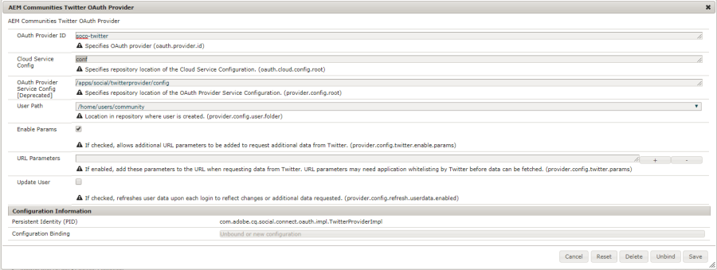
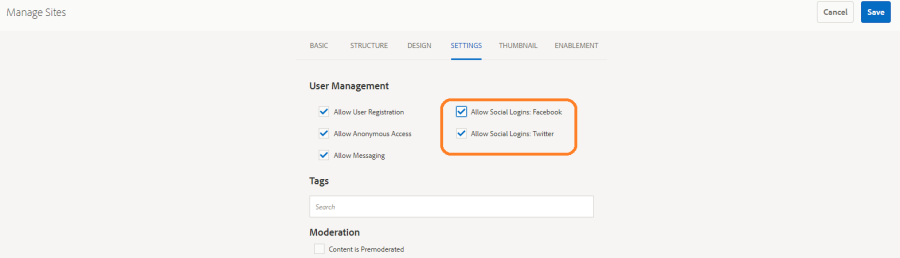

# Social inloggning med Facebook och Twitter {#social-login-with-facebook-and-twitter}

Social inloggning är en funktion för att visa en besökare på webbplatsen möjligheten att logga in med sitt Facebook- eller Twitter-konto. Det innebär att även tillåtna Facebook- eller Twitter-data inkluderas i deras AEM-medlemsprofil.

## Översikt över social inloggning {#social-login-overview}

För att inkludera social inloggning krävs *för att skapa anpassade Facebook- och Twitter-program.

Exemplet med webbförsäljning innehåller exempel på Facebook- och Twitter-appar samt molntjänster, men de är inte tillgängliga på en [produktionswebbplats](../../help/sites-administering/production-ready.md).

De steg som krävs är:

1. [Aktivera OAuth-autentisering](#adobe-granite-oauth-authentication-handler) för alla AEM-publiceringsinstanser.

   Om OAuth inte är aktiverat misslyckas inloggningsförsöken.

1. **Skapa** en social app och molntjänst.

   * Så här stöder du inloggning med Facebook:

      * Skapa en [Facebook-app](#create-a-facebook-app).
      * Skapa och publicera en [Facebook Connect-molntjänst](#create-a-facebook-connect-cloud-service).
   * Så här hanterar du inloggning med Twitter:

      * Skapa en [Twitter-app](#create-a-twitter-app).
      * Skapa och publicera en [Twitter Connect-molntjänst](#create-a-twitter-connect-cloud-service).

1. [**Aktivera **social inloggning](#enable-social-login)för en communitywebbplats.

Det finns två grundläggande begrepp:

1. **Scope** (permissions) anger vilka data programmet får begära.

   * Facebook- och Twitter- [Adobe Granite OAuth-program och -providerinstanser](#adobe-granite-oauth-application-and-provider) har som standard grundläggande programbehörigheter inom sitt omfång.

1. **Fält** (parametrar) anger de faktiska data som begärts med URL-parametrar.

   * Dessa fält anges i [AEM Communities Facebook OAuth Provider](#aem-communities-facebook-oauth-provider) och [AEM Communities Twitter OAuth Provider](#aem-communities-twitter-oauth-provider).
   * Standardfälten räcker för de flesta fall, men kan ändras.

## Facebook-inloggning {#facebook-login}

### API-version för Facebook {#facebook-api-version}

Social inloggning och Facebook-exemplet som vi detaljhandeln använder utvecklades när Facebook Graph API var version 1.0.
Från och med AEM 6.4 GA och AEM 6.3 SP1 uppdaterades social inloggning för att fungera med den nyare versionen av Facebook Graph API 2.5.

>[!NOTE]
>
>För äldre AEM-versioner, om du råkar ut för ett undantag i loggar **Kan inte extrahera en token från detta, **uppgradera till senaste CFP för den AEM-versionen.

Versionsinformation om Facebook Graph API finns i [Facebooks API-ändringslogg](https://developers.facebook.com/docs/apps/changelog).

### Skapa en Facebook-app {#create-a-facebook-app}

Ett korrekt konfigurerat Facebook-program krävs för att aktivera sociala inloggningar på Facebook.

Om du vill skapa Facebook-program följer du Facebooks instruktioner på [https://developers.facebook.com/apps/](https://developers.facebook.com/apps/). Ändringar av instruktionerna återspeglas inte i följande information.

Från och med Facebook API v2.7:

* *Lägg till en ny Facebook-app:*
   * För *Plattform* väljer du Webbplats
      * Ange *webbplatsens URL*`  https://<server>:<port>.`
   * I *Visningsnamn* anger du en titel som ska användas som titel för Facebook-anslutningstjänsten.
   * För *kategorin* rekommenderar vi att du väljer *Appar för sidor,* men det kan vara vad som helst.
   * *Lägg till produkt:  Facebook-inloggning*
      * Ange *giltiga omdirigerings-URI:er* för OAuth `  https://<server>:<port>.`

>[!NOTE]
>
>http://localhost:4503 fungerar för utveckling.

När programmet har skapats letar du reda på inställningarna för **[!UICONTROL program-ID]** och **[!UICONTROL apphemlighet]** . Den här informationen krävs för att konfigurera molntjänsten [för](#createafacebookcloudservice)Facebook.

### Skapa en Facebook Connect Cloud-tjänst {#create-a-facebook-connect-cloud-service}

Instansen [Adobe Granite OAuth Application and Provider](https://chl-author.corp.adobe.com/content/help/en/experience-manager/6-4/communities/using/social-login.html#AdobeGraniteOAuthApplicationandProvider) , som initieras genom att en molntjänstkonfiguration skapas, identifierar Facebook-programmet och medlemsgrupperna som de nya användarna läggs till i.

1. Logga in med administratörsbehörighet på AEM-författarinstansen.
1. Från global navigering väljer du **[!UICONTROL Verktyg > Cloud-tjänster > konfiguration]** av social inloggning på Facebook.
1. Välj **[!UICONTROL kontextsökvägen]** för konfigurationen.

   **[!UICONTROL Kontextsökvägen]** ska vara samma som den molnkonfigurationssökväg som du valde när du skapade/redigerade en community-plats.

1. Kontrollera om din kontextsökväg är aktiverad för att skapa molntjänster under den.
1. Gå till **[!UICONTROL Verktyg > Allmänt > Konfigurationsläsaren]**. Välj kontext och redigera egenskaper. Aktivera molnkonfigurationer om de inte har aktiverats ännu.

   

1. Skapa/redigera konfigurationen av molntjänsten för Facebook.

   

   * **[!UICONTROL Titel]** (*obligatoriskt*) Ange en visningsrubrik som identifierar Facebook-appen. Du bör använda samma namn som anges som *visningsnamn* för Facebook-appen.
   * **[!UICONTROL Program-ID/API-nyckel]** (*obligatoriskt*) Ange ***app-ID*** för Facebook-appen. Detta identifierar den [Adobe Granite OAuth-applikation och Provider](https://helpx.adobe.com/experience-manager/6-3/communities/using/social-login.html#AdobeGraniteOAuthApplicationandProvider) -instans som skapas från dialogrutan.
   * **[!UICONTROL Apphemlighet]** (*obligatoriskt*) Ange ***apphemlighet*** för Facebook-appen.
   * **[!UICONTROL Skapa användare]** Om det här alternativet är markerat skapas en AEM-användarpost och läggs till som medlem i de valda användargrupperna när du loggar in med ett Facebook-konto.  Standard är markerat (rekommenderas).
   * **[!UICONTROL Maskera användar-ID]**: Låt vara avmarkerat.
   * **[!UICONTROL E-postadress]**: användarens e-post-ID ska hämtas från Facebook.
   * **[!UICONTROL Lägg till i användargrupper]** Välj Lägg till användargrupp om du vill välja en eller flera [medlemsgrupper](https://helpx.adobe.com/experience-manager/6-3/communities/using/users.html) för den community som användarna ska läggas till i.
   >[!NOTE]
   >
   >Grupper kan läggas till eller tas bort när som helst. Men befintliga användares medlemskap påverkas inte. Automatiskt medlemskap gäller endast för nya användare som skapas efter den här fältuppdateringen. För webbplatser där anonyma användare är inaktiverade väljer du att lägga till användare i motsvarande community-medlemsgrupp som är avsedd för den stängda communitywebbplatsen.

   * Välj **[!UICONTROL SPARA]**.
   * **[!UICONTROL Publicera]**.

Resultatet är en [Adobe Granite OAuth Application- och Provider](https://helpx.adobe.com/experience-manager/6-3/communities/using/social-login.html#adobe-granite-oauth-application-and-provider) -instans som inte behöver ändras ytterligare om inte ytterligare omfång (behörigheter) läggs till. Standardomfånget är standardbehörigheter för Facebook-inloggning. Om ytterligare omfattning önskas måste OSGI-konfigurationen redigeras direkt. Om ändringar görs direkt via system/konsol ska du undvika att redigera molntjänstkonfigurationerna från pekgränssnittet för att undvika att skriva över dem.

### AEM Communities Facebook OAuth Provider {#aem-communities-facebook-oauth-provider}

AEM Communities-leverantören utökar [Adobe Granite OAuth-programinstansen och providerinstansen](#adobe-granite-oauth-application-and-provider) .

Den här providern behöver redigeras för att:

* Tillåt användaruppdateringar
* Lägg till ytterligare fält [inom omfånget](#adobe-granite-oauth-application-and-provider)

   * Alla fält som tillåts som standard inkluderas inte som standard.

Om redigering behövs kan du göra följande för varje AEM-publiceringsinstans:

1. Logga in med administratörsbehörighet.
1. Navigera till [webbkonsolen](../../help/sites-deploying/configuring-osgi.md). Exempel: http://localhost:4503/system/console/configMgr.
1. Hitta AEM Communities Facebook OAuth Provider.
1. Markera pennikonen som du vill öppna för redigering.

   

   * **[!UICONTROL OAuth Provider-ID]**

      (*Obligatoriskt*) Standardvärdet är *soco-facebook*. Redigera inte.

   * **[!UICONTROL Konfiguration av molntjänst]**

      Standardvärdet är */etc/molntjänster/facebookconnect*. Redigera inte.

   * **[!UICONTROL Tjänstkonfiguration för OAuth-provider]**

      Standardvärdet är */apps/social/facebookprovider/config/*. Redigera inte.

   * **[!UICONTROL Aktivera taggar]**

      Redigera inte.

   * **[!UICONTROL Användarsökväg]**

      Plats i databasen där användardata lagras. För en community-webbplats måste sökvägen vara standard */home/users/community* för att medlemmarna ska kunna se varandras profiler.

   * **[!UICONTROL Aktivera fält]**

      Om det här alternativet är markerat anges de fält som visas på begäran till Facebook för användarautentisering och användarinformation. Standardvärdet är avmarkerat.

   * **[!UICONTROL fält]**

      När fält är aktiverade inkluderas följande fält när Facebook Graph API anropas. Fälten måste vara tillåtna inom det omfång som definieras i molntjänstkonfigurationen. Ytterligare fält kan kräva godkännande från Facebook. Se avsnittet Facebooks inloggningsbehörigheter i dokumentationen för Facebook. Standardfälten som läggs till som parametrar är:

      * id
      * name
      * first_name
      * last_name
      * länk
      * locale
      * picture
      * tidszon
      * uppdaterad_tid
      * verifierad
      * e-post
   Om något fält läggs till eller ändras, uppdaterar du motsvarande standardkonfiguration för synkroniseringshanteraren för att korrigera mappningen.

   * **[!UICONTROL Uppdatera användare]** Om det här alternativet är markerat uppdateras användardata i databasen vid varje inloggning så att profiländringar eller ytterligare data som efterfrågas återspeglas. Standard är avmarkerat.

#### Nästa steg {#next-steps}

Nästa steg är samma för både Facebook och Twitter:

* [Publicera molntjänstkonfigurationer](#publishcloudservices)
* [Aktivera för en community-webbplats](#enable-social-login)

## Twitter-inloggning {#twitter-login}

### Skapa en Twitter-app {#create-a-twitter-app}

Det krävs ett konfigurerat Twitter-program för att aktivera social inloggning på Twitter.

Följ de senaste instruktionerna för att skapa ett nytt Twitter-program på [https://apps.twitter.com](https://apps.twitter.com/).

I allmänhet:

1. Ange ett *namn* som identifierar ditt Twitter-program för webbplatsens användare.
1. Ange en *beskrivning.*
1. För *webbplats* - ange https://&lt;server>/.
1. For *Callback URL* - enter https://&lt;server>/.

   >[!NOTE]
   >
   >Porten behöver inte anges.
   >
   >https://127.0.0.1/ fungerar för utveckling.

1. När programmet har skapats letar du reda på API-hemligheten ( **[!UICONTROL Consumer Key]** and **[!UICONTROL Consumer) (API)]**. Den här informationen behövs för att konfigurera [Twitters molntjänst](#createatwittercloudservice).

#### Permissions {#permissions}

I Twitter-programhanteringens behörighetsavsnittet:

* **[!UICONTROL Åtkomst]**:Välj `Read only`.

   * Andra alternativ stöds inte

* **[!UICONTROL Ytterligare behörigheter]**: Välj `Request email addresses from users`.

   * Om du inte väljer det här alternativet kommer inte användarprofilen i AEM att inkludera sin e-postadress.
   * Twitters instruktioner innehåller information om ytterligare steg att utföra.

Den enda REST-begäran som har gjorts för social inloggning är att *[GET-konto/verifiera inloggningsuppgifter](https://dev.twitter.com/rest/reference/get/account/verify_credentials)*.

### Skapa en Twitter Connect Cloud-tjänst {#create-a-twitter-connect-cloud-service}

Instansen [Adobe Granite OAuth Application och Provider](#adobe-granite-oauth-application-and-provider) , som initieras genom att en molntjänstkonfiguration skapas, identifierar Twitter-programmet och den eller de medlemsgrupper som de nya användarna läggs till i.

1. Logga in med administratörsbehörighet på författarinstansen.
1. Från global navigering väljer du **[!UICONTROL Verktyg > Cloud-tjänster > Konfiguration]** av Twitter-social inloggning.
1. Välj **[!UICONTROL kontextsökvägskonfiguration]** .

   Kontextsökvägen ska vara samma som den molnkonfigurationssökväg som du valde när du skapade/redigerade en community-plats.

1. Kontrollera om din kontextsökväg är aktiverad för att skapa molntjänster under den.
1. Gå till **[!UICONTROL Verktyg > Allmänt > Konfigurationsläsaren]**. Välj kontext och redigera egenskaper. Aktivera molnkonfigurationer om de inte har aktiverats ännu.

   

1. Skapa/redigera konfiguration av Twitter-molntjänster.

   

   * **[!UICONTROL Titel]** (*obligatoriskt*) Ange en visningsrubrik som identifierar Twitter-appen. Vi rekommenderar att du använder samma namn som anges som *visningsnamn* för Twitter-appen.

   * **[!UICONTROL Konsumentnyckel]** (*obligatoriskt*) Ange API-nyckeln **för** konsumenten för Twitter-appen. Detta identifierar den [Adobe Granite OAuth-applikation och Provider](https://helpx.adobe.com/experience-manager/6-3/communities/using/social-login.html#AdobeGraniteOAuthApplicationandProvider) -instans som skapas från dialogrutan.

   * **[!UICONTROL Consumer Secret]** (*Required*) Ange hemlighet ***för*** Consumer(API) för Twitter-appen.

   * **[!UICONTROL Skapa användare]** Om du markerar det här alternativet skapas en AEM-användarpost och läggs till som medlem i de valda användargrupperna när du loggar in med ett Twitter-konto. Standard är markerat (rekommenderas starkt).

   * **[!UICONTROL Låt användar-ID:n]** för mask vara avmarkerade.

   * **[!UICONTROL Lägg till i användargrupper]** Välj Lägg till användargrupp om du vill välja en eller flera [medlemsgrupper](https://helpx.adobe.com/experience-manager/6-3/communities/using/users.html) för den community som användarna ska läggas till i.
   >[!NOTE]
   >
   >Grupper kan läggas till eller tas bort när som helst. Men befintliga användarmedlemskap påverkas inte. Automatiskt medlemskap gäller endast för nya användare som skapas efter den här fältuppdateringen. För webbplatser där anonyma användare är inaktiverade lägger du till användare i motsvarande community-medlemsgrupp som är avsedd för den stängda communitywebbplatsen.

1. Välj **[!UICONTROL SPARA]** och **[!UICONTROL Publicera]**.

Resultatet är en [Adobe Granite OAuth Application- och Provider](https://helpx.adobe.com/experience-manager/6-3/communities/using/social-login.html#adobe-granite-oauth-application-and-provider) -instans som inte behöver ändras ytterligare. Standardomfånget är standardbehörigheten för Twitter-inloggning.

### AEM Communities Twitter OAuth Provider {#aem-communities-twitter-oauth-provider}

AEM Communities-konfigurationen utökar [Adobe Granite OAuth-programinstansen och providerinstansen](#adobe-granite-oauth-application-and-provider) . Leverantören måste redigeras för att tillåta användaruppdateringar.

Om redigering behövs kan du göra följande för varje AEM-publiceringsinstans:

1. Logga in med administratörsbehörighet.
1. Navigera till [webbkonsolen](../../help/sites-deploying/configuring-osgi.md).

   Exempel: http://localhost:4503/system/console/configMgr.

1. Hitta AEM Communities Twitter OAuth Provider.
1. Markera pennikonen som du vill öppna för redigering.

   

   * **[!UICONTROL OAuth Provider-ID]** (*obligatoriskt*)

      Standardvärdet är *soco-twitter*. Redigera inte.

   * **[!UICONTROL Konfiguration av molntjänst]**

      The default value is *conf.* Redigera inte.

   * **[!UICONTROL Tjänstkonfiguration för OAuth-provider]**

      Standardvärdet är */apps/social/twitterprovider/config/*. Redigera inte.

   * **[!UICONTROL Användarsökväg]**

      Plats i databasen där användardata lagras. För en community-webbplats måste sökvägen vara standard */home/users/community* för att medlemmarna ska kunna se varandras profiler.

   * **[!UICONTROL Aktivera parametrar]** redigeras inte
   * **[!UICONTROL URL-parametrar]** redigeras inte
   * **[!UICONTROL Uppdatera användare]**

      Om du markerar det här alternativet uppdateras användardata i databasen vid varje inloggning så att profiländringar eller ytterligare data som efterfrågas återspeglas. Standardvärdet är avmarkerat.

#### Nästa steg {#next-steps-1}

Nästa steg är samma för både Facebook och Twitter:

* [Publicera molntjänstkonfigurationer](#publishcloudservices)
* [Aktivera för en community-webbplats](#enable-social-login)

## Aktivera social inloggning {#enable-social-login}

### AEM Communities Sites Console {#aem-communities-sites-console}

När en molntjänst har konfigurerats kan den aktiveras för den relevanta inställningen för social inloggning för en community-webbplats med underpanelen Inställningar för [användarhantering](https://helpx.adobe.com/experience-manager/6-3/communities/using/sites-console.html#USERMANAGEMENT) när en community-webbplats [skapas](https://helpx.adobe.com/experience-manager/6-3/communities/using/sites-console.html#SiteCreation) eller [hanteras](https://helpx.adobe.com/experience-manager/6-3/communities/using/sites-console.html#ModifyingSiteProperties).

1. Välj den platskonfiguration där du sparade dina konfigurationer för social inloggning.

1. Ange molnkonfigurationer på fliken Allmänt.

   

1. På fliken Inställningar aktiverar du **[!UICONTROL Sociala inloggningar]** och Spara.

   

## Testa social inloggning {#test-social-login}

* Kontrollera att [autentiseringshanteraren](#adobe-granite-oauth-authentication-handler) för Adobe Granite OAuth har aktiverats för alla publiceringsinstanser
* Kontrollera att molntjänsterna har publicerats
* Kontrollera att communitywebbplatsen har publicerats
* Starta den publicerade webbplatsen i en webbläsareTill exempel http://localhost:4503/content/sites/engage/en.html
* Välj **[!UICONTROL inloggning]**
* Välj antingen **[!UICONTROL Logga in med Facebook]** eller **[!UICONTROL Logga in med Twitter]**
* Om du inte redan är inloggad på Facebook eller Twitter loggar du in med rätt autentiseringsuppgifter
* Du kan behöva bevilja behörighet beroende på vilken dialogruta som visas i Facebook- eller Twitter-appen
* Observera att verktygsfältet högst upp på sidan uppdateras för att återspegla den lyckade inloggningen
* Välj **[!UICONTROL profil]**: På profilsidan visas användarens avatarbild, förnamn och efternamn. Den visar även information från Facebook- eller Twitter-profilen enligt tillåtna fält/parametrar.

## OAuth-konfigurationer för AEM-plattform {#aem-platform-oauth-configurations}

### Adobe Granite OAuth-autentiseringshanterare {#adobe-granite-oauth-authentication-handler}

Den `Adobe Granite OAuth Authentication Handler` är inte aktiverad som standard och ***måste aktiveras för alla AEM-publiceringsinstanser.***

Aktivera autentiseringshanteraren vid publicering genom att öppna OSGi-konfigurationen och spara den:

* Logga in med administratörsbehörighet
* Navigera till [webbkonsolen](../../help/sites-deploying/configuring-osgi.md), t.ex. http://localhost:4503/system/console/configMgr
* Sök `Adobe Granite OAuth Authentication Handler`
* Markera för att öppna konfigurationen för redigering
* Välj **[!UICONTROL Spara]**

>[!CAUTION]
>
>Förväxla inte autentiseringshanteraren med en Facebook- eller Twitter-instans av *Adobe Granite OAuth-program och -provider*.

### Adobe Granite OAuth-program och -leverantör {#adobe-granite-oauth-application-and-provider}

När en molntjänst för Facebook eller Twitter skapas `Adobe Granite OAuth Authentication Handler` skapas en instans av .

Så här söker du efter den skapade instansen för en Facebook- eller Twitter-app:

1. Logga in med administratörsbehörighet.
1. Navigera till [webbkonsolen](../../help/sites-deploying/configuring-osgi.md).

   Exempel: http://localhost:4503/system/console/configMgr.

1. Hitta Adobe Granite OAuth-program och -leverantör.

   * Leta reda på instansen där **[!UICONTROL klient-ID]** matchar **[!UICONTROL program-ID:t]**
   

   Utom följande egenskaper lämnar du de andra egenskaperna i konfigurationen oförändrade:

   * **[!UICONTROL Konfig-ID]**

      (*Obligatoriskt*) Konfigurations-ID:n för OAuth måste vara unika. Autogenereras när molntjänsten skapas.

   * **[!UICONTROL Klient-ID]**

      (*Obligatoriskt*) Det program-ID som angavs när molntjänsten skapades.

   * **[!UICONTROL Klienthemlighet]**

      (*Obligatoriskt*) Programhemligheten som angavs när molntjänsten skapades.

   * **[!UICONTROL Omfång]**

      (*Valfritt*) Ytterligare omfång för vad som tillåts kan tillfrågas av leverantören. Standardomfånget omfattar de behörigheter som krävs för att tillhandahålla social autentisering och profildata.

   * **[!UICONTROL Leverantörs-ID]**

      (*Obligatoriskt*) Leverantörs-ID för AEM Communities anges när molntjänsten skapades. Redigera inte. För Facebook Connect är värdet *soco-facebook*. För Twitter Connect är värdet *soco-twitter*.

   * **[!UICONTROL Grupper]**

      (*Rekommenderas*) En eller flera medlemsgrupper som skapade användare läggs till i. För AEM Communities rekommenderar vi att du listar medlemsgruppen för communitywebbplatsen.

   * **[!UICONTROL Återanrops-URL]**

      (*Valfritt*) URL konfigurerad med OAuth-providers för att omdirigera klienten tillbaka. Använd en relativ URL för att använda värddatorn för den ursprungliga begäran. Lämna tomt om du vill använda den ursprungligen begärda URL:en i stället. Suffixet&quot;/callback/j_security_check&quot; läggs automatiskt till på den här URL:en.
   >[!NOTE]
   >
   >Domänen för återanropet måste vara registrerad hos providern (Facebook eller Twitter).

För varje konfiguration av OAuth-autentiseringshanterare skapas ytterligare två konfigurationer i instansen:

* Apache Jackrabbit Oak Default Sync Handler (org.apache.jackrabbit.oak.spi.security.authentication.external.impl.DefaultSyncHandler) - Inga redigeringar krävs, men du kan se hur Facebook-fält mappas till en CQ-användarprofilnod i användarfältet. Lägg även märke till att Sync Handler Name matchar Config Id för OAuth-providerkonfigurationen.
* Apache Jackrabbit Oak External Login Module (org.apache.jackrabbit.oak.spi.security.authentication.external.impl.ExternalLoginModuleFactory) - Inga redigeringar krävs där, men du kan lägga märke till att Identity Provider Name och Sync Handler Name är samma och pekar på motsvarande OAuth- respektive sync handler-konfigurationer.

Mer information finns i [Autentisering med den externa inloggningsmodulen](https://jackrabbit.apache.org/oak/docs/security/authentication/externalloginmodule.html)för Apache Oak.

## OAuth User Traversal Performance {#oauth-user-traversal-performance}

För communitysajter där hundratusentals användare registrerar sig med sina Facebook- eller Twitter-inloggningar kan genomgången av den fråga som utfördes när en besökare använder sin inloggning via sociala medier förbättras genom att följande Oak-index läggs till.

Om traversal-varningar visas i loggarna bör du lägga till det här indexet.

Inloggad med administratörsbehörighet för en författarinstans:

1. Från global navigering: välj **Verktyg,[CRX/DE Lite](../../help/sites-developing/developing-with-crxde-lite.md).**
1. Skapa ett index med namnet ntBaseLucene-oauth från en kopia av ntBaseLucene:

   * Under nod /oak:index
   * Markera noden ntBaseLucene
   * Markera **[!UICONTROL kopia]**
   * Välj `/oak:index`
   * Markera **[!UICONTROL Klistra in]**
   * Byt namn på kopian av ntBaseLucene till ntBaseLucene-oauth

1. Ändra egenskaperna för noden ntBaseLucene-oauth:

   * **[!UICONTROL indexPath]**: /oak:index/ntBaseLucene-oauth
   * **[!UICONTROL namn]**: oauthid-123***
   * **[!UICONTROL omindexera]**:true
   * **[!UICONTROL reindexCount]**: 1

1. Under noden /oak:index/ntBaseLucene-oauth/indexRules/nt:base/properties:

   * Ta bort alla underordnade noder, förutom cqTags.
   * Byt namn på cqTags till oauthid-123****
   * Ändra egenskaperna för noden oauthid-123****

      * **[!UICONTROL namn]**: oauthid-123***
   * Välj **[!UICONTROL Spara alla]**.

**** &amp;ast; Ersätt **123** med Facebook *App ID* eller Twitter *Consumer (API) Key* , som är värdet för ***¥Client ID i¥Adobe Granite OAuth-programmet och¥Providerconfiguration, som*** namnet ***oauthid-*** 123 **** .

Mer information och verktyg finns i [Oak Queries and Indexing](../../help/sites-deploying/queries-and-indexing.md).

## Dispatcher-konfiguration {#dispatcher-configuration}

Se [Konfigurera Dispatcher för Communities](dispatcher.md).
