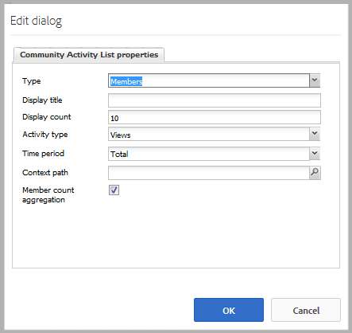

# Aktivitetstrender {#activity-trends}

## Introduktion {#introduction}

Komponenten `Community Activity List` gör det möjligt att lägga till trendinformation om inlägg och vyer från medlemmar samt inlägg och vyer av innehåll.

Dokumentet beskriver:

* Lägger till komponenten `Community Activity List` i en [community-webbplats](/help/communities/overview.md#community-sites).

* Konfigurationsinställningar för komponenten `Community Activity List`.

### Krav {#requirement}

Data för `Community Activity List` är bara tillgängliga när Adobe Analytics är licensierat och konfigurerat för communitywebbplatsen.

Se [Analyskonfiguration för communityfunktioner](/help/communities/analytics.md).

### Lägga till en lista med communityaktiviteter på en sida {#adding-a-community-activity-list-to-a-page}

Om du vill lägga till en `Community Activity List`-komponent på en sida i redigeringsläge letar du reda på komponenten

* `Communities / Community Activity List`

och dra den till rätt plats på en sida.

Mer information finns på [Grunderna för communitykomponenter](/help/communities/basics.md).

När komponenten placeras på en sida i en community-webbplats är det så här den visas:

### Konfigurerar community-aktivitetslista {#configuring-community-activity-list}

Markera den monterade `Community Activity List`-komponenten som ska öppnas och välj ikonen `Configure` som öppnar redigeringsdialogrutan.

Under fliken **Kommentarer** anger du om och hur kommentarer för överförda filer ska visas:

* **Typ**

   Ange om data ska visas för communitymedlemmar eller användargenererat innehåll (UGC).

   Välj  från:

   * `Members`
   * `Content`

   Standardvärdet är `Members`.

* **Visa titel**

   En beskrivande titel som ska visas ovanför data, till exempel `Trending Content`.
Standard är ingen titel.

* **Visa antal**

   Antalet objekt som ska listas.
Standardvärdet är 10.

* **Typ av aktivitet**

   Välj något av följande:

   * `Views`(sidbesök)
   * `Posts`(skapa UGC)
   * `Follows`
   * `Likes`

   Standardvärdet är Vyer.

* **Tidsperiod**

   Välj något av följande:

   * `Last 24 hours`
   * `Last 7 days`
   * `Last 30 days`
   * `Last 90 days`
   * `This year (since Jan 1st)`
   * `Total`

   Standardvärdet är `Total`.

* **Kontextbana**

   Gör det möjligt att omfång aktiviteten till en delmängd av platsen, t.ex. en viss blogg.
Standard är hela communitywebbplatsen.

* **Medlemsräkningsaggregering**

   När du avmarkerar det här alternativet (inaktiverat) räknas endast inlägg på den översta nivån. Om kontexten till exempel är rotsidan (standardvärdet) kommer en `Activity Type` av `Posts` aldrig att visa någon aktivitet eftersom det inte går att publicera innehåll på rotsidan. När du markerar det här alternativet inkluderas antalet på alla underordnade sidor.
Standard är markerat.

### Exempelsida med 4 komponenter {#example-page-with-components}

**Konfiguration** för de vanligaste besökarna: Typ = Medlemmar, aktivitetstyp = Vyer

**Top** Contributorsconfig: Typ = Medlemmar, aktivitetstyp = Bokföring

**Övre** innehållskonfiguration: Typ = Innehåll, aktivitetstyp = Vyer,

**Trending** Contentconfig: Typ = innehåll, aktivitetstyp = inlägg

