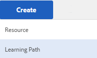

# Uppgradera till AEM 6.5 Communities{#upgrading-to-aem-communities}

Beroende på webbplatsens topologi och funktioner kan följande åtgärder vara nödvändiga vid uppgradering till AEM Communities 6.5 eller installation av den senaste funktionspaketet.

Detta avsnitt är specifikt för Communities och kompletterar informationen som ges i [Uppgradera till AEM 6.5](/help/sites-deploying/upgrade.md) (plattform).

## Uppgradera från AEM 6.1 eller senare {#upgrading-from-aem-or-later}

### Indexera om Solr {#reindex-solr}

När du installerar ett nytt funktionspaket för Communities på en distribution som konfigurerats med MSRP måste du

1. installera det [senaste funktionspaketet](/help/communities/deploy-communities.md#latestfeaturepack)
1. installera de [senaste Solr-konfigurationsfilerna](/help/communities/msrp.md#upgrading)
1. indexera om MSRPse avsnittet [MSRP Reindex Tool](/help/communities/msrp.md#msrp-reindex-tool)

### Aktivera 2.0 {#enablement}

Från och med AEM 6.3 lagras inte längre rapportinformation i MySQL i aktiveringsfunktionerna. MySQL-beroendet finns bara där för att spåra SCORM-innehåll.

Kontakta [kundtjänst](https://helpx.adobe.com/marketing-cloud/contact-support.html) om du behöver hjälp med att migrera innehåll från Enablement 1.0.

## Uppgradera från AEM 6.0 {#upgrading-from-aem}

Om befintlig UGC måste behållas beror det på om distributionen lagrades [lokalt](#on-premise-storage) eller i [Adobe-molnet](#adobe-cloud-storage).

### Adobe Cloud-lagring {#adobe-cloud-storage}

Om den uppgraderade webbplatsen har konfigurerats för att använda Adobes molnlagring kan den visas (felaktigt) som om all UGC har gått förlorad eftersom SRP-metoderna inte kan hitta den befintliga UGC:n på den gamla platsen.

Det finns alltså möjlighet att instruera ASRP att använda `AEM 6.0 compatability-mode` för att få tillgång till UGC.

För alla författare och publiceringsinstanser av AEM 6.3

* logga in med administratörsbehörighet
* konfigurera [ASRP](/help/communities/asrp.md)
* Följ de här stegen för att göra befintlig UGC synlig:

   * gå till webbkonsolen

      * till exempel [https://&lt;värd>:&lt;port>/system/console/configMgr](https://localhost:4502/system/console/configMgr)
   * leta upp **AEM Communities Utilities** configuration
   * välj för att expandera konfigurationspanelen

      * *uncheck ***`Cloud Storage`**

      * välj **Spara**

### Lokal lagring {#on-premise-storage}

Om den uppgraderade webbplatsen inte använde molnlagring måste eventuell befintlig UGC konverteras för att följa den nya struktur som introducerades i AEM 6.1 Communities som stöd för den gemensamma butiken.

Ett verktyg för migrering med öppen källkod finns för GitHub:
UGC-migreringsverktyg för[AEM Communities](https://github.com/Adobe-Marketing-Cloud/communities-ugc-migration)

### Java API:er {#java-apis}

När du uppgraderar från sociala communityn i AEM 6.0 till AEM 6.3 Communities bör du vara medveten om att många API:er har omorganiserats till olika paket. De flesta bör vara lätta att lösa när man använder en integrerad utvecklingsmiljö för anpassning av communityfunktioner.

Mer information om paketet SocialUtils finns på [SocialUtils Refactoring](/help/communities/socialutils.md).

Se även [Använda Maven for Communities](/help/communities/maven.md).

### Inga JSP-komponentmallar {#no-jsp-component-templates}

Det [sociala ramverket](/help/communities/scf.md) (SCF) använder mallspråket [HandlebarsJS](https://www.handlebarsjs.com/) (HBS) i stället för Java Server Pages (JSP) som användes före AEM 6.0.

I AEM 6.0 fanns JSP-komponenterna kvar tillsammans med de nya HBS-ramverkskomponenterna på samma plats, där HBS-komponenterna vanligtvis finns i undermappar med namnet&quot;hbs&quot;.

Från och med AEM 6.1 togs JSP-komponenterna bort helt. För Communities rekommenderas att all användning av JSP-komponenter ersätts med SCF-komponenter.

## AEM Communities UGC Migration Tool {#aem-communities-ugc-migration-tool}

UGC-migreringsverktyget [för](https://github.com/Adobe-Marketing-Cloud/communities-ugc-migration) AEM Communities är ett verktyg för migrering med öppen källkod, som finns på GitHub, som kan anpassas för att exportera UGC från tidigare versioner av AEM-sociala communities och importera till AEM Communities 6.1 eller senare.

Förutom att flytta UGC från tidigare versioner går det också att använda verktyget för att flytta UGC från en [SRP](/help/communities/working-with-srp.md) till en annan, till exempel från MSRP till DSRP.

## Uppgradera från AEM 5.6.1 eller tidigare {#upgrading-from-aem-or-earlier}

Det finns tre generationer av communitykomponenter:

**Gen 1** : CQ 5.4 till och med AEM 5.6.0 - det här är **kollab** -komponenter som lagrar UGC i den lokala databasen med replikering som ett sätt att synkronisera UGC mellan plattformar. Andra skillnader är implementeringen med Java Server Pages (JSP) och bloggfunktionen som bara består av redigering i författarmiljön.

**Gen 2** : från AEM 5.6.1 till AEM 6.1 - det här är en blandning av **collab** och **sociala** komponenter. AEM 6.0 introducerade det nya ramverket [för](/help/communities/scf.md) sociala komponenter (SCF) och AEM 6.2 införde en [gemensam UGC-butik](/help/communities/working-with-srp.md) där UGC används av en [lagringsresursleverantör](/help/communities/srp.md) (SRP).

**Gen 3** : från och med AEM 6.2 finns det bara **sociala** komponenter, som implementeras i SCF som HBS-komponenter (Handlebars) som kräver val av SRP för UGC.
