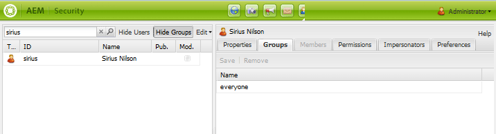

# Hantera användare och användargrupper {#managing-users-and-user-groups}

## Översikt {#overview}

I AEM Communities, i publiceringsmiljön, kan användarna själva registrera sig och redigera sina profiler. Med rätt tillstånd kan de också

* Skapa undergrupper på communitywebbplatsen (se [communitygrupper](creating-groups.md))
* [Modernt](moderation.md) användargenererat innehåll (UGC)
* Var [aktiveringsresurskontakter](resources.md)
* Var [privilegierad](#privileged-members-group) att skapa inlägg för bloggar, kalendrar, QnA och forum

Användare som är registrerade i publiceringsmiljön kallas vanligtvis *communitymedlemmar (medlemmar)* för att skilja dem från *användare *i författarmiljön.

Behörigheter ges genom att medlemmar tilldelas en av [medlemsgrupperna](#publish-group-roles) (användaren) som skapas dynamiskt när communitywebbplatsen [skapas](sites-console.md) eller [ändras](sites-console.md#modifying-site-properties) från författarmiljön. När du arbetar från författarmiljön visas medlemmar från publiceringsmiljön via [tunneltjänsten](#tunnel-service).

Medlemmar och medlemsgrupper som skapats i publiceringsmiljön bör inte visas i författarmiljön. Användare och användargrupper som skapats i författarmiljön är avsedda att finnas kvar i författarmiljön.

När användare som är författare och medlemmar vid publicering kommer från samma lista med användare, t.ex. synkroniserade från samma LDAP-katalog, betraktas de inte som samma användare med samma behörigheter och gruppmedlemskap i både författar- och publiceringsmiljöer. Medlemmars och användares roll(er) måste fastställas separat vid publicering och författare, beroende på vad som är lämpligt.

För en [publiceringsgrupp](topologies.md)måste registrering och ändringar som görs i en publiceringsinstans synkroniseras med andra publiceringsinstanser för att de ska ha tillgång till samma användardata. [Mer information finns i ](sync.md)Användarsynkronisering[, som innehåller ett avsnitt som beskriver ](sync.md#what-happens-when)vad som händer när... .

### Bidragsgränser {#contribution-limits}

För att skydda mot skräppost är det möjligt att begränsa medlemmarnas frekvens för publicering av innehåll. Dessutom är det möjligt att automatiskt begränsa bidragen från nyregistrerade medlemmar.

Mer information finns i Gränser för [medlemsbidrag](limits.md).

### Dynamiskt skapade användargrupper {#dynamically-created-user-groups}

När en ny communitywebbplats skapas nya användargrupper dynamiskt med unika id:n (uid) och behörigheter som är lämpliga för olika administrativa funktioner som krävs för att hantera communitywebbplatsen i författarmiljön (se [Författargruppsroller](#author-group-roles)) eller publiceringsmiljön (se [Publicera grupproller](#publish-group-roles)).

Namnen på grupperna genereras från det namn som angavs för webbplatsen när [communitywebbplatsen skapades](sites-console.md#step13asitetemplate). Med de unika ID:na undviker du namnkonflikter för communitywebbplatser med liknande namn och communitygrupper på samma server.

Om platsnamnet till exempel var &quot;*engage*&quot; för en webbplats med namnet &quot;We.Retail Engage&quot;, skulle en av de användargrupper som skapades vara:

* Community *Engage* -medlemmar

## Författarmiljö {#author-environment}

### Tunneltjänst {#tunnel-service}

När du använder författarmiljön för att [skapa webbplatser](sites-console.md), [ändra webbplatsegenskaper](sites-console.md#modifying-site-properties) och [hantera communitymedlemmar och medlemsgrupper](members.md), måste du ha tillgång till användare och användargrupper som är registrerade i publiceringsmiljön.

Tunneltjänsten ger denna åtkomst med replikeringsagenten på författaren.

* Mer information finns i [konfigurationsinstruktionerna](deploy-communities.md#tunnel-service-on-author) på distributionssidan

Konsolerna [](members.md) Communities-medlemmar och -grupper är avsedda endast för hantering av användare (medlemmar) och användargrupper (medlemsgrupper) som är registrerade i publiceringsmiljön.

Om du vill hantera användare och användargrupper som är registrerade i författarmiljön använder du [säkerhetskonsolen](../../help/sites-administering/security.md)

### Författargruppsroller {#author-group-roles}

| Om gruppmedlem... | Primär roll |
|---|---|
| administratörer | Administratörsgruppen består av systemadministratörer som har alla funktioner som en community-administratör har samt möjlighet att hantera gruppen Community Administrators. |
| Community-administratörer | Gruppen Community Administrators blir automatiskt medlem i alla communitysajter och i alla communitygrupper som skapas på webbplatsen. En inledande medlem i gruppen Community Administrators är gruppen Administratörer. I redigeringsmiljön kan communityadministratörer skapa communitysajter, hantera webbplatser, hantera medlemmar (de kan förbjuda medlemmar från communityn) och moderera innehåll. |
| Webbplatskontakthanteraren för &lt;*platsnamn*> | Content Manager för communitysajt kan utföra traditionell AEM-redigering, skapa innehåll och ändra sidor för en community-sajt. |
| Community Enablement Managers | Gruppen Hanterare för communityaktivering består av användare som är tillgängliga för tilldelning för att hantera en communitywebbplats grupp för aktiveringshanterare. |
| Community &lt;*site name* > SiteEnablementManagers | Gruppen Hanterare för aktivering av communitywebbplats består av användare som har tilldelats behörigheten att hantera en communitys [aktiveringsresurser](resources.md). |
| Inget | En anonym besökare får inte åtkomst till författarmiljön. |

### Systemadministratörer {#system-administrators}

Medlemmar i administratörsgruppen är systemadministratörer som kan utföra den första konfigurationen av en AEM-installation för både författarmiljön och publiceringsmiljön.

I demonstrations- och utvecklingssyfte har administratörsgruppen en medlem vars användar-ID är *admin* och lösenord är *admin*.

I produktionsmiljöer bör standardadministratörsgruppen ändras.

Var noga med att följa [checklistan](../../help/sites-administering/security-checklist.md).

## Publiceringsmiljö {#publish-environment}

### Bli medlem {#becoming-a-member}

I publiceringsmiljön kan en besökare bli en community-medlem beroende på [inställningarna](sites-console.md#user-management) för communitywebbplatsen

* När communitywebbplatsen är privat (stängd):
   * Efter inbjudan
   * Av en administratör

* När communitywebbplatsen är offentlig (öppen):
   * Efter självregistrering
   * Efter social inloggning med Facebook och Twitter

>[!NOTE]
>
>Om en besökare registrerar sig som medlem av en öppen community-webbplats blir han/hon automatiskt medlem av andra öppna communitysajter i samma publiceringsmiljö.

### Publicera grupproller {#publish-group-roles}

| Om gruppmedlem... | Primär roll |
|---|---|
| Community &lt;*site name*>-medlemmar | En community-medlem är en registrerad användare. De kan logga in, ändra sin profil, gå med i en öppen community-grupp, publicera innehåll i communityn, skicka meddelanden till andra medlemmar och följa webbplatsaktiviteter. |
| Moderatorer för communityn &lt;*platsnamn*> | En moderator för communitywebbplatser är en betrodd community-medlem som kan moderera UGC-innehåll antingen i grupp med modereringskonsolen eller i sitt sammanhang på den sida där innehållet publiceras. |
| Community &lt;*site name*> &lt;*group name*>-medlemmar | En community-gruppmedlem är en community-medlem som antingen har gått med i en öppen community-grupp eller har bjudits in till en stängd community-grupp. De har funktionerna som en medlem i den communitygruppen på webbplatsen. |
| Gruppadministratörer för &lt;*platsnamn*> | En administratör för en community-webbplatsgrupp är en betrodd community-medlem som har tilldelats behörigheten att skapa och hantera undergrupper (grupper) på en community-webbplats. Möjligheten att moderera i sitt sammanhang ingår. |
| *Säkerhetsgrupp för behöriga medlemmar* | En användargrupp som skapats och underhålls manuellt för att begränsa möjligheten att skapa innehåll. Se [Grupp](#privileged-members-group)med behöriga medlemmar. |
| Inget | En anonym besökare som upptäcker webbplatsen kan visa och söka på communitysajter som tillåter anonym åtkomst. För att kunna delta och publicera innehåll måste användaren själv registrera sig (om det är tillåtet) och bli medlem i communityn. |

### Tilldela medlemmar till publiceringsgruppsroller {#assigning-members-to-publish-group-roles}

När du [skapar en community-plats](sites-console.md) i författarmiljön eller när du [ändrar platsegenskaper,](sites-console.md#modifying-site-properties) kan medlemmar tilldelas olika roller som utförs i publiceringsmiljön, till exempel moderatorer, gruppadministratörer, resurskontakter eller behöriga medlemmar.

[Om du aktiverar tunneltjänsten](sync.md#accessingpublishusersfromauthor) visas tilldelningsalternativ från medlemmar vid publicering i stället för användare vid författare.

De valda medlemmarna tilldelas automatiskt till [rätt grupp](#publish-group-roles) och deras medlemskap inkluderas när communitywebbplatsen publiceras (på nytt).

### Grupp med behöriga medlemmar {#privileged-members-group}

Syftet med en säkerhetsgrupp för behöriga medlemmar är att begränsa skapandet av innehåll för vissa communityfunktioner till en privilegierad delmängd av medlemmarna på en community-webbplats.

Gruppen med behöriga medlemmar är en medlemsgrupp som skapas och hanteras med konsolen [](members.md)Communities-grupper.

När en privilegierad medlemsgrupp har skapats, och [tunneltjänsten är aktiverad](sync.md#accessingpublishusersfromauthor), kan en befintlig community-platsens struktur [ändras](sites-console.md#modify-structure) för att redigera konfigurationen av dess communityfunktioner till Tillåt privilegierade medlemmar och lägga till den skapade gruppen.

De communityfunktioner som tillåter specificering av en eller flera privilegierade medlemsgrupper är:

* [Bloggfunktion](functions.md#blog-function) - för att begränsa antalet nya artiklar
* [Kalenderfunktion](functions.md#calendar-function) - för att begränsa antalet nya händelser
* [Forum-funktion](functions.md#forum-function) - för att begränsa möjligheten att skapa nya ämnen
* [QnA-funktion](functions.md#qna-function) - för att begränsa antalet nya frågor

När en communityfunktion inte är skyddad (ingen privilegierad medlemsgrupp har tilldelats), tillåts alla community-webbplatsmedlemmar att skapa funktionsinnehåll (artiklar, händelser, ämnen, frågor).

>[!NOTE]
>
>Om du lägger till en användare i en privilegierad medlemsgrupp för en communitywebbplats får användaren endast behörighet om han eller hon också är medlem på samma communitywebbplats.

## Skapa communitymedlemmar {#creating-community-members}

### Lagringsplats {#repository-location}

För att vissa funktioner ska fungera på rätt sätt måste du skapa användare och användargrupper med lämplig behörighet.

När medlemmar skapas i `/home/users/community`ärver de rätt åtkomstkontrollistor som ger läsbehörighet till medlemmarnas profiler.

På samma sätt bör anpassade användargrupper (som behöriga medlemsgrupper) skapas i `/home/groups/community`.

Med konsolerna [Communities Members and Groups (](members.md) Communities-medlemmar och grupper) kan du skapa användare och grupper på de här sökvägarna.

Om du vill ange en anpassad sökväg måste du använda det klassiska säkerhetsgränssnittet, som finns på [https://&lt;server>:&lt;port>/useradmin](http://localhost:4503/useradmin).

Om du vill ge läsbehörighet för anpassade medlemssökvägar anger du åtkomstkontrollistor för alla publiceringsinstanser som liknar `/home/users/community`:

```xml
<allow
  jcr:primaryType="rep:GrantACE"
  rep:principalName="everyone"
  rep:privileges="{Name}[jcr:read]" >
  <rep:restrictions
    jcr:primaryType="rep:Restrictions"
    rep:glob="*/profile*" />
</allow>
```

Om du vill ge rätt behörighet för anpassade medlemsgruppsökvägar, till exempel /home/groups/mycompany, anger du åtkomstkontrollistor som liknar `/home/groups/community`:

```xml
<allow
  jcr:primaryType="rep:GrantACE"
  rep:principalName="community-administrators"
  rep:privileges="{Name}[jcr:read]"  />
```

### Konsoler {#consoles}

Det finns fyra separata konsoler som endast är tillgängliga i författarmiljön:

| konsol | Verktyg, Säkerhet, Användare | Verktyg, Säkerhet, Grupper | Communities, Members | Communities, Groups |
|----------|-----------------------|------------------------|------------------------------------------------------------|------------------------------------------------------------|
| hanterar | användare i författare | användargrupper för författare | medlemmar vid publicering | medlemsgrupper vid publicering |
| kräver | administratörsbehörighet | administratörsbehörighet | administratörsbehörighet, tunneltjänst, användarsynkronisering för publiceringsgrupp | administratörsbehörighet, tunneltjänst, användarsynkronisering för publiceringsgrupp |

### Roll för Community Enablement Manager {#community-enablement-manager-role}

Möjligheten för en besökare att registrera sig själv är vanligtvis inte tillåten för en [aktiveringscommunity](overview.md#enablement-community) eftersom det finns kostnader som är kopplade till varje medlem. Aktiveringsdeltagare och -resurser hanteras av en användare som tilldelats [rollen](#author-group-roles) för `enablement manager` när webbplatsen skapas [på författaren (läggs till som medlem i gruppen](sites-console.md#enablement) `Community <site-name> Siteenablementmanagers`). Det `enablement manager` är även ansvarig för [att tilldela utbildningsresurser](resources.md) till communitymedlemmar om författare.

Endast användare som är medlemmar i den globala `Community Enablement Managers` gruppen kan väljas som en `enablement manager` för en specifik community-webbplats.

Om du vill skapa en användare som kan tilldelas rollen `Community Site Enablement Manager`använder du den klassiska UI-säkerhetskonsolen för att ange sökvägen:

På en författarinstans:

1. Inloggad med administratörsbehörighet. Bläddra till den klassiska säkerhetskonsolen för användargränssnittet.
Till exempel [http://localhost:4502/useradmin](http://localhost:4502/useradmin)

2. Välj **[!UICONTROL Skapa användare]** på menyn Redigera.
3. Fyll i `Create User` dialogrutan.
   * Sökvägen måste vara `/home/users/community`
4. Välj **[!UICONTROL Skapa]**


* I den vänstra rutan söker du efter den nyskapade användaren och väljer att visa i den högra rutan.



I den vänstra rutan:

1. Avmarkera sökrutan och välj **[!UICONTROL Dölj användare]**
2. Leta upp och dra `community-enablementmanagers` till fliken **[!UICONTROL Grupper]** för den nya användaren som visas i den högra rutan


### Rollen Community-administratörer {#community-administrators-role}

Som framgår av diagrammet [Författargrupproller](#author-group-roles) kan medlemmar i gruppen Community Administrators skapa communitysajter, hantera webbplatser, hantera medlemmar (de kan förbjuda medlemmar från communityn) och moderera innehåll.

Följ samma steg som när du skapar och tilldelar en användare rollen som [aktiveringshanterare](#communitysiteenablementmanagerrole), men lägg till en `ommunity-administrators` grupp under användarens gruppflik.

### LDAP-integrering {#ldap-integration}

AEM stöder användningen av LDAP för autentisering av användare och skapande av användarkonton. Detta beskrivs i [Konfigurera LDAP med AEM 6](../../help/sites-administering/ldap-config.md).

Nedan följer några konfigurationsdetaljer som är specifika för communitymedlemmar och medlemsgrupper.

1. Konfigurera LDAP för varje AEM-publiceringsinstans
2. [LDAP-identitetsleverantören](../../help/sites-administering/ldap-config.md#configuring-the-ldap-identity-provider)

   * Inga särskilda instruktioner

3. [Synkroniseringshanteraren](../../help/sites-administering/ldap-config.md#configuring-the-synchronization-handler)

   * Ange följande egenskaper:

      * **[!UICONTROL Automatiskt medlemskap]**: `community-<site name>-<uid>-members`
      * **[!UICONTROL Användarsökvägsprefix]**: `/community`
      * **[!UICONTROL Prefix]** för gruppsökväg: `/community`

4. [Modulen Extern inloggning](../../help/sites-administering/ldap-config.md#the-external-login-module)

   * inga särskilda instruktioner

Detta leder till att användare automatiskt tilldelas till medlemsgruppen på communityplatsen och till att databasplatsen är `/home/users/community` och `/home/groups/community`att de ärver de behörigheter som krävs för att se andras profil.

* Värdet `User auto membership` ska vara `rep:authorizableId` egenskapen, inte `givenName` (visningsnamn) från profilen.

## Synkronisera användare mellan AEM-instanser {#synchronizing-users-among-aem-instances}

När du använder en [publiceringsgrupp](topologies.md)måste användarna ha samma sökväg för varje publiceringsinstans genom att först importera användarna till en instans och [aktivera användarsynkronisering](sync.md) för Sling, distribuera användarna till de andra publiceringsinstanserna.

Om du importerar användargrupper måste du importera till en instans, [skapa ett paket](../../help/sites-administering/package-manager.md#creating-a-new-package) för export och installera paketet på alla andra publiceringsinstanser för att se till att användargrupperna har samma sökväg för varje publiceringsinstans.

Synkronisering av användargrupper via användarsynkronisering ingår i en framtida release, men för närvarande synkroniseras endast *medlemskap *för en användargrupp när användarsynkroniseringen körs.

## Om communitygrupper {#about-community-groups}

När man diskuterar grupper finns det två skilda ämnen:

* **[Community-grupper](overview.md#communitygroups)**Community-grupper är de undergrupper som kan skapas i publiceringsmiljön för en communitywebbplats som stöder skapande av communitygrupper. Om du skapar en community-grupp läggs fler sidor till på webbplatsen och hanteras på samma sätt som den överordnade communitywebbplatsen. Mer information finns på[Community Group Essentials](essentials-groups.md)for developers and[Community Group](creating-groups.md)for authors.

* **[Medlemsgrupper](../../help/sites-administering/security.md)**Medlemsgrupper är de grupper som medlemmar kan tillhöra och hanteras via gruppkonsolen. En stor del av diskussionen på den här sidan har hänskjutits till medlemsgrupper. De medlemsgrupper som automatiskt skapas för en communitywebbplats, som är förberedd för *`Community`*detta, kan kallas en communitygrupp, och därför måste diskussionssammanhanget beaktas.
