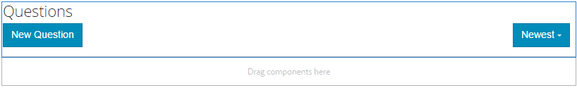

# Forumfunktion för frågor och svar{#q-a-forum-feature}

## Introduktion {#introduction}

Forumfunktionen QnA (frågor och svar) ger ett område där communitymedlemmar kan ställa och besvara frågor. Medlemmar kan:

* Skapa nya frågor
* Lägg till textbundna bilder (med stöd för dra och släpp)
* Visa och svara på frågor
* Sök efter en fråga
* Hjälp till att moderera QnA-innehållet
* Identifiera de bästa svaren
* Flytta QnA-frågor från en sida till en annan

Dokumentationen beskriver:

* Lägga till QnA-forumfunktionen till en AEM webbplats.
* Konfigurationsinställningar för `QnA`komponenten.

## Lägga till ett fråge- och frågeforum på en sida {#adding-a-q-a-forum-to-a-page}

Om du vill lägga till en `QnA`-komponent på en sida i redigeringsläge använder du komponentwebbläsaren för att leta reda på `Communities / QnA` och dra den till rätt plats på en sida där QnA-forumet ska visas.

Mer information finns på [Grunderna för communitykomponenter](/help/communities/basics.md).

När de [nödvändiga klientbiblioteken](/help/communities/qna-essentials.md#essentials-for-client-side) inkluderas visas `QnA`-komponenten så här:

### Konfigurerar QnA {#configuring-qna}

Markera den monterade `QnA`-komponenten som ska öppnas och välj ikonen `Configure` som öppnar redigeringsdialogrutan.

#### Fliken Inställningar {#settings-tab}

Under fliken **Inställningar** anger du inställningar för ämnen (frågor) och svar (svar):

* **Tillåt miniatyrbild för bifogad fil**

   Om du markerar det här alternativet skapas en miniatyrbild av den bifogade bilden.

* **Maximal storlek på miniatyrbild**

   Maximal storlek (i pixlar) för miniatyrbilden för den bifogade filen. Standardvärdet är 800 x 800.

* **Minsta bildstorlek för miniatyrbild**

   Minsta bildstorlek (i byte) för generering av miniatyrbilder för textbundna bilder. Standardvärdet är 100000 byte (100 kB).

* **Maximal miniatyrstorlek**

   Maximal storlek (i pixlar) för miniatyrbilden för textbunden bild. Standardvärdet är 800 x 800.

* **Ämnen per sida**

   Definierar antalet frågor/inlägg som visas per sida. Standardvärdet är 10.

* **Kontrollerad**

   Om det här alternativet är markerat måste publicering av ämnen och kommentarer godkännas innan de visas på en publiceringsplats. Standard är avmarkerat.

* **Stängd**

   Om det här alternativet är markerat stängs forumet för nya frågor och kommentarer. Standard är avmarkerat.

* **RTF-redigerare**

   Om det här alternativet är markerat kan du skriva in ämnen och kommentarer med markeringar. Standard är avmarkerat.

* **Tillåt taggning**

   Om det här alternativet är markerat kan medlemmar lägga till taggetiketter i sina inlägg (se **Tagg field** tab). Standard är avmarkerat.

* **Tillåt filöverföringar**

   Om du markerar det här alternativet kan du tillåta att bifogade filer läggs till i frågan eller kommentaren. Standard är avmarkerat.

* **Tillåt följande**

   Om du markerar det här alternativet inkluderas följande funktion för foruminlägg, som gör att medlemmar kan [meddelas](/help/communities/notifications.md) om nya inlägg. Standard är avmarkerat.

* **Tillåt fästa**

   Om du markerar det här alternativet kan forumämnen fästas överst i ämneslistan. Standard är avmarkerat.

* **Tillåt e-postprenumerationer**

   Om det här alternativet är markerat kan medlemmar meddelas om nya inlägg via e-post ([prenumeration](/help/communities/subscriptions.md)). Kräver att Tillåt följande kontrolleras och [e-post konfigureras](/help/communities/email.md). Standard är avmarkerat.

* **Maximal filstorlek**

   Endast relevant om `Allow File Uploads` är markerat. Det här fältet begränsar storleken (i byte) på en överförd fil. Standardvärdet är 104857600 (10 MB).

* **Tillåtna filtyper**

   Endast relevant om `Allow File Uploads` är markerat. En kommaavgränsad lista med filtillägg med punktavgränsaren. Till exempel: .jpg, .jpeg, .png, .doc, .docx, .pdf. Om någon filtyp har angetts kan de som inte har angetts inte överföras. Standard är inte angivet så att** **alla filtyper tillåts.

* **Maximal filstorlek för bifogad bild**

   Endast relevant om Tillåt filöverföringar är markerat. Maximalt antal byte som en överförd bildfil kan ha. Standardvärdet är 2097152 (2 MB).

* **Tillåt svar**

   Om det här alternativet är markerat, tillåt svar på kommentarer som lagts in i frågan. Standard är avmarkerat.

* **Tillåt röstning**

   Om du markerar det här alternativet inkluderas röstningsfunktionen med en fråga. Standard är avmarkerat.

* **Tillåt användare att ta bort kommentarer och ämnen**

   Om det här alternativet är markerat kan medlemmarna ta bort de kommentarer och frågor som de har skickat in. Standard är avmarkerat.

* **Tillåt behöriga medlemmar**

   Om det här alternativet är markerat kan endast behöriga medlemmar skapa innehåll.

* **Blockera användargenererat innehåll i redigeringsläge för författare**

   Om det här alternativet är aktiverat blockeras användargenererat innehåll när redigering i redigeringsläge.

* **Flytta det markerade svaret överst**

   Om det här alternativet är markerat är det första svar som visas ett valt svar. Standard är avmarkerat.
* **Visa emblem**

   Om det här alternativet är markerat visas intjänade och tilldelade [märken](/help/communities/implementing-scoring.md) med en medlems blogginlägg. Standard är avmarkerat.

* **Tillåt innehåll**

   Om det här alternativet är markerat kan idén identifieras som [aktuellt innehåll](/help/communities/featured.md). Standard är avmarkerat.

* **Aktivera omnämnande**

   Om det här alternativet är aktiverat kan registrerade communityanvändare identifiera andra registrerade medlemmar (med förnamn, efternamn, användarnamn) och tagga dem med den vanliga @användarnamnssyntaxen. De taggade användarna får meddelanden om sina omnämnanden.

* **Max. omnämnanden**

   Begränsa det maximala antalet omnämnanden som tillåts i ett inlägg. Standardvärdet är 10.

* **Mönster för användargränssnittets omnämnande**

   Ange den tillåtna mönstersträngen för att tagga (@mention) den registrerade användaren i ett inlägg. Till exempel, `~{{familyName}}{{givenName}}`.

#### Fliken Användarmoderering {#user-moderation-tab}

Under fliken **Användarmoderering** anger du hur skickade ämnen (frågor) och svar (användargenererat innehåll) ska hanteras. Mer information finns i [Moderating User Generated Content](/help/communities/moderate-ugc.md).

* **Neka svar**

   Om det här alternativet är markerat kan pålitliga medlemsmoderatorer neka publicerade svar och förhindra att svaret visas på det offentliga forumet för frågor och svar. Standard är avmarkerat.

* **Stäng/öppna avsnitt igen**

   Om det här alternativet är markerat kan pålitliga medlemsmoderatorer stänga en fråga (ämne) för ytterligare redigeringar och svar och även öppna en fråga igen. Standard är avmarkerat.

* **Flytta**
ämnen Om det här alternativet är markerat kan du tillåta moderatorer på publiceringssidan att flytta frågor. Standard är avmarkerat.

* **Flagga inlägg**

   Om det här alternativet är markerat kan medlemmarna flagga andras frågor eller svar som olämpliga. Standard är avmarkerat.

* **Flaggorsakslista**

   Om det här alternativet är markerat kan medlemmarna i en nedrullningsbar lista välja orsaken till att en fråga eller ett svar flaggas som olämplig. Standard är avmarkerat.

* **Anledning till anpassad flagga**

   Om det här alternativet är markerat kan medlemmarna ange en egen orsak till att en fråga eller ett svar flaggas som olämpligt. Standard är avmarkerat.

* **Modereringströskel**

   Ange hur många gånger en fråga eller ett svar måste flaggas av medlemmar innan moderatorerna meddelas. Standardvärdet är 1 (en gång).

* **Flaggningsgräns**

   Ange hur många gånger en fråga eller ett svar måste flaggas innan det döljs för den offentliga vyn. Om värdet är -1 döljs aldrig den flaggade frågan eller svaret från den offentliga vyn. Annars måste talet vara större än eller lika med modereringströskeln. Standardvärdet är 5.

#### Tagg field tab {#tag-field-tab}

Under fliken **Tagg field** är de taggar som kan användas, om de tillåts under fliken **Settings** begränsade enligt de namnutrymmen som har valts.

* **Tillåtna namnutrymmen**

   Relevant om `Allow Tagging` är markerat under fliken **Inställningar**. De taggar som kan användas är begränsade till de inom de namnutrymmeskategorier som är markerade. Listan med namnutrymmen innehåller&quot;Standardtaggar&quot; (standardnamnutrymmet) och&quot;Inkludera alla taggar&quot;. Standardvärdet är inget markerat, vilket betyder att alla namnutrymmen är tillåtna.

* **Förslagsgräns**

   Ange antalet taggar som ska visas som ett förslag till medlemmens inlägg i forumet. Värdet **-**1 betyder inga gränser. Standardvärdet är 0.

#### Fliken Sorteringsinställningar {#sort-settings-tab}

Under fliken **Sorteringsinställningar** anger du hur de bokförda kommentarerna ska sorteras när de visas.

* **Sortera efter**

   Markera alla tillåtna sorteringsval: `Newest, Oldest, Last Updated, Most Viewed, Most Active, Most Followed and Most Liked`. Standardvärdet är `Newest, Oldest, Last Updated`.

* **Ange som standard**

   Dra nedåt om du vill välja något av de markerade sorteringsalternativen som ska visas som standard. Standardvärdet är `Newest`.

* **Välj tidsalternativ för Analytics-sortering**

   Välj en av `All, Last 24 Hours, Last 7 Days, Last 30 Days` i listrutan. Standardvärdet är `All`.

## Site Visitor Experience {#site-visitor-experience}

### Identifierar svar {#identifying-answers}

Ett svar kan markeras som ett korrekt eller användbart svar med knappen `Select Answer`. När en fråga har markerats som besvarad kan du inte välja ett annat svar förrän det första har avmarkerats med knappen `Unmark Chosen Answer`.

När det har valts som ett möjligt svar kan det avmarkeras med knappen `Unmark Chosen Answer`.

När ett svar har valts som ett möjligt svar visas en indikation på att frågan har `Answered` bredvid frågeämnet på QnA-huvudsidan.

#### Moderatorer och administratörer {#moderators-and-administrators}

När den inloggade användaren har moderator- eller administratörsbehörighet kan de utföra de modereringsåtgärder som tillåts av komponentens konfiguration, oavsett vem som skapade frågan eller svaret.

De kan också identifiera svaren.

#### Medlemmar {#members}

När webbplatsbesökarna är inloggade, beroende på konfigurationen, kan de:

* Lägg upp en ny fråga.
* Redigera eller ta bort frågor de skapat.
* Flagga frågor eller svar från andra medlemmar.
* Identifiera svar på frågor de skapat.

#### Anonym {#anonymous}

Besökare som inte är inloggade kan bara läsa publicerade frågor och svar, översätta dem om de stöds, men kan varken lägga till frågor eller svar eller flagga inlägg från andra.

## Ytterligare information {#additional-information}

Mer information finns på sidan [QnA Essentials](/help/communities/qna-essentials.md) för utvecklare.

moderering av publicerade ämnen och kommentarer finns i [Moderating User Generated Content](/help/communities/moderate-ugc.md).

Information om hur du taggar publicerade ämnen och kommentarer finns i [Tagga användargenererat innehåll](/help/communities/tag-ugc.md).
