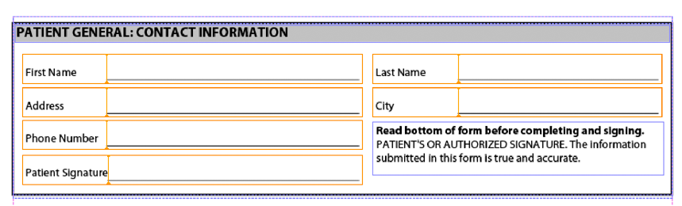

# Sammanställa flera XDP-fragment{#assembling-multiple-xdp-fragments}

Du kan sätta ihop flera XDP-fragment till ett enda XDP-dokument. Ta till exempel XDP-fragment där varje XDP-fil innehåller ett eller flera delformulär som används för att skapa ett hälsoformulär. Följande bild visar dispositionsvyn (representerar filen tuc018_template_flowed.xdp som används i snabbstarten *för att sätta ihop flera XDP-fragment* ):


Följande bild visar patientavsnittet (representerar filen tuc018_contact.xdp som används i snabbstarten *för att sätta ihop flera XDP-fragment* ):



Följande bild visar patientens hälsoavsnitt (representerar filen tuc018_patient.xdp som används i snabbstarten *för att sätta ihop flera XDP-fragment* ):


Detta fragment innehåller två delformulär som heter *subPatientPhysical* och *subPatientHealth*. Båda dessa delformulär refereras i det DDX-dokument som skickas till Assembler-tjänsten. Med Assembler-tjänsten kan du kombinera alla dessa XDP-fragment till ett enda XDP-dokument, vilket visas på följande bild.


Följande DDX-dokument samlar ihop flera XDP-fragment till ett XDP-dokument.

```as3
 <?xml version="1.0" encoding="UTF-8"?>
 <DDX xmlns="https://ns.adobe.com/DDX/1.0/">
         <XDP result="tuc018result.xdp">
            <XDP source="tuc018_template_flowed.xdp">
             <XDPContent insertionPoint="ddx_fragment" source="tuc018_contact.xdp" fragment="subPatientContact" required="false"/>
               <XDPContent insertionPoint="ddx_fragment" source="tuc018_patient.xdp" fragment="subPatientPhysical" required="false"/>
               <XDPContent insertionPoint="ddx_fragment" source="tuc018_patient.xdp" fragment="subPatientHealth" required="false"/>
            </XDP>
         </XDP>
 </DDX>
```

DDX-dokumentet innehåller en XDP- `result` tagg som anger resultatets namn. I den här situationen är värdet `tuc018result.xdp`. Detta värde refereras i den programlogik som används för att hämta XDP-dokumentet efter att Assembler-tjänsten returnerar resultatet. Ta till exempel följande Java-programlogik som används för att hämta det sammansatta XDP-dokumentet (lägg märke till att värdet är fetstilt):

```as3
 //Iterate through the map object to retrieve the result XDP document
 for (Iterator i = allDocs.entrySet().iterator(); i.hasNext();) {
     // Retrieve the Map object’s value
     Map.Entry e = (Map.Entry)i.next();
     //Get the key name as specified in the
     //DDX document
     String keyName = (String)e.getKey();
     if (keyName.equalsIgnoreCase("tuc018result.xdp"))
                 {
         Object o = e.getValue();
         outDoc = (Document)o;
         //Save the result PDF file
         File myOutFile = new File("C:\\AssemblerResultXDP.xdp");
         outDoc.copyToFile(myOutFile);
     }
 }
```

Taggen anger den XDP-fil som representerar ett fullständigt XDP-dokument som kan användas som behållare för att lägga till XDP-fragment eller som ett av ett antal dokument som läggs ihop i ordning. `XDP source` I det här fallet används XDP-dokumentet bara som en behållare (den första bilden som visas vid *sammansättning av flera XDP-fragment*). De andra XDP-filerna placeras alltså i XDP-behållaren.

För varje delformulär kan du lägga till ett `XDPContent` element (det här elementet är valfritt). Observera att det finns tre delformulär i exemplet ovan: `subPatientContact`, `subPatientPhysical`och `subPatientHealth`. Både `subPatientPhysical` `subPatientHealth` delformuläret och delformuläret finns i samma XDP-fil, tuc018_patient.xdp. Fragmentelementet anger namnet på delformuläret, enligt Designer.

>[!NOTE]
>
>Mer information om tjänsten Assembler finns i [Tjänstreferens för AEM-formulär](https://www.adobe.com/go/learn_aemforms_services_63).

>[!NOTE]
>
>Mer information om ett DDX-dokument finns i [Assembler Service och DDX Reference](https://www.adobe.com/go/learn_aemforms_ddx_63).

## Sammanfattning av steg {#summary-of-steps}

Gör så här om du vill sätta ihop flera XDP-fragment:

1. Inkludera projektfiler.
1. Skapa en PDF Assembler-klient.
1. Referera till ett befintligt DDX-dokument.
1. Referera till XDP-dokumenten.
1. Ange körningsalternativ.
1. Sammanställ de olika XDP-dokumenten.
1. Hämta det monterade XDP-dokumentet.

**Inkludera projektfiler**

Inkludera nödvändiga filer i utvecklingsprojektet. Om du skapar ett klientprogram med Java, inkluderar du de JAR-filer som behövs. Om du använder webbtjänster måste du inkludera proxyfilerna.

Följande JAR-filer måste läggas till i projektets klasssökväg:

* adobe-livecycle-client.jar
* adobe-usermanager-client.jar
* adobe-assembler-client.jar
* adobe-utilities.jar (krävs om AEM Forms distribueras på JBoss)
* jbossall-client.jar (krävs om AEM Forms distribueras på JBoss)

**Skapa en PDF Assembler-klient**

Skapa en Assembler-tjänstklient innan du programmässigt utför en Assembler-åtgärd.

**Referera till ett befintligt DDX-dokument**

Ett DDX-dokument måste refereras till för att kunna samla ihop flera XDP-dokument. Det här DDX-dokumentet måste innehålla `XDP result`, `XDP source`och `XDPContent` element.

**Referera till XDP-dokument**

Om du vill samla ihop flera XDP-dokument refererar du till alla XDP-filer som används för att sammanställa det resulterande XDP-dokumentet. Kontrollera att namnet på delformuläret i XDP-dokumentet som refereras av `source` -attributet anges i `fragment` attributet. Ett delformulär definieras i Designer. Här följer ett exempel på XML.

```as3
 <XDPContent insertionPoint="ddx_fragment" source="tuc018_contact.xdp" fragment="subPatientContact" required="false"/>
```

Delformuläret *subPatientContact* måste finnas i XDP-filen *tuc018_contact.xdp*.

**Ange körningsalternativ**

Du kan ställa in körningsalternativ som styr beteendet för Assembler-tjänsten när den utför ett jobb. Du kan till exempel ange ett alternativ som instruerar Assembler-tjänsten att fortsätta bearbeta ett jobb om ett fel uppstår.

**Sammanställa flera XDP-dokument**

Om du vill montera flera XDP-filer anropar du `invokeDDX` åtgärden. Assembler-tjänsten returnerar det monterade XDP-dokumentet i ett samlingsobjekt.

**Hämta det monterade XDP-dokumentet**

Ett monterat XDP-dokument returneras inom ett samlingsobjekt. Upprepa genom samlingsobjektet och spara XDP-dokumentet som en XDP-fil. Du kan också skicka XDP-dokumentet till en annan AEM Forms-tjänst, till exempel Output.

**Se även**

[Sammanställa flera XDP-fragment med Java API](assembling-multiple-xdp-fragments.md#assemble-multiple-xdp-fragments-using-the-java-api)

[Sammanställa flera XDP-fragment med hjälp av webbtjänstens API](assembling-multiple-xdp-fragments.md#assemble-multiple-xdp-fragments-using-the-web-service-api)

[Inkludera AEM Forms Java-biblioteksfiler](/help/forms/developing/invoking-aem-forms-using-java.md#including-aem-forms-java-library-files)

[Ange anslutningsegenskaper](/help/forms/developing/invoking-aem-forms-using-java.md#setting-connection-properties)

[Programmisk sammanställning av PDF-dokument](/help/forms/developing/programmatically-assembling-pdf-documents.md#programmatically-assembling-pdf-documents)

[Skapa PDF-dokument med fragment](/help/forms/developing/creating-document-output-streams.md#creating-pdf-documents-using-fragments)

## Sammanställa flera XDP-fragment med Java API {#assemble-multiple-xdp-fragments-using-the-java-api}

Sammanställa flera XDP-fragment med Assembler Service API (Java):

1. Inkludera projektfiler.

   Inkludera JAR-klientfiler, t.ex. adobe-assembler-client.jar, i Java-projektets klassökväg.

1. Skapa en PDF Assembler-klient.

   * Skapa ett `ServiceClientFactory` objekt som innehåller anslutningsegenskaper.
   * Skapa ett `AssemblerServiceClient` objekt med hjälp av dess konstruktor och skicka `ServiceClientFactory` objektet.

1. Referera till ett befintligt DDX-dokument.

   * Skapa ett `java.io.FileInputStream` objekt som representerar DDX-dokumentet med hjälp av dess konstruktor och skicka ett strängvärde som anger platsen för DDX-filen.
   * Skapa ett `com.adobe.idp.Document` objekt med hjälp av dess konstruktor och skicka `java.io.FileInputStream` objektet.

1. Referera till XDP-dokumenten.

   * Skapa ett `java.util.Map` objekt som används för att lagra XDP-indatadokument med hjälp av en `HashMap` konstruktor.
   * Skapa ett `com.adobe.idp.Document` objekt och skicka `java.io.FileInputStream` objektet som innehåller XDP-indatafilen (upprepa den här uppgiften för varje XDP-fil).
   * Lägg till en post i `java.util.Map` objektet genom att anropa dess `put` metod och skicka följande argument:

      * Ett strängvärde som representerar nyckelnamnet. Detta värde måste matcha elementvärdet som anges i DDX-dokumentet (upprepa den här uppgiften för varje XDP-fil). `source`
      * Ett `com.adobe.idp.Document` objekt som innehåller XDP-dokumentet som motsvarar `source` elementet (upprepa den här uppgiften för varje XDP-fil).

1. Ange körningsalternativ.

   * Skapa ett `AssemblerOptionSpec` objekt som lagrar körningsalternativ med hjälp av dess konstruktor.
   * Ange körningsalternativ som uppfyller dina affärsbehov genom att anropa en metod som tillhör `AssemblerOptionSpec` objektet. Om du till exempel vill instruera Assembler-tjänsten att fortsätta bearbeta ett jobb när ett fel inträffar, anropar du `AssemblerOptionSpec` objektets `setFailOnError` metod och skickar `false`.

1. Sammanställ de olika XDP-dokumenten.

   Anropa `AssemblerServiceClient` objektets `invokeDDX` metod och skicka följande obligatoriska värden:

   * Ett `com.adobe.idp.Document` objekt som representerar det DDX-dokument som ska användas
   * Ett `java.util.Map` objekt som innehåller XDP-indatafilerna
   * Ett `com.adobe.livecycle.assembler.client.AssemblerOptionSpec` objekt som anger körningsalternativen, inklusive standardteckensnittet och jobbloggsnivån
   Metoden returnerar `invokeDDX` ett `com.adobe.livecycle.assembler.client.AssemblerResult` objekt som innehåller det sammansatta XDP-dokumentet.

1. Hämta det monterade XDP-dokumentet.

   Utför följande åtgärder för att hämta det monterade XDP-dokumentet:

   * Anropa `AssemblerResult` objektets `getDocuments` metod. Den här metoden returnerar ett `java.util.Map` objekt.
   * Upprepa genom `java.util.Map` objektet tills du hittar det resulterande `com.adobe.idp.Document` objektet.
   * Anropa `com.adobe.idp.Document` objektets `copyToFile` metod för att extrahera det monterade XDP-dokumentet.

**Se även**

[Sammanställa flera XDP-fragment](assembling-multiple-xdp-fragments.md#assembling-multiple-xdp-fragments)[snabbstart (SOAP-läge): Sammanställa flera XDP-fragment med Java API](/help/forms/developing/assembler-service-java-api-quick.md#quick-start-soap-mode-assembling-multiple-xdp-fragments-using-the-java-api)[Inklusive Java-biblioteksfiler](/help/forms/developing/invoking-aem-forms-using-java.md#including-aem-forms-java-library-files)[för AEM FormsAnge anslutningsegenskaper](/help/forms/developing/invoking-aem-forms-using-java.md#setting-connection-properties)

## Sammanställa flera XDP-fragment med hjälp av webbtjänstens API {#assemble-multiple-xdp-fragments-using-the-web-service-api}

Sammanställa flera XDP-fragment med Assembler Service API (webbtjänst):

1. Inkludera projektfiler.

   Skapa ett Microsoft .NET-projekt som använder MTOM. Kontrollera att du använder följande WSDL-definition när du anger en tjänstreferens:

   ```as3
    https://localhost:8080/soap/services/AssemblerService?WSDL&lc_version=9.0.1.
   ```

   >[!NOTE]
   >
   >Ersätt `localhost` med IP-adressen för servern som är värd för AEM Forms.

1. Skapa en PDF Assembler-klient.

   * Skapa ett `AssemblerServiceClient` objekt med hjälp av dess standardkonstruktor.
   * Skapa ett `AssemblerServiceClient.Endpoint.Address` objekt med hjälp av `System.ServiceModel.EndpointAddress` konstruktorn. Skicka ett strängvärde som anger WSDL till AEM Forms-tjänsten, till exempel `https://localhost:8080/soap/services/AssemblerService?blob=mtom`). Du behöver inte använda attributet `lc_version` . Det här attributet används när du skapar en tjänstreferens.
   * Skapa ett `System.ServiceModel.BasicHttpBinding` objekt genom att hämta värdet för `AssemblerServiceClient.Endpoint.Binding` fältet. Sänd returvärdet till `BasicHttpBinding`.
   * Ställ in `System.ServiceModel.BasicHttpBinding` objektets `MessageEncoding` fält till `WSMessageEncoding.Mtom`. Detta värde garanterar att MTOM används.
   * Aktivera grundläggande HTTP-autentisering genom att utföra följande åtgärder:

      * Tilldela användarnamnet för AEM-formulär till `AssemblerServiceClient.ClientCredentials.UserName.UserName` fältet.
      * Tilldela motsvarande lösenordsvärde till `AssemblerServiceClient.ClientCredentials.UserName.Password`fältet.
      * Tilldela `HttpClientCredentialType.Basic` konstantvärdet till `BasicHttpBindingSecurity.Transport.ClientCredentialType`fältet.
      * Tilldela `BasicHttpSecurityMode.TransportCredentialOnly` konstantvärdet till `BasicHttpBindingSecurity.Security.Mode`fältet.

1. Referera till ett befintligt DDX-dokument.

   * Skapa ett `BLOB` objekt med hjälp av dess konstruktor. Objektet används `BLOB` för att lagra DDX-dokumentet.
   * Skapa ett `System.IO.FileStream` objekt genom att anropa dess konstruktor och skicka ett strängvärde som representerar filplatsen för DDX-dokumentet och läget som filen ska öppnas i.
   * Skapa en bytearray som lagrar innehållet i `System.IO.FileStream` objektet. Du kan bestämma storleken på bytearrayen genom att hämta `System.IO.FileStream` objektets `Length` egenskap.
   * Fyll bytearrayen med strömdata genom att anropa `System.IO.FileStream` objektets `Read` metod. Skicka bytearrayen, startpositionen och strömlängden som ska läsas.
   * Fyll objektet `BLOB` genom att tilldela dess `MTOM` egenskap med innehållet i bytearrayen.

1. Referera till XDP-dokumenten.

   * För varje XDP-indatafil skapar du ett `BLOB` objekt med hjälp av dess konstruktor. Objektet används `BLOB` för att lagra indatafilen.
   * Skapa ett `System.IO.FileStream` objekt genom att anropa dess konstruktor och skicka ett strängvärde som representerar indatafilens plats och det läge i vilket filen ska öppnas.
   * Skapa en bytearray som lagrar innehållet i `System.IO.FileStream` objektet. Du kan bestämma storleken på bytearrayen genom att hämta `System.IO.FileStream` objektets `Length` egenskap.
   * Fyll bytearrayen med strömdata genom att anropa `System.IO.FileStream` objektets `Read` metod. Skicka bytearrayen, startpositionen och strömlängden som ska läsas.
   * Fyll objektet `BLOB` genom att tilldela dess `MTOM` fält med innehållet i bytearrayen.
   * Create a `MyMapOf_xsd_string_To_xsd_anyType` object. Samlingsobjektet används för att lagra indatafiler som krävs för att skapa ett sammansatt XDP-dokument.
   * Skapa ett `MyMapOf_xsd_string_To_xsd_anyType_Item` objekt för varje indatafil.
   * Tilldela ett strängvärde som representerar nyckelnamnet till `MyMapOf_xsd_string_To_xsd_anyType_Item` objektets `key` fält. Detta värde måste matcha värdet för elementet som anges i DDX-dokumentet. (Utför den här åtgärden för varje XDP-indatafil.)
   * Tilldela det `BLOB` objekt som lagrar indatafilen till `MyMapOf_xsd_string_To_xsd_anyType_Item` objektets `value` fält. (Utför den här åtgärden för varje XDP-indatafil.)
   * Lägg till `MyMapOf_xsd_string_To_xsd_anyType_Item` objektet i `MyMapOf_xsd_string_To_xsd_anyType` objektet. Anropa `MyMapOf_xsd_string_To_xsd_anyType` objektets `Add` metod och skicka `MyMapOf_xsd_string_To_xsd_anyType` objektet. (Utför den här åtgärden för varje XDP-indatadokument.)

1. Ange körningsalternativ.

   * Skapa ett `AssemblerOptionSpec` objekt som lagrar körningsalternativ med hjälp av dess konstruktor.
   * Ange körningsalternativ som uppfyller dina affärskrav genom att tilldela ett värde till en datamedlem som tillhör `AssemblerOptionSpec` objektet. Om du till exempel vill instruera Assembler-tjänsten att fortsätta bearbeta ett jobb när ett fel inträffar tilldelar du `false` till `AssemblerOptionSpec` objektets `failOnError` datamedlem.

1. Sammanställ de olika XDP-dokumenten.

   Anropa `AssemblerServiceClient` objektets `invokeDDX` metod och skicka följande värden:

   * Ett `BLOB` objekt som representerar DDX-dokumentet
   * Det `MyMapOf_xsd_string_To_xsd_anyType` objekt som innehåller de nödvändiga filerna
   * Ett `AssemblerOptionSpec` objekt som anger körningsalternativ
   Metoden returnerar ett `invokeDDX` `AssemblerResult` objekt som innehåller resultatet av jobbet och eventuella undantag som inträffade.

1. Hämta det monterade XDP-dokumentet.

   Utför följande åtgärder för att hämta det nya XDP-dokumentet:

   * Få åtkomst till `AssemblerResult` objektets `documents` fält, som är ett `Map` objekt som innehåller de resulterande PDF-dokumenten.
   * Iterera genom objektet `Map` för att få fram varje resulterande dokument. Sedan konverterar du arraymedlemmens `value` till en `BLOB`.
   * Extrahera de binära data som representerar PDF-dokumentet genom att få åtkomst till dess `BLOB` objektegenskap `MTOM` . Detta returnerar en bytearray som du kan skriva ut till en XDP-fil.

**Se även**

[Sammanställa flera XDP-fragment](assembling-multiple-xdp-fragments.md#assembling-multiple-xdp-fragments)[som anropar AEM-formulär med MTOM](/help/forms/developing/invoking-aem-forms-using-web.md#invoking-aem-forms-using-mtom)